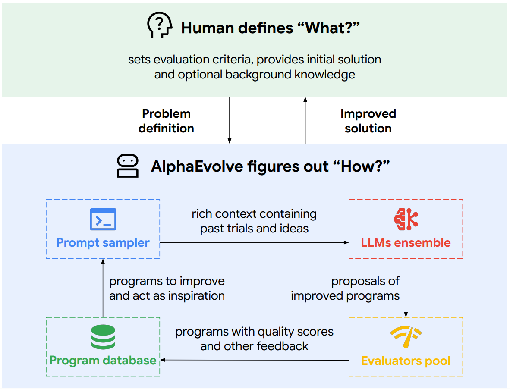
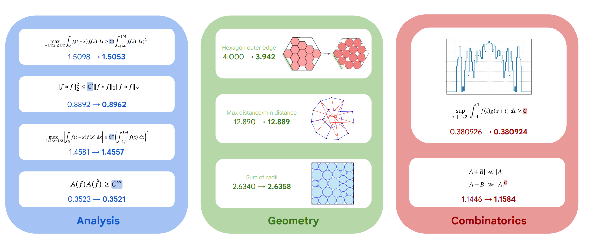
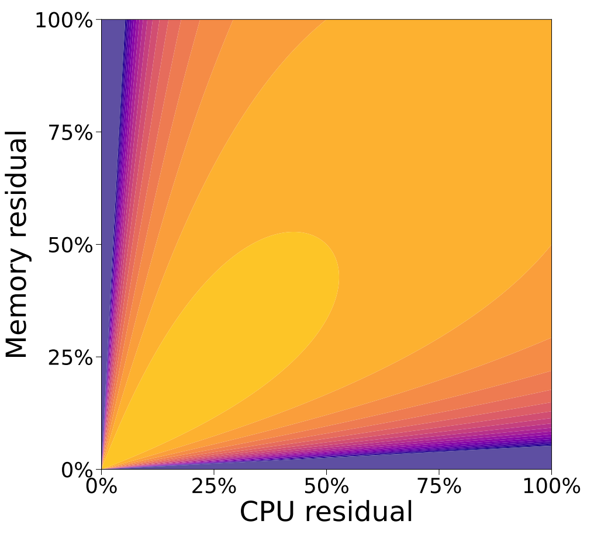
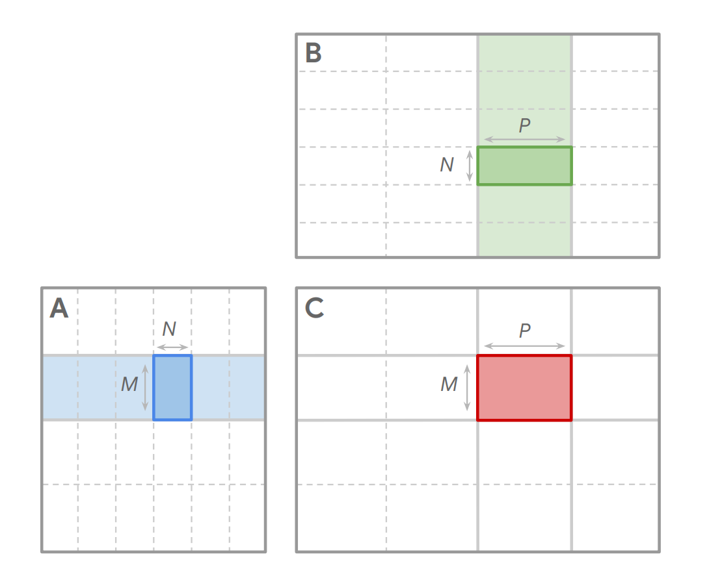
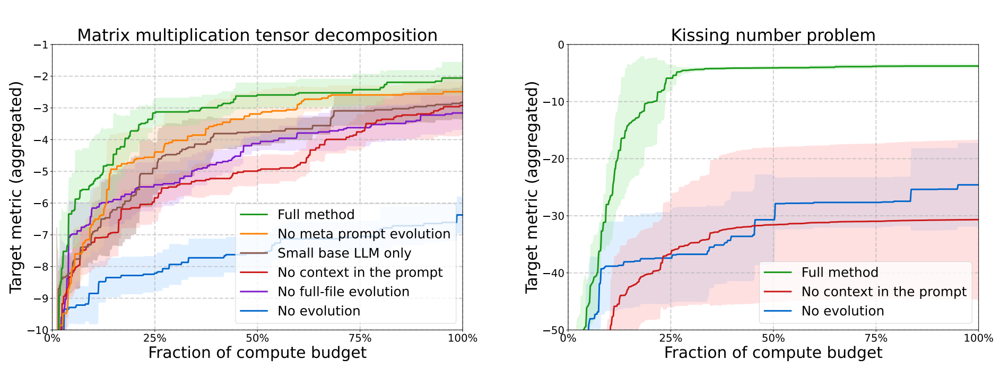

# *AlphaEvolve***: A coding agent for scientific and algorithmic discovery**

**Alexander Novikov**\* **, Ngân Vu˜** \* **, Marvin Eisenberger**\* **, Emilien Dupont**\* **, Po-Sen Huang**\* **, Adam Zsolt Wagner**\* **, Sergey Shirobokov**\* **, Borislav Kozlovskii**\* **, Francisco J. R. Ruiz, Abbas Mehrabian, M. Pawan Kumar, Abigail See, Swarat Chaudhuri, George Holland, Alex Davies, Sebastian Nowozin, Pushmeet Kohli and Matej Balog**\* Google DeepMind[1](#page-0-0)

**In this white paper, we present** *AlphaEvolve***, an evolutionary coding agent that substantially enhances capabilities of state-of-the-art LLMs on highly challenging tasks such as tackling open scientific problems or optimizing critical pieces of computational infrastructure.** *AlphaEvolve* **orchestrates an autonomous pipeline of LLMs, whose task is to improve an algorithm by making direct changes to the code. Using an evolutionary approach, continuously receiving feedback from one or more evaluators,** *AlphaEvolve* **iteratively improves the algorithm, potentially leading to new scientific and practical discoveries. We demonstrate the broad applicability of this approach by applying it to a number of important computational problems. When applied to optimizing critical components of large-scale computational stacks at Google,** *AlphaEvolve* **developed a more efficient scheduling algorithm for data centers, found a functionally equivalent simplification in the circuit design of hardware accelerators, and accelerated the training of the LLM underpinning** *AlphaEvolve* **itself. Furthermore,** *AlphaEvolve* **discovered novel, provably correct algorithms that surpass state-of-the-art solutions on a spectrum of problems in mathematics and computer science, significantly expanding the scope of prior automated discovery methods (Romera-Paredes et al., 2023). Notably,** *AlphaEvolve* **developed a search algorithm that found a procedure to multiply two** 4 × 4 **complex-valued matrices using** 48 **scalar multiplications; offering the first improvement, after 56 years, over Strassen's algorithm in this setting. We believe** *AlphaEvolve* **and coding agents like it can have a significant impact in improving solutions of problems across many areas of science and computation.**

## **1. Introduction**

Discovering new high-value knowledge, such as making a novel scientific discovery or developing a commercially valuable algorithm, generally requires a prolonged process of ideation, exploration, backtracking on unpromising hypotheses, experimentation, and validation. There has been much recent interest in using large language models (LLMs) to automate significant parts of this process. Hopes of success here are driven by the breathtaking power of recent LLMs [32, 76], which can enhance their capabilities using test-time compute, and the rise of *agents* that combine language generation and action [88, 114]. These advances have improved performance across a range of established benchmarks and accelerated discoveryoriented tasks like hypothesis generation [34] and experiment design [7, 43]. However, getting LLM pipelines all the way to making entirely new scientific or practical discoveries remains challenging.

In this white paper, we present an LLM code superoptimization agent, called *AlphaEvolve*, that takes on this challenge using a combination of evolutionary computation and LLM-based code generation. *AlphaEvolve* focuses on the broad spectrum of scientific and engineering

<span id="page-0-0"></span><sup>1</sup>See Acknowledgments and Author information section. <sup>∗</sup>Equal contributions.

discovery problems in which the candidates of discovery can be automatically evaluated. It represents the candidates (for example, new mathematical objects or practical heuristics) as algorithms and uses a set of LLMs to generate, critique, and evolve a pool of such algorithms. The LLM-directed evolution process is grounded using code execution and automatic evaluation. This evaluation mechanism allows *AlphaEvolve* to avoid any incorrect suggestions from the base LLM [44].

The evolutionary process in *AlphaEvolve* leverages modern LLMs' ability to respond to feedback, enabling the discovery of candidates that are substantially different from the initial candidate pool in syntax and function. It is applicable both to problems where discovering new algorithms is the intrinsic goal, as well as to the broad range of problems where the solution of interest is not an algorithm itself but an algorithm can *describe* how that solution is to be constructed or found. In the latter case, discovering the algorithm is only an instrumental goal, but it turns out to be a surprisingly effective strategy compared to searching for the solution directly [83].

The idea of combining evolutionary methods with coding LLMs has been previously explored in various specialized settings. In particular, *AlphaEvolve* is a substantial enhancement of *FunSearch* [83] (see [Table 1\)](#page-1-0), which used LLM-guided evolution to discover heuristics in order to construct novel mathematical objects or to drive the operation of online algorithms. Also, related approaches have been used in tasks such as discovering policies for simulated robots [57], symbolic regression [35, 89], and the synthesis of heuristic functions for combinatorial optimization [63]. In contrast to these systems, *AlphaEvolve* leverages state-of-the-art (SOTA) LLMs to evolve large pieces of code that implement complex algorithms spanning multiple functions and components. As a result, it is able to go significantly beyond its predecessors in scale and generality.

<span id="page-1-0"></span>

| FunSearch [83]                              | AlphaEvolve                                          |  |
|---------------------------------------------|------------------------------------------------------|--|
| evolves single function                     | evolves entire code file                             |  |
| evolves up to 10-20 lines of code           | evolves up to hundreds of lines of code              |  |
| evolves code in Python                      | evolves any language                                 |  |
| needs fast evaluation (≤<br>20min on 1 CPU) | can evaluate for hours, in parallel, on accelerators |  |
| millions of LLM samples used                | thousands of LLM samples suffice                     |  |
| small LLMs used; no benefit from larger     | benefits from SOTA LLMs                              |  |
| minimal context (only previous solutions)   | rich context and feedback in prompts                 |  |
| optimizes single metric                     | can simultaneously optimize multiple metrics         |  |

**Table 1** | Capabilities and typical behaviours of *AlphaEvolve* and our previous agent.

While the use of an automated evaluation metric offers *AlphaEvolve* a key advantage, it is also a limitation—in particular, it puts tasks that require manual experimentation out of our scope. Because problems in mathematics, computer science, and system optimization typically permit automated evaluation metrics, our efforts on *AlphaEvolve* focus on these domains. Specifically, we use *AlphaEvolve* to make progress on several well-known open problems in algorithm design and constructive mathematics, as well as the optimization of critical layers in the large-scale computation stacks at Google.

Within algorithm design, we consider the fundamental problem of discovering fast algorithms for multiplying matrices, a problem to which a more specialized AI approach had been applied previously [26]. Despite being general-purpose, *AlphaEvolve* goes beyond [26], improving the SOTA for 14 matrix multiplication algorithms; notably, for 4 × 4 matrices, *AlphaEvolve* improves Strassen (1969)'s algorithm by discovering an algorithm using 48 multiplications to multiply 4 × 4 complex-valued matrices.[2](#page-2-0)

In mathematics, we consider a broad range of open problems on which one can make progress by discovering constructions (objects) with better properties than all previously known constructions, according to given mathematical definitions. We apply *AlphaEvolve* to a large number (over 50) of such problems and match the best known constructions on ∼75% of them (in many cases these constructions are likely to already be optimal). On ∼20% of the problems, *AlphaEvolve* surpasses the SOTA and discovers new, provably better constructions. This includes an improvement on the Minimum Overlap Problem set by Erdős [25] and an improved construction on the Kissing Numbers problem in 11 dimensions [8, 31].

Finally, we use *AlphaEvolve* in four engineering problems spanning different layers of Google's compute stack: discovering scheduling heuristics for Google's cluster management system, optimizing matrix-multiplication kernels used to train LLMs, optimizing arithmetic circuits used within TPUs, and optimizing the runtime of attention in Transformers. Because these components are run repeatedly over a long period of time, any improvements are highly valuable.

# **2.** *AlphaEvolve*

*AlphaEvolve* is a coding agent that orchestrates an autonomous pipeline of computations including queries to LLMs, and produces algorithms that address a userspecified task. At a high level, the orchestrating procedure is an evolutionary algorithm that gradually develops programs that improve the score on the automated evaluation metrics associated with the task. A high-level overview of *AlphaEvolve* is shown in [Figure 1](images/figure_1.png), and [Figure 2](images/figure_2.png) gives an expanded view.



<span id="page-2-1"></span>[Figure 1](images/figure_1.png) | *AlphaEvolve* high-level overview.

#### <span id="page-2-2"></span>**2.1. Task specification**

**Evaluation.** Since *AlphaEvolve* tackles problems with machine-gradeable solutions, the user must provide a mechanism for automatically assessing generated solutions. This mechanism takes the form of a function ℎ mapping a solution to a set of scalar evaluation metrics. By convention, these metrics are maximized. In our current setup, ℎ is typically implemented

<span id="page-2-0"></span><sup>2</sup>These discovered algorithms as well as our other new mathematical results can be found at [https:](https://colab.research.google.com/github/google-deepmind/alphaevolve_results/blob/master/mathematical_results.ipynb) [//colab.research.google.com/github/google-deepmind/alphaevolve\\_results/blob/maste](https://colab.research.google.com/github/google-deepmind/alphaevolve_results/blob/master/mathematical_results.ipynb) [r/mathematical\\_results.ipynb](https://colab.research.google.com/github/google-deepmind/alphaevolve_results/blob/master/mathematical_results.ipynb).

<span id="page-3-0"></span>![Figure 2: Expanded view of the *AlphaEvolve* discovery process. The user provides an initial program (with components to evolve marked), evaluation code, and optional configurations (Section 2.1). *AlphaEvolve* then initiates an evolutionary loop. The *Prompt sampler* uses programs from the *Program database* to construct rich prompts (Section 2.2). Given these prompts, the *LLMs* generate code modifications (diffs), which are applied to create new programs (Section 2.3). These are then scored by *Evaluators* (Section 2.4), and promising solutions are registered back into the *Program database* (Section 2.5), driving the iterative discovery of better and better programs.](images/figure_2.png)

[Figure 2](images/figure_2.png) | Expanded view of the *AlphaEvolve* discovery process. The user provides an initial program (with components to evolve marked), evaluation code, and optional configurations (Section 2.1). *AlphaEvolve* then initiates an evolutionary loop. The *Prompt sampler* uses programs from the *Program database* to construct rich prompts (Section 2.2). Given these prompts, the *LLMs* generate code modifications (diffs), which are applied to create new programs (Section 2.3). These are then scored by *Evaluators* (Section 2.4), and promising solutions are registered back into the *Program database* (Section 2.5), driving the iterative discovery of better and better programs.

as a Python function, called evaluate, with a fixed input/output signature, returning a dictionary of scalars.

Depending on the application, executing this function may take only seconds on a single device or spawn extensive computations. For mathematical problems, the function h is typically very simple. For example, when wishing to find largest possible graphs satisfying a given property, h invokes the evolved code to generate a graph, checks whether the property holds, and then simply returns the size of the graph as the score. In more complicated cases, the function h might involve performing an evolved search algorithm, or training and evaluating a machine learning model.

**API.** To support evolving multiple components across a codebase, *AlphaEvolve* exposes an input API where blocks of code can be annotated as to-be-evolved-by-the-system; see Figure 3a for an illustration. This design facilitates integrating it with existing codebases while requiring only minimal changes, simply by adding special markers (# EVOLVE-BLOCK-START and # EVOLVE-BLOCK-END) as comments into the code.

Any user-provided code inside such evolution blocks serves as the initial solution to be improved by *AlphaEvolve*, and the rest of the code forms a skeleton that ties the evolved pieces together, so that they can be invoked from evaluate. While this initial implementation must be complete, it can be rudimentary—for instance, consisting of single-line functions that return constants of the appropriate types.

**Flexibility in choosing the abstraction.** *AlphaEvolve* can be applied to the same problem in very different ways—especially when the evolved programs are not the final output but a means to discover solutions. For example, *AlphaEvolve* can evolve the solution in raw string representation (as in classical evolutionary algorithms); evolve a function of a definite form that specifies how to construct the solution from scratch (the approach taken in [83]); evolve a bespoke search algorithm to find the solution within some fixed compute budget; or even co-evolve intermediate solutions and search algorithms together, such that each search algorithm is specifically tailored to further improve upon a particular intermediate solution.

We find that different levels of abstraction work better for different problems. For example, we hypothesize that for problems with highly symmetric solutions it is advantageous to evolve constructor functions as these tend to be more concise [83], whereas for problems with non-symmetric solutions it works better to evolve customized search algorithms.

## <span id="page-4-0"></span>**2.2. Prompt sampling**

As *AlphaEvolve* leverages SOTA LLMs, it supports various types of customization and providing long contexts as part of the primary evolution prompt. This prompt comprises multiple previously discovered solutions sampled from the program database, as well as system instructions on how to propose changes to a particular solution. Beyond these key ingredients, users can further tailor prompts to their specific needs in different ways, such as the following.

- *Explicit context*: details about the problem being solved, such as fixed human-written instructions, equations, code snippets, or relevant literature (e.g., pdf files).
- *Stochastic formatting*: template placeholders with human-provided alternatives for increased diversity, instantiated using probability distributions provided in a separate config file.
- *Rendered evaluation results*: usually this will include a program, the result of executing that program, and the scores assigned by the evaluate function.
- *Meta prompt evolution*: instructions and context suggested by the LLM itself in an additional prompt-generation step, co-evolved in a separate database analogous to the solution programs.

#### <span id="page-4-1"></span>**2.3. Creative generation**

To drive the evolutionary procedure, *AlphaEvolve* leverages the capabilities of SOTA LLMs, whose principal role is to digest information about previously developed solutions and propose new, diverse ways to improve the solutions. Although *AlphaEvolve* is model-agnostic, in ablations we observe that *AlphaEvolve* performs increasingly better as the underlying LLM improves (see [Section 4\)](#page-16-0).

**Figure 3a. User-provided file with evolvable blocks and the evaluation hook**

```python
# EVOLVE-BLOCK START
"""Image classification experiment in jaxline."""
import jax
# EVOLVE-BLOCK-END
# EVOLVE-BLOCK-START
class ConvNet(hk.Module):
def __init__(self, num_classes): ...
def __call__(self, inputs, is_training): ...
def sweep():
    return hyper.zipit([...])
# EVOLVE-BLOCK-END
def evaluate(eval_inputs) -> dict[str, float]:
    return metrics
```

**Figure 3b. Example assembled prompt provided to the LLMs**

```text
Act as an expert software developer. Your task is to iteratively improve the provided codebase. [...]

- Prior programs
Previously we found that the following programs performed well on the task at hand:
top_1_acc: 0.796; neg_eval_log_loss: 0.230; average_score: 0.513
[...]

- Current program
Here is the current program that we are trying to improve (you will need to propose a modification to it below).
top_1_acc: 0.862; neg_eval_log_loss: 0.387; average_score: 0.624
[...]

SEARCH/REPLACE block rules:
[...]

Task
Suggest a new idea to improve the code that is inspired by your expert knowledge of optimization and machine learning.
Describe each change with a SEARCH/REPLACE block.
The current model uses a simple ResNet architecture with only three ResNet blocks. We can improve its performance by increasing the model capacity and adding regularization. This will allow the model to learn more complex features and generalize better to unseen data. We also add weight decay to the optimizer to further regularize the model and prevent overfitting. AdamW is generally a better choice than Adam, especially with weight decay.
```

**Figure 3c. Example output generated by the LLM**

```diff
<<<<<<< SEARCH
self._block1 = ResNetBlock(num_channels)
self._block2 = ResNetBlock(num_channels * 2, stride = 2)
self._block3 = ResNetBlock(num_channels * 4, stride = 2)
= = = = = = =
self._block1 = ResNetBlock(num_channels)
self._block2 = ResNetBlock(num_channels, stride = 1)
self._block3 = ResNetBlock(num_channels * 2, stride = 2)
self._block4 = ResNetBlock(num_channels * 2, stride = 1)
self._block5 = ResNetBlock(num_channels * 4, stride = 2)
self._block6 = ResNetBlock(num_channels * 4, stride = 1)
>>>>>>> REPLACE
<<<<<<< SEARCH
def optimizer(self, learning_rate):
    return optax.adam(learning_rate)
= = = = = = =
def optimizer(self, learning_rate):
    return optax.adamw(learning_rate, weight_decay = 1e-4)
>>>>>>> REPLACE
```

**Figure 3.** Illustrative example of applying *AlphaEvolve* to evolving a supervised learning pipeline. All snippets are abbreviated, with ellipsis (...) indicating skipped lines. (a) The user-provided file with blocks marked for evolution, and the special evaluate function that can be invoked to score the current version of the code. (b) Example of an assembled prompt to be provided to the LLMs. (c) Example output generated by the LLM. The proposed diffs in (c) will be applied to the "current program" shown in the prompt (b), and the resulting modified program will then be sent to the evaluators. The evaluators will invoke the evaluate function from (a) in order to obtain the scores of the newly proposed program.

**Output format.** When *AlphaEvolve* asks an LLM to modify existing code, especially within larger codebases, it requests the changes to be provided as a sequence of diff blocks in a specific format:

```
<<<<<<< SEARCH
# Original code block to be found and replaced
= = = = = = =
# New code block to replace the original
>>>>>>> REPLACE
```

Here, the code between <<<<<<< SEARCH and ======= is the exact segment to match in the current program version. The code between ======= and >>>>>>> REPLACE is the new segment that will replace the original one. This allows for targeted updates to specific parts of the code.

In cases where the code being evolved is very short, or when a complete rewrite is more appropriate than a small modification, *AlphaEvolve* can be configured to instruct the LLM to output the entire code block directly, rather than using the diff format.

**Models used.** *AlphaEvolve* employs an ensemble of large language models. Specifically, we utilize a combination of Gemini 2.0 Flash and Gemini 2.0 Pro. This ensemble approach allows us to balance computational throughput with the quality of generated solutions. Gemini 2.0 Flash, with its lower latency, enables a higher rate of candidate generation, increasing the number of ideas explored per unit of time. Concurrently, Gemini 2.0 Pro, possessing greater capabilities, provides occasional, higher-quality suggestions that can significantly advance the evolutionary search and potentially lead to breakthroughs. This strategic mix optimizes the overall discovery process by maximizing the volume of evaluated ideas while retaining the potential for substantial improvements driven by the more powerful model.

#### <span id="page-6-0"></span>**2.4. Evaluation**

To track *AlphaEvolve*'s progress and to select which ideas to propagate in future generations, each new solution proposed by the LLMs is automatically evaluated. In principle, this process amounts to simply executing the user-provided evaluation function ℎ on the generated solution. In practice, *AlphaEvolve* supports optional mechanisms to make this evaluation more flexible and more efficient:

- *Evaluation cascade (hypothesis testing)*: the user can specify ensembles of test cases of increasing difficulty, such that new solutions are evaluated on the next stage only if they achieve sufficiently promising results in all earlier stages. This helps to prune out less promising solutions more quickly. Moreover, new solutions are initially evaluated on a small scale before being subjected to the main test cases, to filter out faulty programs early.
- *LLM-generated feedback*: in some applications, desirable solutions have certain characteristics that are difficult to capture precisely in the user-provided evaluation function

- ℎ; for example, simplicity of the discovered program. These properties can be graded using separate LLM calls and added to the dictionary of scores to steer evolution, or they can be used to discard solutions when a criterion is not fulfilled.
- *Parallelized evaluation*: the sample efficiency of *AlphaEvolve* makes it feasible to spend on the order of 100 compute-hours to evaluate any new solution. However, unless individual evaluations are parallelized to reduce their wall-clock duration, this can slow down the rate at which new generations appear, limiting the ability of the evolutionary algorithm to apply several consecutive mutations. In many applications, evaluation is embarrassingly parallel (for example, running a search algorithm from multiple randomized initializations), allowing *AlphaEvolve* to distribute this work through asynchronous calls to an evaluation cluster.

**Multiple scores.** *AlphaEvolve* allows for optimizing multiple user-provided scores, i.e., evolving objects that achieve a high score under one or multiple evaluation metrics. This has both an intrinsic and instrumental value. While in multiple applications we genuinely care about developing solutions for multiple evaluation metrics (or one solution that is strong on all of them simultaneously), we find that even if one metric is of particular interest, optimizing for multiple metrics often improves results for the single target metric. Perhaps this occurs because programs excelling under different evaluation criteria often possess distinct structures or logic and, by incorporating examples of these diverse, high-performing programs—each representing a different definition of "good"—into the prompts provided to the language model, we can stimulate the generation of more varied candidate solutions, increasing the chances of discovering novel approaches that are highly effective for the target metric.

## <span id="page-7-0"></span>**2.5. Evolution**

During its evolutionary procedure, *AlphaEvolve* continually generates a growing number of solutions with evaluation results (scores and program outputs) attached to them. These solutions are stored in an evolutionary database, the primary goal of which is to optimally resurface previously explored ideas in future generations. A key challenge in designing such databases is balancing exploration and exploitation, to continuously improve the best programs while maintaining diversity to encourage exploration of the entire search space. In *AlphaEvolve*, the evolutionary database implements an algorithm that is inspired by a combination of the MAP elites algorithm [74] and island-based population models [83, 97].

#### **2.6. Distributed pipeline**

<span id="page-7-1"></span>*AlphaEvolve* is implemented as an asynchronous computational pipeline (using the asyncio Python library) in which many computations are run concurrently, with each computation blocking (waiting) whenever its next step relies on the result of another, yet unfinished computation. More specifically, the asynchronous pipeline comprises a controller, LLM samplers, and evaluation nodes. The entire pipeline is optimized for throughput (rather than the speed of any one particular computation), in order to maximize the number of ideas that can be proposed and evaluated within a specific overall computation budget.

<span id="page-8-0"></span>

| $\langle m, n, p \rangle$ | best known [reference] | AlphaEvolve |
|---------------------------|------------------------|-------------|
| $\langle 2, 4, 5 \rangle$ | 33 [42]                | 32          |
| $\langle 2, 4, 7 \rangle$ | 46 [93]                | 45          |
| $\langle 2, 4, 8 \rangle$ | 52 [93]                | 51          |
| $\langle 2, 5, 6 \rangle$ | 48 [93]                | 47          |
| $\langle 3, 3, 3 \rangle$ | 23 [52]                | 23          |
| $\langle 3, 4, 6 \rangle$ | 56 [48]                | 54          |
| $\langle 3, 4, 7 \rangle$ | 66 [91]                | 63          |
| $\langle 3, 4, 8 \rangle$ | 75 [91]                | 74          |
| $\langle 3, 5, 6 \rangle$ | 70 [48]                | 68          |
| $\langle 3, 5, 7 \rangle$ | 82 [91]                | 80          |
| $\langle 4, 4, 4 \rangle$ | 49 [95]                | 48          |
| $\langle 4, 4, 5 \rangle$ | 62 [47]                | 61          |
| $\langle 4, 4, 7 \rangle$ | 87 [93]                | 85          |
| $\langle 4, 4, 8 \rangle$ | 98 [95]                | 96          |
| $\langle 4, 5, 6 \rangle$ | 93 [48]                | 90          |
| $\langle 5, 5, 5 \rangle$ | 93 [72]                | 93          |

**Table 2** | Upper bounds on the rank of the tensor  $\langle m, n, p \rangle$  representing the product of an  $m \times n$  matrix and an  $n \times p$  matrix, i.e. the number of scalar multiplications required to compute this matrix product. Beyond the examples shown here, for all parameters  $m, n, p \leq 5$ , *AlphaEvolve* either matched or surpassed the best known solutions, and provided exact algorithms (see Table 3 in appendix for full results). For  $\langle 3, 4, 7 \rangle$ ,  $\langle 4, 4, 4 \rangle$ , and  $\langle 4, 4, 8 \rangle$ , the algorithms discovered by *AlphaEvolve* use complex-valued multiplications which can be used for exact multiplication of complex or real-valued matrices. The decompositions shown in this table can be found in the accompanying Google Colab.

#### 3. Results

#### <span id="page-8-1"></span>3.1. Faster matrix multiplication via finding novel algorithms for tensor decomposition

From accelerating machine learning computations to enabling realistic computer graphics, matrix multiplication serves as a fundamental operation underpinning numerous critical algorithms and applications within computer science. Since the pioneering work of Strassen [95], it has been known that a rich space of algorithms for multiplying two matrices can be represented as decompositions of a given 3D tensor into rank-one tensors. The rank (number of terms) of the decomposition exactly specifies the number of scalar multiplications needed to compute the matrix product. Hence, to develop faster matrix multiplication algorithms one needs to find low-rank decompositions of particular tensors. This problem has been tackled with many approaches, from specialized alternating least squares solvers [93] to deep reinforcement learning [26] and custom search algorithms [47]; yet, despite decades of effort, even for the simple case of multiplying two  $3 \times 3$  matrices, the minimum achievable rank is not known, showcasing the difficulty of the problem.

Starting from the problem description and a standard gradient-based algorithm (including an initializer, a reconstruction loss function, and an Adam optimizer [50]), *AlphaEvolve* is able to develop sophisticated tensor decomposition algorithms that outperform existing approaches. To evaluate each evolved program, we choose a set of matrix multiplication targets and run the algorithm, initialized with multiple random seeds using the evaluation cascade described in [Section 2.4.](#page-6-0) The performance is then measured as the best (lowest) rank achieved on each target as well as the fraction of seeds that achieved this rank, providing a signal for *AlphaEvolve* to hill-climb. To ensure the exactness of the decomposition and avoid any potential numerical error, when evaluating, we round each element to the nearest integer or the nearest half-integer; and, to encourage the algorithm to generate near-integral solutions, we include this request in natural language in the LLM's prompt.

In Table [2,](#page-8-0) one can see that the various algorithms developed by *AlphaEvolve* improve the state of the art for 14 different matrix multiplication targets. Notably, for multiplying two 4 × 4 matrices, applying the algorithm of Strassen [95] recursively results in an algorithm with rank (number of scalar multiplications) equal to 49, which works over any field. For the very specific case of multiplying in the field with 2 elements, Fawzi et al. [26] found an algorithm with rank 47. For 56 years, designing an algorithm with rank less than 49 over any field with characteristic 0 was an open problem.[3](#page-9-0) *AlphaEvolve* is the first method to find a rank-48 algorithm to multiply two 4 × 4 complex-valued matrices.

As shown in Figure [4,](#page-10-0) *AlphaEvolve* makes significant changes to the initial program, introducing several original ideas to design increasingly better algorithms. While most results in Table [2](#page-8-0) (including ⟨4, 4, 4⟩) were obtained from a simple initial program, we found that for some parameters, seeding the initial program with our own ideas (such as adding stochasticity to the evaluation function or using evolutionary approaches) could further boost performance, highlighting the possibility of scientific collaboration between researchers and *AlphaEvolve*.

## <span id="page-9-1"></span>**3.2. Finding tailored search algorithms for a wide range of open mathematical problems**

A significant frontier in mathematical research involves discovering objects or *constructions* that possess optimal, or near-optimal, properties according to some measure. Examples range from finding dense packings of geometric shapes [29] to identifying functions or sets satisfying specific combinatorial or analytic constraints (e.g., [39, 40, 70, 104]). Progress often relies on finding a single construction that surpasses all previously known examples, thereby establishing new lower or upper bounds for the optimal value. We demonstrate that *AlphaEvolve* serves as a powerful tool for exploring the vast search space inherent in these problems, successfully tackling a diverse array of open mathematical challenges.

To assess its capabilities, we apply *AlphaEvolve* to a curated set of over 50 mathematical problems, spanning more than five different branches of mathematics, including analysis, combinatorics, number theory, and geometry, evaluated across numerous specific parameter settings (e.g., different dimensions or sizes). In 75% of the cases *AlphaEvolve* rediscovered the best known constructions, and in 20% of the cases it discovered a new object that is better than a previously known best construction, thereby improving the SOTA. In all these cases, the initial starting point was a simple or a random construction. These results underscore *AlphaEvolve*'s broad potential as a versatile tool for mathematical research.

<span id="page-9-0"></span><sup>3</sup>There exist algorithms using fewer than 49 multiplications, but they do not correspond to decompositions of the matrix multiplication tensor, and they cannot be applied recursively to multiplying larger matrices.

**Figure 4. Excerpts from the diff proposed by *AlphaEvolve* for faster matrix multiplication**

```diff
1 @@ -45, 9 +45, 14 @@
2 # EVOLVE-BLOCK-START
3 def _get_optimizer(self) -> optax.GradientTransformation:
4 """Returns optimizer ."""
5-return optax.adam(self.hypers.learning_rate)
6 + return optax.adamw(
7 + self.hypers.learning_rate, weight_decay = self.hypers.weight_decay
10 def _get_init_fn(self) -> jax.nn.initializers.Initializer:
11 """Returns initializer function ."""
12-return initializers.normal(0.0, self.hypers.init_scale, jnp.complex64)
13 + # Initialize with a smaller scale to encourage finding low-rank solutions .
14 + # Increase scale slightly for better exploration .
15 + scale = self.hypers.init_scale
16 + return initializers.normal(0 + 1j * 0, scale * 0.2, jnp.complex64)
20 updates, opt_state = self.opt.update(grads, opt_state, decomposition)
21 decomposition = optax.apply_updates(decomposition, updates)
23 + rng, g_noise_rng = jax.random.split(rng)
24 + decomposition = jax.tree_util.tree_map(
26 + + self.hypers.grad_noise_std * jax.random.normal(g_noise_rng, x.shape),
27 + decomposition,
31 + _, noise_rng = jax.random.split(rng)
35 + decomposition = jax.tree_util.tree_map(
36 + lambda x: x + noise_std * jax.random.normal(noise_rng, x.shape),
37 + decomposition,
53 + def soft_clip(x, threshold):
68 + x_im > threshold, threshold + (x_im-threshold) * 0.1, x_im
78 + decomposition = jax.tree_util.tree_map(
82 return decomposition, opt_state, loss
84 def _loss_fn(
85 @@ -91, 13 +156, 86 @@
86 """Computes(batched) loss on learned decomposition ."""
87 # Compute reconstruction loss .
88 rec_tensor = self._decomposition_to_tensor(decomposition) # (B, N, M, P)
90 + # Add noise to the target tensor(robustness).
91 + rng, noise_rng = jax.random.split(rng)
92 + target_noise = self.hypers.target_noise_std * jax.random.normal(
93 + noise_rng, self.target_tensor.shape
95 + noisy_target_tensor = self.target_tensor + target_noise
97 + # Hallucination loss(encourages exploration by randomly replacing values)
98 + hallucination_prob = self.hypers.hallucination_prob
99 + hallucination_scale = self.hypers.hallucination_scale
100 +
101 + def hallucinate(x, hallucination_rng):
102 + mask = jax.random.bernoulli(hallucination_rng, p = hallucination_prob)
103 + noise = hallucination_scale * jax.random.normal(
104 + hallucination_rng, x.shape
106 + return jnp.where(mask, noise, x)
108 + _, factor_rng = jax.random.split(rng)
109 + decomposition = jax.tree_util.tree_map(
110 + lambda x: hallucinate(x, jax.random.split(factor_rng) [0]),
111 + decomposition,
114 # Add a batch dimension to `target_tensor ` to ensure correct broadcasting .
115 # Define the loss as the L2 reconstruction error .
116-rec_loss = l2_loss_complex(self.target_tensor [None, ...], rec_tensor)
117 + rec_loss = l2_loss_complex(noisy_target_tensor [None, ...], rec_tensor)
119 # We must return a real-valued loss .
120-return jnp.real(rec_loss)
122 + # Discretization loss(encourage entries to be multiples of 1/2 or integer).
123 + def dist_to_half_ints(x):
124 + x_re = jnp.real(x)
125 + x_im = jnp.imag(x)
126 + return jnp.minimum(
127 + jnp.abs(x_re-jnp.round(x_re * 2) / 2),
128 + jnp.abs(x_im-jnp.round(x_im * 2) / 2),
130 +
131 + def dist_to_ints(x):
132 + return jnp.abs(x-jnp.round(x))
133 +
134 + discretization_loss = 0.0
135 + for factor in decomposition:
136 + discretization_loss + = jnp.mean(dist_to_half_ints(factor))
137 + discretization_loss + = jnp.mean(dist_to_ints(factor))
138 +
139 + discretization_loss / = (
140 + len(decomposition) * 2
141 +) # average across all factors and loss components
142 +
143 + discretization_weight = self._linear_schedule(
144 + global_step, start = 0.0, end = self.hypers.discretization_weight
147 + # Cosine annealing for half-integer loss .
148 + cycle_length = self.config.training_steps //4 # Number of steps per cycle
149 + cycle_progress = (
150 + global_step % cycle_length
151 +) / cycle_length # Normalized progress within the current cycle [0, 1)
152 + half_int_multiplier = (1 + jnp.cos(jnp.pi * cycle_progress)) / 2
153 + half_int_multiplier = (
154 + 1-self.hypers.half_int_start
155 +) * half_int_multiplier + self.hypers.half_int_start
157 + total_loss = (
158 + rec_loss
159 + + discretization_weight * discretization_loss * half_int_multiplier
172 def l2_loss_complex(x: jnp.ndarray, y: jnp.ndarray) -> jnp.ndarray:
174 @@ -117, 6 +255, 18 @@
175 return hyper.zipit([
176-hyper.uniform('init_scale', hyper.interval(0.2, 1.5)),
177-hyper.uniform('learning_rate', hyper.interval(0.05, 0.3)),
178 + hyper.uniform('init_scale', hyper.interval(0.1, 1.0)),
179 + hyper.uniform('learning_rate', hyper.interval(0.01, 0.2)),
180 + hyper.uniform('discretization_weight', hyper.interval(0.0, 0.1)),
181 + hyper.uniform('hallucination_prob', hyper.interval(0.0, 0.2)),
182 + hyper.uniform('hallucination_scale', hyper.interval(0.0, 0.2)),
183 + hyper.uniform('noise_std', hyper.interval(0.0, 0.01)),
184 + hyper.uniform('target_noise_std', hyper.interval(0.0, 0.01)),
185 + hyper.uniform('weight_decay', hyper.interval(0.00001, 0.001)),
186 + hyper.uniform('clip_min', hyper.interval(0.0, 0.5)),
187 + hyper.uniform('clip_max', hyper.interval(1.0, 3.0)),
188 + hyper.uniform('large_value_penalty_weight', hyper.interval(0.0, 0.01)),
189 + # Add noise to the gradient to aid in exploration .
190 + hyper.uniform('grad_noise_std', hyper.interval(0.0, 0.001)),
191 + hyper.uniform('half_int_start', hyper.interval(0.0, 1.0)),
192])
193 # EVOLVE-BLOCK-END
1 @@ -45, 9 +45, 14 @@
2 # EVOLVE-BLOCK-START
3 def _get_optimizer(self) -> optax.GradientTransformation:
4 """Returns optimizer ."""
5-return optax.adam(self.hypers.learning_rate)
6 + return optax.adamw(
7 + self.hypers.learning_rate, weight_decay = self.hypers .
weight_decay
8 +)
10 def _get_init_fn(self) -> jax.nn.initializers.Initializer:
11 """Returns initializer function ."""
12-return initializers.normal(0.0, self.hypers.init_scale, jnp .
complex64)
13 + # Initialize with a smaller scale to encourage finding low-rank
solutions .
14 + # Increase scale slightly for better exploration .
15 + scale = self.hypers.init_scale
16 + return initializers.normal(0 + 1j * 0, scale * 0.2, jnp.complex64)
1 @@ -91, 13 +156, 86 @@
2 """Computes(batched) loss on learned d ec om pos it io n ."""
3 # Compute r e c o n s t r u c t i o n loss .
4 rec_tensor = self._decomposition_to_tensor(decomposition) # (B, N
, M, P)
6 + # Discretization loss(encourage entries to be multiples of 1/2 or
integer).
7 + def dist_to_half_ints(x):
8 ...
9 +
10 + def dist_to_ints(x):
12 + discretization_loss = 0.0
13 + for factor in decomposition:
14 + discretization_loss + = jnp.mean(dist_to_half_ints(factor))
15 + discretization_loss + = jnp.mean(dist_to_ints(factor))
16 +
17 + discretization_loss / = (
18 + len(decomposition) * 2
19 +) # average across all factors and loss components
20 +
21 + discretization_weight = self._linear_schedule(
22 + global_step, start = 0.0, end = self.hypers.discretization_weight
23 +)
24 +
25 + # Cosine annealing for half-integer loss .
26 + cycle_length = self.config.training_steps //4 # Number of steps
per cycle
27 + cycle_progress = (
28 + global_step % cycle_length
29 +) / cycle_length # Normalized progress within the current cycle
[0, 1)
30 + half_int_multiplier = (1 + jnp.cos(jnp.pi * cycle_progress)) / 2
31 + half_int_multiplier = (
32 + 1-self.hypers.half_int_start
33 +) * half_int_multiplier + self.hypers.half_int_start
34 +
35 + total_loss = (
36 + rec_loss
37 + + discretization_weight * discretization_loss *
half_int_multiplier
38 +)
1 @@ -117, 6 +255, 18 @@
2 return hyper.zipit([
3-hyper.uniform('init_scale', hyper.interval(0.2, 1.5)),
4-hyper.uniform('learning_rate', hyper.interval(0.05, 0.3)),
5 + hyper.uniform('init_scale', hyper.interval(0.1, 1.0)),
6 + hyper.uniform('learning_rate', hyper.interval(0.01, 0.2)),
7 + hyper.uniform('discretization_weight', hyper.interval(0.0, 0.1))
8 + hyper.uniform('hallucination_prob', hyper.interval(0.0, 0.2)),
9 + hyper.uniform('hallucination_scale', hyper.interval(0.0, 0.2)),
10 + hyper.uniform('noise_std', hyper.interval(0.0, 0.01)),
11 + hyper.uniform('target_noise_std', hyper.interval(0.0, 0.01)),
12 + hyper.uniform('weight_decay', hyper.interval(0.00001, 0.001)),
13 + hyper.uniform('clip_min', hyper.interval(0.0, 0.5)),
14 + hyper.uniform('clip_max', hyper.interval(1.0, 3.0)),
15 + hyper.uniform('large_value_penalty_weight', hyper.interval(0.0,
0.01)),
16 + # Add noise to the gradient to aid in exploration .
17 + hyper.uniform('grad_noise_std', hyper.interval(0.0, 0.001)),
18 + hyper.uniform('half_int_start', hyper.interval(0.0, 1.0)),
19])
20 # EVOLVE-BLOCK-END
```

**Figure 4.** Changes proposed by *AlphaEvolve* to discover faster matrix multiplication algorithms. The full diff is outlined on the left (see magnified version in Figures 9a to 9c) and some excerpts are highlighted on the right. In this example, *AlphaEvolve* proposes extensive changes across several components, including the optimizer and weight initialization (top right), the loss function (middle right), and hyperparameter sweep (bottom right). These changes are highly non-trivial, requiring 15 mutations during the evolutionary process.



[Figure 5](images/figure_5.png) | Examples of SOTA-breaking mathematical constructions discovered with *AlphaEvolve*. The versatility of *AlphaEvolve* allows us to tackle problems in analysis (autocorrelation and uncertainty inequalities), geometry (packing and minimum/maximum distance problems) and combinatorics (Erdős's minimum overlap problem and sums and differences of finite sets).

A significant advantage of the *AlphaEvolve* configuration used here is its versatility and speed of application. The core methodology, focused on evolving heuristic search programs (detailed below), can be rapidly deployed across a diverse range of mathematical construction problems and conjectures, often requiring less initial problem-specific expert tailoring compared to traditional bespoke approaches. While deep mathematical insight naturally aids in problem formulation and search space definition, *AlphaEvolve* often demonstrates a capacity to autonomously discover effective search patterns and attack strategies by identifying subtle structures within the problem landscape. This allows for efficient, large-scale exploration across many different problems.

The key methodological innovation enabling these discoveries is *AlphaEvolve*'s ability to evolve *heuristic search algorithms* rather than directly evolving the constructions themselves. For many problems, particularly those with fast objective function evaluations—which are common in mathematics—we employed an iterative refinement strategy. Each generation of *AlphaEvolve* was tasked with evolving a program representing a search heuristic. This program was given a fixed time budget (e.g., 1000 seconds) and was shown the best construction found by the previous best heuristic. Its goal was to leverage this starting point and the allotted time to find an even better construction. The evolutionary process thus selects for heuristics that are effective at improving already high-quality solutions. The final constructions were often the result of a sequence of different, specialized heuristics discovered by *AlphaEvolve*—early heuristics proficient at making large gains from random or simple initial states, and later heuristics adept at fine-tuning near-optimal configurations. This automated discovery of multi-stage, adaptive search strategies is challenging to replicate manually and proved crucial for surpassing the SOTA.

Below are high-level descriptions of some of the problems where *AlphaEvolve* yielded new results. Full list of problems and details are provided in Appendix B.

## • **Analysis**

- **– Autocorrelation inequalities.** *AlphaEvolve* was able to improve the best known bounds on several autocorrelation inequalities.
- **– Uncertainty principles.** *AlphaEvolve* was able to produce a refined configuration for a problem arising in Fourier analysis, by polishing an uncertainty principle construction [33] leading to a slightly better upper bound.

## • **Combinatorics and number theory**

**– Erdős's minimum overlap problem.** *AlphaEvolve* established a new upper bound for the minimum overlap problem [25], slightly improving upon the previous record [40].

## • **Geometry and packing**

- **– Kissing number problem.** In 11 dimensions, *AlphaEvolve* improved the lower bound on the kissing number, finding a configuration of 593 non-overlapping unit spheres that can simultaneously touch a central unit sphere, surpassing the previous record of 592 [31].
- **– Packing problems.** *AlphaEvolve* achieved several new results in packing problems, such as packing points in a shape to minimize the ratio of the maximum and minimum distance, packing various polygons in other polygons in the most efficient way, and variants of the Heilbronn problem concerning point sets avoiding small-area triangles [29].

The full list of problems appears in Appendix B and the new constructions found by *AlphaEvolve* can be found in the accompanying [Google Colab.](https://colab.research.google.com/github/google-deepmind/alphaevolve_results/blob/master/mathematical_results.ipynb) More examples and details on these problems and the methods used will be provided in an upcoming paper. Most of these discoveries are on open problems suggested to us by external mathematicians Javier Gomez Serrano and Terence Tao, who also advised on how to best formulate them as inputs to *AlphaEvolve*. This highlights the potential for synergistic partnerships between AI-driven discovery engines like *AlphaEvolve* and human mathematical expertise.

#### **3.3. Optimizing Google's computing ecosystem**

In addition to the scientific applications presented in preceding sections, here we demonstrate how *AlphaEvolve* has been used to improve performance of mission-critical infrastructure and deliver real-world impact.

#### *3.3.1. Improving data center scheduling*

Efficiently scheduling compute jobs onto a cluster of machines is a critical optimization problem, particularly at the scale of Google's data centers, orchestrated by Borg [102]. This task involves assigning jobs to available machines based on job resource requirements and machine capacity. Inefficient assignments can result in stranded resources: when a machine can no longer accept jobs because it has run out of one kind of resource (e.g., memory) but still has other resources free (e.g., CPU). Improvements in scheduling efficiency can recover these stranded resources, allowing more jobs to be completed on the same amount of computational footprint.

<span id="page-13-0"></span>

```python
def alpha_evolve_score(required, free):
    cpu_residual = required.cpu / free.cpu
    mem_residual = required.mem / free.mem
    return -1.0 * (
        cpu_residual
        + mem_residual
        + mem_residual / cpu_residual
        + cpu_residual / mem_residual
    )
```



**Figure 6.** Left: The heuristic function discovered by *AlphaEvolve*, tailored to Google's workloads and capacity. Right: Visualization of the heuristic scoring function. Yellow regions represent high scores, while purple regions represent low scores.

This recovery is essential to accommodate growing compute needs without a proportional increase in resource consumption. Furthermore, this problem is challenging since it combines typical engineering difficulties, such as debuggability and scale, on top of the classically difficult bin-packing problem.

We address this challenge by framing the online job scheduling problem as a vector bin-packing problem with two variables. In this context, machines represent bins with defined capacities for CPU and memory, and incoming jobs are items with specific resource demands. A heuristic function takes as input a pending job's CPU and memory requirements and a potential machine's CPU and memory availability. This function then outputs a priority score for the machine. The Borg scheduler subsequently assigns the pending job to the machine with the highest priority score as determined by the heuristic function, among other objectives. Because this heuristic only influences the ranking of machines already determined by Borg to be available and capable of running each pending job, the resulting scheduling decisions are effectively correct by construction.

An early version of *AlphaEvolve* was used to discover a remarkably simple yet effective heuristic function (shown in Figure 6), evolving from the existing one in production. We use a simulator of our data centers to provide feedback to *AlphaEvolve* based on historical snapshots of workloads and capacity across Google's fleet. We measure the performance of *AlphaEvolve*'s heuristic function on an unseen test dataset of recent workloads and capacity to ensure generalization. Observing that *AlphaEvolve*'s heuristic function outperforms the one in production, we rolled out *AlphaEvolve*'s heuristic function to the entire fleet. Post-deployment measurements across Google's fleet confirmed the simulator results, revealing that this heuristic function continuously recovers on average 0.7% of Google's fleet-wide compute resources, which would otherwise be stranded. *AlphaEvolve* was chosen over a deep reinforcement learning approach because its code solution not only leads to better performance, but also offers clear advantages in interpretability, debuggability, predictability, and ease of deployment—essential qualities for a mission-critical system.

<span id="page-14-0"></span>

[Figure 7](images/figure_7.png) | Visualization of the tiling heuristic problem for a matrix product $AB = C$. Creating a heuristic that automatically chooses the right tile size $(M, N, P)$ for all input shapes is difficult because one has to know the matrix multiplication unit's optimal shapes and memory capacity, the memory requirements of surrounding operations, extra operations that are fused into the kernel, and low-level compiler intricacies, among other details.

## *3.3.2. Enhancing Gemini kernel engineering*

Training large models like Gemini requires substantial computational resources. Gemini is built on JAX [9], and Pallas is an extension to JAX that enables writing custom, highly specialized programs (kernels) tailored for optimal execution on hardware accelerators. Therefore, efficient Pallas kernels are crucial for optimizing Gemini's training performance. A critical aspect of kernel optimization is tuning the tiling strategy for matrix multiplication operations (see [Figure 7](images/figure_7.png)). This technique involves dividing a large matrix multiplication computation into smaller subproblems to better balance computation with data movement, which is key to accelerating the overall computation. Traditionally, kernel engineers rely on either search-based autotuning or manually crafted heuristics to determine near-optimal tiling configurations for various input shapes. Search-based tuning interrupts the research workflow, necessitating retuning for every input shape change. Conversely, manually crafting effective tiling heuristics is a major engineering bottleneck due to its complexity, demanding a deep understanding of both kernel functionality and hardware intricacies. The key advantage of a performant heuristic is its ability to deliver high performance across arbitrary input shapes. Consequently, to expedite the design of performant kernels for emerging hardware and to simplify their utilization by model developers, we aim to facilitate the heuristic generation process.

We address this challenge by employing *AlphaEvolve* to optimize tiling heuristics for an important matrix multiplication kernel used to train Gemini. The objective is to minimize the kernel's actual runtime. *AlphaEvolve* iteratively explores and refines tiling heuristics for this kernel by proposing candidate code, aiming to minimize this runtime on various input shapes on real TPU accelerators. The kernel's correctness is maintained by construction because *AlphaEvolve* is optimizing the tiling strategy for this kernel rather than altering its underlying mathematical operation. To build the training and evaluation datasets for *AlphaEvolve*, we automatically collect realistic kernel input shapes from kernel users. Half of these input shapes form the training set, providing the optimization targets during the evolutionary process. The remaining input shapes form the evaluation set, used to test the general applicability of the resulting heuristic.

This automated approach enables *AlphaEvolve* to discover a heuristic that yields an average 23% kernel speedup across all kernels over the existing expert-designed heuristic, and a corresponding 1% reduction in Gemini's overall training time. In addition, the use of *AlphaEvolve* significantly reduced the kernel optimization time, from several months of dedicated engineering effort to just days of automated experimentation. This acceleration speeds up the deployment of optimized kernels, allowing kernel engineers to dedicate their expertise to more strategic, higher-level optimization problems. Furthermore, *AlphaEvolve* offers a path towards automating the manual tuning process and improving the ergonomics of Gemini kernel usage. The tiling heuristic discovered by *AlphaEvolve* has been deployed in production, directly enhancing Gemini's training efficiency and the Gemini team's research and engineering velocity. This deployment also marks a novel instance where Gemini, through the capabilities of *AlphaEvolve*, optimizes its own training process.

#### *3.3.3. Assisting in hardware circuit design*

Specialized hardware, such as Google's Tensor Processing Units (TPUs), is crucial for achieving the resource efficiency required to run modern AI systems at scale. However, designing new computer chips is a complex and time-consuming process, often spanning years. Register-Transfer Level (RTL) optimization, a critical step in this process, involves manually rewriting hardware descriptions to improve metrics like power, performance, and area, demanding months of iteration by highly skilled engineers.

In this work, *AlphaEvolve* was challenged to optimize an already highly optimized Verilog implementation of a key TPU arithmetic circuit within the matrix multiplication unit. The optimization objectives were to reduce both area and power consumption while preserving the component's core functionality. Crucially, the final proposal must pass robust verification methods to confirm that the modified circuit maintains functional correctness. *AlphaEvolve* was able to find a simple code rewrite that removed unnecessary bits, a change validated by TPU designers for correctness. While this specific improvement was also independently caught by downstream synthesis tools, *AlphaEvolve*'s contribution at the RTL stage demonstrates its capability to refine source RTL and provide optimizations early in the design flow.

Integrated into an upcoming TPU, this improvement represents Gemini's first direct contribution to TPU arithmetic circuits, achieved via *AlphaEvolve*, paving the way for future contributions. A key advantage of *AlphaEvolve* is that it communicates the suggested changes directly in Verilog, the standard language used by hardware engineers, fostering trust and simplifying adoption. This early exploration demonstrates a novel approach where LLMpowered code evolution assists in hardware design, potentially reducing time to market.

#### *3.3.4. Directly optimizing compiler-generated code*

The transformer architecture [100] is used in the majority of modern neural networks, ranging from LLMs to AlphaFold [1]. The core computation of transformers is the attention mechanism [4], which is most commonly implemented using FlashAttention [22]. In our stack, FlashAttention is implemented as an accelerator kernel in Pallas, wrapped by higherlevel code in JAX that handles input preparation and output postprocessing. The machine learning compiler (XLA [77]) then translates this implementation into a sequence of intermediate representations (IRs), each adding more detail for execution on particular hardware. At these stages, improved decisions on memory access orchestration or computation scheduling can significantly reduce runtime on specific hardware.

We challenged *AlphaEvolve* to directly optimize the XLA-generated IRs encapsulating the FlashAttention kernel along with pre- and postprocessing code. We optimized a configuration corresponding to a highly impactful transformer model used for inference at scale on GPUs, with the goal of minimizing the module's overall execution time. This was a particularly challenging task, because (1) the IR is designed for debugging purposes rather than for direct editing by developers, and (2) it is compiler-generated and already highly optimized. Each modification proposed by *AlphaEvolve* was checked against the reference (unmodified) code on randomized inputs in order to ensure numerical correctness throughout optimization. The final version of the code was rigorously confirmed by human experts to be correct for all possible inputs.

*AlphaEvolve* was able to provide meaningful optimizations for both levels of abstraction exposed by the IR. Firstly, the FlashAttention kernel for the configuration of interest was sped up by 32%. Secondly, *AlphaEvolve* found improvements in pre- and postprocessing of kernel inputs and outputs, resulting in a 15% speed up in this part. These results demonstrate the ability of *AlphaEvolve* to optimize compiler-generated code, offering the potential of incorporating discovered optimizations into existing compilers for specific use cases, or, in the longer term, incorporating *AlphaEvolve* into the compiler workflow itself.

## <span id="page-16-0"></span>**4. Ablations**

We carried out ablations on two tasks: finding tensor decompositions for faster matrix multiplication [\(Section 3.1\)](#page-8-1) and computing lower bounds on kissing numbers [\(Section 3.2\)](#page-9-1), aiming to understand the efficacy of the following components of *AlphaEvolve*.

- **Evolutionary approach.** *AlphaEvolve* utilizes an evolutionary approach, where previously generated programs are stored in a database and used to obtain better programs in subsequent iterations. To analyze the importance of evolution, we consider an alternative approach, which repeatedly feeds the same initial program to the language model. We refer to this approach as "No evolution".
- **Context in prompts.** *AlphaEvolve* uses powerful language models with large context windows, whose output can be improved significantly by providing problem-specific context in the prompt. To test the importance of context, we consider an alternative approach where no explicit context is added to the prompt. We refer to this approach as "No context in the prompt".

<span id="page-17-0"></span>

[Figure 8](images/figure_8.png) | Left: Ablations of *AlphaEvolve* on the problem of finding low-rank tensor decomposition for faster matrix multiplication. Right: Ablations of *AlphaEvolve* on the problem of finding sphere packings for improving kissing numbers. Each curve shows the performance of an individual setting with increasing compute budget, averaged over all considered targets (higher values on the target metric are better). The shades indicate intra-target standard deviation, averaged over three independent runs of *AlphaEvolve*, initialized with different random seeds.

- **Meta prompts.** *AlphaEvolve* also uses meta prompts in order to improve the prompts that are provided to the language model. This allows it to potentially surpass the performance one can obtain using a human prompter. To test the efficacy of meta prompting, we disable it for the task of tensor decomposition. We refer to this approach as "No meta prompt evolution".
- **Full-file evolution.** Unlike previous approaches such as FunSearch, *AlphaEvolve* can evolve an entire codebase instead of focusing on a single function. To test the importance of full-file evolution, we consider an alternative in the context of tensor decomposition where only the loss function is evolved. We refer to this approach as "No full-file evolution".
- **Powerful language models.** *AlphaEvolve* relies on a mixture of small and large language models in order to obtain highly diverse samples. To understand the importance of this component, we consider an alternative where only a single small base model is used. We refer to this approach as "Small base LLM only".

[Figure 8](images/figure_8.png) shows the results of the all-inclusive *AlphaEvolve* approach as well as the various alternatives listed above. As can be seen, each of the components is responsible for a significant improvement in the results.

#### 5. Related work

**Evolutionary methods.** AlphaEvolve extends a long tradition of research on evolutionary or genetic programming [54], where one repeatedly uses a set of mutation and crossover operators to evolve a pool of programs [5, 51]. In particular, classical evolutionary techniques have succeeded in symbolic regression applications [66, 87], automated scientific [21] or algorithmic [16] discovery, and scheduling [118] problems. However, a challenge with these

methods is the use of handwritten evolution operators, which can be hard to design and may fail to capture important properties of the domain. In contrast, *AlphaEvolve* uses LLMs to automate the construction of these operators—it leverages the LLM's world knowledge to mutate programs without the need to pre-define a set of allowed mutation operations.

*AlphaEvolve* was preceded by a body of recent efforts that combine LLMs and evolution; specifically, it extends the FunSearch system, introduced by Romera-Paredes et al. [83] as an approach to mathematical discovery. FunSearch was subsequently used in downstream tasks such as learning acquisition functions for Bayesian optimization [2], discovering cognitive models [13], computing distances between graphs [103], or combinatorial competitive programming [101]. *AlphaEvolve* goes beyond FunSearch and its recent reimplementation [24] in three key ways. First, while FunSearch only allowed the evolution of a single Python function, *AlphaEvolve* allows evolution over entire codebases written in a wide range of programming languages. Second, FunSearch optimized a single objective function, while *AlphaEvolve* provides the ability to perform multiobjective optimization. Third, the LLMs in FunSearch were relatively small and solely trained on code. By contrast, *AlphaEvolve* uses frontier LLMs and rich forms of natural-language context and feedback. As has been demonstrated in this paper, these extensions allow *AlphaEvolve* to address important challenging problems that were not amenable to FunSearch.

Other efforts in this category include the approach by Lehman et al. [57], which uses an LLM-guided evolution process to discover programmatic policies for a set of simulated robots; or the approach by Hemberg et al. [41] for code synthesis. Similar approaches have found use in several scientific and mathematical tasks, including symbolic regression [35, 89], discovering heuristics for combinatorial optimization [63, 115, 117], and synthesizing molecular structures [105]. LLM-guided evolution has also been used to improve AI systems by enhancing LLM prompts [27] and searching over neural architectures [14, 73]. *AlphaEvolve* differs from these approaches in its scale, flexibility, and general applicability to a broad range of domains.

Some recent efforts have augmented the basic paradigm of LLM-guided evolution with complementary ideas. For example, Surina et al. [96] complement the evolution process by continuously finetuning the LLM through reinforcement learning. Grayeli et al. [35] enhance the evolution process with an LLM-directed concept learning step that summarizes high-performing programs in the pool into natural language. More investigation is required to understand the benefits of these ideas at the scale at which *AlphaEvolve* operates.

Evolutionary methods have also found use in the recent AI Co-Scientist work [34], which seeks to automate scientific discovery using distinct agents for tasks like hypothesis discovery, ranking of hypotheses, and literature review. While AI Co-Scientist represents scientific hypotheses and their evaluation criteria in *natural language*, *AlphaEvolve* focuses on evolving *code*, and directs evolution using programmatic evaluation functions. This choice enables us to substantially sidestep LLM hallucinations, which allows *AlphaEvolve* to carry on the evolution process for a large number of time steps. Nevertheless, it is possible in principle to combine the two approaches, leading to a method that allows a flexible combination of natural-language and programmatic idioms.

**Superoptimization and algorithm discovery.** *AlphaEvolve* can be viewed as a method for *code superoptimization* in that it iteratively improves an initial program using execution feedback. The idea of code superoptimization goes back to the 1980s [69]; pre-LLM approaches to the problem included systematic enumeration [69], genetic search [20], Monte Carlo sampling [86], and deep reinforcement learning [68]. Additionally, in limited settings that focus on a single problem such as matrix multiplication, there have been systems such as AlphaTensor that were also able to discover provably correct algorithms [26].

More recently, a body of LLM-based approaches to superoptimization and algorithm discovery have emerged. This literature builds on the success of LLMs in coding tasks, perhaps best illustrated by their success in (simulated) programming competitions as in the case of AlphaCode [60]. For instance, LLM agents have been used to optimize certain operations in GPU kernels, such as the attention operation [15] or more general user-specified operations [56]. There is also work on using LLMs to discover novel evolutionary algorithms [55], train language models [58], and optimize warehouse-scale computers [61]. Other recent work [108] has also proposed the use of multiple LLM agents that converse with each other to accomplish mathematical and coding tasks.

While previous work on using LLMs for algorithm discovery provided promising results, *AlphaEvolve*'s approach to leverage it for evolutionary algorithms allows us to address significantly more challenging problems, as demonstrated in [Section 3.](#page-7-1)

**AI for scientific and mathematical discovery.** Over the last decade, AI systems have been applied to a wide range of scientific disciplines and tasks, from protein structure prediction [46] to quantum physics [6, 84] to climate sciences [53]. In particular, there are numerous recent LLM-based methods that target scientific problems in multiple disciplines, such as materials science [45, 71, 94, 119], chemistry [12, 64], bioinformatics [67, 85], geoscience [79], and quantum physics [30, 78] (for surveys on the topic, see [36, 65, 81]).

Many of these methods use LLMs to automate several distinct stages of the scientific discovery process [37, 59, 106, 109, 112], e.g., for generating and ranking hypotheses and ideas [38, 90]. Of these methods, especially related to *AlphaEvolve* are the methods that use LLM-guided tree search-based algorithms [11] or LLM-guided evolutionary algorithms [34, 113, 120]. Other works use LLMs to optimize experimental planning and design [7, 10, 43, 75] or experiment execution and workflow [28, 62, 82, 105, 116]. Finally, there are also works focusing on the data analysis stage [80]. *AlphaEvolve* differs from most of these methods in its use of programmatic hypothesis representations and evaluation metrics.

AI systems have also contributed to advances in pure mathematics [23]. In this context, the FunSearch approach [24, 83] established LLM-guided evolution as a powerful tool for discovering witnesses for, and counterexamples to, mathematical statements—a problem that is complementary to that of finding formal and informal proofs of mathematical statements [3, 19, 98, 99, 110, 111].

## **6. Discussion**

*AlphaEvolve* demonstrates the surprising power of combining state-of-the-art LLMs with automated evaluation metrics within an evolutionary framework, which can lead to new discoveries on decades-old mathematical problems as well as practical improvements to highly optimized compute stacks.

Interestingly, *AlphaEvolve* often allows approaching the same problem in different ways: searching for the solution directly, finding a function that constructs it from scratch, or evolving a search algorithm to find it. Applying *AlphaEvolve* in different ways comes with different biases (for example, finding constructive functions may favor discovering highly symmetric objects [83]) and thus can suit different problems.

*AlphaEvolve* can also be seen as a test-time compute agent that, through its evolutionary procedure, significantly enhances the capability of the base LLM (compared to, e.g., repeated sampling). On one hand, this can be seen as a compelling demonstration of how machine feedback is able to sustain test-time compute scaling up to regimes where new scientific discoveries and highly valuable practical optimizations are made. On the other hand, a natural next step will be to consider distilling the *AlphaEvolve*-augmented performance of the base LLMs into the next generation of the base models. This can have intrinsic value and also, likely, uplift the next version of *AlphaEvolve*.

Beyond distillation, it is also intriguing that *AlphaEvolve* can make practical discoveries that increase the efficiency of its own infrastructure and of (future versions of) its base LLMs. Currently, the gains are moderate and the feedback loops for improving the next version of *AlphaEvolve* are on the order of months. However, with these improvements we envision that the value of setting up more environments (problems) with robust evaluation functions will become more widely recognized, which in turn will result in more high-value practical discoveries going forward.

The main limitation of *AlphaEvolve* is that it handles problems for which it is possible to devise an automated evaluator. While this is true of many problems in the mathematical and computational sciences, there are domains such as the natural sciences where only some experiments can be simulated or automated. While *AlphaEvolve* does allow for LLM-provided evaluation of ideas, this is not a setting we have optimized for. However, concurrent work shows this is possible [34], and a natural step would be to link the two settings, with LLMs providing feedback on high-level ideas before transitioning to an implementation stage, for which machine feedback is available through code execution.
