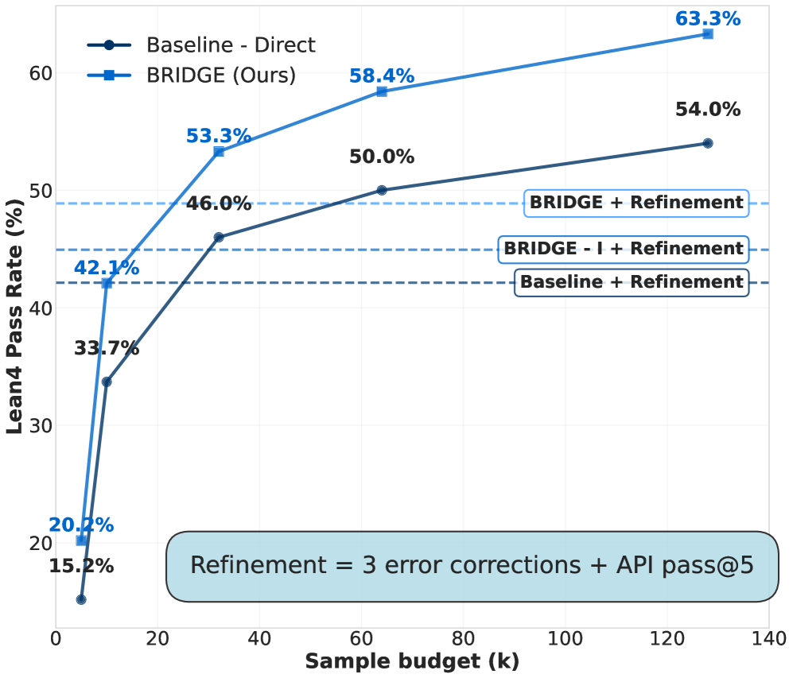
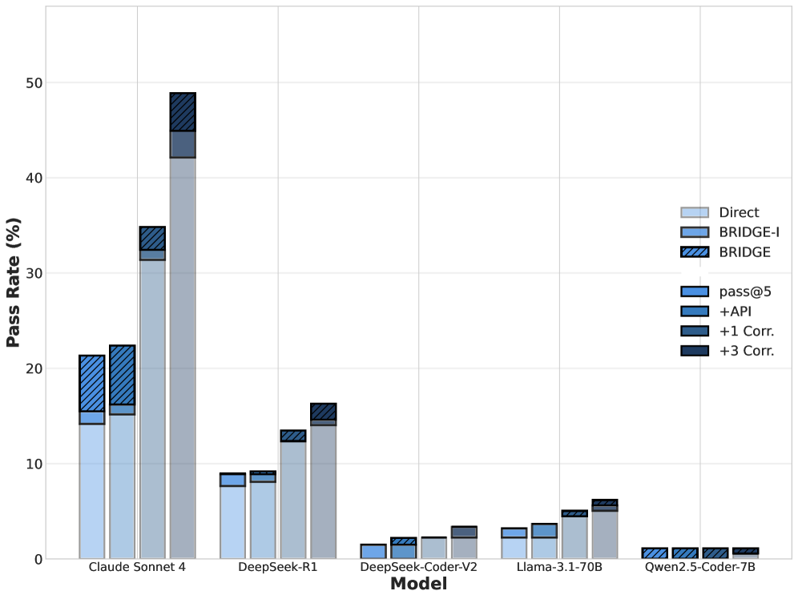
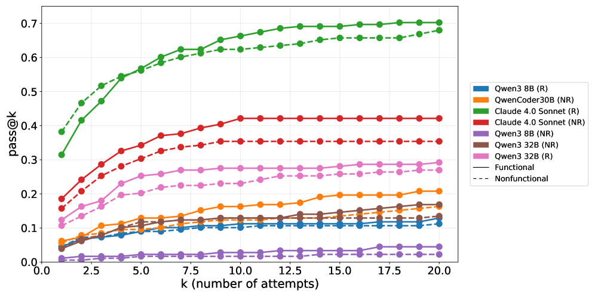
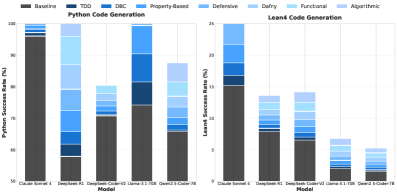
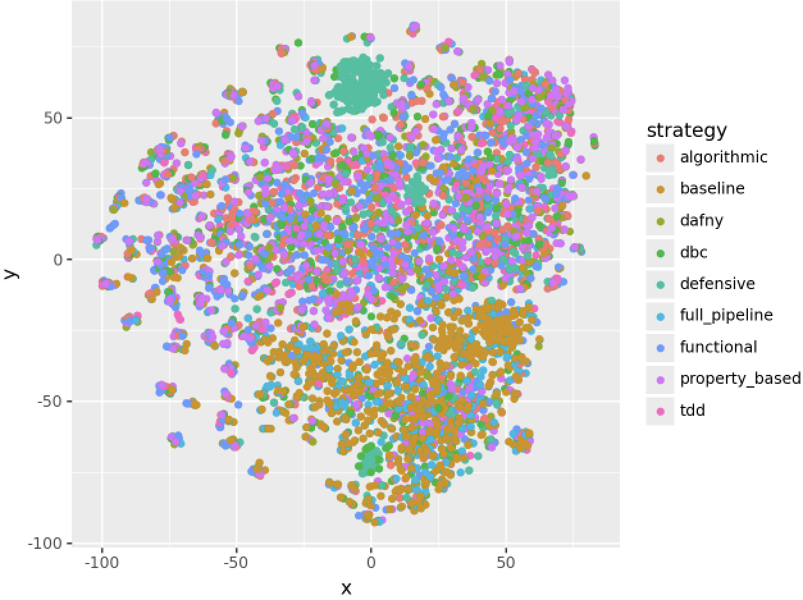
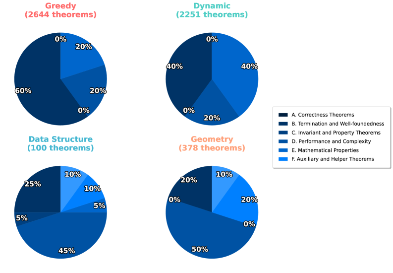
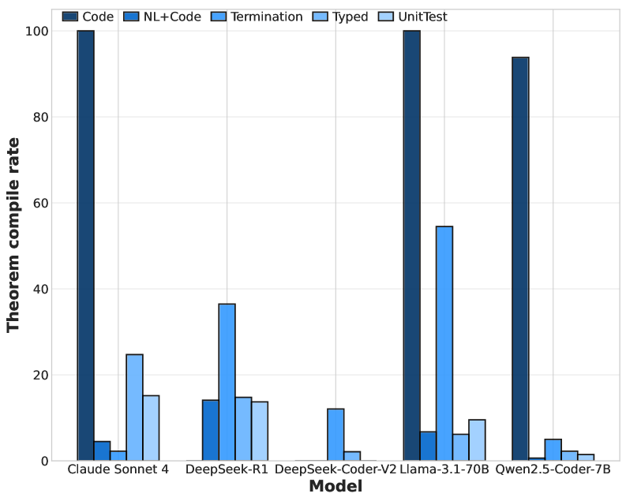
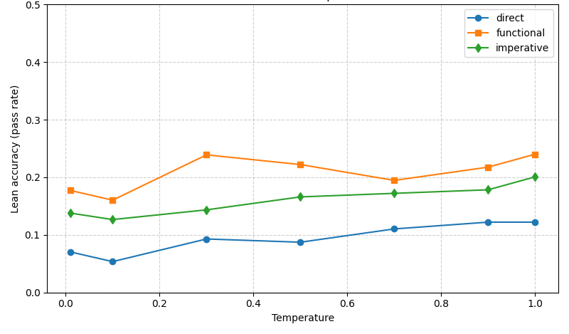
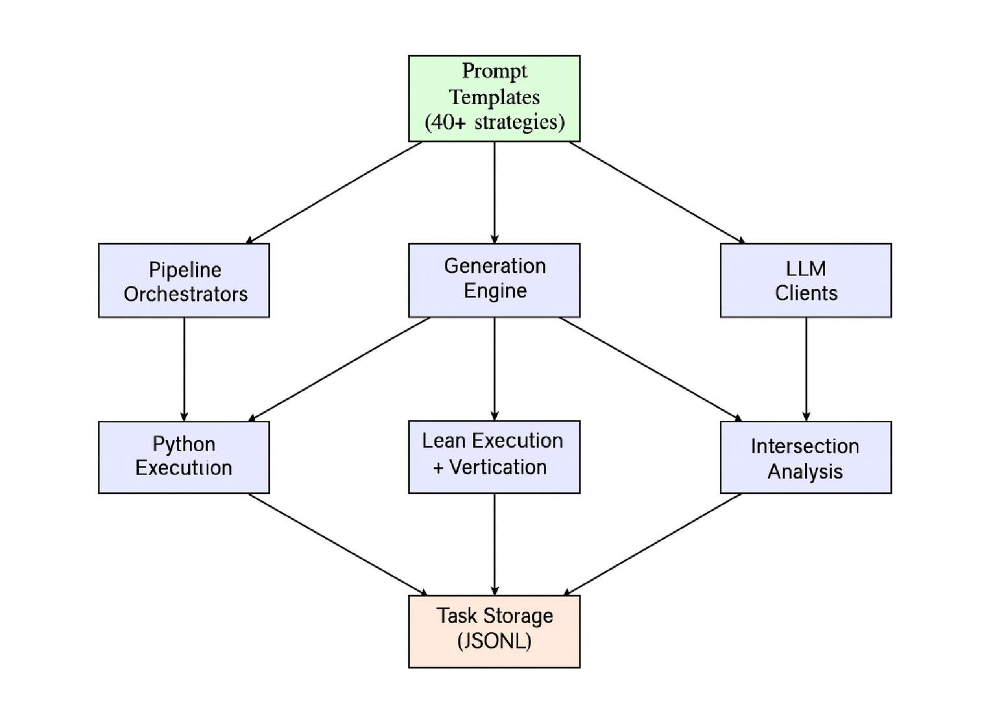
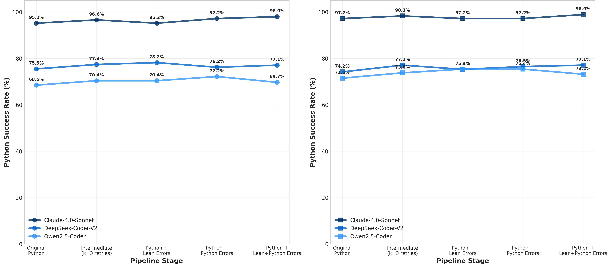

# BRIDGE: Building Representations In Domain Guided Program Synthesis

**Robert Joseph George Carson Eisenach Udaya Ghai Dominique Perrault-Joncas Anima Anandkumar Dean Foster**

## Abstract

Large language models (LLMs) are good at generating code, but remain brittle for formal verification in systems like Lean4. A core scalability challenge is that verified synthesis requires *consistent* outputs across multiple artifacts—executable code, precise specifications, theorem statements and ultimately proofs—yet existing approaches rarely treat these as a unified pipeline. We present **BRIDGE**, a structured prompting framework that decomposes verification into three interconnected domains: *Code* (implementations), *Specifications* (formal intent), and *Theorem Statements* (constructive correctness claims), and elicits domain-specific intermediate reasoning to connect them. In Lean4, BRIDGE often adopts a code-first workflow, using the generated implementation as a semantic anchor for downstream specification and theorem statement generation. Across 178 algorithmic problems and five LLMs, BRIDGE improves Lean executable correctness by nearly $1.5\times$ (pass@5) over direct baselines and can be *$2\times$ more sample-efficient* at inference time, requiring fewer samples per verified solution at comparable generation lengths. We further find that specification-driven prompting improves Python pass rates by up to 17.5%. Beyond inference-time prompting, supervised fine-tuning on BRIDGE-style reasoning traces yields nearly $1.5\times$ higher Lean pass success than code-only SFT, indicating that these intermediate representations are learnable. BRIDGE provides a practical foundation for scaling verified synthesis and motivates future work on expert iteration and full proof generation.

Program Synthesis, Large Language Models, Formal Methods, Lean4

*Figure 1 : BRIDGE (functional reasoning) improves executable correctness while reducing inference-time sample complexity. Lines show n -way parallel generation without refinement. Dotted horizontal lines indicate pass@5 with Lean API access and error correction at comparable generation lengths which are counted by the Claude Sonnet 4 tokenizer for consistent relative comparison. BRIDGE-I uses imperative (languages like Python) for intermediate reasoning. Results are using Claude Sonnet 4.*

*Figure 2 : Minimum Key Pushes example illustrating the BRIDGE pipeline: (a) problem statement, (b) functional reasoning, (c) specification reasoning, (d) theorem reasoning.*

## 1 Introduction

Program verification seeks guarantees beyond passing tests: a program should satisfy a precise specification for *all* inputs and executions. Achieving this traditionally involves three tightly coupled artifacts—an implementation that is accurately implemented ^1^11We report Lean executable correctness (elaboration + termination + tests), Elaboration means translating surface syntax into Lean’s core type theory and passing the trusted kernel checks. , a formal specification, and a correctness statement (and ultimately a proof) connecting the two—an idea that traces back to foundational work on axiomatic semantics and program correctness (Hoare, 1969; Floyd, 1967; Clarke and Wing, 1996). Functional languages such as Haskell or OCaml encourage compositional structure and equational reasoning, and they support rich specification idioms (e.g., algebraic datatypes, parametricity, and property-based testing). However, *functional structure alone is not a proof*: purity and type checking eliminate many bug classes, but they do not certify that a nontrivial semantic contract holds (e.g., optimality, safety invariants, or refinement to a mathematical model). To obtain machine-checked, end-to-end correctness arguments, one needs an interactive theorem prover (ITP) in which programs, specifications, and proofs coexist and are validated by a small trusted kernel—e.g., Lean4 (de Moura et al., 2015) or Rocq/Coq (Bertot and Castéran, 2013). This is precisely where Lean differs from “just writing the solution in a functional language”: Lean’s dependent types make specifications first-class, and its proof discipline forces the correctness argument to be explicit and mechanically checked.

Large language models now make it plausible to automate substantial parts of this pipeline, but their performance drops sharply once *formal guarantees* are required. Recent evaluations in Lean4 show that models can often produce plausible implementations and contracts, yet struggle to reliably close the loop with proof-oriented artifacts or end-to-end verification at scale (e.g., VERINA, CLEVER, and VeriBench) (Ye et al., 2025; Thakur et al., 2025; Miranda et al., 2025). We focus on Lean4 for three practical reasons. First, Lean provides a unified environment for *programming + specification + proof* with a large, actively maintained library ecosystem (Mathlib) that supports scalable composition (mathlib Community, 2020). Second, Lean enforces total, terminating definitions by default, making it a stringent testbed for verifiable synthesis: generated code must be executable and proof-relevant, not merely plausible. Third, compared to older ITPs, Lean4 has rapidly grown in adoption and standardization, and it provides immediate, fine-grained checker feedback that is particularly amenable to LLM-driven iteration.

In this setting, we ask a complementary question: rather than treating Lean as “just another syntax,” can we induce *reasoning representations* that preserve semantic structure across code, specifications, and theorem statements, and thereby improve the rate at which LLMs reach verifiable artifacts? Therefore, we propose **BRIDGE**, a structured prompting methodology for automated formal verification that enforces *semantic consistency* across three interconnected domains: **Code** (executable implementations), **Specifications** (formal behavioral intent), and **Theorem Statements** (constructive correctness arguments). Classical deductive verification is often taught and tooled as a *specification-first* workflow (contracts/invariants, then implementation, then proof obligations). In contrast, BRIDGE is designed for LLMs, where formalizing non-vacuous specs directly from natural language can be harder than producing a plausible implementation. We therefore support (and in Lean often prefer) a *code-first* decomposition: elicit Lean-friendly code via domain-specific reasoning, use the implementation as a semantic anchor to synthesize faithful specifications, and derive theorem statements that connect code to specification. Importantly, BRIDGE does not prescribe a fixed ordering over domains: while code-first decomposition is often effective, specification- and theorem-driven reasoning can also be used as intermediate scaffolds to improve downstream synthesis. Rather than requiring models to jump directly from natural language to full proofs, BRIDGE uses domain-specific prompting strategies to guide intermediate reasoning within and across these domains, enabling incremental transitions from problem statements to Lean code, from code to specifications, and from specifications to theorem statements, with full proof script generation left to future work. To our knowledge, BRIDGE is the first systematic approach to verifiable program synthesis that applies structured prompting across the full formal verification pipeline. We instantiate BRIDGE in Lean4 (de Moura et al., 2015; mathlib Community, 2020), but the methodology naturally extends to other formal systems such as Dafny and rocq.

Our central finding is that **reasoning strategy matters as much as language familiarity** for code synthesis in formal languages. Functional paradigms such as OCaml and Haskell align naturally with constructive reasoning and type-driven proof search, whereas imperative languages like Python and C++ often conflict with the requirements of formal logic. Across code, specification, and theorem statement generation, structured reasoning strategies yield consistent gains, with functional reasoning achieving nearly $1.5\times$ higher Lean executable correctness—measured by successful compilation and termination checking—than direct baselines at comparable generation lengths. These inference-time results indicate that the primary bottleneck is the *structure of the reasoning representation*, rather than familiarity with syntax or proof scripts. Beyond prompting, SFT on functional reasoning traces further improves Lean performance on code synthesis (measured by pass@k), suggesting that these representations can be internalized by the model. By contrast, literate programming improves readability but not verification performance (Appendix A). Looking ahead, reinforcement learning from verifiable rewards (RLVR) offers a natural path to scale these gains.

**Contributions.** Our main contributions are as follows:

1. **BRIDGE Framework.** We introduce **BRIDGE**, the first prompting-based framework for verified code synthesis. It decomposes verification into three domains—*Code*, *Specifications*, and *Theorem Statements*—and provides a scalable way to generate and interconnect them. Beyond prompting, we show that these domain-specific reasoning strategies can also be internalized through supervised fine-tuning, improving Lean executable correctness performance.
2. **Empirical Gains across Models and Domains.** Across 178 LeetCode algorithmic problems and five LLMs, BRIDGE yields substantial improvements. Functional prompting achieves up to a $1.5\times$ increase in success rates on verifiable code synthesis. It also does so more *efficiently*, in some cases reaching double the pass rates of direct baselines with comparable generation lengths. Specification prompting enhances Python code pass rates by up to 17.5%, and proof prompting produces stronger, non-trivial theorems rather than vacuous statements.
3. **Reasoning Strategy and Language Familiarity Interaction.** We show that reasoning strategy and language familiarity interact multiplicatively: functional paradigms (OCaml, Haskell) consistently outperform imperative ones (Python, C++), even when less represented in pretraining. This highlights structured reasoning, rather than dataset frequency, as the central bottleneck.

Though instantiated in Lean4 (which we hereafter abbreviate as Lean), BRIDGE generalizes to both programming languages and formal systems (e.g., rocq, Dafny, Boogie), enabling scalable, paradigm-aware code verification.

**Paper Structure.** Section 2 reviews related work on LLMs for program verification. Section 3 introduces BRIDGE and its prompting strategies across Code, Specifications, and Theorem Statements. Section 4 describes the datasets, models, and evaluation setup, while Section 5 presents empirical results and error analyses. Section 6 discusses implications for verified AI and future directions, including reinforcement learning from verification rewards (RLVR). Additional analyses, prompting strategies, and error breakdowns are provided in Appendices A, B, and C.

## 2 Related Work

Formal verification has a rich history spanning both foundational theory and applied systems. We highlight the most relevant strands of prior work that inform our paradigm-aware approach to LLM-assisted verification. More details and related work are in Appendix E.

| **Work / Method** | **CoT Style** | **CodeGen** | **SpecGen** | **TheoremGen** | **Compose** |
| --- | --- | --- | --- | --- | --- |
| **Prompting / Reasoning Methods** |  |  |  |  |  |
| CoT Prompting (Wei et al., 2022) | Rationale CoT | $\bullet$ | $\circ$ | $\circ$ | $\circ$ |
| Self-Consistency (Wang et al., 2022) | Sample & vote | $\bullet$ | $\circ$ | $\circ$ | $\circ$ |
| PAL (Gao et al., 2022) | Program-aided | $\bullet$ | $\circ$ | $\circ$ | $\circ$ |
| ReAct (Yao et al., 2023b) | Reason+Act (tools) | $\bullet$ | $\circ$ | $\circ$ | $\circ$ |
| Tree-of-Thought (Yao et al., 2023a) | Search over CoT | $\bullet$ | $\circ$ | $\circ$ | $\circ$ |
| Reflexion (Shinn et al., 2023) | Self-reflection | $\bullet$ | $\circ$ | $\circ$ | $\circ$ |
| Self-Refine (Madaan et al., 2023) | Iterative critique | $\bullet$ | $\circ$ | $\circ$ | $\circ$ |
| Clover (Sun et al., 2024) | Closed-loop checks | $\bullet$ | $\bullet$ | $\circ$ | $\circ$ |
| AutoSpec (Wen et al., 2024) | Spec synthesis (SMT) | $\circ$ | $\bullet$ | $\circ$ | $\circ$ |
| **BRIDGE (ours)** | Domain-specific CoT | $\bullet$ | $\bullet$ | $\LEFTcircle$ | $\bullet$ |
| **Benchmarks** |  |  |  |  |  |
| DafnyBench (Loughridge et al., 2024) | Solver-backed verify | $\circ$ | $\bullet$ | $\circ$ | $\circ$ |
| miniCodeProps (Lohn and Welleck, 2024) | Properties in Lean | $\circ$ | $\circ$ | $\RIGHTcircle$ | $\circ$ |
| VERINA (Ye et al., 2025) | Lean eval (code+spec+proof) | $\bullet$ | $\bullet$ | $\RIGHTcircle$ | $\circ$ |
| CLEVER (Thakur et al., 2025) | End-to-end Lean verify | $\bullet$ | $\bullet$ | $\RIGHTcircle$ | $\circ$ |
| DAFNYCOMP (Xu et al., 2025) | Compositional specs | $\circ$ | $\bullet$ | $\circ$ | $\circ$ |
| Vericoding (Bursuc et al., 2025) | Cross-system vericoding | $\bullet$ | $\bullet$ | $\RIGHTcircle$ | $\circ$ |

Table 1 : Chain-of-thought (CoT) / reasoning prompting vs. benchmarks for software and verification. TheoremGen refers to theorem statement generation, not full proof scripts. ∙ = supported/evaluated; ∘ = not a focus; ◐ = statement generation only; ◑ = proof generation only. "Compose" indicates whether the method is designed to connect artifacts across Code/Specs/Theorem Statements and Proofs.

**Program Synthesis/Verification.** Program verification aims to establish that a program satisfies its specification under all possible executions. Foundational work by Hoare and Floyd introduced axiomatic semantics and invariants for reasoning about program correctness (Hoare, 1969; Floyd, 1967), later formalized through weakest preconditions and deductive reasoning frameworks (Dijkstra, 1976; Clarke and Wing, 1996). A key but often underemphasized factor is the role of *programming paradigms* in verifiability. Imperative languages such as C++ and Python rely on mutable state and loops, requiring explicit reasoning about state transitions and loop invariants (Hoare, 1971). In contrast, functional paradigms (e.g., OCaml, Haskell) emphasize immutability and structural recursion, aligning more naturally with logical reasoning and inductive proofs (Hudak, 1989). Dependently typed systems such as Lean and rocq enforce these disciplines by construction (de Moura et al., 2015; Bertot and Castéran, 2013), which improves theoretical verifiability but poses challenges for models trained primarily on imperative corpora. BRIDGE directly targets this paradigm gap by introducing structured intermediate reasoning aligned with the target verification system.

**Automated Formal Verification with LLMs.** SMT-backed deductive verification systems provide one end of the verification spectrum. In these settings, approaches such as Clover (Sun et al., 2024) and benchmarks like VeriBench show that when powerful SMT backends are available, large language models can achieve high end-to-end verification rates despite noisy intermediate outputs. Interactive theorem provers (ITPs) expose sharper limitations: unlike solver-driven systems, ITPs require explicit proof construction, making them a stricter test of deep reasoning. Across multiple benchmarks, performance drops sharply when full proofs or cross-module composition are required, highlighting a persistent brittleness in LLM-based formal verification that aligns with earlier formal methods literature (Clarke and Wing, 1996).

**Interactive Theorem Proving and Lean4.** Interactive theorem provers (ITPs) provide strong correctness guarantees through explicit proof construction checked by a trusted kernel. Lean4 unifies programming and proving via dependent type theory, enabling highly expressive specifications and proofs (de Moura et al., 2015). Despite a large ecosystem such as Mathlib4, LLMs struggle with Lean’s strict termination discipline, rich type system, and tactic-based proof search. Prior work shows that even frontier models can generate syntactically valid Lean code and plausible specifications, but fail to reliably construct non-trivial proofs or compose correctness across modules. Domain-specific fine-tuning (e.g., TheoremLlama (Wang et al., 2024)) improves isolated proof tasks but does not address end-to-end verification pipelines linking implementations, specifications, and theorems. These limitations motivate BRIDGE’s focus on multi-stage, domain-aware prompting rather than direct translation to proofs.

**Multi-View Representations of Programs.** A complementary line of research explores representing programs from multiple semantic views. Models such as CodeBERT (Feng et al., 2020), GraphCodeBERT (Guo et al., 2021), and related approaches jointly model code, documentation, and structural information to improve program understanding and generation. CLOVER introduced closed-loop consistency checks by regenerating docstrings from code to detect semantic drift. These approaches highlight the importance of maintaining coherence across different representations of the same program.

## 3 Methodology

Existing approaches typically treat code, specifications, and proof artifacts as separate generation tasks, leaving limited machinery for maintaining semantic consistency across them. **BRIDGE** reframes verification as an inference-time reasoning process over three interconnected domains: *Code* (implementations), *Specifications* (formal intent), and *Theorem Statements* (correctness claims). BRIDGE uses domain-specific prompting to produce intermediate representations that act as checkpoints linking these artifacts, enabling evaluation and refinement through cross-domain consistency rather than isolated accuracy. We describe each domain and illustrate the elicited reasoning artifacts on the example in Figure 2; Appendix B provides the full prompt templates.

### 3.1 The Lean Code Domain

Implementing correct programs in Lean is uniquely challenging because it serves as both a programming language and a proof assistant grounded in dependent type theory (de Moura et al., 2015). Every definition must be total, terminating, and type-correct, so Lean treats programs as mathematical objects with explicit proof obligations. Even simple recursion requires a structural or well-founded justification, and imperative control patterns often fail to type-check or terminate. In this setting, writing Lean code is itself a form of formal reasoning. Imperative languages such as Python and C++ rely heavily on mutable state and explicit control flow, demanding auxiliary invariants and reasoning about state transitions (Hoare, 1969; Floyd, 1967; Videla, 2018). By contrast, Lean enforces a purely functional core and effectful computations are supported through monads like `IO` and `State`. The Lean ecosystem, including Mathlib4 (mathlib Community, 2020) and Std, follows this discipline closely—most Lean programs, including large mathematical and algorithmic libraries, are expressed in a functional style. We want to emphasize that the intermediate functional artifact is *not* required to compile in OCaml/Haskell; it serves as a reasoning scaffold and we evaluate only the final Lean4 output. In a complementary two-stage variant (Appendix B), we first generate an intermediate Python solution that is executed against tests before translating to Lean, and show that this executable intermediate can further improve downstream Lean success. **Code-domain evaluation.** In the Code domain, we measure Lean executable correctness: a sample is successful if the generated Lean solution elaborates, is accepted by Lean’s termination/totality checker, and passes the provided test suite (100 tests).

### 3.2 The Lean Specifications Domain

If code defines *how* a program operates, specifications define *what* it must guarantee. Formal specifications describe behavioral intent as logical contracts, forming the bridge between informal problem statements and provable implementations. Since the foundational work of Floyd and Hoare (Hoare, 1969; Floyd, 1967), this distinction has remained central to verification: correctness means demonstrating that an implementation satisfies its specification for all admissible inputs. In Lean, specifications appear as dependent types, pre/postconditions, and invariants that constrain program behavior. While Lean provides automation tools such as `omega` and `lean-smt` for discharging simple goals, verifying realistic specifications still requires explicit reasoning. Poorly structured or vacuous specifications can yield meaningless “correct” theorem statements, whereas overly rigid contracts may reject valid implementations.

The **BRIDGE** framework allows for different paradigms – including DbC, Property-Based Testing, Test-Driven Development, and Defensive Programming – to leverage additional views on the same task. Figure 2 shows an example of specification reasoning, where the model is prompted to reason about the contracts the implementation must satisfy before solving in Lean. Detailed comparisons across specification styles and examples of cross-language reasoning are included in Appendix C.

### 3.3 The Lean Theorem Statements Domain

Finally, Theorem statements and proofs provide the formal evidence that what the specifications state must in fact hold. While proof generation is the end goal, a necessary precursor is identifying *meaningful theorem goals*. In most prior work, these goals are the standard verification conditions (VCs) derived from the specification and implementation (e.g., the code satisfies its pre/postconditions and loop invariants). BRIDGE treats theorem discovery as an explicit reasoning step: the model proposes substantive properties such as bounds, invariants, monotonicity, or termination that clarify what must be proved and how it connects to the specification and code. In this work we focus primarily on evaluating proofs (when they exist) as a reasoning strategy for improving code synthesis (the reverse direction is left as future work).

Figure 2 shows an example of the reasoning content produced when the model is prompted to reason about the mathematical properties for the purpose of writing a theorem, before implementing the Lean solution. We can see that it identifies the mathematical properties of the optimal solution. Additional detailed examples and intersection analyses are presented in Appendix D.

### 3.4 The Semantic Bridge Hypothesis

Large language models bring immense statistical knowledge of code and mathematics, yet verification success depends not only on what they know but on how they *structure* that knowledge during reasoning. Our hypothesis is that formal verification requires an intermediate stage of structured reasoning, a **semantic bridge** that connects the model’s internal representations to the logical abstractions expected by proof assistants. Our central hypothesis is that verification requires more than direct translation: it requires **alignment between the model’s reasoning paradigm and the mathematical structure of the target system**.

Functional reasoning naturally captures recursion and compositionality; specification-oriented reasoning foregrounds correctness constraints; and theorem-driven reasoning surfaces the abstract properties that must be proved. These are not different languages, but complementary *representational modes* that help preserve semantic structure when translating from natural language to Lean artifacts. This matters because training data is misaligned: while Mathlib4 provides rich mathematics, there is comparatively little paired data linking *code, specifications, theorem statements, and proofs* end-to-end, and LLMs are predominantly trained on imperative corpora (Python/C++) rather than Lean’s functional and proof-oriented idioms. As a result, direct Lean generation is brittle, whereas structured, functionally grounded intermediate reasoning is more stable. BRIDGE therefore targets *stable intermediate representations* which we find can be internalized through SFT.

## 4 Experimental Setup and Methodology

### 4.1 Model and Dataset Settings

We evaluate BRIDGE on 178 algorithmic problems curated from LeetCode and various coding competitions, spanning diverse difficulty levels. The problems cover arrays, strings, graphs, dynamic programming, numerical algorithms, and trees. Each problem includes natural language documentation and test suites, enabling meaningful evaluation across all three domains: *Code* (correct Lean implementations), *Specifications* (non-vacuous formal contracts), and *Theorem Statements* (constructive statements linking code to specs). Lean code evaluation is performed by running each generated solution against 100 test cases per problem to verify functional correctness, compilation, and termination.

Five state-of-the-art LLMs are chosen to represent diverse architectures and training regimes: Claude Sonnet 4, DeepSeek Coder V2, DeepSeek R1, Llama-3.1-70B, and Qwen2.5 Coder. All are run with consistent decoding parameters (temperature 0.7, max output tokens 4096).

**Compute budgets and evaluation protocol.** Unless stated otherwise, we evaluate each strategy with $k$ independent samples per task (temperature $0.7$, max output tokens $4096$); pass@k is $1$ iff at least one of the $k$ samples yields a correct Lean solution under our code-domain criterion. For refinement settings, we allocate a fixed budget of 3 repair rounds per initial sample, where each round appends the Lean error message and requests a corrected solution under the same token cap; we report pass@5 after the final round. “API” denotes augmenting the prompt with retrieved Lean v4.21 library documentation (scraped signatures and docstrings) provided as additional context.

**Reasoning Strategies and Evaluation Design** We systematically vary reasoning strategies to test the semantic bridge hypothesis across all three verification domains. In the *Code* domain, we compare direct generation of Lean programs with approaches that use intermediate reasoning in different programming paradigms, including functional languages (e.g., Haskell, OCaml) and imperative languages (e.g., Python, C++, Java).

In the *Specifications* domain, we explore multiple frameworks as reasoning strategies for producing Lean specifications, following and extending the methodology introduced in VERINA. These frameworks include Design by Contract, Property-Based Testing, Test-Driven Development, and Defensive Programming prior to translation.

In the *Theorem Statements* domain, we evaluate theorem statements not by proof completion, but by semantic plausibility, recurrence across pathways, and alignment with known correctness patterns (bounds, monotonicity, invariants). In particular we evaluate four complementary reasoning pathways that connect informal descriptions, implementations, and formal statements. These pathways draw on natural language descriptions, unit tests, termination reasoning, and documentation, and we perform intersection analysis across them to identify robust correctness statements.

## 5 Experimental Results and Analysis

### 5.1 Thinking “Functionally” is a Win For All Models

We find strong evidence for our central hypothesis: functional reasoning paradigms consistently outperform imperative approaches across models and enhancement settings (Figure [3](images/001_x2.png)). For example, Claude Sonnet 4 reaches 48.9% with functional prompting, compared to 44.9% with imperative prompting and 42.1% for direct generation with 3 refinement rounds + API. The same trend holds across diverse models, including DeepSeek-R1 (16.3% vs. 14.6%), Llama-3.1-70B (6.2% vs. 5.6%), and Qwen2.5-Coder-7B (1.1% vs. 0.6%), suggesting functional scaffolds align better with Lean’s typing and termination constraints. While LeetCode-style tasks raise a potential retrieval confound, the consistent uplift on weaker models with low absolute Lean success makes a pure “retrieve-and-translate” explanation less likely, supporting a structural alignment effect (Appendix A).

*Figure 3 : Imperative vs Functional Reasoning. Bar graphs show each model’s pass@5 performance trajectory across enhancement strategies, with functional paradigms consistently outperforming imperative approaches.*

*Figure 4 : All models showcase functional paradigms consistently outperforming even at increased pass@k. NR=Non-reasoning mode while R=Reasoning mode.*

As shown in Figure [1](images/000_x1.png), **functional reasoning is up to $2\times$ more sample-efficient**: it requires roughly half as many generations to obtain one Lean-correct solution and, under the same refinement budget, achieves nearly $4\times$ higher Lean success than the direct pass@64 baseline at comparable generation lengths ($\approx 573$–$603$ tokens). Crucially, this efficiency gain is *not* an artifact of longer outputs: we include a length-matched *Double Lean* (check Appendix for the prompt) control that uses comparable token budgets, and functional reasoning still outperforms it, showing the improvement comes from representational structure rather than verbosity. Functional reasoning continues to improve beyond pass@128, indicating a higher asymptotic ceiling and greater stability, while imperative and direct methods plateau earlier due to compounding inconsistencies. These advantages are robust across temperatures (0.5–0.9), with OCaml/Haskell-style prompting consistently reaching 20–22% success and yielding 80–100% relative improvements over baseline strategies (Appendix A). Finally, error analysis supports the mechanism: functional prompting substantially reduces syntax errors (45%$\rightarrow$12%), lowers type errors, and cuts termination failures (15%$\rightarrow$8%), reinforcing that structured functional scaffolds improve Lean code synthesis.

### 5.2 Supervised Fine-Tuning on Reasoning Traces

We further study supervised fine-tuning (SFT) using reasoning traces derived from the TACO dataset (Li et al., 2023), starting from the Claude Sonnet 4 base model. Using approximately 1k annotated Lean problems, we generate both direct and BRIDGE-style reasoning traces for each example. Fine-tuning on functional BRIDGE traces yields a substantial improvement in Lean executable correctness, outperforming code-only fine-tuning by nearly $1.5\times$, which indicates that BRIDGE’s structured reasoning representations are learnable and provide a strong training signal. In absolute terms (pass@5), Lean executable correctness improves from 4.4% for the unfine-tuned baseline to 5.6% with direct fine-tuning, and further to 8.5% with BRIDGE-style fine-tuning.

### 5.3 Specification Reasoning Improves Code Synthesis

We find that specification reasoning strategies provide benefits extending beyond formal specifications to general code generation. As shown in Figure [5](images/003_x4.png), these strategies improve performance across both Python and Lean domains, demonstrating their broader value as a cognitive scaffold for program synthesis. In Python code generation, specification reasoning yields clear gains. Claude Sonnet 4 improves from 96.1% to 97.9%, while weaker models see larger boosts: DeepSeek-R1 (57.9%→68.0%, +17.5%), DeepSeek-Coder-V2 (70.8%→73.4%, +3.6%), Llama-3.1-70B (74.2%→86.0%, +15.9%), and Qwen2.5-Coder-7B (65.7%→71.9%, +9.4%). This shows that reasoning about intent before implementation improves code accuracy even outside formal theorem provers. We also observe that certain specification paradigms are consistently more effective. Algorithmic reasoning achieves an average success rate of 78.7% in Python generation, while Dafny-style formal specifications reach 78.1% and Defensive Programming 77.6%. This clustering of high-performing strategies suggests that structured specification design plays a key role in guiding implementation quality, independent of the target language or framework (see Appendix C for a comprehensive strategy analysis).

*Figure 5 : Dual improvement analysis showing that specification reasoning enhances both Python code pass rates (left) and Lean pass rates (right). All models benefit from specification-guided reasoning over direct baseline approaches.*

### 5.4 Different Strategies produce Semantically Different Code

To understand how different reasoning strategies affect generated Python code, we embedded all implementations using Qwen2.5-Coder embeddings and visualized them in two-dimensional space using t-SNE projection. Figure [6](images/004_codeembedding.png) shows that most intermediate reasoning strategies cluster together in semantic space, including Design by Contract, defensive programming, functional reasoning, and property-based testing. The baseline strategy appears as scattered orange points, often separated from these clusters, indicating that direct translation produces qualitatively different implementations. Semantic convergence across strategies supports our cognitive scaffolding theory and the consistent clustering of non-baseline approaches confirms that *thinking differently* results in meaningfully *different* code.

*Figure 6 : Code Embedding Analysis: Generated Python implementations cluster by strategy, with baseline (orange) showing distinct separation from other approaches.*

### 5.5 Theorem Statements: Multi-Pathway Analysis

Our multi-pathway analysis highlights a central bottleneck in verifiable synthesis: models often identify the right *mathematical properties*, but struggle to express them as well-typed Lean4 theorem statements (Figure [7](images/005_x5.png)). We emphasize that this paper *does not evaluate proof completion*; instead, we evaluate theorem *statement generation* via two complementary signals: (i) **Lean formalization**, measured by whether the generated statement typechecks in Lean4, and (ii) **semantic plausibility**, assessed by human annotators with consistency checks from a meta-LLM judge (Claude Sonnet 4). While Lean typechecking rates remain low (e.g., 9–20% across pathways in our pipeline), intersection analysis shows that models reliably rediscover recurring correctness categories (bounds, monotonicity, invariant preservation, optimality, and termination), suggesting the core structure is present even when Lean formalization fails. Full judging prompts, rubrics, and pathway details are provided in Appendix D.

*Figure 7 : Theorem Statements Analysis: a) The top panel shows some theorem distribution analysis. b) Shows final compile rates for different Theorem Statements generated using the strategies.*

## 6 Conclusion and Future Work

We introduced BRIDGE, a framework that reframes formal verification as achieving *semantic consistency* across three interdependent domains—code, specifications, and theorem statements—rather than as a single leap from natural language to proof. By eliciting structured intermediate representations, BRIDGE helps preserve mathematical structure as models move between abstraction levels, aligning their reasoning with the constraints of verification frameworks like Lean. Experiments on five state-of-the-art LLMs and 178 algorithmic problems show consistent gains: functional paradigms reduce syntax and termination failures and improve Lean executable correctness by up to $1.5\times$ (pass@5), while specification-oriented reasoning improves Python correctness by up to 17.5%. This work suggests several directions: (i) **close the loop with proofs** by extending BRIDGE from theorem *statement* generation to proof completion in Lean, combining LLM-guided proof search with lightweight counterexample filtering (e.g., Plausible) and verification-condition generation for effectful code (e.g., Lean’s `mvcgen` / monadic WP framework). We will also explore tighter integrations with emerging Lean verification infrastructures and larger-scale proof-oriented benchmarks. (ii) evaluate BRIDGE on standardized public benchmarks and scale to larger, more diverse task suites; and (iii) pursue post-training, especially RL from verifiable rewards (RLVR), to improve end-to-end reliability under fixed compute budgets.

## Impact Statement

This paper presents work whose goal is to advance the field of Machine Learning. There are many potential societal consequences of our work, none which we feel must be specifically highlighted here.

## Appendix A Extended Analysis

### A.1 Literate Programming for Formal Synthesis

Literate programming presents programs as readable mathematical exposition with embedded, executable code. In this section we ask whether large language models can solve formal problems in that style. Rather than emitting Lean code only, we prompt the model to produce a short manuscript that explains the problem, gives the mathematical context, derives the algorithm, and presents an executable Lean implementation together with its compilation status. The goal is to make the generated artifacts useful to both people and proof checkers, and to test whether a more formal narrative helps the model organize its reasoning.

##### Study design and setup.

We evaluated three concisely defined styles using Claude Sonnet 4. The *tutorial* style prioritizes pedagogical explanation, the *proof* style foregrounds formal justification, and the *mathematical* style adopts a compact, theorem oriented exposition. Each manuscript follows the same structure: brief abstract and problem restatement, minimal mathematical context and Lean implementation.

| **Style** | **Verified Works** | **Pass Rate** |
| --- | --- | --- |
| Tutorial | 8 | 4.5% |
| Proof | 14 | **7.9%** |
| Mathematical | 13 | 7.3% |

Table 2 : Literate programming styles pass@5 rates for Lean Code on the dataset.

The proof style attained the highest pass rate, which suggests that asking the model to think in terms of claims and justifications can improve the precision of its implementations. The mathematical style was a close second. The tutorial style was most readable but least successful, which indicates that explanations optimized for novice readability do not always align with the logical structure that Lean requires.

##### A compact example.

Below is a shortened example that illustrates the format. We present a brief narrative followed by a Lean function. The full listing is omitted for space.

*Listing 1: Literate solution skeleton, truncated for brevity*

##### Findings and implications.

The style that encourages the model to express claims and sketch justifications produced more verifiable Lean, even when the theorem statements were brief. This supports the broader result that representation matters: when the model articulates invariants and intended properties, the subsequent implementation is more likely to be precise and checkable. Literate generation also yields human readable artifacts that can be refined into full proofs (as a future work), which makes it a useful bridge between informal reasoning and formal verification. Future work includes interactive notebooks that couple Lean code, minimal proofs, and concise exposition, and a study of which narrative prompts best support proof discovery.

### A.2 Temperature Robustness Analysis

*Figure 8 : Temperature robustness of reasoning paradigms. Pass@5 accuracy of Claude Sonnet 4 as a function of sampling temperature for three prompting strategies: direct natural-language → Lean (blue), imperative Python-bridge (green), and functional OCaml-bridge (orange).*

Functional paradigms remain consistently stronger across all temperatures. Their success rates improve slightly with higher temperatures, suggesting robust structured reasoning benefits independent of sampling randomness.

*Figure 9 : BRIDGE framework for Inference Time prompting.*

### A.3 Error-Informed Python Code Refinement Pipeline

Understanding how error feedback from downstream compilation can improve upstream code generation reveals critical dynamics in iterative refinement. We implemented a multi-stage pipeline where Python generation benefits from both retry mechanisms ($k=3$ attempts) and cross-domain error signals from Lean execution. These Lean-derived errors improve Python quality even when Lean translation ultimately fails. Qwen2.5-Coder gains the most from Lean feedback (+3.9% in the functional paradigm), while DeepSeek-Coder-V2 benefits mainly from intermediate retries (+2.9%). Claude Sonnet 4, already near ceiling (97–98%), shows minimal gains, indicating diminishing returns for stronger models.

*Figure 10 : Python code success rates across improvement stages. Functional paradigms (Left) consistently outperforms imperative ones (Right), and incorporating Lean error feedback boosts Python success, though the gap to final executable accuracy remains large.*

Functional paradigms consistently outperform imperative ones across all pipeline stages, maintaining this advantage even with error feedback. Combining Python and Lean error signals yields the strongest results, with Claude Sonnet 4 reaching 98.9% success. However, the steep drop from high Python success (70–98%) to low Lean executable accuracy rates (0–14%) highlights a persistent bottleneck: the core challenge lies not in code quality but in translating algorithmic solutions into formally verified statements.

#### A.3.1 Inference Time Compute by Reasoning Strategy

Studying the relationship between reasoning verbosity and functional correctness reveals that increased inference-time compute is not the primary driver of improved performance. To quantify this, Table 3 measures average word and token counts (using the Claude Sonnet 4 tokenizer) for successful and failed attempts under each reasoning strategy, averaged across all five evaluated models. All reasoning strategies consistently have longer generation lengths (use more FLOPs), with OCaml responses averaging 563 tokens compared to only 270 for direct translation. Double Lean responses average 555 tokens, closely matching functional reasoning, yet achieve only 15.2% success (pass@5) compared to 20.2% (pass@5) for OCaml. This shows that mere verbosity does not explain functional advantages—structured reasoning drives the gains beyond raw reasoning effort.

While functional reasoning strategies require roughly 2× more tokens per generation compared to direct translation, the improved sample efficiency (fewer generations needed per verified solution) can offset this cost. For example, if direct translation requires 10 generations to find one verified solution (at 270 tokens each = 2,700 total tokens), while functional reasoning requires 5 generations (at 563 tokens each = 2,815 total tokens), the total computational cost is comparable despite the higher per-sample cost. The key advantage is that functional reasoning achieves higher absolute success rates, making it more reliable for production use even when total token costs are similar.

| **Reasoning Strategy** | **Direct (NL$\rightarrow$Lean)** | **Double Lean** | **Python** |
| --- | --- | --- | --- |
| Average length | 195 / 270 | 402 / 555 | 382 / 526 |
| Success length | 141 / 196 | 347 / 480 | 324 / 446 |
| Failure length | 200 / 278 | 412 / 570 | 391 / 540 |
| **Reasoning Strategy** | **Haskell** | **C++** | **OCaml** |
| Average length | 387 / 534 | 390 / 538 | 408 / 563 |
| Success length | 334 / 460 | 341 / 469 | 343 / 473 |
| Failure length | 401 / 555 | 402 / 558 | 421 / 581 |

Table 3 : Generation lengths by reasoning strategy. Lengths are reported as words / tokens, averaged over all attempts, successful attempts only, and failed attempts only.

### A.4 Error Pattern Analysis Across Paradigms

Systematic analysis of failure modes across different reasoning approaches exposes where structured reasoning provides specific cognitive advantages. The error distribution patterns illuminate why functional paradigms excel in formal verification tasks. All statistics reported here are averaged across all five evaluated models at pass@5.

Syntax errors represent the most immediate failure mode, occurring in 45% of direct translation attempts due to incorrect Lean syntax and missing type annotations. Functional reasoning approaches reduce syntax errors to 12%, showing better alignment with Lean’s mathematical syntax patterns. Functional paradigms naturally guide models toward syntactic structures compatible with dependently typed programming languages.

Type errors account for 30% of overall failures, with functional approaches showing 20% fewer type errors. Common issues include incorrect dependent type usage and mismatched function signatures. The reduced incidence in functional approaches confirms that functional reasoning patterns align naturally with Lean’s type theoretic foundations, where types can encode mathematical properties and proof obligations.

Most significantly, termination and totality failures occur in 15% of imperative approaches versus only 8% for functional approaches. Functional reasoning naturally leads to structurally recursive solutions that Lean can automatically prove terminating, while imperative approaches often produce iterative algorithms requiring complex termination arguments that current models struggle to provide. This pattern directly supports our theoretical claim that functional paradigms provide cognitive scaffolding aligned with mathematical proof construction requirements.

### A.5 Termination Error Analysis and Functional Paradigm Benefits

Understanding termination failures provides crucial insights into why functional paradigms excel in formal verification. Our analysis across multiple models and reasoning strategies reveals that functional approaches provide measurable benefits in reducing termination-related failures during Lean code generation.

The Python→Lean strategy consistently demonstrates lower termination error rates compared to direct translation approaches. Claude Sonnet 4 shows a 10.8% reduction in termination errors (29.88% vs 40.68% for direct Lean generation), while the Double Lean reasoning strategy achieves an average termination error rate of 33.5%. This pattern suggests that intermediate functional reasoning helps models develop structurally recursive solutions that align naturally with Lean’s termination checking requirements. However, we observe an interesting trade-off between verification success rates and termination error management. Higher-performing strategies like OCaml→Lean achieve the best pass rates (20.2% for Claude Sonnet 4) but encounter significant termination errors (34.57%). This suggests that sophisticated reasoning approaches tackling complex verification challenges naturally encounter more termination-related difficulties, but the overall success rate improvement outweighs these specific failures.

Model capability remains the primary determinant of success, with weaker models showing both poor pass rates (0-2%) and high termination error rates (28-49%) regardless of reasoning strategy. This indicates that while functional reasoning strategies provide structural benefits for termination management, underlying model capability determines whether these benefits can be effectively utilized.

### A.6 Theorem Statements Impact on Code Quality

Meta-analysis of formal proof reasoning within the BRIDGE Framework demonstrates measurable benefits for Lean code synthesis. We compared two distinct approaches: Strategy 1 involves reasoning about theorem statements from natural language descriptions before generating code, while Strategy 2 employs direct natural language to Lean translation without explicit proof consideration.

Strategy 1’s explicit proof-driven approach achieves higher overall success (14.6% vs. 10.1% at pass@5), indicating that formal reasoning scaffolding improves implementation quality. When both strategies succeed on the same problems, their solutions share over 95% algorithmic similarity, suggesting that generating good Theorem Statements both verifies correctness and guides the discovery of good algorithms. The two strategies also exhibit complementary strengths: Strategy 1 performs best on mathematically heavy tasks (e.g., geometry, combinatorial counting, bit manipulation), where explicit theorem statements provide the necessary scaffolding for correct Lean implementations, while Strategy 2 does better on dynamic programming and stateful computations, where full formal reasoning is less critical. Overall, these patterns support our three-domain view of proof generation as serving two roles: it enforces correctness by pinning down key mathematical properties, and it acts as an algorithmic discovery tool that systematically filters out incorrect solution paths.

## Appendix B Comprehensive Prompt System for BRIDGE

Our BRIDGE framework uses a modular prompt system to evaluate structured reasoning approaches across the three domains of formal verification. Over 40 strategies are organized into three families: *Code Domain* (Lean implementations), *Specification Domain* (formal contracts), and *Theorem Statements Domain* (mathematical property discovery). We present unified templates with strategy-specific content marked as `[SWAP]` placeholders.

##### Prompt Construction Procedure.

To construct a complete prompt from a template, we follow a systematic substitution process. First, the natural language problem description (from the LeetCode dataset) is prepended to the template. Next, `[SWAP:STRATEGY]` is replaced with one of the strategy options listed in the template (e.g., “Direct”, “Python Bridge”, “Haskell Functional”). The `[SWAP:REASONING_STYLE]` placeholder is replaced with the corresponding reasoning approach name (e.g., “Functional Reasoning” for Haskell, “Imperative Reasoning” for C++). The `[SWAP:REASONING_DETAILS]` placeholder is filled with strategy-specific reasoning guidelines provided in the subsequent template boxes. Metadata placeholders such as `InputType`, `OutputType`, and `{{ function_name }}` are extracted from the problem statement: `InputType` and `OutputType` are inferred from the problem’s input/output specifications, while `{{ function_name }}` is derived from the problem’s function signature or a canonical name based on the problem description. All placeholders are replaced before sending the prompt to the model, ensuring complete and consistent prompt construction across all strategies.

### B.1 Code Domain Strategies (Lean)

The Code Domain tests our hypothesis that reasoning strategies affect Lean generation success. We use a unified template with 6 reasoning strategies:

**BRIDGE Code Domain Template** **Instructions. Solve the task by applying the reasoning paradigm in `[SWAP:STRATEGY]` and translate the solution to Lean4.** **[SWAP:STRATEGY] options:** • **Direct**: Solve directly in Lean4 • **Python Bridge**: Reason in Python logic first, then translate • **Haskell Functional**: Pattern matching, recursion, type-driven development • **OCaml Type-Guided**: Type safety and mathematical invariants • **Double Lean**: Mathematical reasoning in Lean style, then implement • **C++ Imperative**: Procedural logic, then translate to functional Lean4 `Step 1: [SWAP:REASONING_STYLE] — [SWAP:REASONING_DETAILS]` **Note: `[SWAP:REASONING_STYLE]` is replaced with the strategy name (e.g., “Functional Reasoning”, “Imperative Reasoning”) corresponding to the selected `[SWAP:STRATEGY]` option.** `Step 2: Lean4 Translation` [⬇](data:text/plain;base64,aW1wb3J0IFN0ZAppbXBvcnQgTWF0aGxpYgoKZGVmIHNvbHV0aW9uIChpbnB1dCA6IElucHV0VHlwZSkgOiBPdXRwdXRUeXBlIDo9CiAgLS0gSW1wbGVtZW50YXRpb24gZnJvbSBbU1dBUDpTVFJBVEVHWV0KICBzb3JyeQ==) **import**` ``Std` **import**` ``Mathlib` **def**` ``solution`` ``(``input`` ``:`` ``InputType``)`` ``:`` ``OutputType`` ``:=` ` ``-- Implementation from [SWAP:STRATEGY]` ` `**sorry**

**BRIDGE-I (C++ / Python)** **[SWAP:REASONING_DETAILS] for C++:** • Loops, arrays, pointers, algorithmic thinking • Data structures (vectors, maps, sets) • Memory management, efficiency, complexity **[SWAP:REASONING_DETAILS] for Python:** • Python-like logic and built-ins • Simple, readable solutions

**BRIDGE (Haskell / OCaml / Double Lean)** **[SWAP:REASONING_DETAILS] for Haskell:** • Pattern matching and structural recursion • Functional composition and list processing • Type signatures and algebraic data types **[SWAP:REASONING_DETAILS] for OCaml:** • Immutable data structures and recursion • Algebraic data types, variants, records • Tail recursion and compositional design **[SWAP:REASONING_DETAILS] for Double Lean:** • Mathematical properties and invariants • Inductive definitions and recursive structures • Proof strategies grounded in type theory

### B.2 Specification Domain Strategies (Python)

**Unified Specification Domain Template** **Instructions. Solve the problem using `[SWAP:STRATEGY]` reasoning, then implement the solution in Python with formal contracts.** **[SWAP:STRATEGY] options:** • **Direct**: Write Python solution directly without intermediate reasoning • **Design by Contract**: Define preconditions, postconditions, and invariants • **Dafny-style**: Use requires/ensures clauses and verification conditions • **Property-Based Testing**: Identify universal mathematical properties • **Functional Programming**: Use immutable data and pure functions • **Defensive Programming**: Validate inputs and handle errors robustly • **Algorithmic Thinking**: Decompose into algorithmic subproblems • **Test-Driven Development**: Design by reasoning about test cases first `Step 1: [SWAP:REASONING_APPROACH] — Apply strategy-specific reasoning.` `Step 2: Python Implementation — Translate reasoning into Python with formal contracts.` [⬇](data:text/plain;base64,IyBBUFBST0FDSDoKIyBGaXJzdCByZWFzb24gdXNpbmcgW1NXQVA6U1RSQVRFR1ldIHByaW5jaXBsZXMsCiMgdGhlbiBpbXBsZW1lbnQgaW4gUHl0aG9uLgoKIyBTb2x1dGlvbiBQcm9jZXNzCiMgU3RlcCAxOiBbU1dBUDpTVFJBVEVHWV0gUmVhc29uaW5nCltTV0FQOkRFVEFJTEVEX1JFQVNPTklOR19HVUlERUxJTkVTXQoKIyBTdGVwIDI6IFB5dGhvbiBJbXBsZW1lbnRhdGlvbgojIEFwcGx5IFtTV0FQOlNUUkFURUdZXSByZWFzb25pbmcgdG8gY3JlYXRlIHJvYnVzdCBjb2RlIHdpdGggY29udHJhY3RzCgpbU1dBUDpDT05UUkFDVF9ERUNPUkFUT1JTXQpkZWYgZnVuY3Rpb25fbmFtZShwYXJhbWV0ZXJzKToKICAgICIiIgogICAgW1NXQVA6RE9DU1RSSU5HX1dJVEhfQ09OVFJBQ1RTXQogICAgIiIiCiAgICAjIEltcGxlbWVudGF0aW9uIGd1aWRlZCBieSBbU1dBUDpTVFJBVEVHWV0gcmVhc29uaW5nCiAgICBwYXNz) *# APPROACH:* *# First reason using [SWAP:STRATEGY] principles,* *# then implement in Python.* *# Solution Process* *# Step 1: [SWAP:STRATEGY] Reasoning* `[``SWAP``:``DETAILED_REASONING_GUIDELINES``]` *# Step 2: Python Implementation* *# Apply [SWAP:STRATEGY] reasoning to create robust code with contracts* `[``SWAP``:``CONTRACT_DECORATORS``]` **def**` ``function_name``(``parameters``):` ` ``""``"` ` ``[SWAP:DOCSTRING_WITH_CONTRACTS]` ` ``"``""` ` `*# Implementation guided by [SWAP:STRATEGY] reasoning* ` `**pass**

#### B.2.1 Concrete Prompt Examples for Each Strategy

**Prompt — Design by Contract Reasoning** **Reasoning Focus. Define rigorous preconditions, postconditions, and invariants that govern function behavior. This approach emphasizes formal contracts that specify exactly what conditions must hold before and after execution.** [⬇](data:text/plain;base64,aW1wb3J0IGRlYWwKZnJvbSB0eXBpbmcgaW1wb3J0IExpc3QKCkBkZWFsLnByZShsYW1iZGEgZGF0YTogaXNpbnN0YW5jZShkYXRhLCBsaXN0KSBhbmQgbGVuKGRhdGEpID4gMCkKQGRlYWwucHJlKGxhbWJkYSBkYXRhOiBhbGwoaXNpbnN0YW5jZSh4LCBpbnQpIGZvciB4IGluIGRhdGEpKQpAZGVhbC5wb3N0KGxhbWJkYSByZXN1bHQ6IHJlc3VsdCA+PSAwKQpAZGVhbC5lbnN1cmUobGFtYmRhIGRhdGEsIHJlc3VsdDogcmVzdWx0IDw9IHN1bSh4IGZvciB4IGluIGRhdGEgaWYgeCA+IDApKQpkZWYgY29udHJhY3Rfc29sdXRpb24oZGF0YTogTGlzdFtpbnRdKSAtPiBpbnQ6CiAgICAiIiIKICAgIFByZWNvbmRpdGlvbjogbm9uLWVtcHR5IGxpc3Qgb2YgaW50ZWdlcnMKICAgIFBvc3Rjb25kaXRpb246IHJlc3VsdCA+PSAwIGFuZCBib3VuZGVkIGJ5IHBvc2l0aXZlIHN1bQogICAgSW52YXJpYW50OiBpbnB1dCBkYXRhIHN0cnVjdHVyZSByZW1haW5zIHVuY2hhbmdlZAogICAgIiIiCiAgICBhc3NlcnQgaXNpbnN0YW5jZShkYXRhLCBsaXN0KSBhbmQgbGVuKGRhdGEpID4gMAogICAgYXNzZXJ0IGFsbChpc2luc3RhbmNlKHgsIGludCkgZm9yIHggaW4gZGF0YSkKICAgIHJlc3VsdCA9IHN1bSh4IGZvciB4IGluIGRhdGEgaWYgeCA+PSAwKQogICAgYXNzZXJ0IHJlc3VsdCA+PSAwCiAgICByZXR1cm4gcmVzdWx0) **import**` ``deal` **from**` ``typing`` `**import**` ``List` `@deal``.``pre``(`**lambda**` ``data``:`` `**isinstance**`(``data``,`` `**list**`)`` `**and**` `**len**`(``data``)`` ``>`` ``0)` `@deal``.``pre``(`**lambda**` ``data``:`` `**all**`(`**isinstance**`(``x``,`` `**int**`)`` `**for**` ``x`` `**in**` ``data``))` `@deal``.``post``(`**lambda**` ``result``:`` ``result`` ``>=`` ``0)` `@deal``.``ensure``(`**lambda**` ``data``,`` ``result``:`` ``result`` ``<=`` `**sum**`(``x`` `**for**` ``x`` `**in**` ``data`` `**if**` ``x`` ``>`` ``0))` **def**` ``contract_solution``(``data``:`` ``List``[`**int**`])`` ``->`` `**int**`:` ` ``""``"` ` ``Precondition:`` ``non-empty`` ``list`` ``of`` ``integers` ` ``Postcondition:`` ``result`` ``>=`` ``0`` ``and`` ``bounded`` ``by`` ``positive`` ``sum` ` ``Invariant:`` ``input`` ``data`` ``structure`` ``remains`` ``unchanged` ` ``"``""` ` ``assert`` `**isinstance**`(``data``,`` `**list**`)`` `**and**` `**len**`(``data``)`` ``>`` ``0` ` ``assert`` `**all**`(`**isinstance**`(``x``,`` `**int**`)`` `**for**` ``x`` `**in**` ``data``)` ` ``result`` ``=`` `**sum**`(``x`` `**for**` ``x`` `**in**` ``data`` `**if**` ``x`` ``>=`` ``0)` ` ``assert`` ``result`` ``>=`` ``0` ` `**return**` ``result`

**Prompt — Dafny-Style Specification Reasoning** **Reasoning Focus. Apply formal verification principles with requires/ensures clauses and mathematical assertions, inspired by the Dafny verification language.** [⬇](data:text/plain;base64,aW1wb3J0IGRlYWwKZnJvbSB0eXBpbmcgaW1wb3J0IExpc3QKCkBkZWFsLmNoYWluKAogICAgZGVhbC5wcmUobGFtYmRhIGRhdGE6IGFsbChpc2luc3RhbmNlKHgsIGludCkgZm9yIHggaW4gZGF0YSkpLAogICAgZGVhbC5wcmUobGFtYmRhIGRhdGE6IGRhdGEgPT0gc29ydGVkKGRhdGEpKSwKICAgIGRlYWwucG9zdChsYW1iZGEgcmVzdWx0OiByZXN1bHQgPT0gc29ydGVkKHJlc3VsdCkpLAogICAgZGVhbC5lbnN1cmUobGFtYmRhIGRhdGEsIHJlc3VsdDogYWxsKHggPj0gMCBmb3IgeCBpbiByZXN1bHQpKQopCmRlZiBkYWZueV9zdHlsZV9zb2x1dGlvbihkYXRhOiBMaXN0W2ludF0pIC0+IExpc3RbaW50XToKICAgICIiIgogICAgUmVxdWlyZXM6IGlucHV0IHNvcnRlZCBsaXN0IG9mIGludHMKICAgIEVuc3VyZXM6IG91dHB1dCBzb3J0ZWQgYW5kIG5vbi1uZWdhdGl2ZQogICAgSW52YXJpYW50OiBzb3J0ZWQgb3JkZXIgbWFpbnRhaW5lZCB0aHJvdWdob3V0CiAgICAiIiIKICAgIGFzc2VydCBhbGwoaXNpbnN0YW5jZSh4LCBpbnQpIGZvciB4IGluIGRhdGEpCiAgICBhc3NlcnQgZGF0YSA9PSBzb3J0ZWQoZGF0YSkKICAgIHJlc3VsdCA9IFthYnMoeCkgZm9yIHggaW4gZGF0YV0KICAgIGFzc2VydCByZXN1bHQgPT0gc29ydGVkKHJlc3VsdCkKICAgIHJldHVybiByZXN1bHQ=) **import**` ``deal` **from**` ``typing`` `**import**` ``List` `@deal``.``chain``(` ` ``deal``.``pre``(`**lambda**` ``data``:`` `**all**`(`**isinstance**`(``x``,`` `**int**`)`` `**for**` ``x`` `**in**` ``data``)),` ` ``deal``.``pre``(`**lambda**` ``data``:`` ``data`` ``==`` `**sorted**`(``data``)),` ` ``deal``.``post``(`**lambda**` ``result``:`` ``result`` ``==`` `**sorted**`(``result``)),` ` ``deal``.``ensure``(`**lambda**` ``data``,`` ``result``:`` `**all**`(``x`` ``>=`` ``0`` `**for**` ``x`` `**in**` ``result``))` `)` **def**` ``dafny_style_solution``(``data``:`` ``List``[`**int**`])`` ``->`` ``List``[`**int**`]:` ` ``""``"` ` ``Requires:`` ``input`` ``sorted`` ``list`` ``of`` ``ints` ` ``Ensures:`` ``output`` ``sorted`` ``and`` ``non-negative` ` ``Invariant:`` ``sorted`` ``order`` ``maintained`` ``throughout` ` ``"``""` ` ``assert`` `**all**`(`**isinstance**`(``x``,`` `**int**`)`` `**for**` ``x`` `**in**` ``data``)` ` ``assert`` ``data`` ``==`` `**sorted**`(``data``)` ` ``result`` ``=`` ``[`**abs**`(``x``)`` `**for**` ``x`` `**in**` ``data``]` ` ``assert`` ``result`` ``==`` `**sorted**`(``result``)` ` `**return**` ``result`

**Prompt — Property-Based Testing Reasoning** **Reasoning Focus. Identify universal mathematical properties that must hold across all valid input domains, emphasizing algebraic invariants and bounds.** [⬇](data:text/plain;base64,aW1wb3J0IGRlYWwKZnJvbSB0eXBpbmcgaW1wb3J0IExpc3QKCkBkZWFsLmNoYWluKAogICAgZGVhbC5wcmUobGFtYmRhIGRhdGE6IGlzaW5zdGFuY2UoZGF0YSwgbGlzdCkpLAogICAgZGVhbC5wb3N0KGxhbWJkYSByZXN1bHQ6IHJlc3VsdCA+PSAwKSwKICAgIGRlYWwuZW5zdXJlKGxhbWJkYSBkYXRhLCByZXN1bHQ6IHJlc3VsdCA8PSBzdW0oYWJzKHgpIGZvciB4IGluIGRhdGEpKQopCmRlZiBwcm9wZXJ0eV9zb2x1dGlvbihkYXRhOiBMaXN0W2ludF0pIC0+IGludDoKICAgICIiIgogICAgVW5pdmVyc2FsIFByb3BlcnRpZXM6CiAgICAtIENvbW11dGF0aXZpdHk6IG9yZGVyIGluZGVwZW5kZW5jZQogICAgLSBNb25vdG9uaWNpdHk6IGFkZGluZyBwb3NpdGl2ZXMgaW5jcmVhc2VzIHJlc3VsdAogICAgLSBOb24tbmVnYXRpdml0eTogcmVzdWx0ID49IDAKICAgICIiIgogICAgcmV0dXJuIHN1bSh4IGZvciB4IGluIGRhdGEgaWYgeCA+PSAwKQ==) **import**` ``deal` **from**` ``typing`` `**import**` ``List` `@deal``.``chain``(` ` ``deal``.``pre``(`**lambda**` ``data``:`` `**isinstance**`(``data``,`` `**list**`)),` ` ``deal``.``post``(`**lambda**` ``result``:`` ``result`` ``>=`` ``0),` ` ``deal``.``ensure``(`**lambda**` ``data``,`` ``result``:`` ``result`` ``<=`` `**sum**`(`**abs**`(``x``)`` `**for**` ``x`` `**in**` ``data``))` `)` **def**` ``property_solution``(``data``:`` ``List``[`**int**`])`` ``->`` `**int**`:` ` ``""``"` ` ``Universal`` ``Properties:` ` ``-`` ``Commutativity:`` ``order`` ``independence` ` ``-`` ``Monotonicity:`` ``adding`` ``positives`` ``increases`` ``result` ` ``-`` ``Non-negativity:`` ``result`` ``>=`` ``0` ` ``"``""` ` `**return**` `**sum**`(``x`` `**for**` ``x`` `**in**` ``data`` `**if**` ``x`` ``>=`` ``0)`

**Prompt — Test-Driven Development Reasoning** **Reasoning Focus. Design solutions by reasoning about comprehensive test cases first, following the Red–Green–Refactor cycle.** [⬇](data:text/plain;base64,aW1wb3J0IGRlYWwKZnJvbSB0eXBpbmcgaW1wb3J0IExpc3QKCkBkZWFsLmNoYWluKAogICAgZGVhbC5wcmUobGFtYmRhIGRhdGE6IGlzaW5zdGFuY2UoZGF0YSwgbGlzdCkpLAogICAgZGVhbC5wb3N0KGxhbWJkYSByZXN1bHQ6IGlzaW5zdGFuY2UocmVzdWx0LCBpbnQpIGFuZCByZXN1bHQgPj0gMCkKKQpkZWYgdGRkX3NvbHV0aW9uKGRhdGE6IExpc3RbaW50XSkgLT4gaW50OgogICAgIiIiCiAgICBUREQgRGVzaWduIFByb2Nlc3M6CiAgICAtIFJlZDogZGVmaW5lIGZhaWxpbmcgdGVzdHMKICAgIC0gR3JlZW46IG1pbmltYWwgaW1wbGVtZW50YXRpb24KICAgIC0gUmVmYWN0b3I6IG9wdGltaXplIHNhZmVseQogICAgIiIiCiAgICBpZiBub3QgaXNpbnN0YW5jZShkYXRhLCBsaXN0KSBvciBsZW4oZGF0YSkgPT0gMDoKICAgICAgICByZXR1cm4gMAoKICAgIHBvc2l0aXZlX3N1bSA9IHN1bSh4IGZvciB4IGluIGRhdGEgaWYgaXNpbnN0YW5jZSh4LCBpbnQpIGFuZCB4ID4gMCkKICAgIHJldHVybiBwb3NpdGl2ZV9zdW0KCmRlZiBjb21wcmVoZW5zaXZlX3Rlc3Rfc3VpdGUoKToKICAgIGFzc2VydCB0ZGRfc29sdXRpb24oWzEsIDIsIDNdKSA9PSA2CiAgICBhc3NlcnQgdGRkX3NvbHV0aW9uKFtdKSA9PSAwCiAgICBhc3NlcnQgdGRkX3NvbHV0aW9uKFstMSwgLTJdKSA9PSAwCiAgICBhc3NlcnQgdGRkX3NvbHV0aW9uKFsxLCAiMiIsIE5vbmVdKSA9PSAx) **import**` ``deal` **from**` ``typing`` `**import**` ``List` `@deal``.``chain``(` ` ``deal``.``pre``(`**lambda**` ``data``:`` `**isinstance**`(``data``,`` `**list**`)),` ` ``deal``.``post``(`**lambda**` ``result``:`` `**isinstance**`(``result``,`` `**int**`)`` `**and**` ``result`` ``>=`` ``0)` `)` **def**` ``tdd_solution``(``data``:`` ``List``[`**int**`])`` ``->`` `**int**`:` ` ``""``"` ` ``TDD`` ``Design`` ``Process:` ` ``-`` ``Red:`` ``define`` ``failing`` ``tests` ` ``-`` ``Green:`` ``minimal`` ``implementation` ` ``-`` ``Refactor:`` ``optimize`` ``safely` ` ``"``""` ` `**if**` `**not**` `**isinstance**`(``data``,`` `**list**`)`` `**or**` `**len**`(``data``)`` ``==`` ``0:` ` `**return**` ``0` ` ``positive_sum`` ``=`` `**sum**`(``x`` `**for**` ``x`` `**in**` ``data`` `**if**` `**isinstance**`(``x``,`` `**int**`)`` `**and**` ``x`` ``>`` ``0)` ` `**return**` ``positive_sum` **def**` ``comprehensive_test_suite``():` ` ``assert`` ``tdd_solution``([1,`` ``2,`` ``3])`` ``==`` ``6` ` ``assert`` ``tdd_solution``([])`` ``==`` ``0` ` ``assert`` ``tdd_solution``([-1,`` ``-2])`` ``==`` ``0` ` ``assert`` ``tdd_solution``([1,`` ``"2"``,`` ``None``])`` ``==`` ``1`

**Prompt — Defensive Programming Reasoning** **Reasoning Focus. Implement comprehensive input validation, error handling, and fail-safe behaviors to ensure robustness.** [⬇](data:text/plain;base64,aW1wb3J0IGRlYWwKaW1wb3J0IGxvZ2dpbmcKZnJvbSB0eXBpbmcgaW1wb3J0IExpc3QsIFVuaW9uCgpAZGVhbC5jaGFpbigKICAgIGRlYWwuc2FmZSwKICAgIGRlYWwucG9zdChsYW1iZGEgcmVzdWx0OiBpc2luc3RhbmNlKHJlc3VsdCwgaW50KSBhbmQgcmVzdWx0ID49IDApCikKZGVmIGRlZmVuc2l2ZV9zb2x1dGlvbihkYXRhOiBVbmlvbltMaXN0W2ludF0sIE5vbmVdKSAtPiBpbnQ6CiAgICAiIiIKICAgIERlZmVuc2l2ZSBTdHJhdGVnaWVzOgogICAgLSBWYWxpZGF0ZSBpbnB1dHMKICAgIC0gSGFuZGxlIG1hbGZvcm1lZCBkYXRhIGdyYWNlZnVsbHkKICAgIC0gUHJvdmlkZSBzYWZlIGZhbGxiYWNrIGJlaGF2aW9yCiAgICAiIiIKICAgIGlmIGRhdGEgaXMgTm9uZSBvciBub3QgaXNpbnN0YW5jZShkYXRhLCBsaXN0KToKICAgICAgICBsb2dnaW5nLndhcm5pbmcoIkludmFsaWQgaW5wdXQsIHVzaW5nIHNhZmUgZGVmYXVsdCIpCiAgICAgICAgcmV0dXJuIDAKCiAgICB0cnk6CiAgICAgICAgdmFsaWRfaW50cyA9IFt4IGZvciB4IGluIGRhdGEgaWYgaXNpbnN0YW5jZSh4LCBpbnQpXQogICAgICAgIHJldHVybiBzdW0oeCBmb3IgeCBpbiB2YWxpZF9pbnRzIGlmIHggPj0gMCkKICAgIGV4Y2VwdCBFeGNlcHRpb24gYXMgZToKICAgICAgICBsb2dnaW5nLmVycm9yKGYiQ29tcHV0YXRpb24gZXJyb3I6IHtlfSIpCiAgICAgICAgcmV0dXJuIDA=) **import**` ``deal` **import**` ``logging` **from**` ``typing`` `**import**` ``List``,`` ``Union` `@deal``.``chain``(` ` ``deal``.``safe``,` ` ``deal``.``post``(`**lambda**` ``result``:`` `**isinstance**`(``result``,`` `**int**`)`` `**and**` ``result`` ``>=`` ``0)` `)` **def**` ``defensive_solution``(``data``:`` ``Union``[``List``[`**int**`],`` ``None``])`` ``->`` `**int**`:` ` ``""``"` ` ``Defensive`` ``Strategies:` ` ``-`` ``Validate`` ``inputs` ` ``-`` ``Handle`` ``malformed`` ``data`` ``gracefully` ` ``-`` ``Provide`` ``safe`` ``fallback`` ``behavior` ` ``"``""` ` `**if**` ``data`` `**is**` ``None`` `**or**` `**not**` `**isinstance**`(``data``,`` `**list**`):` ` ``logging``.``warning``(``"Invalid input, using safe default"``)` ` `**return**` ``0` ` `**try**`:` ` ``valid_ints`` ``=`` ``[``x`` `**for**` ``x`` `**in**` ``data`` `**if**` `**isinstance**`(``x``,`` `**int**`)]` ` `**return**` `**sum**`(``x`` `**for**` ``x`` `**in**` ``valid_ints`` `**if**` ``x`` ``>=`` ``0)` ` `**except**` ``Exception`` ``as`` ``e``:` ` ``logging``.``error``(``f``"Computation error: {e}"``)` ` `**return**` ``0`

**Prompt — Algorithmic Thinking Reasoning** **Reasoning Focus. Systematically decompose problems into algorithmic subcomponents, emphasizing structure, correctness, and complexity analysis.** [⬇](data:text/plain;base64,aW1wb3J0IGRlYWwKZnJvbSB0eXBpbmcgaW1wb3J0IExpc3QKCkBkZWFsLmNoYWluKAogICAgZGVhbC5wcmUobGFtYmRhIGRhdGE6IGlzaW5zdGFuY2UoZGF0YSwgbGlzdCkpLAogICAgZGVhbC5wb3N0KGxhbWJkYSByZXN1bHQ6IGlzaW5zdGFuY2UocmVzdWx0LCBpbnQpIGFuZCByZXN1bHQgPj0gMCkKKQpkZWYgYWxnb3JpdGhtaWNfc29sdXRpb24oZGF0YTogTGlzdFtpbnRdKSAtPiBpbnQ6CiAgICAiIiIKICAgIEFsZ29yaXRobSBEZXNpZ246CiAgICAxLiBQcmVwcm9jZXNzaW5nCiAgICAyLiBDb3JlIGNvbXB1dGF0aW9uCiAgICAzLiBQb3N0LXByb2Nlc3NpbmcgdmFsaWRhdGlvbgoKICAgIENvbXBsZXhpdHk6IE8obikgdGltZSwgTygxKSBzcGFjZQogICAgIiIiCiAgICBpZiBub3QgZGF0YToKICAgICAgICByZXR1cm4gMAoKICAgIHJlc3VsdCA9IHN1bSh4IGZvciB4IGluIGRhdGEgaWYgaXNpbnN0YW5jZSh4LCBpbnQpIGFuZCB4ID4gMCkKICAgIHJldHVybiBtYXgoMCwgcmVzdWx0KQ==) **import**` ``deal` **from**` ``typing`` `**import**` ``List` `@deal``.``chain``(` ` ``deal``.``pre``(`**lambda**` ``data``:`` `**isinstance**`(``data``,`` `**list**`)),` ` ``deal``.``post``(`**lambda**` ``result``:`` `**isinstance**`(``result``,`` `**int**`)`` `**and**` ``result`` ``>=`` ``0)` `)` **def**` ``algorithmic_solution``(``data``:`` ``List``[`**int**`])`` ``->`` `**int**`:` ` ``""``"` ` ``Algorithm`` ``Design:` ` ``1.`` ``Preprocessing` ` ``2.`` ``Core`` ``computation` ` ``3.`` ``Post-processing`` ``validation` ` ``Complexity:`` ``O(n)`` ``time,`` ``O(1)`` ``space` ` ``"``""` ` `**if**` `**not**` ``data``:` ` `**return**` ``0` ` ``result`` ``=`` `**sum**`(``x`` `**for**` ``x`` `**in**` ``data`` `**if**` `**isinstance**`(``x``,`` `**int**`)`` `**and**` ``x`` ``>`` ``0)` ` `**return**` `**max**`(0,`` ``result``)`

### B.3 Theorem Statements Domain Strategies

The Theorem Statements Domain uses five pathways for robust mathematical property discovery and theorem generation. Each pathway approaches mathematical property identification from different perspectives to ensure comprehensive coverage.

**Unified Theorem Statements Template** **[SWAP:PATHWAY] options:** • **Natural Language**: Extract properties directly from the problem description • **Unit Tests**: Generalize mathematical claims from test patterns • **Code Analysis**: Reverse-engineer properties from implementation structure • **Type-Guided**: Leverage refined types for precise theorem generation • **Termination**: Focus on termination proofs and complexity bounds [⬇](data:text/plain;base64,LS0gVGFzazogR2VuZXJhdGUgTGVhbiBpbXBsZW1lbnRhdGlvbiBBTkQgdGhlb3JlbXMgdmlhIFtTV0FQOlBBVEhXQVldCgotLSBQQVRIV0FZOgotLSBbU1dBUDpQQVRIV0FZX1NQRUNJRklDX0FOQUxZU0lTXQoKLS0gWW91ciB0YXNrIGlzIHRvIGNyZWF0ZToKLS0gMSkgTGVhbiBJbXBsZW1lbnRhdGlvbjogY29tcGxldGUgc29sdXRpb24gdG8gdGhlIHByb2JsZW0KLS0gMikgRm9ybWFsIFRoZW9yZW1zOiBtYXRoZW1hdGljYWwgcHJvcGVydGllcyBkaXNjb3ZlcmVkIHZpYSBbU1dBUDpQQVRIV0FZXQoKaW1wb3J0IFN0ZAppbXBvcnQgTWF0aGxpYgoKZGVmIHNvbHV0aW9uIChpbnB1dCA6IElucHV0VHlwZSkgOiBPdXRwdXRUeXBlIDo9CiAgLS0gSW1wbGVtZW50YXRpb24gZ3VpZGVkIGJ5IFtTV0FQOlBBVEhXQVldIGFuYWx5c2lzCiAgc29ycnkKCi0tIFtTV0FQOlRIRU9SRU1fVFlQRV0KdGhlb3JlbSBbU1dBUDpUSEVPUkVNX05BTUVdIChpbnB1dCA6IElucHV0VHlwZSkgOgogIFtTV0FQOlRIRU9SRU1fU1RBVEVNRU5UXSA6PSBieQogIHNvcnJ5) `-- Task: Generate Lean implementation AND theorems via [SWAP:PATHWAY]` `-- PATHWAY:` `-- [SWAP:PATHWAY_SPECIFIC_ANALYSIS]` `-- Your task is to create:` `-- 1) Lean Implementation: complete solution to the problem` `-- 2) Formal Theorems: mathematical properties discovered via [SWAP:PATHWAY]` **import**` ``Std` **import**` ``Mathlib` **def**` ``solution`` ``(``input`` ``:`` ``InputType``)`` ``:`` ``OutputType`` ``:=` ` ``-- Implementation guided by [SWAP:PATHWAY] analysis` ` `**sorry** `-- [SWAP:THEOREM_TYPE]` **theorem**` ``[``SWAP``:``THEOREM_NAME``]`` ``(``input`` ``:`` ``InputType``)`` ``:` ` ``[``SWAP``:``THEOREM_STATEMENT``]`` ``:=`` `**by** ` `**sorry**

#### B.3.1 Concrete Pathway Examples

**Prompt — Natural Language $\to$ Lean Theorems** **Analysis Focus. Extract key mathematical properties and correctness conditions from the natural language statement and express them as Lean theorems about `{{ function_name }}`. Implement `{{ function_name }}` and generate *Theorem 1* (functional correctness) and *Theorem 2* (input/output relationship).** [⬇](data:text/plain;base64,LS0gVGhlb3JlbSAxOiBmdW5jdGlvbmFsIGNvcnJlY3RuZXNzCnRoZW9yZW0ge3sgZnVuY3Rpb25fbmFtZSB9fV9jb3JyZWN0bmVzcwogICAgKHt7IGZ1bmN0aW9uX3BhcmFtcyB9fSkgKGggOiBwcmVjb25kaXRpb24ge3sgZnVuY3Rpb25fcGFyYW1zIH19KSA6CiAgICBwcm9wZXJ0eSAoe3sgZnVuY3Rpb25fbmFtZSB9fSB7eyBwYXJhbV9uYW1lcyB9fSkgOj0gYnkKICBzb3JyeQoKLS0gVGhlb3JlbSAyOiBpbnB1dC9vdXRwdXQgcmVsYXRpb25zaGlwCnRoZW9yZW0ge3sgZnVuY3Rpb25fbmFtZSB9fV9pbnB1dF9vdXRwdXRfcmVsYXRpb25zaGlwCiAgICAoe3sgZnVuY3Rpb25fcGFyYW1zIH19KSA6CiAgICByZWxhdGlvbiB7eyBwYXJhbV9uYW1lcyB9fSAoe3sgZnVuY3Rpb25fbmFtZSB9fSB7eyBwYXJhbV9uYW1lcyB9fSkgOj0gYnkKICBzb3JyeQ==) `-- Theorem 1: functional correctness` **theorem**` ``{{`` ``function_name`` ``}}``_correctness` ` ``({{`` ``function_params`` ``}})`` ``(``h`` ``:`` ``precondition`` ``{{`` ``function_params`` ``}})`` ``:` ` ``property`` ``({{`` ``function_name`` ``}}`` ``{{`` ``param_names`` ``}})`` ``:=`` `**by** ` `**sorry** `-- Theorem 2: input/output relationship` **theorem**` ``{{`` ``function_name`` ``}}``_input_output_relationship` ` ``({{`` ``function_params`` ``}})`` ``:` ` ``relation`` ``{{`` ``param_names`` ``}}`` ``({{`` ``function_name`` ``}}`` ``{{`` ``param_names`` ``}})`` ``:=`` `**by** ` `**sorry**

**Prompt — Unit Test Pattern $\to$ Lean Theorems** **Analysis Focus. Study unit test patterns to infer relationships and invariants they enforce, then express these as Lean theorems about `{{ function_name }}`. Implement `{{ function_name }}` and generate *Theorem 1* (a property generalized from tests) and *Theorem 2* (an invariant relating multiple calls).** [⬇](data:text/plain;base64,LS0gVGhlb3JlbSAxOiBwcm9wZXJ0eSBnZW5lcmFsaXplZCBmcm9tIHRlc3QgcGF0dGVybnMKdGhlb3JlbSB7eyBmdW5jdGlvbl9uYW1lIH19X3Rlc3RfcGF0dGVybl90aGVvcmVtCiAgICAoe3sgZnVuY3Rpb25fcGFyYW1zIH19KSA6CiAgICBwcm9wZXJ0eV9mcm9tX3Rlc3RzIHt7IHBhcmFtX25hbWVzIH19CiAgICAgICh7eyBmdW5jdGlvbl9uYW1lIH19IHt7IHBhcmFtX25hbWVzIH19KSA6PSBieQogIHNvcnJ5CgotLSBUaGVvcmVtIDI6IGludmFyaWFudCBpZGVudGlmaWVkIGZyb20gdGVzdHMKdGhlb3JlbSB7eyBmdW5jdGlvbl9uYW1lIH19X3Rlc3RfaW52YXJpYW50X3RoZW9yZW0KICAgIChpbnB1dDEgaW5wdXQyIDoge3sgaW5wdXRfdHlwZSB9fSkgOgogICAgaW52YXJpYW50X3Byb3BlcnR5CiAgICAgICh7eyBmdW5jdGlvbl9uYW1lIH19IGlucHV0MSkKICAgICAgKHt7IGZ1bmN0aW9uX25hbWUgfX0gaW5wdXQyKSA6PSBieQogIHNvcnJ5) `-- Theorem 1: property generalized from test patterns` **theorem**` ``{{`` ``function_name`` ``}}``_test_pattern_theorem` ` ``({{`` ``function_params`` ``}})`` ``:` ` ``property_from_tests`` ``{{`` ``param_names`` ``}}` ` ``({{`` ``function_name`` ``}}`` ``{{`` ``param_names`` ``}})`` ``:=`` `**by** ` `**sorry** `-- Theorem 2: invariant identified from tests` **theorem**` ``{{`` ``function_name`` ``}}``_test_invariant_theorem` ` ``(``input1`` ``input2`` ``:`` ``{{`` ``input_type`` ``}})`` ``:` ` ``invariant_property` ` ``({{`` ``function_name`` ``}}`` ``input1``)` ` ``({{`` ``function_name`` ``}}`` ``input2``)`` ``:=`` `**by** ` `**sorry**

**Prompt — Code Implementation $\to$ Lean Theorems** **Analysis Focus. Reverse-engineer mathematical properties from an existing Lean implementation of `{{ function_name }}`. Derive theorems that verify algorithmic correctness and implementation-specific invariants.** [⬇](data:text/plain;base64,LS0gVGhlb3JlbSAxOiBmdW5jdGlvbmFsIGNvcnJlY3RuZXNzIG9mIHt7IGZ1bmN0aW9uX25hbWUgfX0KdGhlb3JlbSB7eyBmdW5jdGlvbl9uYW1lIH19X2NvcnJlY3RuZXNzCiAgICAoe3sgZnVuY3Rpb25fcGFyYW1zIH19KSAoaCA6IHZhbGlkX2lucHV0IHt7IHBhcmFtX25hbWVzIH19KSA6CiAgICBzYXRpc2ZpZXNfc3BlY2lmaWNhdGlvbgogICAgICAoe3sgZnVuY3Rpb25fbmFtZSB9fSB7eyBwYXJhbV9uYW1lcyB9fSkge3sgcGFyYW1fbmFtZXMgfX0gOj0gYnkKICBzb3JyeQoKLS0gVGhlb3JlbSAyOiBtYXRoZW1hdGljYWwgcHJvcGVydHkgcHJlc2VydmF0aW9uCnRoZW9yZW0ge3sgZnVuY3Rpb25fbmFtZSB9fV9wcm9wZXJ0eV9wcmVzZXJ2ZWQKICAgICh7eyBmdW5jdGlvbl9wYXJhbXMgfX0pIDoKICAgIHByb3BlcnR5X2hvbGRzIHt7IHBhcmFtX25hbWVzIH19CiAgICAgICh7eyBmdW5jdGlvbl9uYW1lIH19IHt7IHBhcmFtX25hbWVzIH19KSA6PSBieQogIHNvcnJ5CgotLSBUaGVvcmVtIDM6IGFsZ29yaXRobWljIGludmFyaWFudAp0aGVvcmVtIHt7IGZ1bmN0aW9uX25hbWUgfX1fYWxnb3JpdGhtX2ludmFyaWFudAogICAgKHt7IGZ1bmN0aW9uX3BhcmFtcyB9fSkgOgogICAgZm9yYWxsX3N0ZXBzX3NhdGlzZnlfaW52YXJpYW50CiAgICAgICh7eyBmdW5jdGlvbl9uYW1lIH19IHt7IHBhcmFtX25hbWVzIH19KSA6PSBieQogIHNvcnJ5) `-- Theorem 1: functional correctness of {{ function_name }}` **theorem**` ``{{`` ``function_name`` ``}}``_correctness` ` ``({{`` ``function_params`` ``}})`` ``(``h`` ``:`` ``valid_input`` ``{{`` ``param_names`` ``}})`` ``:` ` ``satisfies_specification` ` ``({{`` ``function_name`` ``}}`` ``{{`` ``param_names`` ``}})`` ``{{`` ``param_names`` ``}}`` ``:=`` `**by** ` `**sorry** `-- Theorem 2: mathematical property preservation` **theorem**` ``{{`` ``function_name`` ``}}``_property_preserved` ` ``({{`` ``function_params`` ``}})`` ``:` ` ``property_holds`` ``{{`` ``param_names`` ``}}` ` ``({{`` ``function_name`` ``}}`` ``{{`` ``param_names`` ``}})`` ``:=`` `**by** ` `**sorry** `-- Theorem 3: algorithmic invariant` **theorem**` ``{{`` ``function_name`` ``}}``_algorithm_invariant` ` ``({{`` ``function_params`` ``}})`` ``:` ` ``forall_steps_satisfy_invariant` ` ``({{`` ``function_name`` ``}}`` ``{{`` ``param_names`` ``}})`` ``:=`` `**by** ` `**sorry**

**Prompt — Termination $\to$ Complexity Proofs** **Analysis Focus. Generate Lean theorems about termination and computational complexity for `{{ function_name }}`. Implement `{{ function_name }}` with termination in mind and produce termination-focused statements.** [⬇](data:text/plain;base64,LS0gVGhlb3JlbSAxOiB0ZXJtaW5hdGlvbiBvZiB7eyBmdW5jdGlvbl9uYW1lIH19CnRoZW9yZW0ge3sgZnVuY3Rpb25fbmFtZSB9fV90ZXJtaW5hdGVzCiAgICAoe3sgZnVuY3Rpb25fcGFyYW1zIH19KSA6CiAgICDiiIMgb3V0cHV0IDoge3sgcmV0dXJuX3R5cGUgfX0sCiAgICAgIHt7IGZ1bmN0aW9uX25hbWUgfX0ge3sgcGFyYW1fbmFtZXMgfX0gPSBvdXRwdXQgOj0gYnkKICBzb3JyeQoKLS0gVGhlb3JlbSAyOiB3ZWxsLWZvdW5kZWQgcmVjdXJzaW9uIChpZiBhcHBsaWNhYmxlKQp0aGVvcmVtIHt7IGZ1bmN0aW9uX25hbWUgfX1fcmVjdXJzaW9uX3dlbGxfZm91bmRlZAogICAgKHt7IGZ1bmN0aW9uX3BhcmFtcyB9fSkgOgogICAgV2VsbEZvdW5kZWQgKHJlY3Vyc2lvbl9yZWxhdGlvbiB7eyBwYXJhbV9uYW1lcyB9fSkgOj0gYnkKICBzb3JyeQoKLS0gVGhlb3JlbSAzOiBjb21wbGV4aXR5IGJvdW5kIGZvciB7eyBmdW5jdGlvbl9uYW1lIH19CnRoZW9yZW0ge3sgZnVuY3Rpb25fbmFtZSB9fV9jb21wbGV4aXR5X2JvdW5kCiAgICAoe3sgZnVuY3Rpb25fcGFyYW1zIH19KSA6CiAgICBjb21wdXRhdGlvbl9zdGVwcyAoe3sgZnVuY3Rpb25fbmFtZSB9fSB7eyBwYXJhbV9uYW1lcyB9fSkg4omkCiAgICAgIGNvbXBsZXhpdHlfZnVuY3Rpb24gKHNpemUge3sgcGFyYW1fbmFtZXMgfX0pIDo9IGJ5CiAgc29ycnk=) `-- Theorem 1: termination of {{ function_name }}` **theorem**` ``{{`` ``function_name`` ``}}``_terminates` ` ``({{`` ``function_params`` ``}})`` ``:` ` ``$\exists$`` ``output`` ``:`` ``{{`` ``return_type`` ``}},` ` ``{{`` ``function_name`` ``}}`` ``{{`` ``param_names`` ``}}`` ``=`` ``output`` ``:=`` `**by** ` `**sorry** `-- Theorem 2: well-founded recursion (if applicable)` **theorem**` ``{{`` ``function_name`` ``}}``_recursion_well_founded` ` ``({{`` ``function_params`` ``}})`` ``:` ` ``WellFounded`` ``(``recursion_relation`` ``{{`` ``param_names`` ``}})`` ``:=`` `**by** ` `**sorry** `-- Theorem 3: complexity bound for {{ function_name }}` **theorem**` ``{{`` ``function_name`` ``}}``_complexity_bound` ` ``({{`` ``function_params`` ``}})`` ``:` ` ``computation_steps`` ``({{`` ``function_name`` ``}}`` ``{{`` ``param_names`` ``}})`` ``$\leq$` ` ``complexity_function`` ``(``size`` ``{{`` ``param_names`` ``}})`` ``:=`` `**by** ` `**sorry**

**Prompt — Type-Guided $\to$ Lean Theorems** **Analysis Focus. Given a strongly typed Lean implementation of `{{ function_name }}`, generate theorems that leverage refined types and mathematical structure to prove stronger correctness and invariants.** [⬇](data:text/plain;base64,LS0gVGhlb3JlbSAxOiB0eXBlLWxldmVsIGNvcnJlY3RuZXNzIGZvciB7eyBmdW5jdGlvbl9uYW1lIH19CnRoZW9yZW0ge3sgZnVuY3Rpb25fbmFtZSB9fV90eXBlX2xldmVsX2NvcnJlY3RuZXNzCiAgICAoe3sgZnVuY3Rpb25fcGFyYW1zIH19KSA6CiAgICBUeXBlQ29uc3RyYWludFNhdGlzZmllZAogICAgICAoe3sgZnVuY3Rpb25fbmFtZSB9fSB7eyBwYXJhbV9uYW1lcyB9fSkgOj0gYnkKICBzb3JyeQoKLS0gVGhlb3JlbSAyOiBwcmVzZXJ2YXRpb24gb2YgbWF0aGVtYXRpY2FsIHN0cnVjdHVyZQp0aGVvcmVtIHt7IGZ1bmN0aW9uX25hbWUgfX1fc3RydWN0dXJlX3ByZXNlcnZhdGlvbgogICAgKHt7IGZ1bmN0aW9uX3BhcmFtcyB9fSkgOgogICAgUHJlc2VydmVzU3RydWN0dXJlCiAgICAgICh7eyBmdW5jdGlvbl9uYW1lIH19IHt7IHBhcmFtX25hbWVzIH19KQogICAgICB7eyBwYXJhbV9uYW1lcyB9fSA6PSBieQogIHNvcnJ5CgotLSBUaGVvcmVtIDM6IGVuaGFuY2VkIGludmFyaWFudCB1c2luZyByZWZpbmVkIHR5cGVzCnRoZW9yZW0ge3sgZnVuY3Rpb25fbmFtZSB9fV9lbmhhbmNlZF9pbnZhcmlhbnQKICAgICh7eyBmdW5jdGlvbl9wYXJhbXMgfX0pIDoKICAgIFN0cm9uZ2VySW52YXJpYW50IHt7IHBhcmFtX25hbWVzIH19CiAgICAgICh7eyBmdW5jdGlvbl9uYW1lIH19IHt7IHBhcmFtX25hbWVzIH19KSA6PSBieQogIHNvcnJ5) `-- Theorem 1: type-level correctness for {{ function_name }}` **theorem**` ``{{`` ``function_name`` ``}}``_type_level_correctness` ` ``({{`` ``function_params`` ``}})`` ``:` ` ``TypeConstraintSatisfied` ` ``({{`` ``function_name`` ``}}`` ``{{`` ``param_names`` ``}})`` ``:=`` `**by** ` `**sorry** `-- Theorem 2: preservation of mathematical structure` **theorem**` ``{{`` ``function_name`` ``}}``_structure_preservation` ` ``({{`` ``function_params`` ``}})`` ``:` ` ``PreservesStructure` ` ``({{`` ``function_name`` ``}}`` ``{{`` ``param_names`` ``}})` ` ``{{`` ``param_names`` ``}}`` ``:=`` `**by** ` `**sorry** `-- Theorem 3: enhanced invariant using refined types` **theorem**` ``{{`` ``function_name`` ``}}``_enhanced_invariant` ` ``({{`` ``function_params`` ``}})`` ``:` ` ``StrongerInvariant`` ``{{`` ``param_names`` ``}}` ` ``({{`` ``function_name`` ``}}`` ``{{`` ``param_names`` ``}})`` ``:=`` `**by** ` `**sorry**

### B.4 Iterative Improvement Strategies

The framework implements iterative improvement mechanisms using chain-of-thought error analysis. This enables systematic refinement of failed solutions through structured error diagnosis and targeted corrections.

**Prompt — Chain-of-Thought Error Analysis** **Goal. Systematically improve failed solutions through structured error analysis and reasoning refinement. The approach follows a four-phase methodology to identify, analyze, and correct solution failures.** **Process: Four Steps** • **Step 1: Error Classification.** Identify syntax errors, semantic errors, logic errors, type mismatches, and edge case failures. • **Step 2: Root Cause Analysis.** Determine why the errors occurred and which concepts were misunderstood or mis-modeled. • **Step 3: Solution Strategy Design.** Plan algorithmic changes, type corrections, edge case handling, and specification fixes. • **Step 4: Systematic Implementation.** Apply improvements based on the analysis and re-verify correctness. [⬇](data:text/plain;base64,IyBSRVRSWSBBVFRFTVBUIHt7IHJldHJ5X2F0dGVtcHQgfX0gLyB7eyBtYXhfcmV0cmllcyB9fQoKIyBZb3VyIHByZXZpb3VzIHNvbHV0aW9uIGZhaWxlZC4KIyBBbmFseXplIHRoZSBlcnJvcnMgYW5kIGdlbmVyYXRlIGFuIGltcHJvdmVkIHNvbHV0aW9uLgoKIyBQcmV2aW91cyBQeXRob24gLyBMZWFuIENvZGUgKEZBSUxFRCkKe3sgcHJldmlvdXNfcHl0aG9uX29yX2xlYW5fY29kZSB9fQoKIyBFcnJvciBNZXNzYWdlcyBhbmQgRmVlZGJhY2sKe3sgcHl0aG9uX29yX2xlYW5fZXJyb3JzIH19) *# RETRY ATTEMPT {{ retry_attempt }} / {{ max_retries }}* *# Your previous solution failed.* *# Analyze the errors and generate an improved solution.* *# Previous Python / Lean Code (FAILED)* `{{`` ``previous_python_or_lean_code`` ``}}` *# Error Messages and Feedback* `{{`` ``python_or_lean_errors`` ``}}`

**Meta-Analysis Process** **Analysis Methodology. Examine theorems generated across all five proof pathways to identify robust mathematical properties. The process synthesizes pathway-specific insights into integrated theorem sets with enhanced verification coverage.** [⬇](data:text/plain;base64,ewogICJpbnRlcnNlY3Rpb25fYW5hbHlzaXMiOiB7CiAgICAiY29tbW9uX2NvbmNlcHRzIjogWwogICAgICAibW9ub3RvbmljaXR5IiwKICAgICAgImJvdW5kcyIsCiAgICAgICJvcHRpbWFsaXR5IiwKICAgICAgImNvcnJlY3RuZXNzIgogICAgXSwKICAgICJzaGFyZWRfcHJvcGVydGllcyI6IFsKICAgICAgImludmFyaWFudF9wcmVzZXJ2YXRpb24iLAogICAgICAiZWRnZV9jYXNlX2hhbmRsaW5nIgogICAgXSwKICAgICJyb2J1c3RfdGhlb3JlbXMiOiBbCiAgICAgICJtb3N0X2ZyZXF1ZW50bHlfYXBwZWFyaW5nIiwKICAgICAgImhpZ2hlc3RfbWF0aGVtYXRpY2FsX3JpZ29yIgogICAgXSwKICAgICJwYXRod2F5X3NwZWNpZmljX2luc2lnaHRzIjogWwogICAgICAidW5pcXVlX2NvbnRyaWJ1dGlvbnNfcGVyX3BhdGh3YXkiCiAgICBdCiAgfSwKICAiZmluYWxfdGhlb3JlbV9zZWxlY3Rpb24iOiBbCiAgICAic29sdXRpb25fY29ycmVjdG5lc3M6IGVzc2VudGlhbCBmdW5jdGlvbmFsIGNvcnJlY3RuZXNzIHByb3BlcnR5IiwKICAgICJzb2x1dGlvbl9ib3VuZHM6IG1hdGhlbWF0aWNhbCBib3VuZHMgYW5kIGNvbnN0cmFpbnQgdmVyaWZpY2F0aW9uIiwKICAgICJzb2x1dGlvbl90ZXJtaW5hdGlvbjogY29tcHV0YXRpb25hbCB0ZXJtaW5hdGlvbiBndWFyYW50ZWVzIgogIF0sCiAgImNvbXBsZXRlX0xlYW5fZmlsZSI6ICIKaW1wb3J0IFN0ZAppbXBvcnQgTWF0aGxpYgoKZGVmIHNvbHV0aW9uIChpbnB1dCA6IElucHV0VHlwZSkgOiBPdXRwdXRUeXBlIDo9CiAgY29tcGxldGVfaW1wbGVtZW50YXRpb24KCnRoZW9yZW0gc29sdXRpb25cX2JvdW5kcyAoaW5wdXQgOiBJbnB1dFR5cGUpIDoKICAwIFxcbGUgc29sdXRpb24gaW5wdXQgXFx3ZWRnZSBzb2x1dGlvbiBpbnB1dCBcXGxlIHVwcGVyXFxfYm91bmQgaW5wdXQgOj0gYnkKICBzb3JyeQogIC0tIG9taXR0ZWQgZm9yIGJyZXZpdHkKIgp9) `{` ` ``"intersection_analysis"``:`` ``{` ` ``"common_concepts"``:`` ``[` ` ``"monotonicity"``,` ` ``"bounds"``,` ` ``"optimality"``,` ` ``"correctness"` ` ``],` ` ``"shared_properties"``:`` ``[` ` ``"invariant_preservation"``,` ` ``"edge_case_handling"` ` ``],` ` ``"robust_theorems"``:`` ``[` ` ``"most_frequently_appearing"``,` ` ``"highest_mathematical_rigor"` ` ``],` ` ``"pathway_specific_insights"``:`` ``[` ` ``"unique_contributions_per_pathway"` ` ``]` ` ``},` ` ``"final_theorem_selection"``:`` ``[` ` ``"solution_correctness: essential functional correctness property"``,` ` ``"solution_bounds: mathematical bounds and constraint verification"``,` ` ``"solution_termination: computational termination guarantees"` ` ``],` ` ``"complete_Lean_file"``:`` ``"` `import`` ``Std` `import`` ``Mathlib` `def`` ``solution`` ``(input`` ``:`` ``InputType)`` ``:`` ``OutputType`` ``:=` ` ``complete_implementation` `theorem`` ``solution\_bounds`` ``(input`` ``:`` ``InputType)`` ``:` ` ``0`` ``\\le`` ``solution`` ``input`` ``\\wedge`` ``solution`` ``input`` ``\\le`` ``upper\\_bound`` ``input`` ``:=`` ``by` ` ``sorry` ` ``--`` ``omitted`` ``for`` ``brevity` `"` `}`

## Appendix C BRIDGE Framework: Extended Analysis

### C.1 Programming Paradigms and Verification

In Lean4, programs are mathematical objects within dependent type theory. The structure of code directly shapes verification success. Paradigms emphasizing *immutability*, *structural recursion*, and *compositionality* align with Lean’s requirements, while those built on *mutation* and *control effects* introduce complex proof obligations.

##### Key Paradigm Characteristics:

- **Functional**: Pure functions, pattern matching, structural recursion. *Pros*: Compositional semantics, fewer aliasing hazards, invariants encoded in types. *Cons*: Unfamiliarity for models trained on imperative code.
- **Imperative**: Mutable variables, loops, state transitions. *Pros*: Hardware-close, familiar patterns. *Cons*: Requires loop invariants, complex aliasing reasoning.
- **Object-Oriented**: Encapsulation, subtyping, dispatch. *Pros*: Modularity in large systems. *Cons*: Frame conditions, ownership models complicate specifications.

##### BRIDGE Approach:

We use *structured intermediate representations* to guide models toward Lean-friendly structures. For algorithmic tasks, OCaml/Lean-style recursive solutions yield code with appropriate measures and invariants, while Python/Java-style loops require models to recover invariants post-hoc.

### C.2 Specification Paradigms

Specifications define *what* programs must guarantee, forming the bridge between informal requirements and provable implementations. BRIDGE supports multiple specification paradigms to prevent vacuity and improve coverage.

##### Design by Contract (DbC):

- **Core concept**: Every component has explicit preconditions, postconditions, and invariants
- **In Lean**: Preconditions → hypotheses; postconditions → dependent types; invariants → reusable properties
- **Limitations**: Cannot express temporal/relational properties; provides no proof construction guidance

##### Property-Based Testing (PBT):

- **Core concept**: Universal behavioral properties over broad input spaces (monotonicity, commutativity, bounds)
- **BRIDGE usage**: Models articulate general properties conceptually before implementation, not executable tests
- **Validation**: We use Plausible library to test generated properties on randomized inputs, filtering vacuous specifications

##### Defensive Programming:

- **Core concept**: Validate all inputs, check invariants, handle errors explicitly
- **BRIDGE usage**: Pre-specification filter to surface implicit assumptions that cause vacuous contracts
- **Trade-off**: Improves robustness but can obscure core logic with excessive checks

##### Test-Driven Development (TDD):

- **Core concept**: Tests as executable specifications capturing intended behavior and edge cases
- **BRIDGE usage**: Specification discovery mechanism—models reason about comprehensive test cases before formal specification
- **Effectiveness**: Particularly useful for combinatorial problems requiring exhaustive case analysis

### C.3 Multi-Pathway Proof Discovery

Generating Theorem Statements is the most challenging verification stage. Unlike code or specifications, theorems must capture deep mathematical relationships that make programs correct.

##### BRIDGE Approach: Five Complementary Pathways

1. **Natural Language → Code+theorem statements**: Direct extraction from problem descriptions
2. **Unit Tests → Code+theorem statements**: Pattern analysis from test cases to hypothesize correctness properties
3. **Code → theorem statements**: Two-stage approach—first generate correct Lean code, then derive theorem statements from structure
4. **Typed Code → theorem statements**: Leverage rich dependent types to guide proof statement discovery
5. **Termination → theorem statements**: Focus on termination analysis and well-founded measures before full correctness

##### Intersection Analysis:

We cluster candidate theorem statements across pathways and identify properties appearing consistently. This multi-perspective approach surfaces robust mathematical insights rather than pathway-specific artifacts.

##### Universal Proof Categories Discovered:

- **Bounds proofs**: Lower/upper bounds on outputs (78% of problems)
- **Monotonicity proofs**: How outputs vary with parameters (65% of problems)
- **Invariant preservation**: Properties maintained during execution (52% of problems)
- **Optimality proofs**: Solutions are maximal/minimal (43% of problems)
- **Termination properties**: Recursive algorithms terminate (89% of recursive problems)

### C.4 Domain-Specific Proof Patterns

Different algorithmic categories require distinct proof strategies:

##### Sorting/Searching (e.g., Maximum Beauty):

Correctness depends on range constraints and sliding window invariants. Verification requires proving: (i) algorithm returns achievable subsequence, (ii) result is optimal, (iii) sliding window invariant preserved. Benefits from functional reasoning due to natural alignment with structural recursion.

##### Combinatorics (e.g., Incremovable Subarrays):

Stress counting correctness and exhaustive enumeration. Typical theorems ensure exact counting of valid cases, trivial upper bounds, and closed forms for special inputs. Correctness depends on exhaustive case reasoning rather than structural induction.

##### Tree Algorithms (e.g., Tree DP):

Require structural induction and recursive invariant maintenance. Theorems establish correctness by induction on tree structure. Natural alignment with functional paradigms—both algorithm and proof are structurally recursive.

## Appendix D Theorem Statements Examples and Analysis

We present selected examples illustrating why generating good theorem Statements is hard and how BRIDGE addresses them. Each highlights how different algorithmic categories require distinct reasoning strategies, motivating our three-domain approach to formal verification. All code examples and theorem statements shown in this section were generated by Claude Sonnet 4 using the BRIDGE framework.

### D.1 Sorting and Searching: Maximum Beauty

The `maximumBeauty` problem exemplifies the sorting/searching category, where correctness depends on range constraints and sliding window invariants. The task is to find the longest subsequence whose elements can all be transformed to the same value within a tolerance $k$.

*Listing 2: Maximum Beauty Implementation (truncated)*

Verification relies on proving (i) that the algorithm returns an achievable subsequence, (ii) that it is optimal, and (iii) that the sliding window invariant is preserved:

*Listing 3: Correctness Theorems*

This domain benefits from functional reasoning because the recursive sliding window structure aligns naturally with structural recursion and proof mechanisms.

### D.2 Combinatorics: Incremovable Subarray Count

Combinatorial problems stress counting correctness and exhaustive enumeration. The `incremovableSubarrayCount` problem counts subarrays whose removal leaves a strictly increasing sequence.

*Listing 4: Incremovable Subarray Count (core loop)*

Typical theorems ensure (i) exact counting of valid removals, (ii) a trivial size-squared upper bound, and (iii) a closed form for strictly increasing inputs:

*Listing 5: Combinatorial Theorems*

Here, correctness depends on exhaustive case reasoning, contrasting with the structural reasoning used for sorting.

### D.3 Tree Algorithms: Structural Induction

Tree dynamic programming problems require structural induction and recursive invariant maintenance. The `maximumScoreAfterOperations` problem computes the optimal score while preserving tree health.

*Listing 6: Tree DP Core (simplified)*

In contrast to the array and combinatorial cases, producing a fully verified version of this tree DP (with an explicit `termination_by` proof) remained challenging for the model, even under functional prompting. The model consistently discovered the correct recursive structure over children and the score/cost decomposition, but it struggled to synthesize a well-founded measure acceptable to Lean’s termination checker. In particular, it attempted several plausible termination arguments (e.g., measures based on the number of unvisited nodes or the height of the remaining subtree), yet could not turn these into a fully checked Lean4 termination proof. Nevertheless, the functional reasoning stage still led to a substantially better design than direct Lean generation, which often produced non-structural recursion or cyclic calls that could not even type-check.

Theorems establish correctness by induction on the tree structure:

*Listing 7: Tree DP Theorems*

Theorem LABEL:lst:tree_dp_theorems illustrates the intended correctness and optimality statement for this DP: the score component of `dfs` should coincide with an abstract specification `optimalScore`, and both score and cost should be nonnegative. In our experiments, models frequently proposed high-level termination and correctness arguments matching this specification (e.g., decreasing measures over visited nodes or subtree sizes), but were unable to fully discharge the corresponding Lean4 proof obligations; we therefore present this theorem as an aspirational specification rather than a fully verified artifact.

## Appendix E Additional Related Work

##### Large-Scale Formal Verification.

Projects such as the seL4 microkernel and the CompCert verified compiler have demonstrated that end-to-end proofs of functional correctness are possible for realistic software, but only at immense manual cost, often spanning a decade of expert engineering effort. Tools like Dafny, Boogie, Why3, and Verus (Lattuada et al., 2023) aim to lower this barrier by translating annotated code into verification conditions discharged by SMT solvers, albeit at the expense of expressiveness and flexibility. These developments underscore the importance of bridging programming paradigms and automated reasoning systems for scalability.

##### Program Verification with SMT-Based Systems.

Deductive verification frameworks such as Dafny, Boogie, and Verus verify programs by translating annotated code into logical verification conditions and discharging them with SMT solvers. Because proof search is delegated to automated backends, large language models (LLMs) can perform surprisingly well in these settings. For instance, DafnyBench reports overall verification success rates around 60–70% for GPT-4-class models, and specification-synthesis methods like AutoSpec (Wen et al., 2024) achieve up to 79% success. These results suggest that when solvers can close the reasoning gap, the primary difficulty shifts from constructing proofs to generating correct and complete specifications.

##### Automated Formal Verification with LLMs (Extended).

SMT-backed deductive verification systems provide one end of the spectrum. In this setting, Clover (Sun et al., 2024), evaluated on the CloverBench suite of Dafny programs, implements a closed-loop pipeline in which an LLM generates code, docstrings, and annotations and then uses consistency checks plus SMT-based verification to decide acceptance; on this benchmark it accepts the vast majority of correct solutions while rejecting all incorrect ones. VeriBench further systematizes these evaluations across multiple solver-based frameworks, illustrating that when powerful SMT backends are available, LLMs can achieve high end-to-end verification rates despite noisy intermediate outputs.

Interactive theorem provers (ITPs) reveal sharper limits for LLM-based verification. Benchmarks such as VERINA show that even frontier models produce around 61% correct Lean4 code and 51% sound specifications, yet only 3.6% correct proofs at pass@5, rising to 22% after 64 refinements. On CLEVER, which requires end-to-end verified Lean code, models succeed on just one of 161 tasks. The Lean slice of VeriBench similarly reports that Claude Sonnet 4 compiles fewer than 15% of Lean executable accuracy tasks. Beyond Lean, DAFNYCOMP (Xu et al., 2025) and the Vericoding Benchmark (Bursuc et al., 2025) show that even when local verification succeeds, composing specifications and proofs across modules remains challenging, underscoring the difficulty of scaling from local assertions to whole-program reasoning (Clarke and Wing, 1996).
