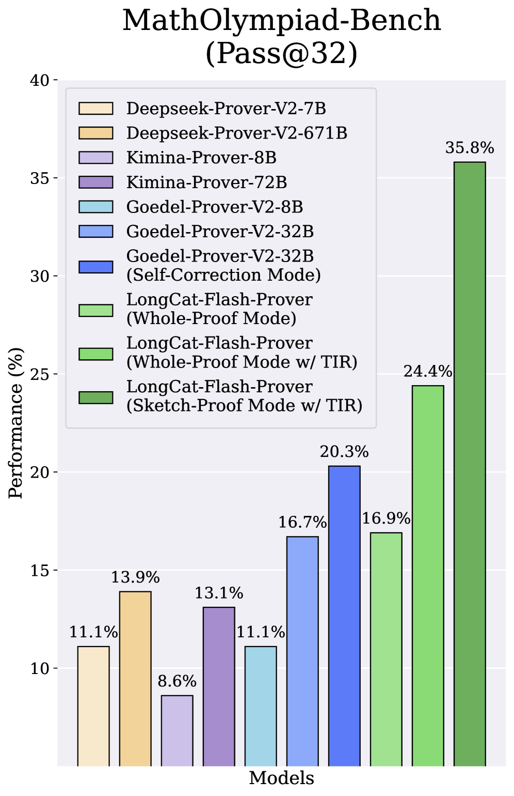
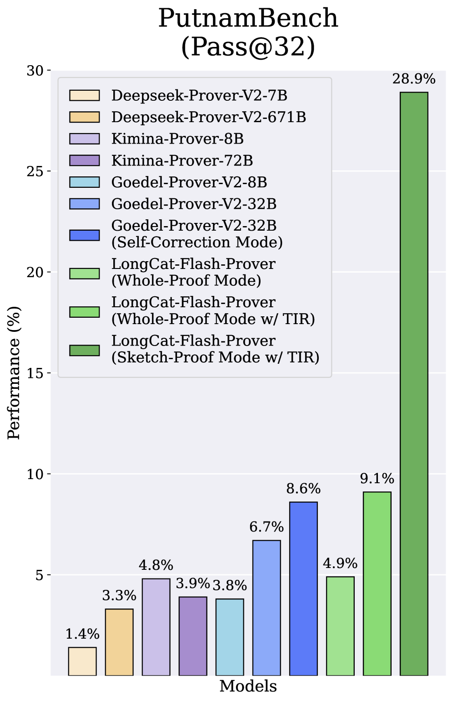
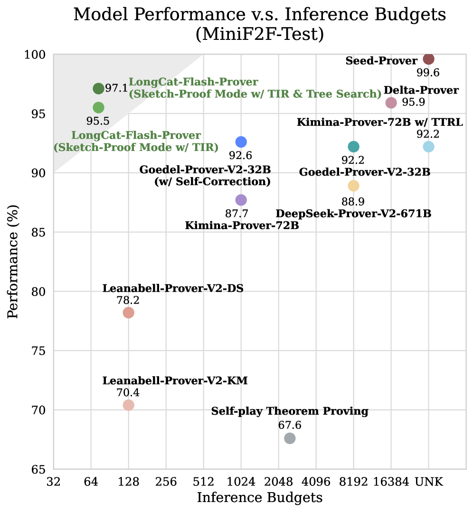
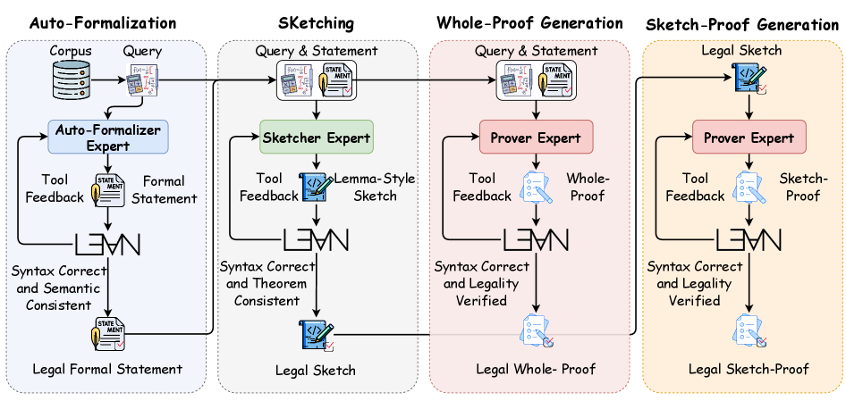
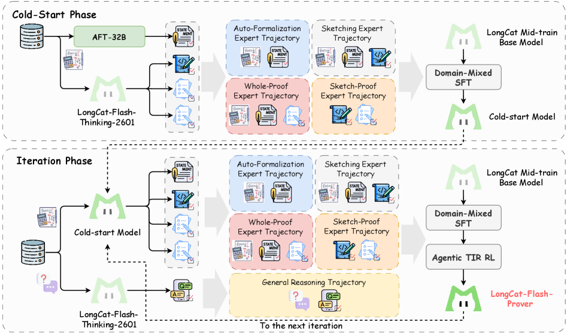
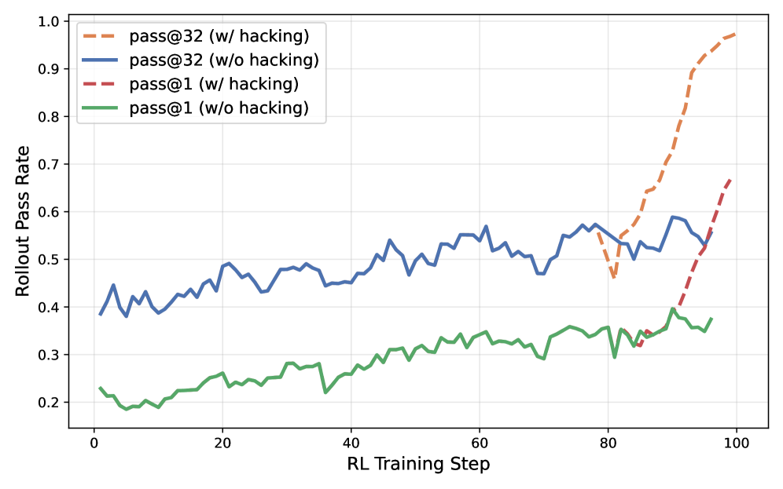
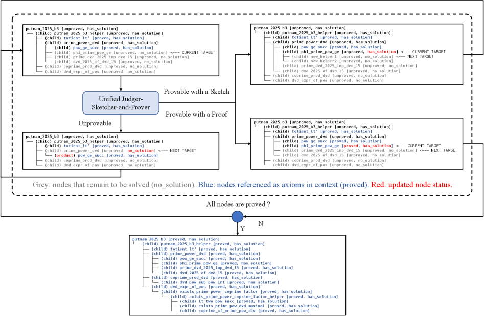

# LongCat-Flash-Prover: Advancing Native Formal Reasoning via Agentic Tool-Integrated Reinforcement Learning

**Meituan LongCat Team longcat-team@meituan.com**

## Abstract

We introduce **LongCat-Flash-Prover**, a flagship $560$-billion-parameter open-source Mixture-of-Experts (MoE) model that advances **Native Formal Reasoning** in Lean4 through agentic tool-integrated reasoning (TIR). We decompose the native formal reasoning task into three independent formal capabilities, i.e., *auto-formalization*, *sketching*, and *proving*. To facilitate these capabilities, we propose a **Hybrid-Experts Iteration Framework** to expand high-quality task trajectories, including generating a formal statement based on a given informal problem, producing a whole-proof directly from the statement, or a lemma-style sketch. During agentic RL, we present a **Hierarchical Importance Sampling Policy Optimization (HisPO)** algorithm, which aims to stabilize the MoE model training on such long-horizon tasks. It employs a gradient masking strategy that accounts for the policy staleness and the inherent train-inference engine discrepancies at both sequence and token levels. Additionally, we also incorporate theorem consistency and legality detection mechanisms to eliminate reward hacking issues. Extensive evaluations show that our LongCat-Flash-Prover sets a new state-of-the-art for open-weights models in both auto-formalization and theorem proving. Demonstrating remarkable sample efficiency, it achieves a 97.1% pass rate on MiniF2F-Test using only 72 inference budget per problem. On more challenging benchmarks, it solves 70.8% of ProverBench and 41.5% of PutnamBench with no more than 220 attempts per problem, significantly outperforming existing open-weights baselines.

**Huggingface**: [https://huggingface.co/meituan-longcat/LongCat-Flash-Prover](https://huggingface.co/meituan-longcat/LongCat-Flash-Prover) **Project Page**: [https://github.com/meituan-longcat/LongCat-Flash-Prover](https://github.com/meituan-longcat/LongCat-Flash-Prover)







*Figure 1: The performance comparison over proving tasks. The figures on the left and middle illustrate the performance with a limited 32 inference budget on MathOlympiad-Bench and PutnamBench, respectively. The figure on the right shows the model performance on MiniF2F-Test balancing with the inference budgets.*

## 1 Introduction

Recent advancements in large language models (LLMs) have shifted decisively toward enriching the reasoning capabilities, promoting the boundaries of artificial general intelligence (AGI) (OpenAI, 2024; Comanici et al., 2025; Guo et al., 2025a; Yang et al., 2025). While notable progress has been made in solving complex problems using natural language, current LLMs still struggle with formal theorem-proving tasks. These tasks necessitate the use of rigorous, verified formal languages (e.g., Lean4) to ensure reliable formal statements and proofs. Several previous efforts have been devoted to leveraging feedback from verification tools to train models in repairing Lean4 code snippets (Shang et al., 2025; Wang et al., 2025a; Lin et al., 2025a; Chen et al., 2025a, b; Ji et al., 2025; Shen et al., 2025; Lin et al., 2025b; Xin et al., 2024; Ren et al., 2025). However, unlike traditional Python scripts or other callable tools, Lean4 is a formal language that embodies the rigorous logical progression of a solution. Consequently, directly applying vanilla TIR to such formal verification tasks remains a significant challenge.

In this work, we introduce LongCat-Flash-Prover, an efficient open-source Mixture-of-Experts (MoE) reasoning model that sets a new state-of-the-art for open-source reasoning models. LongCat-Flash-Prover is built upon our foundational LongCat Mid-train Base model (Meituan, 2025a), which comprises 560B total parameters with approximately 27B active parameters. Compared to our recent LongCat-Flash-Thinking-2601 (Meituan, 2026) and other open-source models (Meituan, 2025a, b), LongCat-Flash-Prover represents a significant leap in both informal reasoning (e.g., logic, mathematics, coding, and agentic tasks) and formal reasoning (e.g., auto-formalization and theorem proving). The development of LongCat-Flash-Prover is characterized by the following key innovations:

- **Native formal reasoning**. We define “native formal reasoning” as a core capability of LLMs, analogous to native multimodal (Shukor et al., 2025) and native tool calls (Anthropic, 2024). This paradigm enables the model to leverage formal operators to solve complex reasoning tasks without specialized architectural modifications. We decompose the native formal reasoning into three specific capabilities: 1) **Agentic auto-formalization** aims to transform the informal statement ^1^11The problem or reasoning trajectory that in natural language can be denoted as informal statement. into a verified formal statement; 2) **Agentic sketching** aims to generate a lemma-style sketch based upon the given problem and corresponding formal statement (Jiang et al., 2023); 3) **Agentic proving** aims to generate a whole-proof that completes the target theorem body, or to generate a lemma-style proof that introduces helper lemmas and finally proves the target theorem. These capabilities are further enhanced through a TIR strategy, where all experts can interact directly with the Lean4 tools for compilation and verification.
- **Hybrid-experts iteration framework**. To facilitate native formal reasoning, we developed a framework to generate high-quality cold-start data. This framework employs several optimized expert models, each specialized in distinct domains such as auto-formalization, lemma-style sketching, and proving. We utilize this framework to synthesize a series of trajectories centered on native formal operators, using multiple verifiable formal tools as environmental feedback. By doing so, each expert is iteratively refined on these tool-assisted reasoning trajectories, emulating the human process of learning through trial, verification, and reflection.
- **Hierarchical Importance Sampling Policy Optimization (HisPO)**. Following our prior works (Meituan, 2026, 2025b), we perform agentic reinforcement learning with verified reward (RLVR) by designing different tasks, including generating a formal statement based on a given informal problem, producing a proof directly from the statement, or a lemma-style sketch. To make the MoE model training stable, we introduce HisPO, which is a hierarchical clipping strategy that eliminates the gradient contributions who has large training-inference engine discrepancy by estimating sequence-wise or token-wise important sampling (IS) ratios. In addition to outcome-based rewards, we designed a legality detection strategy to explore the proof with obvious hacking features, for example, the proof that is inconsistent with the semantics of the formal statement, mismatching the pre-defined theorem conditions, containing unverified or model-created axioms that attempt to fool the Lean4 server, etc.

We conduct extensive experiments on multiple challenging benchmarks to evaluate the effectiveness of our LongCat-Flash-Prover on solving native formal reasoning tasks. As shown in Figure [1](images/000_x1.png), Compared to current open-source state-of-the-art model, our model with TIR strategy achieves a significant improvement of 25.5% and 20.3% on MathOlympiad-Bench and PutnamBench in the Pass@32 metric, respectively. Furthermore, by increasing the inference budget, we achieved a score of 97.1% on the MiniF2F-Test with only 72 attempts per problem, surpassing the performance and efficiency of open-source SOTA models. In addition, our model outperforms all open-source general-purpose reasoning models and proprietary models on auto-formalization and other proving tasks, and maintains a performance level comparable to LongCat-Flash-Thinking-2601 on the informal reasoning task. We hope our open-source native formal reasoning model will encourage the community to build upon it, prompting AI systems to better solve complex problems in both informal and formal scenarios.

## 2 Hybrid-Experts Iteration Framework



*Figure 2: The overview of our hybrid-experts tool-integration synthesis pipeline. In this pipeline, we iteratively optimize three different experts (i.e., auto-formalizer, lemma-style sketcher, and prover), and use these experts to synthesize trajectories based on pre-defined formal reasoning capabilities. Given one problem in natural language, we first transform it into a formal statement in Lean4 by interacting with the Lean4 compiler. Then, the formal statement will be used to generate a whole-proof and lemma-style sketch. If the whole-proof still fails to pass verification within a limited number of tool feedback rounds, the proof generated from the lemma-style sketch will be used instead for verification. In the rejection sampling phase, we will retain the trajectory that allows us to fully utilize the tools to perform auto-formalization, sketching, and proving.*

To help realize this potential and empower researchers, we introduce significant enhancements to our model’s formal reasoning capabilities. Our work aims to provide a robust and versatile foundation upon which the community can build and explore new scientific frontiers. To reach this goal, we develop a hybrid-experts iteration framework to synthesize multiple verified trajectories and continuously train professional native formal reasoning expert models.

### 2.1 Native Formal Experts

We decompose native formal reasoning into three main capabilities: *auto-formalization*, *sketching*, and *proving*. Each capability corresponds to a specialized expert model, formally, representing $\pi_{\theta_{af}}$, $\pi_{\theta_{sk}}$, and $\pi_{\theta_{pf}}$, respectively. We also maintain a set of available tools $\mathcal{T}_{af}$, $\mathcal{T}_{sk}$, and $\mathcal{T}_{pf}$ to work with the expert model for the TIR trajectories synthesis and rejected sampling.

##### Auto-Formalization (AF)

The task of AF aims to transform the natural language problem statement or unfinished proof into a formal statement in Lean4. Formally, the input denoted as $x$ is uniformly referred to as an informal statement. Through the AF, we can obtain a formal statement as $s_{x}=\pi_{\theta_{af}}(x)$. We found that the model outputs syntactically incorrect or semantically inconsistent formal statements during the AF process. To address this, we introduce two verified tools to form the tool set $\mathcal{T}_{af}=\{\mathcal{V}_{syn},\mathcal{V}_{con}\}$.

- **Statement Syntax Detection $\mathcal{V}_{syn}$**: We follow (Wang et al., 2025b)’s work to develop the Lean4 Server ^2^22`https://github.com/project-numina/kimina-lean-server`. (v4.15). Each generated formal statement is concatenated with the placeholder “:= by sorry”, and compiled through the Lean4 Server. This tool yield a binary outcome as $\mathcal{V}_{syn}(s_{x})\in\{\text{SORRY},\text{FAIL}\}$, where SORRY means the statement has no syntax error other than the “:= by sorry” part not being implemented. In default, we direct receive the JSON-like feedback from this tool, which consists of the error messages and the location.
- **Semantic Consistency Detection $\mathcal{V}_{con}$**: We found that auto-formalization can occasionally alter the original problem’s meaning. To address this, we employ a model-based semantic filter to identify and discard formal statements that are inconsistent with their informal counterparts. The specific implementation is shown in Appendix D.3.

##### Sketching

The task of sketching aims to generate a lemma-style sketch in Lean4 for a given formal statement. A lemma-style sketch resembles a functional programming approach, consisting of a complete proof body for the target theorem, following several unproved helper lemmas (initially admitted “:= by sorry”). Introducing the sketch strategy is inspired by Divide and Conquer as well as Dynamic Programming, since the helper lemmas can be much easier to prove under appropriate decomposition and proved helper lemmas can be referenced in proof of following lemmas. Formally, given a natural language problem $x$ and the corresponding verified formal statement $s_{x}$. The sketch can be represented as $d_{x}=\pi_{\theta_{sk}}(x,s_{x})$, where $d_{x}$ contains $n$ helper lemmas and the main body, i.e., $d_{x}=[lemma_{1},\cdots,lemma_{n},s_{x},body_{x}]$, $lemma_{i}$ denotes the $i$-th helper lemma, and $body_{x}$ denotes the main proof body of the target theorem. A case of the lemma-style sketch is shown in Appendix B.4.

##### Proving

Formally, the task of theorem proving is to generate a valid proof in Lean4. We define two kinds of proving schema according to the input format.

- **Whole-Proof Generation**: Given a natural language problem $x$ and the corresponding formal statement $s_{x}$, the task of whole-proof generation is to produce a proof $p_{x}$ in a single interaction (without tools) or multi-interaction (with tools). Formally, we have $p_{x}=\pi_{\theta_{pf}}(x,s_{x})$.
- **Sketch-Proof Generation**: Given a natural language problem $x$ and the corresponding formal statement $s_{x}$, we first apply the sketcher model to construct a formal sketch $d_{x}$, where the target theorem is proved on the basis of several unproved helper lemmas. Then we let the prover model complete the proofs of unproved lemmas, so as to produce a final proof. Formally, we have $p_{x}=\pi_{\theta_{pf}}(x,d_{x})$.

For the tools, we design two verifiers $\mathcal{T}_{pf}=\{\mathcal{V}_{syn},\mathcal{V}_{val}\}$ to detect whether the proof is valid:

- **Syntax Verificiation $\mathcal{V}_{syn}$**: This tool aims to check the proof syntax, yielding an outcome from $\mathcal{V}_{syn}(p_{x})\in\{\text{SORRY},\text{PASS},\text{FAIL}\}$. The PASS outcome means that the current proof is successfully compiled by the Lean4 kernel, without any formal errors or unproved statements, which would lead to FAIL and SORRY respectively.
- **Legality Detection $\mathcal{V}_{leg}$**: A formally complete Lean4 code may be inconsistent with the original formal statement, e.g., with tampered theorem definition or special compilation context. To this end, we develop light-weight Lean4 lexer and parser to convert Lean4 code into Abstract Syntax Tree (AST), and perform strict AST consistency checks between the formal statement and the proof or the sketch. The details are shown in Appendix E.

### 2.2 Hybrid-experts Tool-Integration Synthesize

As shown in Figure [2](images/003_x4.png), we utilize these expert models for data synthesis. Each expert model generates either single-turn trajectories (without tool calls) or multi-turn trajectories (in TIR mode), thereby ensuring diversity in the synthesized data. To enable the model to dynamically select appropriate tools and proof strategies based on the difficulty of each problem, we adopt a curriculum learning approach: 1) starting with single-turn synthesis, then followed by multi-turn tool calls synthesis, and 2) progressing from whole-proof generation to lemma-style sketch proving. The basic synthesis process is as follows:

1. Give a natural language problem $x_{i}$, we first use the auto-formalizer $\pi_{\theta_{af}}$ to generate $N$ responses. For each response, we extract the formal statement in Lean4, and perform rejected sampling via the pre-defined tools $\mathcal{T}_{af}$. If at least one formal statement passes validation, we retain all verified statements and construct the AF single-turn trajectory set, represented as: $\displaystyle\mathcal{D}_{af}=\{(x_{i},s_{x_{i}}|\mathcal{V}_{syn}(s_{x_{i}})=\text{SORRY}\cap\mathcal{V}_{con}(s_{x_{i}})=1\}_{i}^{\leq N}.$ (1)
2. If $x_{i}$ does not correspond to the correct formal statement within $N$ attempts, we will use the TIR mode of auto-formalization. Specifically, we select the response with the fewest tool feedback errors from $N$ trajectories as the first turn, and then let the auto-formalizer re-think based on the tool feedback until it finally passes the verification of all tools. Formally, the synthesized trajectories can be formed as: $\displaystyle\mathcal{D}^{\prime}_{af}=\{(x_{i},s_{x_{i}}^{1},\tau_{s_{x_{i}}}^{1},\cdots,s_{x_{i}}^{m}|\mathcal{V}_{syn}(s_{x_{i}}^{m})=\text{SORRY}\cap\mathcal{V}_{con}(s_{x_{i}}^{m})=1\}_{i}^{\leq N},$ (2) where $\tau_{s_{x_{i}}}^{j}=\mathcal{V}_{syn}(s_{x_{i}}^{j})+\mathcal{V}_{con}(s_{x_{i}}^{j})$ is the tool feedback at $j$-th interaction, $m$ denotes to the model-tool interaction times, we will denote $s_{x_{i}}=s_{x_{i}}^{m}$ as the final formal statement.
3. Next, for each problem $x_{i}$ that has at least one verified formal statement, we will use the prover model $\pi_{\theta_{pf}}$ to perform whole-proof generation. We randomly sample one formal statement $s_{x}$, and let the prover model generate $N$ whole-proofs. Similar to the synthesis strategy of auto-formalization, we retain all correct proofs to reach a final trajectory set: $\displaystyle\mathcal{D}_{whole.pf}=\{(x_{i},s_{x_{i}},p_{x_{i}})|(x_{i},s_{x_{i}})\in\mathcal{D}_{af}\cup\mathcal{D}^{\prime}_{af},\mathcal{V}_{syn}(p_{x_{i}})=\text{PASS}\cap\mathcal{V}_{leg}(p_{x_{i}})=1\}_{i}^{\leq N}\}.$ (3)
4. For problems that fail after $N$ attempts at whole-proof generation, we select the response with the fewest errors and leverage tool feedback to enable the prover model to interact with verification tools. Steps 3 and 4 are repeated multiple times, each time using a different formal statement as input to the prover. This process is designed to ensure that the same problem is associated with diverse formal statements and proof trajectories, thereby increasing the likelihood of discovering a correct proof, regardless of whether TIR is employed. Finally, the trajectories set of whole-proof with TIR refers to: $\displaystyle\mathcal{D}^{\prime}_{whole.pf}=\{(x_{i},s_{x_{i}},p_{x_{i}}^{1},\tau_{p_{x_{i}}}^{1},\cdots,p_{x_{i}}^{m})|(x_{i},s_{x_{i}})\in\mathcal{D}_{af}\cup\mathcal{D}^{\prime}_{af},\mathcal{V}_{syn}(p_{x_{i}}^{m})=\text{PASS}\cap\mathcal{V}_{leg}(p_{x_{i}}^{m})=1\}_{i}^{\leq N}\},$ (4) where $\tau_{p_{x_{i}}}^{j}=\mathcal{V}_{syn}(p_{x_{i}}^{j})+\mathcal{V}_{leg}(p_{x_{i}}^{j})$ is the tool feedback at $j$-th interaction, we denote $p_{x_{i}}=p_{x_{i}}^{m}$ as the final proof.
5. For unresolved problems that have a verified formal statement yet lack a verified proof, we deploy the sketcher model to generate $N$ lemma-style sketches. This decomposition into multiple lemmas is designed to ease and enhance the efficiency of subsequent proof construction. Specifically, we aim to produce $N$ responses and extract the Lean4 sketch to perform rejected sampling. The sketch will be retained, which contains the SORRY result and a consistent theorem. We directly use TIR mode to increase the likelihood of discovering the verified sketch: $\displaystyle\mathcal{D}^{\prime}_{sk}=\{(x_{i},s_{x_{i}},d_{x_{i}}^{1},\tau_{d_{x_{i}}}^{1},\cdots,d_{x_{i}}^{m})|(x_{i},s_{x_{i}})\in\mathcal{D}_{af}\cup\mathcal{D}^{\prime}_{af},\mathcal{V}_{syn}(d_{x_{i}}^{m})=\text{SORRY}\cap\mathcal{V}_{theo}(d_{x_{i}}^{m})=1\}_{i}^{\leq N}\},$ (5) where $\tau_{d_{x_{i}}}^{j}=\mathcal{V}_{syn}(d_{x_{i}}^{j})+\mathcal{V}_{theo}(d_{x_{i}}^{j})$ is the tool feedback at $j$-th interaction, the final sketch is $d_{x_{i}}=d_{x_{i}}^{m}$.
6. Through the lemma-style sketch $d_{x_{i}}$, we can reuse the prover model to complete each lemma, which is a similar action to generate whole-proof for each lemma. We directly use TIR mode to synthesize the lemma-style proof: $\displaystyle\mathcal{D}^{\prime}_{sk.pf}=\{(x_{i},d_{x_{i}},p_{x_{i}}^{1},\tau_{p_{x_{i}}}^{1},\cdots,p_{x_{i}}^{m})|(x_{i},d_{x_{i}})\in\mathcal{D}_{sk}\cup\mathcal{D}^{\prime}_{sk},\mathcal{V}_{syn}(p_{x_{i}}^{m})=\text{PASS}\cap\mathcal{V}_{leg}(p_{x_{i}}^{m})=1\}_{i}^{\leq N}\}.$ (6)

To this end, the hybrid experts can reach 6 different sets of trajectories $\mathcal{D}_{af},\mathcal{D}^{\prime}_{af},\mathcal{D}_{whole.pf},\mathcal{D}^{\prime}_{whole.pf},\mathcal{D}^{\prime}_{sk},\mathcal{D}^{\prime}_{sk.pf}$. Importantly, within this framework, single-turn trajectories (e.g., $\mathcal{D}_{af},\mathcal{D}_{whole.pf}$) that do not require tool interaction typically indicate a relatively simple task. Trajectories requiring tool interaction (e.g., $\mathcal{D}^{\prime}_{af},\mathcal{D}^{\prime}_{whole.pf},\mathcal{D}^{\prime}_{sk},\mathcal{D}^{\prime}_{sk.pf}$) indicate a more difficult task. This progressive synthesis approach (first synthesizing without tools, then synthesizing with tool feedback) allows the model to dynamically perceive the task’s difficulty and its adaptability to tool invocation. The specific cases of different types of trajectories are illustrated in Appendix B.

### 2.3 Experts Self-Evolving

To enrich the trajectories and the experts, we follow an expert iterative strategy. Each iteration begins with a cold-start process that progressively refining through self-distillation, and is followed by an agentic RL process. For this purpose, we utilize our prior LongCat Mid-train Base Model as the foundation for the auto-formalizer, prover, and sketcher.

Through this iterative process, we curated a substantial corpus of high-quality training instances, each containing a formal statement, a synthesized thinking process, and a verified proof. This dataset was then used to comprehensively enhance the native formal reasoning capabilities of our LongCat-Flash-Thinking-2601. We will describe the details in Section 3.

## 3 Approach

### 3.1 Overview

In this section, we describe the training approach for our LongCat-Flash-Prover. The overview of the training process is shown in Figure [3](images/004_x5.png), it begins with an initial checkpoint derived from the LongCat Mid-train Base model, an early-stage version of our previous LongCat-Flash-Thinking-2601. The pipeline is organized into two main phases:

- **Cold-start Phase**. We first utilize ATF-32B (Guo et al., 2025b), our previously released auto-formalization model trained via TIR and DPO Rafailov et al. (2023), to synthesize multiple formal statements. Building on these statements, we leverage our LongCat-Flash-Thinking-2601 (Meituan, 2026) to generate high-quality agentic trajectories integrated with verification tools. From this synthesized data, we curate a high-quality cold-start dataset by performing decontamination, deduplication, and sampling based on both difficulty and diversity. Since different expert models come from different model families, we apply domain-mixed SFT to integrate these capabilities. Specifically, we employ the LongCat Mid-train Base model (Meituan, 2026) as the initialization point, and the trained model will be represented as the cold-start model.
- **Iteration Phase**. In the iteration phase, we choose the cold-start model derived from the cold-start phase as our new expert. The trajectories for each native formal reasoning task are synthesized using this new expert. In addition, we also incorporate a large amount of general data to ensure the model possesses informal reasoning capabilities. After data curation, we train the model using domain-mixed SFT and agentic TIR RL, and further improve its performance via multiple iterations. Following the expert iteration cycles, we perform a final round of SFT and agentic TIR RL to reach our final LongCat-Flash-Prover.



*Figure 3: The overview of the training pipeline of LongCat-Flash-Prover. We choose the LongCat Mid-train base model as the starting point, and then perform domain-mixed SFT to obtain a cold-start model. Then, we use the new cold-start model to refresh the prompts and trajectories through self-distillation and agentic RL, and repeat this process multiple times. After the iteration, we obtain our LongCat-Flash-Prover model.*

### 3.2 Data Curation

We curate our training data from two views, i.e., mathematics queries for native formal reasoning, and general-purpose queries for informal reasoning. We mix up generic data in the cold start phase means preserving the informal reasoning capabilities of the LongCat-Flash-Prover model in regular dialogues, including conversation, STEM-like reasoning, coding, agentic tool use, searching, knowledge, and safety. We directly sample some pieces of cold-start data that are used by LongCat-Flash-Thinking-2601, enabling our LongCat-Flash-Prover to achieve comparable informal reasoning performance with LongCat-Flash-Thinking-2601.

For native formal reasoning, we collect a variety of mathematical and formal queries from open-source datasets and in-house corpus. To further enhance data quality, we additionally developed an external self-synthesis framework that constructs complex problems by transforming informal tasks into formal ones, spanning auto-formalization, proving, and sketching.

To make the hybrid-experts iteration framework efficiency by using these prompts, we built a simple data processing pipeline in each iteration process, including basic processing, difficulty estimation, and diversity sampling.

##### Basic Processing

We adopt the data processing workflow of LongCat-Flash-Thinking-2601 for basic data preprocessing, which includes semantic deduplication, desaturation, and quality assurance checks. Specifically, for natural language problems which are static in nature, preprocessing is conducted only at the initial stage of the expert iteration. In each expert iteration, we additionally preprocess the formal statements generated through the auto-formalizer expert, primarily by removing duplicates and filtering out statements that may closely resemble those in the test set. Unlike our previous mention involving rejection sampling with predefined tools, the formal statements in this context are inherently correct and verifiable; filtering is performed solely to prevent data leakage and ensure the integrity of the evaluation.

##### Difficulty Estimation

As previously described in Section 2.2, our hybrid-experts iterative framework incorporates the difficulty estimation of each prompt. Specifically, for each prompt, the expert will repeatedly synthesize into $N$ trajectories, allowing us to compute their difficulty using the following metric:

$$\displaystyle\text{Difficulty}(x_{i},\mathcal{D})=\frac{\sum_{(x_{j},\cdots)\in\mathcal{D}}\mathbb{I}(x_{i}=x_{j})}{N},$$

where $\mathcal{D}\in\{\mathcal{D}_{af},\mathcal{D}^{\prime}_{af},\mathcal{D}_{whole.pf},\mathcal{D}^{\prime}_{whole.pf},\mathcal{D}^{\prime}_{sk},\mathcal{D}^{\prime}_{sk.pf}\}$ is the set that contains only verified trajectories.

This enables us, on one hand, to monitor the progress and evolution of each expert throughout the iterations, and on the other hand, to dynamically select more challenging data for subsequent training rounds. Prompts with a difficulty score of 0 are retained for future synthesis cycles, while those with a difficulty score of 1 for two or more consecutive iterations are removed from the synthesis process to enhance efficiency. Additionally, for each set involving tool calls (i.e., $\mathcal{D}^{\prime}_{af},\mathcal{D}^{\prime}_{whole.pf},\mathcal{D}^{\prime}_{sk},\mathcal{D}^{\prime}_{sk.pf}$), it is further divided into two subsets for cold-start and RL training. Prompts allocated to cold-start training and RL training are both ensured to have a non-zero and non-one pass rate, respectively.

##### Diversity Sampling

The expert iteration framework produces 6 distinct sets of synthesized trajectories. To prevent overfitting during cold-start training, we restrict each prompt to a single trajectory, facilitated by a diversity sampling strategy. We evaluate the average trajectory length and tool call frequency within each set, preferentially selecting responses with shorter lengths or fewer tool calls to avoid excessive reasoning or irrelevant tool usage.

Rather than simply choosing the shortest trajectory or the one with minimal tool calls, we implement a weighted sampling scheme. This approach ensures that each prompt is associated with only one trajectory, while preserving the diversity of the overall trajectory collection.

### 3.3 Hierarchical Importance Sampling Policy Optimization

For agentic RL, We introduce a novel HisPO algorithm that implements a hierarchical gradient masking strategy by estimating the training-inference consistency of sequence-level and token-level granularity to ensure a stable optimization. We built this training recipe on our Dynamic ORchestration for Asynchronous rollout (DORA) system, which is introduced in our prior works (Meituan, 2025b, 2026).

Recall the current widely used Group Relative Policy Optimization (GRPO) algorithm (Shao et al., 2024), which is a variant version of Proximal Policy Optimization (PPO) (Schulman et al., 2017). However, applying this vanilla objective on this long-horizon task makes it face significant challenges due to *distribution drift*. Inspired by recent works (Zheng et al., 2025a; Wang et al., 2026), we can attribute this phenomenon to the train-inference discrepancy when calculating the important sampling ratio $r_{i,t}(\theta)$, which can be decomposed into two distinct manners: train-inference discrepancy $r_{i,t}^{dis}(\theta)$ and policy staleness $r_{i,t}^{stale}(\theta)$:

$$\displaystyle r_{i,t}(\theta)=\frac{\pi_{\theta}(y_{i,t}|x,y_{i,<t})}{\mu_{\theta_{old}}(y_{i,t}|x,y_{i,<t})}=\frac{\pi_{\theta_{old}}(y_{i,t}|x,y_{i,<t})}{\mu_{\theta_{old}}(y_{i,t}|x,y_{i,<t})}\times\frac{\pi_{\theta}(y_{i,t}|x,y_{i,<t})}{\pi_{\theta_{old}}(y_{i,t}|x,y_{i,<t})}=r_{i,t}^{dis}(\theta)\times r_{i,t}^{stale}(\theta),$$

where $\pi_{\theta}$, $\pi_{\theta_{old}}$, and $\mu_{\theta_{old}}$ denotes the current policy on train engine, old version of policy on train engine, and the old version of the policy model on the inference engine, respectively.

- **Train-Inference Discrepancy** $r_{i,t}^{dis}(\theta)$. Our training infrastructure follows the asynchronous training mode that splits the whole framework into the parameter optimization (model built on Megatron engine (Shoeybi et al., 2019))) and experience makers (model built on vLLM engine (Kwon et al., 2023)). The difference kernels do not guarantee bitwise consistency and are especially critical when the inference and training backends are mismatched. In addition, LongCat-Flash-Prover is a model built on the MoE architecture. The train-inference inconsistencies may also arise due to differences in word segmentation, expert routing, and other factors. In general, the discrepancy between training and inference can potentially affect the calculation of the importance sampling ratio, thereby increasing the overall optimization instability risk when combined with clipping operations.
- **Policy Staleness** $r_{i,t}^{stale}(\theta)$. In asynchronous training, each generated sample may originate from multiple prior versions of the policy, which can become outdated as the current policy $\pi_{\theta}$ undergoes continuous updates. This discrepancy between the behavior policy that generates the data and the target policy being optimized introduces instability into the training process, hindering convergence and potentially causing model collapse in extreme cases.

To mitigate the aforementioned issues, we introduce a hierarchical importance sampling strategy that alleviate the tokens that have significant train-inference discrepancy. The overall surrogate objective is illustrated in the following:

$$\displaystyle\mathcal{J}_{\text{GRPO}}(\theta)$$

where $H_{i,t}(\theta)$ is a masking matrix that controls the gradient flow at both the sequence-level and token-level, $\mathbb{I}(\cdot)$ is the indicator function, $\delta_{seq}>0$ and $\delta_{tok}>0$ represent the hyper-parameters.

Compared to the vanilla GRPO, the major revision is to introduce a hierarchical masking strategy $H_{i,t}(\theta)$. To be specific:

- **Sequence-level Discrepancy Masking**. We first estimate the sequence-level train-inference discrepancy by calculating the Geometric average of all tokens’ discrepancy ratios. For the entire sequence, if its discrepancy exceeds a certain range, it is considered to have a significant impact on training stability, and the gradient contribution of the entire sequence will be removed. Compared to GSPO (Zheng et al., 2025b), this strategy aims to consider only the sequence-level measure of training-inference consistency, avoiding the excessive neglect of valuable tokens.
- **Token-level Discrepancy Masking**. For the remaining sequences, we will remove tokens with significant training-pull inconsistencies to ensure that the remaining tokens will not compromise stability due to training-pull inconsistencies.
- **Token-level Staleness Control**. For tokens retained after sequence and token-level masking, we consider controlling staleness to ensure that the update magnitude is limited within a certain range to guarantee training stability.

We also follow our prior works (Meituan, 2025b, 2026) to remove the divergence loss term because the use of default $k_{3}$ estimator, the corresponding gradient of this term is biased during optimization despite its unbiased expectation (Zang, 2025). We also employ the global constant maximum generation length during training as the denominator of the loss function. This adjustment mitigates the length bias that can pose challenges to training robustness Liu et al. (2025a). Besides, as expert routing strategy may change across different versions of policies, the staleness issue can be even more obvious in sparse MoE models, where negative token-level advantages can therefore lead to excessively large importance sampling ratios and unbounded variance. Following Yu et al. (2025a) and Ye et al. (2020), we employ a triplet clipping scheme: $\epsilon_{\text{neg}_{\text{low}}}$ and $\epsilon_{\text{neg}_{\text{high}}}$ bound the importance ratio for negative advantages, while $\epsilon_{\text{pos}_{\text{high}}}$ provides an upper bound for positive advantages. This strategy prevents model collapse and maintains sufficient entropy for effective exploration.

## 4 Experiments

We conduct comprehensive evaluation of LongCat-Flash-Prover across both formal and informal reasoning tasks. In the formal domain, we specifically measure the model’s capabilities in auto-formalization and theorem proving. In the informal domain, we investigate whether training on formal reasoning tasks preserves or enhances the model’s performance on general reasoning tasks. In addition, we also conduct scaling behavior analysis to show the model training performance.

| **Auto-Formalization** | Combi- | FormalMath- | MathOlympiad- | MiniF2F- | ProofNet- | Prover- | Putnam- |
| --- | --- | --- | --- | --- | --- | --- | --- |
| Bench | Lite | Bench | Test | Test | Bench | Bench |  |
| ${}_{\text{(Pass@8)}}$ | ${}_{\text{(Pass@8)}}$ | ${}_{\text{(Pass@8)}}$ | ${}_{\text{(Pass@8)}}$ | ${}_{\text{(Pass@8)}}$ | ${}_{\text{(Pass@8)}}$ | ${}_{\text{(Pass@8)}}$ |  |
| *Open-Weights Reasoning Models* |  |  |  |  |  |  |  |
| DeepSeek-V3.2 | 65.0 | 95.2 | 85.6 | 97.5 | 81.8 | 83.0 | 46.7 |
| Kimi-K2.5 | 84.0 | 97.9 | 91.1 | 98.4 | 88.2 | 91.7 | 82.8 |
| *Close-Weights Reasoning Models* |  |  |  |  |  |  |  |
| Claude-Opus-4.5 | 92.0 | 97.9 | 94.4 | 98.0 | 90.9 | 94.8 | 93.5 |
| Gemini-3 Pro | 82.0 | 97.4 | 93.1 | 97.5 | 91.9 | 93.0 | 90.8 |
| *Open-Weights Auto-Formalizer Models* |  |  |  |  |  |  |  |
| Kimina-Autoformalizer-7B | 25.0 | 86.8 | 33.3 | 92.2 | 55.4 | 67.4 | 59.3 |
| StepFun-Formalizer-7B | 40.0 | 88.0 | 71.9 | 96.7 | 53.8 | 65.2 | 55.4 |
| StepFun-Formalizer-32B | 50.0 | 90.9 | 78.6 | 95.9 | 62.4 | 73.5 | 65.1 |
| Goedel-V2-Formalizer-8B | 61.0 | 98.1 | 73.2 | 98.4 | 76.9 | 93.0 | 80.4 |
| Goedel-V2-Formalizer-32B | 73.0 | 98.1 | 89.2 | 98.4 | 79.0 | 94.4 | 85.9 |
| ATF-8B-Distilled | 59.0 | 95.5 | 76.7 | 95.1 | 45.7 | 83.0 | 70.7 |
| ATF-32B | 70.0 | 94.3 | 83.6 | 98.0 | 53.8 | 89.6 | 77.5 |
| *Ours* |  |  |  |  |  |  |  |
| LongCat-Flash-Prover | 83.0 | 98.6 | 93.3 | 99.2 | 87.1 | 95.2 | 89.9 |
| w/ TIR | **97.0** | **99.8** | **99.2** | **100.0** | **97.9** | **100.0** | **98.1** |

Table 1: Auto-formalization performance (Pass@8 metric, %) of different reasoning and specific auto-formalizer models across multiple benchmarks. Best in bold , second in underlined .

### 4.1 Evaluation of Auto-Formalization

In this section, we conduct the experiments on auto-formalization tasks. For the benchmarks, we select CombiBench (Liu et al., 2025b), FormalMath-Lite (Yu et al., 2025b), MathOlympiadBench (Lin et al., 2025a), MiniF2F-Test (Zheng et al., 2022), ProofNet (Azerbayev et al., 2023), ProveBench (Xin et al., 2024), and PutnamBench (Tsoukalas et al., 2024). The desciption of each benchmark and the corresponding inference settings are shown in Appendix A. For the baselines, we choose two open-weights reasoning models (i.e., DeepSeek-V3.2 (DeepSeek-AI et al., 2025) and Kimi-K2.5 (Team et al., 2026) , two close-weights reasoning models (e.g., Claude-Opus-4.5 (Anthropic, 2025), and Gemini-3 Pro), and multiple open-weights auto-formalizer models (e.g., Kimina-Autoformalizer-7B (Wang et al., 2025a), StepFun-Formalizer-7B/32B (Wu et al., 2025), Goedel-V2-Formalizer-8B/32B (Lin et al., 2025a), ATF-8B-Distilled/32B (Guo et al., 2025b)).

During the evaluation process, each query is encapsulated using a uniform prompt, and the metric is Pass@8. We selected two verifiers that were used in the hybrid-experts iteration framework, e.g., Lean4 Server’s syntax check, and LLM-as-a-Judger’s semantic consistency check. The system prompt for semantic consistency detection is shown in Appendix D. The results are shown in Table 1. Our LongCat-Flash-Prover establishes new state-of-the-art results on all auto-formalization benchmarks; in particular, we achieve 100% scores on MiniF2F-Test and ProofNet. TIR-based enhancements yielded up to a 14% performance gain, underscoring the efficacy of tool feedback in enabling the model to solve previously unsolvable tasks. Furthermore, some general reasoning models demonstrated competitive performance in auto-formalization relative to proprietary auto-formalizer models. Notably, closed-source models such as Claude-Opus-4.5 and Gemini-3 Pro outperformed all four leading open-source models. Unlike proprietary auto-formalizer models, which are tailored for a single task, these closed-source models were not specifically optimized for auto-formalization, indicating that general task optimization can effectively transfer to specialized tasks. Overall, our model outperformed both state-of-the-art general reasoning models and proprietary auto-formalizer models in auto-formalization tasks, thereby laying a robust foundation for further advancements in sketching and proving metrics.

| **Theorem-Proving** | MathOlympiad- | MiniF2F- | ProofNet | Prover- | Putnam- |
| --- | --- | --- | --- | --- | --- |
| Bench | Test | Test | Bench | Bench |  |
| ${}_{\text{(Pass@32)}}$ | ${}_{\text{(Pass@32)}}$ | ${}_{\text{(Pass@32)}}$ | ${}_{\text{(Pass@32)}}$ | ${}_{\text{(Pass@32)}}$ |  |
| *Open-Weights Reasoning Models* |  |  |  |  |  |
| DeepSeek-V3.2 | 14.7 | 77.9 | 20.4 | 42.8 | 5.8 |
| Kimi-K2.5 | 7.5 | 76.6 | 19.9 | 44.3 | 1.2 |
| *Close-Weights Reasoning Models* |  |  |  |  |  |
| Claude-Opus-4.5 | - | 65.6 | 35.0 | - | - |
| Gemini-3 Pro | 3.9 | 56.2 | 22.0 | 33.5 | 1.2 |
| *Open-Weights Prover Models* |  |  |  |  |  |
| Kimina-Prover-8B | 8.6 | 78.3^† | 11.8 | 37.8 | 4.8 |
| Kimina-Prover-72B | 13.1 | 84.0^† | 18.3 | 44.6 | 3.9 |
| DeepSeek-Prover-V2-7B | 11.1 | 75.6^† | 23.0^† | 49.0^† | 1.4^† |
| DeepSeek-Prover-V2-671B | 13.9^† | 82.4^† | 30.5^† | 52.9^† | 3.3^† |
| Leanabell-Prover-V2-KM | - | 68.4^† | 13.4^† | 39.8^† | - |
| Leanabell-Prover-V2-DS | - | 76.6^† | 23.7^† | 47.8^† | - |
| Goedel-Prover-V2-8B | 11.1 | 84.6^† | 16.7 | 49.5 | 3.8^† |
| w/ self-correction | - | 86.7^† | - | - | - |
| Goedel-Prover-V2-32B | 16.7^† | 88.1^† | 22.0 | 53.2 | 6.7^† |
| w/ self-correction | 20.3^† | 90.4^† | - | - | 8.6^† |
| *Ours* |  |  |  |  |  |
| LongCat-Flash-Prover |  |  |  |  |  |
| whole-proof mode | 16.9 | 84.4 | 19.9 | 49.9 | 4.9 |
| whole-proof mode w/ TIR | 27.5 | 90.2 | 36.1 | 57.9 | 10.4 |
| sketch-proof mode w/ TIR | **35.8** | **93.9** | **47.3** | **66.5** | **28.9** |

Table 2: Theorem-proving performance (Pass@32 metric, %) of different reasoning and specific prover models across multiple benchmarks. Best in bold , second in underlined . † indicates the score is from external reports.

| **Theorem-Proving** | MathOlympiad- | MiniF2F- | ProofNet- | Prover- | Putnam- |
| --- | --- | --- | --- | --- | --- |
| Bench | Test | Test | Bench | Bench |  |
| *Open-Weights Prover Models* |  |  |  |  |  |
| Kimina-Prover-72B | - | 87.7^† / 1,024 | - | - | - |
| w/ TTRL | - | 92.2^† / UNK | - | - | - |
| DeepSeek-Prover-V2-671B | - | 88.9^† / 8,192 | 37.1^† / 1,024 | 59.1^† / 512 | 7.1^† / 1,024 |
| Self-play Theorem Proving | - | 67.6^† / 2,560 | 26.9^† / 2，560 | - | 1.2^† / 3,200 |
| Leanabell-Prover-V2-KM | - | 70.4^† / 128 | 18.2^† / 128 | 42.9^† / 128 | - |
| Leanabell-Prover-V2-DS | - | 78.2^† / 128 | 25.2^† / 128 | 48.7^† / 128 | - |
| Goedel-Prover-V2-32B | 16.7^† / 32 | 92.2^† / 8,192 | - | - | 6.7^† / UNK |
| w/ self-correction | - | 92.6^† / 1,024 | - | - | 13.0^† / 184 |
| *Close-Weights Prover Models* |  |  |  |  |  |
| Delta-Prover | - | 95.9^† / 16,384 | - | - | - |
| Seed-Prover | - | **99.6^†** / UNK | - | - | 50.4^† / UNK |
| Seed-Prover 1.5 | - | - | - | - | **87.9^†** / UNK |
| *Ours* |  |  |  |  |  |
| LongCat-Flash-Prover |  |  |  |  |  |
| sketch-proof mode w/ TIR | 42.5 / 180 | 95.5 / 72 | 51.1 / 68 | 69.5 / 220 | 31.7 / 118 |
| sketch-proof mode w/ TIR & Tree Search | **46.7** / 180 | 97.1 / 72 | **52.2** / 68 | **70.8** / 220 | 41.5 / 118 |

Table 3: Theorem-proving performance (with different larger budgets, %) of different specific prover models across multiple benchmarks. Best in bold , second in underlined . Each element a / b denotes to the accuracy a with limited budget b (i.e., Pass@ b ). “UNK” means unknown of the specific budget. † indicates the score is from external reports. Because different models may have different budget calculations, we directly extract the results from the report instead of conducting our own evaluations. Therefore, some benchmark results may not be available.

### 4.2 Evaluation of Theorem Proving

We further conduct the experiments on theorem proving. For the benchmarks, we select MathOlympiadBench (Lin et al., 2025a), MiniF2F-Test (Zheng et al., 2022), ProofNet (Azerbayev et al., 2023), ProveBench (Xin et al., 2024), and PutnamBench (Tsoukalas et al., 2024), which are the competition-level open-source data for proving. For each benchmark, we initially adopt the official formal statement as the default. However, we found that some of these formal statements may have semantic inconsistencies, which could prevent some proofs from being reasonably proven. To this end, we conduct semantic consistency verification to evaluate the official formal statements. Instances of semantic inconsistency are subsequently rectified by substituting them with accurate formalizations generated by our model.

We evaluate performance across three modes. 1) Whole-proof: we perform multiple parallel inferences per statement, reporting Pass@32 via unbiased estimation (Chen et al., 2021). Beyond Lean4 Server verification, we strictly validate theorem consistency to prevent the model from tampering with objectives or generating “hacked” proofs. 2) Whole-proof with TIR: the total budget (parallel inferences $\times$ average tool calls) is capped at 32. 3) Sketch-proof with TIR: we first sample sketches in parallel, using TIR to ensure syntactic consistency with the theorem. Each lemma within the sketch is then proven via multiple TIR inferences, with the total attempts limited to 32.

For the baselines, we choose two open-weights reasoning models (i.e., DeepSeek-V3.2 (DeepSeek-AI et al., 2025) and Kimi-K2.5 (Team et al., 2026), , two close-weights reasoning models ^3^33Due to inherent instabilities in the inference APIs of closed-weight reasoning models, evaluation metrics may not always fully reflect their true capabilities. We are committed to providing timely updates as more stable results. (e.g., Claude-Opus-4.5 (Anthropic, 2025), and Gemini-3 Pro), and multiple specific prover models (e.g., Kimina-Prover-8B/72B (Wang et al., 2025a), DeeSeek-Prover-V2-7B/671B (Ren et al., 2025), Leanabell-Prover-V2-KM/DS (Ji et al., 2025), Goedel-Prover-V2-8B/32B (Lin et al., 2025a)). Since proving performance for many reasoning models was not publicly disclosed, we re-evaluated them using our own evaluation framework. For proprietary models, we adopted the official results published in their reports and supplemented these by evaluating any missing benchmarks. Throughout this process, we employed the same prompting strategy as in our previous work to maintain consistency.

We first present the performance comparison in Table 2 with a clear budget limit of 32 attempts (Pass@32). Our experimental results yield the following key observations: 1) In theorem-proving tasks, general-purpose reasoning models significantly underperform compared to specialized proprietary provers. This suggests that proficiency in formal theorem proving does not readily emerge from general reasoning or coding capabilities alone. 2) LongCat-Flash-Prover demonstrates superior efficacy across different evaluation modes. In the whole-proof TIR configuration, our model surpasses the majority of baselines. In the sketch-proof TIR mode, it establishes a new state-of-the-art among all open-source provers. Specifically, on the MiniF2F-Test, we achieved a score of 93.9%, outstripping the previous state-of-the-art, Goedel-Prover-V2, under identical computational budget constraints. Furthermore, on the more challenging PutnamBench, our model reached an accuracy of 28.9%, significantly exceeding all other evaluated models.

We also compared the performance of tests without budget constraints. In this settings, we added an additional Tree Search strategy to further improve the search space of sketch-proof. For details on the implementation process, please refer to Appendix C. For the baselines, we externally added Self-play Theorem Proving (Dong and Ma, 2025) (Open-weights model), Delta-Prover (Zhou et al., 2025) (Close-weights model), Seed Prover (Chen et al., 2025a) (Close-weights model), and Seed-Prover 1.5 (Chen et al., 2025b) (Close-weights model) for comparison. We only present their officially reported results to ensure the unbiasedness of the evaluation. The results are shown in Table 3. Our experimental results demonstrate the following: 1) LongCat-Flash-Prover outperforms all existing open-source prover models. Using MiniF2F-Test as a representative case, while Goedel-prover-v2-32B and Kimina-Prover-72B both achieved 92.2% in whole-proof and TIR modes, they required over 1024 attempts. In contrast, our model achieved a superior score of 95.5% with only 72 attempts, demonstrating significantly higher sample efficiency. We observe a similar performance lead across all other evaluated benchmarks. 2) Within the same budget limitation, Tree Search can further improve the accuracy, bringing an average increase of 3.1%. This suggests that each lemma can be simplified by iteratively decomposing to make the lemma-style proof easier. 3) Comparison with proprietary models reveals competitive potential despite undisclosed constraints. While Seed-Prover and Seed-Prover 1.5 currently lead on MiniF2F-Test and PutnamBench, a rigorous comparison is precluded by its undisclosed and potentially much larger search budget. We intend to scale our search budget in future iterations to further narrow this gap and explore the upper bounds of our model’s performance.

| **Informal Tasks** | *Prior* | *Ours* |
| --- | --- | --- |
| LongCat-Flash- | LongCat-Flash- |  |
| Thinking-2601 | Prover |  |
| AIME-25${}_{\text{(Avg@16)}}$ | **99.6** | 97.7 |
| HMMT-25${}_{\text{(Avg@16)}}$ | **93.4** | 90.8 |
| IMO-AnswerBench${}_{\text{(Avg@4)}}$ | **78.6** | 77.3 |
| AMO-Bench EN${}_{\text{(Avg@16)}}$ | 61.6 | **62.2** |
| AMO-Bench CH${}_{\text{(Avg@16)}}$ | 56.8 | **57.3** |
| GPQA-Diamond${}_{\text{(Avg@16)}}$ | **80.5** | 79.2 |
| LCB (24.08-25.05)${}_{\text{(Avg@4)}}$ | **82.8** | 81.8 |
| OJBench${}_{\text{(Pass@1)}}$ | **42.2** | 41.8 |

Table 4: Performance (%) comparison across multiple general reasoning benchmarks. Best in bold . The result indicates that our LongCat-Flash-Prover can retain the general reasoning ability.

### 4.3 Evaluation of General Informal Reasoning

In this section, we aim to investigate whether our LongCat-Flash-Prover can solve general reasoning tasks. We select AIME-25 (Zhang and Math-AI, 2025), HMMT-25 (HMMT, 2025), IMO-AnswerBench (Luong et al., 2025), AMO-Bench with English (EN) and Chinese (CH) versions (An et al., 2025), GPQA-Diamond (Rein et al., 2024), LiveCodeBench (24.08-25.05) (Jain et al., 2025), and OJBench (Wang et al., 2025c) as the benchmarks. As illustrated in Table 4, our method performs slightly worse on general reasoning tasks compared to LongCat-Flash-Thinking-2601 (Meituan, 2026), suggesting that the entire training process of native formal reasoning will lead to a loss in informal reasoning. However, this loss is acceptable, and we expect to better balance the performance of native formal reasoning and informal reasoning in the later stages.

### 4.4 Analysis of Reward Hacking and Evaluation Loopholes

During the agentic RL training process of LongCat-Flash-Prover, we observed a suspicious phenomenon that the rollout pass rate on the training set exhibited an explosive surge around the 80th step. Through careful investigation, we identified that this anomaly stemmed from critical vulnerabilities in the existing open-source evaluation pipeline. The existing evaluation pipeline relied solely on Lean4 syntax verification and the target theorem definition consistency checks, while the formal context of the target theorem was completely editable. This design allowed custom commands (e.g., `import`, `open`, etc.) and helper definitions (e.g., `lemma`, `instance`, etc.) to assist in the final proof of the target theorem. However, it also enabled models to cheat through various means, as summarized in Appendix E. These loopholes induced severe reward hacking issues and evaluation errors. To bridge the gap between the reward/metric score and the true proving capability, we developed a light-weight lexer and parser for Lean 4 proofs to convert them into ASTs, enabling rigorous inspection of cheating components. The source code of this AST-based checking is available in our project page.

After fixing the reward function, we resumed RL training from the 80-th step. The resulting pass rate curves on training rollouts in Figure [4](images/005_x6.png) show that cheating behaviors were effectively suppressed, demonstrating that the reward hacking issue was mitigated with the repaired reward function. Additionally, we generate Lean 4 proofs on 1024 training cases from both the hacking model and the fixed model, and evaluate them with different verification layers. The results are illustrated in Table 5. The hacking model is shown to adeptly generate proofs that satisfy existing evaluation metrics but actually contain cheating components, whereas the fixed model is more effective at avoiding such fake proofs, ultimately achieving a higher ratio of valid proofs.



*Figure 4: RL rollout pass rate (w/ v.s. w/o hacking).*

## 5 Related Works

### 5.1 Large Reasoning Models (LRMs)

In recent years, human-like reasoning like System-2 has attracted considerable attention from both academia and industry due to its significant potential for large language models (LLMs) to solve complex real-world problems through abstract and logical reasoning. Cutting-edge large reasoning models (LRMs), such as OpenAI’s o1 (OpenAI, 2024), Google’s Gemini (Comanici et al., 2025), DeepSeek-R1 (Guo et al., 2025a), and Claude code (Anthropic, 2024), have demonstrated the ability to engage in deep human-like thinking when solving problems by generating an extensive CoT (Wei et al., 2022) before arriving at a final solution. This advanced capability is typically developed through large-scale reinforcement learning with verified rewards (Sutton et al., 1998; Mroueh, 2025; Lu et al., 2025) or self-evolutionary RL (Wang et al., 2024a; Chen et al., 2025c; Sun et al., 2025; Zhang et al., 2026). By scaling inference-time computation to accommodate longer chains of thought, LLMs have achieved expert-level performance on challenging tasks across mathematics, programming, and STEM disciplines. Recently, we released LongCat-Flash-Thinking (Meituan, 2025b) and LongCat-Flash-Thinking-2601 (Meituan, 2026) models. These models have formal reasoning capabilities, but they did not enhance the formal reasoning capabilities in the RL stage. Therefore, we introduce a specific model named LongCat-Flash-Prover, which not only retains the general reasoning ability (e.g., STEM, code, agent, etc.), but also further expands the boundaries of native formal reasoning capabilities through expert iteration and agentic TIR RL.

### 5.2 Formal Reasoning in LRMs

Different from the vanilla reasoning, native formal reasoning aims to utilize the formal language (e.g., Lean4) to exhibit rationales that answer a mathematics problem, which is one of the challenging tasks in complex logic reasoning (Jiang et al., 2025). Previous work has treated auto-formalization and proving as separate models when solving formal reasoning, for example, Kimina-AutoFormalizer and Kimina-Prover-V2 (Wang et al., 2025a), Godel-Formalizer-V2 and Goedel-Prover-V2 (Lin et al., 2025a), Stepfun-Formalizer (Wu et al., 2025) and Stepfun-Prover (Shang et al., 2025). Early works aim to utilize the data synthesis or bootstrapping method (Li et al., 2025; Wang et al., 2024b), tree searching strategy (Han et al., 2022; Lample et al., 2022; Lamont et al., 2025) and self-training (Lin et al., 2025b; Dong and Ma, 2025). In addition, several previous efforts have been devoted to leveraging feedback from verification tools with reinforcement learning to optimize models to learn from experiences (Shang et al., 2025; Wang et al., 2025a; Lin et al., 2025a; Chen et al., 2025a, b; Ji et al., 2025; Shen et al., 2025; Xin et al., 2024; Ren et al., 2025; Xin et al., 2025). In contrast to these approaches, we treat formal reasoning and informal reasoning as an integrated learning mode, and consider auto-formalization, sketching, and proving as atomic capabilities of native formal reasoning. These capabilities can be composably applied to solve complex problems. Furthermore, we enhance the upper bound of formal reasoning performance through large-scale TIR RL.

## 6 Conclusion

In this work, we introduce LongCat-Flash-Prover, a $560$-billion-parameter Mixture-of-Experts (MoE) model that fuses the native formal reasoning with general reasoning capabilities. It achieves state-of-the-art performance among open-source models on multiple auto-formalization and theorem-proving tasks with verified tools. The core innovations underpinning LongCat-Flash-Prover are as follows: 1) an effective hybrid-experts iteration framework to better construct high-quality synthesized trajectories with multiple verified tools. 2) a Hierarchical Importance Sampling Policy Optimization method that stabilizes the RL training based on MoE model. We also explore multiple verified tools for formal reasoning and futher ensure the reliability of the theorem proving by legality detection. We hope that the open-sourcing of LongCat-Flash-Prover will advance research in both informal reasoning and formal reasoning, particularly in the areas of high-quality data strategies, efficient RL training, and native agentic reasoning.

## 7 Contributions

### Core Contributors

*An asterisk (*) indicates members who have equal contributions.*

Jianing Wang *, Jianfei Zhang *, Qi Guo *, Linsen Guo, Rumei Li

### Tech Leads

Wei Wang, Peng Pei, Xunliang Cai

### Contributions

*We are grateful for all the support from the following partners, listed in alphabetical order by first name. A dagger ($\dagger$) indicates members who have left the LongCat team.*

Chao Zhang, Chong Peng, Cunguang Wang, Dengchang Zhao, Jiarong Shi, Jingang Wang, Liulin Feng, Mengxia Shen, Qi Li, Shengnan An, Shun Wang$\dagger$, Wei Shi, Xiangyu Xi, Xiaoyu Li, Xuezhi Cao, Yi Lu, Yunke Zhao, Zhengyu Chen, Zhimin Lin

## Appendix A Details of Benchmarks

To comprehensively evaluate our method, we select a diverse collection of mathematical benchmarks. All of these benchmarks contain natural language problem statements paired with their formal counterparts an are selected for **auto-formalization** evaluation. For **theorem-proving**, we specifically select MathOlympiad, MiniF2F, ProofNet, ProverBench, and PutnamBench, as these datasets are extensively utilized by existing prover models.

- **Combibench**: Combibench comprises 100 combinatorial math problems, covering a wide spectrum of difficulty levels, ranging from middle school to university and International Mathematical Olympiad (IMO) levels, and spans over ten combinatorial topics. License: MIT.
- **FormalMath-lite**: A carefully selected subset of 425 problems (359 high school and 66 undergraduate level) derived from the rigorously validated FormalMATH benchmark (5,560 problems), where each problem is verified through a hybrid pipeline of multi-LLM semantic verification and careful review by Olympiad-level experts. License: MIT.
- **MathOlympiad-Bench**: A high-quality dataset comprising 360 human-verified formalizations of Olympiad-level mathematical competition problems, including 158 IMO problems from 1959 to 2024, 131 IMO shortlist problems covering 2006 to 2023, 68 national mathematical Olympiad problems, and 3 additional mathematical puzzles. License: Apache-2.0.
- **MiniF2F**: A widely recognized dataset created for evaluating automated theorem proving techniques, featuring a collection of mathematical problems designed for human challenge. It consists of 244 training problems and 244 test problems. In our experiments, we perform the evaluation exclusively on the test split. License: Apache-2.0.
- **ProofNet**: ProofNet consists of 371 problems in Lean 3, spanning popular undergraduate pure mathematics textbooks and topics such as real and complex analysis, linear algebra, abstract algebra, and topology. We select the Lean 4 translation of ProofNet made available by [Xin et al., 2024], which is further divided into two splits: ProofNet-valid and ProofNet-test, containing 185 and 186 problems, respectively. We choose the test split of ProofNet for model evaluation. License: MIT.
- **ProverBench**: ProverBench contains 325 formalized mathematical problems designed to enable more comprehensive evaluation across both high-school competition problems and undergraduate-level mathematics. The collection features 15 authentic high-school competition challenges sourced from recent AIME competitions in number theory and algebra, alongside 310 pedagogically grounded problems drawn from curated textbook examples and educational tutorials. License: MIT.
- **PutnamBench**: A dataset derived from the prestigious Putnam Mathematical Competition, featuring problems sourced from 1965 to 2025. It comprises 672 formalizations in Lean 4. License: MIT.

## Appendix B Task Cases

### B.1 Case of Auto-formalization without Tools

Case: Ladies’ Club Partition into Two Cliques **Informal Statement:** There are 100 members in a ladies’ club. Each lady has had tea (in private) with exactly 56 of the other members of the club. The Board, consisting of the 50 most distinguished ladies, has all had tea with one another. Prove that the entire club may be split into two groups in such a way that, within each group, any lady has had tea with any other. **Generation without Tools:** [⬇](data:text/plain;base64,PGxvbmdjYXRfdGhpbms+CkxldCBtZSB1bmRlcnN0YW5kIHRoaXMgcHJvYmxlbToKCjEuIFRoZXJlIGFyZSAxMDAgbWVtYmVycyBpbiBhIGxhZGllcycgY2x1YgoyLiBFYWNoIGxhZHkgaGFzIGhhZCB0ZWEgd2l0aCBleGFjdGx5IDU2IG9mIHRoZSBvdGhlciBtZW1iZXJzCjMuIFRoZSBCb2FyZCBjb25zaXN0cyBvZiB0aGUgNTAgbW9zdCBkaXN0aW5ndWlzaGVkIGxhZGllcwo0LiBUaGUgQm9hcmQgbWVtYmVycyBoYXZlIGFsbCBoYWQgdGVhIHdpdGggb25lIGFub3RoZXIgKHNvIHRoZSBCb2FyZCBmb3JtcyBhIGNvbXBsZXRlIGdyYXBoKQo1LiBXZSBuZWVkIHRvIHByb3ZlIHRoYXQgdGhlIGVudGlyZSBjbHViIGNhbiBiZSBzcGxpdCBpbnRvIHR3byBncm91cHMgc3VjaCB0aGF0IHdpdGhpbiBlYWNoIGdyb3VwLCBhbnkgbGFkeSBoYXMgaGFkIHRlYSB3aXRoIGFueSBvdGhlciAoaS5lLiwgZWFjaCBncm91cCBmb3JtcyBhIGNvbXBsZXRlIGdyYXBoKQoKTGV0IG1lIHRoaW5rIGFib3V0IGhvdyB0byBmb3JtYWxpemUgdGhpcyBpbiBMZWFuIDQuCgpGaXJzdCwgSSBuZWVkIHRvIHJlcHJlc2VudDoKLSBBIHNldCBvZiAxMDAgbGFkaWVzCi0gQSB0ZWEtZHJpbmtpbmcgcmVsYXRpb24gKGEgZ3JhcGgpCi0gVGhlIGNvbnN0cmFpbnQgdGhhdCBlYWNoIGxhZHkgaGFzIGhhZCB0ZWEgd2l0aCBleGFjdGx5IDU2IG90aGVycwotIFRoZSBjb25zdHJhaW50IHRoYXQgdGhlIEJvYXJkICg1MCBsYWRpZXMpIGZvcm1zIGEgY29tcGxldGUgZ3JhcGgKLSBUaGUgY29uY2x1c2lvbiB0aGF0IHRoZSBjbHViIGNhbiBiZSBwYXJ0aXRpb25lZCBpbnRvIHR3byBjb21wbGV0ZSBzdWJncmFwaHMKCkxldCBtZSBzdHJ1Y3R1cmUgdGhpczoKCmBgYGxlYW40CnRoZW9yZW0gbXlfdGhlb3JlbSA6CiAg4oiAIChsYWRpZXMgOiBGaW5zZXQg4oSVKSAodGVhIDog4oSVIOKGkiBGaW5zZXQg4oSVKSwKICAgIGxhZGllcy5jYXJkID0gMTAwIOKGkgogICAgKOKIgCBsIOKIiCBsYWRpZXMsIHRlYSBsIOKKhiBsYWRpZXMpIOKGkgogICAgKOKIgCBsIOKIiCBsYWRpZXMsICh0ZWEgbCkuY2FyZCA9IDU2KSDihpIKICAgICjiiIMgYm9hcmQgOiBGaW5zZXQg4oSVLCBib2FyZCDiioYgbGFkaWVzIOKIpyBib2FyZC5jYXJkID0gNTAg4oinCiAgICAgIOKIgCBhIGIsIGEg4oiIIGJvYXJkIOKGkiBiIOKIiCBib2FyZCDihpIgYSDiiaAgYiDihpIgYiDiiIggdGVhIGEpIOKGkgogICAg4oiDIChBIEIgOiBGaW5zZXQg4oSVKSwgQSDiiKogQiA9IGxhZGllcyDiiKcgQSDiiKkgQiA9IOKIhSDiiKcKICAgICAgKOKIgCBhIGIsIGEg4oiIIEEg4oaSIGIg4oiIIEEg4oaSIGEg4omgIGIg4oaSIGIg4oiIIHRlYSBhKSDiiKcKICAgICAgKOKIgCBhIGIsIGEg4oiIIEIg4oaSIGIg4oiIIEIg4oaSIGEg4omgIGIg4oaSIGIg4oiIIHRlYSBhKSA6PSBieSBzb3JyeQpgYGAKCkknbSByZWFsaXppbmcgdGhlIGNvbXBsZXhpdHkgb2YgdGhlIGN1cnJlbnQgZm9ybWFsaXphdGlvbiBtaWdodCBiZSBvdmVyd2hlbG1pbmcuIFRoZSBjb3JlIGNoYWxsZW5nZSBpcyBmaW5kaW5nIGEgd2F5IHRvIHBhcnRpdGlvbiB0aGUgbGFkaWVzIGludG8gdHdvIGdyb3VwcyB3aGVyZSBlYWNoIGdyb3VwIGZvcm1zIGEgY29tcGxldGUgZ3JhcGggb2YgdGVhLWRyaW5raW5nIHJlbGF0aW9uc2hpcHMuCgpUaGUga2V5IGluc2lnaHRzIGFyZToKLSBXZSBoYXZlIDEwMCB0b3RhbCBsYWRpZXMKLSBFYWNoIGxhZHkgZHJpbmtzIHRlYSB3aXRoIGV4YWN0bHkgNTYgb3RoZXJzCi0gQSBib2FyZCBvZiA1MCBsYWRpZXMgaGFzIGFscmVhZHkgZXN0YWJsaXNoZWQgY29tcGxldGUgdGVhLWRyaW5raW5nIGNvbm5lY3Rpb25zCi0gV2UgbmVlZCB0byBwcm92ZSB3ZSBjYW4gc3BsaXQgdGhlIHJlbWFpbmluZyBsYWRpZXMgaW50byB0d28gY29tcGxldGUgdGVhLWRyaW5raW5nIGdyb3VwcwoKVGhlIHByb2JsZW0gcmVxdWlyZXMgYSBjbGV2ZXIgcGFydGl0aW9uaW5nIHN0cmF0ZWd5IHRoYXQgbGV2ZXJhZ2VzIHRoZSBleGlzdGluZyB0ZWEtZHJpbmtpbmcgcmVsYXRpb25zaGlwcyB0byBjcmVhdGUgdHdvIGZ1bGx5IGNvbm5lY3RlZCBzdWJncm91cHMuCgpJJ2xsIG5lZWQgdG8gY29uc3RydWN0IGEgcHJvb2YgdGhhdCBkZW1vbnN0cmF0ZXMgaG93IHRvIGRpdmlkZSB0aGUgbGFkaWVzIGludG8gdHdvIHNldHMgd2hlcmUgZXZlcnkgbWVtYmVyIHdpdGhpbiBlYWNoIHNldCBoYXMgdGVhLWRydW5rIHdpdGggZXZlcnkgb3RoZXIgbWVtYmVyLCB1c2luZyB0aGUgaW5pdGlhbCBib2FyZCdzIGNvbXBsZXRlIGNvbm5lY3Rpdml0eSBhcyBhIHN0cmF0ZWdpYyBzdGFydGluZyBwb2ludC4KClRoZSBjaGFsbGVuZ2UgbGllcyBpbiBzaG93aW5nIHRoYXQgdGhlIHJlbWFpbmluZyA1MCBsYWRpZXMgY2FuIGJlIHBlcmZlY3RseSBkaXZpZGVkIGludG8gdHdvIDUwLW1lbWJlciBncm91cHMgd2l0aCBjb21wbGV0ZSBpbnRlcm5hbCB0ZWEtZHJpbmtpbmcgY29ubmVjdGlvbnMsIHdoaWxlIG1haW50YWluaW5nIHRoZSBvcmlnaW5hbCBib2FyZCdzIGNvbXBsZXRlIGdyYXBoIHN0cnVjdHVyZS4KClRoZSBrZXkgY29uc3RyYWludHMgYXJlOgotIFRvdGFsIGxhZGllczogMTAwCi0gRWFjaCBsYWR5IGRyaW5rcyB0ZWEgd2l0aCBleGFjdGx5IDU2IG90aGVycwotIEJvYXJkIG9mIDUwIGxhZGllcyBoYXMgY29tcGxldGUgaW50ZXJuYWwgdGVhLWRyaW5raW5nCi0gR29hbCBpcyB0byBwYXJ0aXRpb24gdGhlIGVudGlyZSBzZXQgaW50byB0d28gY29tcGxldGUgc3ViZ3JhcGhzCgpUaGUgcHJvb2Ygc3RyYXRlZ3kgd2lsbCBpbnZvbHZlIGNhcmVmdWxseSBhbmFseXppbmcgdGhlIHRlYS1kcmlua2luZyByZWxhdGlvbnNoaXBzIGFuZCBsZXZlcmFnaW5nIHRoZSBib2FyZCdzIGNvbXBsZXRlIGdyYXBoIHRvIGNvbnN0cnVjdCB0aGUgZGVzaXJlZCBwYXJ0aXRpb24uCgpJJ2xsIG5lZWQgdG8gcHJvdmUgdGhhdCB0aGUgcmVtYWluaW5nIDUwIGxhZGllcyBjYW4gYmUgc3BsaXQgaW50byB0d28gZ3JvdXBzIHdoZXJlIGVhY2ggZ3JvdXAgaGFzIGNvbXBsZXRlIGludGVybmFsIHRlYS1kcmlua2luZyBjb25uZWN0aW9ucy4gVGhlIGNoYWxsZW5nZSBpcyBlbnN1cmluZyBlYWNoIGdyb3VwIG1haW50YWlucyB0aGUgNTYtdGVhLWRydW5rIGNvbnN0cmFpbnQgd2hpbGUgYmVpbmcgZnVsbHkgaW50ZXJjb25uZWN0ZWQuCgpUaGUgdGhlb3JlbSByZXF1aXJlcyBzaG93aW5nIHRoZSBleGlzdGVuY2Ugb2YgdHdvIGRpc2pvaW50IHNldHMgQSBhbmQgQiB0aGF0IHRvZ2V0aGVyIGNvdmVyIGFsbCAxMDAgbGFkaWVzLCB3aXRoIGVhY2ggc2V0IGhhdmluZyBjb21wbGV0ZSBpbnRlcm5hbCB0ZWEtZHJpbmtpbmcgcmVsYXRpb25zaGlwcy4KClRoZSBrZXkgY29uc3RyYWludHMgYXJlOgotIFRvdGFsIGxhZGllczogMTAwCi0gRWFjaCBsYWR5IGRyaW5rcyB0ZWEgd2l0aCBleGFjdGx5IDU2IG90aGVycwotIEEgYm9hcmQgb2YgNTAgbGFkaWVzIGhhcyBjb21wbGV0ZSB0ZWEtZHJpbmtpbmcgY29ubmVjdGlvbnMKLSBHb2FsIGlzIHRvIHBhcnRpdGlvbiB0aGUgcmVtYWluaW5nIDUwIGxhZGllcyBpbnRvIHR3byBjb21wbGV0ZSB0ZWEtZHJpbmtpbmcgZ3JvdXBzCgpUaGUgcHJvb2Ygc3RyYXRlZ3kgaW52b2x2ZXMgZGVtb25zdHJhdGluZyBob3cgdGhlIGluaXRpYWwgYm9hcmQncyBjb21wbGV0ZSBncmFwaCBjYW4gYmUgdXNlZCB0byBjb25zdHJ1Y3QgdGhlIGRlc2lyZWQgcGFydGl0aW9uLCBlbnN1cmluZyBlYWNoIHN1YnNldCBtYWludGFpbnMgdGhlIHJlcXVpcmVkIHRlYS1kcmlua2luZyBwcm9wZXJ0aWVzLgoKVGhlIHRoZW9yZW0gc2Vla3MgdG8gcHJvdmUgdGhlIGV4aXN0ZW5jZSBvZiB0d28gZGlzam9pbnQgc2V0cyBBIGFuZCBCIHRoYXQgdG9nZXRoZXIgY292ZXIgdGhlIHJlbWFpbmluZyA1MCBsYWRpZXMsIHdpdGggZWFjaCBzZXQgaGF2aW5nIGNvbXBsZXRlIGludGVybmFsIHRlYS1kcmlua2luZyByZWxhdGlvbnNoaXBzLgoKVGhlIGtleSBjb25zdHJhaW50cyBpbnZvbHZlIHRoZSB0ZWEtZHJpbmtpbmcgY29ubmVjdGlvbnMgYmV0d2VlbiBsYWRpZXMsIHNwZWNpZmljYWxseSB0aGF0IGVhY2ggbGFkeSBkcmlua3MgdGVhIHdpdGggZXhhY3RseSA1NiBvdGhlcnMsIGFuZCB0aGF0IHRoZSBib2FyZCBmb3JtcyBhIGNvbXBsZXRlIGdyYXBoLiBUaGUgZ29hbCBpcyB0byBwYXJ0aXRpb24gdGhlIHJlbWFpbmluZyA1MCBsYWRpZXMgaW50byB0d28gZ3JvdXBzIHdoZXJlIGVhY2ggZ3JvdXAgbWFpbnRhaW5zIGNvbXBsZXRlIGludGVybmFsIHRlYS1kcmlua2luZyBjb25uZWN0aXZpdHkuCgpUaGUgcHJvb2Ygc3RyYXRlZ3kgaW52b2x2ZXMgZGVtb25zdHJhdGluZyB0aGF0IHN1Y2ggYSBwYXJ0aXRpb24gaXMgcG9zc2libGUgdW5kZXIgdGhlc2Ugc3BlY2lmaWMgY29uZGl0aW9ucyBvZiB0ZWEtZHJpbmtpbmcgcmVsYXRpb25zaGlwcyBhbmQgc2V0IGNvbXBvc2l0aW9uLgo8L2xvbmdjYXRfdGhpbms+Ckxvb2tpbmcgYXQgdGhpcyBwcm9ibGVtLCBJIG5lZWQgdG8gZm9ybWFsaXplOgoxLiBBIGNsdWIgb2YgMTAwIGxhZGllcyB3aXRoIGEgdGVhLWRyaW5raW5nIHJlbGF0aW9uCjIuIEVhY2ggbGFkeSBkcmlua3MgdGVhIHdpdGggZXhhY3RseSA1NiBvdGhlcnMKMy4gVGhlIEJvYXJkIG9mIDUwIGxhZGllcyBmb3JtcyBhIGNvbXBsZXRlIGdyYXBoCjQuIFRoZSBjb25jbHVzaW9uIHRoYXQgdGhlIGNsdWIgY2FuIGJlIHBhcnRpdGlvbmVkIGludG8gdHdvIGNvbXBsZXRlIHN1YmdyYXBocwoKYGBgbGVhbjQKaW1wb3J0IE1hdGhsaWIKaW1wb3J0IEFlc29wCgpzZXRfb3B0aW9uIG1heEhlYXJ0YmVhdHMgMAoKb3BlbiBCaWdPcGVyYXRvcnMgUmVhbCBOYXQgVG9wb2xvZ3kgUmF0Cgp0aGVvcmVtIG15X3RoZW9yZW0gOgogIOKIgCAodGVhIDogRmluIDEwMCDihpIgRmluc2V0IChGaW4gMTAwKSksCiAgICAo4oiAIGkgOiBGaW4gMTAwLCAodGVhIGkpLmNhcmQgPSA1Nikg4oaSCiAgICAo4oiDIGJvYXJkIDogRmluc2V0IChGaW4gMTAwKSwgYm9hcmQuY2FyZCA9IDUwIOKIpwogICAgICDiiIAgYSBiLCBhIOKIiCBib2FyZCDihpIgYiDiiIggYm9hcmQg4oaSIGEg4omgIGIg4oaSIGIg4oiIIHRlYSBhKSDihpIKICAgIOKIgyAoQSBCIDogRmluc2V0IChGaW4gMTAwKSksIEEg4oiqIEIgPSBGaW5zZXQudW5pdiDiiKcgQSDiiKkgQiA9IOKIhSDiiKcKICAgICAgKOKIgCBhIGIsIGEg4oiIIEEg4oaSIGIg4oiIIEEg4oaSIGEg4omgIGIg4oaSIGIg4oiIIHRlYSBhKSDiiKcKICAgICAgKOKIgCBhIGIsIGEg4oiIIEIg4oaSIGIg4oiIIEIg4oaSIGEg4omgIGIg4oaSIGIg4oiIIHRlYSBhKSA6PSBieSBzb3JyeQpgYGAK) `<``longcat_think``>` `Let`` ``me`` ``understand`` ``this`` ``problem``:` `1.`` ``There`` ``are`` ``100`` ``members`` ``in`` ``a`` ``ladies``‘`` ``club` `2.`` ``Each`` ``lady`` ``has`` ``had`` ``tea`` ``with`` ``exactly`` ``56`` ``of`` ``the`` ``other`` ``members` `3.`` ``The`` ``Board`` ``consists`` ``of`` ``the`` ``50`` ``most`` ``distinguished`` ``ladies` `4.`` ``The`` ``Board`` ``members`` ``have`` ``all`` ``had`` ``tea`` ``with`` ``one`` ``another`` ``(``so`` ``the`` ``Board`` ``forms`` ``a`` ``complete`` ``graph``)` `5.`` ``We`` ``need`` ``to`` ``prove`` ``that`` ``the`` ``entire`` ``club`` ``can`` ``be`` ``split`` ``into`` ``two`` ``groups`` ``such`` ``that`` ``within`` ``each`` ``group``,`` ``any`` ``lady`` ``has`` ``had`` ``tea`` ``with`` ``any`` ``other`` ``(``i``.``e``.,`` ``each`` ``group`` ``forms`` ``a`` ``complete`` ``graph``)` `Let`` ``me`` ``think`` ``about`` ``how`` ``to`` ``formalize`` ``this`` ``in`` ``Lean`` ``4.` `First``,`` ``I`` ``need`` ``to`` ``represent``:` `-`` ``A`` ``set`` ``of`` ``100`` ``ladies` `-`` ``A`` ``tea``-``drinking`` ``relation`` ``(``a`` ``graph``)` `-`` ``The`` ``constraint`` ``that`` ``each`` ``lady`` ``has`` ``had`` ``tea`` ``with`` ``exactly`` ``56`` ``others` `-`` ``The`` ``constraint`` ``that`` ``the`` ``Board`` ``(50`` ``ladies``)`` ``forms`` ``a`` ``complete`` ``graph` `-`` ``The`` ``conclusion`` ``that`` ``the`` ``club`` ``can`` ``be`` ``partitioned`` ``into`` ``two`` ``complete`` ``subgraphs` `Let`` ``me`` ``structure`` ``this``:` ``````lean4` `theorem`` ``my_theorem`` ``:` ` ``$\forall$`` ``(``ladies`` ``:`` ``Finset`` ``$\mathbb{N}$``)`` ``(``tea`` ``:`` ``$\mathbb{N}$`` ``$\rightarrow$`` ``Finset`` ``$\mathbb{N}$``),` ` ``ladies``.``card`` ``=`` ``100`` ``$\rightarrow$` ` ``(``$\forall$`` ``l`` ``$\in$`` ``ladies``,`` ``tea`` ``l`` ``$\subseteq$`` ``ladies``)`` ``$\rightarrow$` ` ``(``$\forall$`` ``l`` ``$\in$`` ``ladies``,`` ``(``tea`` ``l``).``card`` ``=`` ``56)`` ``$\rightarrow$` ` ``(``$\exists$`` ``board`` ``:`` ``Finset`` ``$\mathbb{N}$``,`` ``board`` ``$\subseteq$`` ``ladies`` ``$\land$`` ``board``.``card`` ``=`` ``50`` ``$\land$` ` ``$\forall$`` ``a`` ``b``,`` ``a`` ``$\in$`` ``board`` ``$\rightarrow$`` ``b`` ``$\in$`` ``board`` ``$\rightarrow$`` ``a`` ``$\neq$`` ``b`` ``$\rightarrow$`` ``b`` ``$\in$`` ``tea`` ``a``)`` ``$\rightarrow$` ` ``$\exists$`` ``(``A`` ``B`` ``:`` ``Finset`` ``$\mathbb{N}$``),`` ``A`` ``$\cup$`` ``B`` ``=`` ``ladies`` ``$\land$`` ``A`` ``$\cap$`` ``B`` ``=`` ``$\emptyset$`` ``$\land$` ` ``(``$\forall$`` ``a`` ``b``,`` ``a`` ``$\in$`` ``A`` ``$\rightarrow$`` ``b`` ``$\in$`` ``A`` ``$\rightarrow$`` ``a`` ``$\neq$`` ``b`` ``$\rightarrow$`` ``b`` ``$\in$`` ``tea`` ``a``)`` ``$\land$` ` ``(``$\forall$`` ``a`` ``b``,`` ``a`` ``$\in$`` ``B`` ``$\rightarrow$`` ``b`` ``$\in$`` ``B`` ``$\rightarrow$`` ``a`` ``$\neq$`` ``b`` ``$\rightarrow$`` ``b`` ``$\in$`` ``tea`` ``a``)`` ``:=`` ``by`` ``sorry` ````` `I``‘``m`` ``realizing`` ``the`` ``complexity`` ``of`` ``the`` ``current`` ``formalization`` ``might`` ``be`` ``overwhelming``.`` ``The`` ``core`` ``challenge`` ``is`` ``finding`` ``a`` ``way`` ``to`` ``partition`` ``the`` ``ladies`` ``into`` ``two`` ``groups`` ``where`` ``each`` ``group`` ``forms`` ``a`` ``complete`` ``graph`` ``of`` ``tea``-``drinking`` ``relationships``.` `The`` ``key`` ``insights`` ``are``:` `-`` ``We`` ``have`` ``100`` ``total`` ``ladies` `-`` ``Each`` ``lady`` ``drinks`` ``tea`` ``with`` ``exactly`` ``56`` ``others` `-`` ``A`` ``board`` ``of`` ``50`` ``ladies`` ``has`` ``already`` ``established`` ``complete`` ``tea``-``drinking`` ``connections` `-`` ``We`` ``need`` ``to`` ``prove`` ``we`` ``can`` ``split`` ``the`` ``remaining`` ``ladies`` ``into`` ``two`` ``complete`` ``tea``-``drinking`` ``groups` `The`` ``problem`` ``requires`` ``a`` ``clever`` ``partitioning`` ``strategy`` ``that`` ``leverages`` ``the`` ``existing`` ``tea``-``drinking`` ``relationships`` ``to`` ``create`` ``two`` ``fully`` ``connected`` ``subgroups``.` `I``‘``ll`` ``need`` ``to`` ``construct`` ``a`` ``proof`` ``that`` ``demonstrates`` ``how`` ``to`` ``divide`` ``the`` ``ladies`` ``into`` ``two`` ``sets`` ``where`` ``every`` ``member`` ``within`` ``each`` ``set`` ``has`` ``tea``-``drunk`` ``with`` ``every`` ``other`` ``member``,`` ``using`` ``the`` ``initial`` ``board``‘``s`` ``complete`` ``connectivity`` ``as`` ``a`` ``strategic`` ``starting`` ``point``.` `The`` ``challenge`` ``lies`` ``in`` ``showing`` ``that`` ``the`` ``remaining`` ``50`` ``ladies`` ``can`` ``be`` ``perfectly`` ``divided`` ``into`` ``two`` ``50-``member`` ``groups`` ``with`` ``complete`` ``internal`` ``tea``-``drinking`` ``connections``,`` ``while`` ``maintaining`` ``the`` ``original`` ``board``‘``s`` ``complete`` ``graph`` ``structure``.` `The`` ``key`` ``constraints`` ``are``:` `-`` ``Total`` ``ladies``:`` ``100` `-`` ``Each`` ``lady`` ``drinks`` ``tea`` ``with`` ``exactly`` ``56`` ``others` `-`` ``Board`` ``of`` ``50`` ``ladies`` ``has`` ``complete`` ``internal`` ``tea``-``drinking` `-`` ``Goal`` ``is`` ``to`` ``partition`` ``the`` ``entire`` ``set`` ``into`` ``two`` ``complete`` ``subgraphs` `The`` ``proof`` ``strategy`` ``will`` ``involve`` ``carefully`` ``analyzing`` ``the`` ``tea``-``drinking`` ``relationships`` ``and`` ``leveraging`` ``the`` ``board``‘``s`` ``complete`` ``graph`` ``to`` ``construct`` ``the`` ``desired`` ``partition``.` `I``‘``ll`` ``need`` ``to`` ``prove`` ``that`` ``the`` ``remaining`` ``50`` ``ladies`` ``can`` ``be`` ``split`` ``into`` ``two`` ``groups`` ``where`` ``each`` ``group`` ``has`` ``complete`` ``internal`` ``tea``-``drinking`` ``connections``.`` ``The`` ``challenge`` ``is`` ``ensuring`` ``each`` ``group`` ``maintains`` ``the`` ``56-``tea``-``drunk`` ``constraint`` ``while`` ``being`` ``fully`` ``interconnected``.` `The`` ``theorem`` ``requires`` ``showing`` ``the`` ``existence`` ``of`` ``two`` ``disjoint`` ``sets`` ``A`` ``and`` ``B`` ``that`` ``together`` ``cover`` ``all`` ``100`` ``ladies``,`` ``with`` ``each`` ``set`` ``having`` ``complete`` ``internal`` ``tea``-``drinking`` ``relationships``.` `The`` ``key`` ``constraints`` ``are``:` `-`` ``Total`` ``ladies``:`` ``100` `-`` ``Each`` ``lady`` ``drinks`` ``tea`` ``with`` ``exactly`` ``56`` ``others` `-`` ``A`` ``board`` ``of`` ``50`` ``ladies`` ``has`` ``complete`` ``tea``-``drinking`` ``connections` `-`` ``Goal`` ``is`` ``to`` ``partition`` ``the`` ``remaining`` ``50`` ``ladies`` ``into`` ``two`` ``complete`` ``tea``-``drinking`` ``groups` `The`` ``proof`` ``strategy`` ``involves`` ``demonstrating`` ``how`` ``the`` ``initial`` ``board``‘``s`` ``complete`` ``graph`` ``can`` ``be`` ``used`` ``to`` ``construct`` ``the`` ``desired`` ``partition``,`` ``ensuring`` ``each`` ``subset`` ``maintains`` ``the`` ``required`` ``tea``-``drinking`` ``properties``.` `The`` ``theorem`` ``seeks`` ``to`` ``prove`` ``the`` ``existence`` ``of`` ``two`` ``disjoint`` ``sets`` ``A`` ``and`` ``B`` ``that`` ``together`` ``cover`` ``the`` ``remaining`` ``50`` ``ladies``,`` ``with`` ``each`` ``set`` ``having`` ``complete`` ``internal`` ``tea``-``drinking`` ``relationships``.` `The`` ``key`` ``constraints`` ``involve`` ``the`` ``tea``-``drinking`` ``connections`` ``between`` ``ladies``,`` ``specifically`` ``that`` ``each`` ``lady`` ``drinks`` ``tea`` ``with`` ``exactly`` ``56`` ``others``,`` ``and`` ``that`` ``the`` ``board`` ``forms`` ``a`` ``complete`` ``graph``.`` ``The`` ``goal`` ``is`` ``to`` ``partition`` ``the`` ``remaining`` ``50`` ``ladies`` ``into`` ``two`` ``groups`` ``where`` ``each`` ``group`` ``maintains`` ``complete`` ``internal`` ``tea``-``drinking`` ``connectivity``.` `The`` ``proof`` ``strategy`` ``involves`` ``demonstrating`` ``that`` ``such`` ``a`` ``partition`` ``is`` ``possible`` ``under`` ``these`` ``specific`` ``conditions`` ``of`` ``tea``-``drinking`` ``relationships`` ``and`` ``set`` ``composition``.` `</``longcat_think``>` `Looking`` ``at`` ``this`` ``problem``,`` ``I`` ``need`` ``to`` ``formalize``:` `1.`` ``A`` ``club`` ``of`` ``100`` ``ladies`` ``with`` ``a`` ``tea``-``drinking`` ``relation` `2.`` ``Each`` ``lady`` ``drinks`` ``tea`` ``with`` ``exactly`` ``56`` ``others` `3.`` ``The`` ``Board`` ``of`` ``50`` ``ladies`` ``forms`` ``a`` ``complete`` ``graph` `4.`` ``The`` ``conclusion`` ``that`` ``the`` ``club`` ``can`` ``be`` ``partitioned`` ``into`` ``two`` ``complete`` ``subgraphs` ``````lean4` `import`` ``Mathlib` `import`` ``Aesop` `set_option`` ``maxHeartbeats`` ``0` `open`` ``BigOperators`` ``Real`` ``Nat`` ``Topology`` ``Rat` `theorem`` ``my_theorem`` ``:` ` ``$\forall$`` ``(``tea`` ``:`` ``Fin`` ``100`` ``$\rightarrow$`` ``Finset`` ``(``Fin`` ``100)),` ` ``(``$\forall$`` ``i`` ``:`` ``Fin`` ``100,`` ``(``tea`` ``i``).``card`` ``=`` ``56)`` ``$\rightarrow$` ` ``(``$\exists$`` ``board`` ``:`` ``Finset`` ``(``Fin`` ``100),`` ``board``.``card`` ``=`` ``50`` ``$\land$` ` ``$\forall$`` ``a`` ``b``,`` ``a`` ``$\in$`` ``board`` ``$\rightarrow$`` ``b`` ``$\in$`` ``board`` ``$\rightarrow$`` ``a`` ``$\neq$`` ``b`` ``$\rightarrow$`` ``b`` ``$\in$`` ``tea`` ``a``)`` ``$\rightarrow$` ` ``$\exists$`` ``(``A`` ``B`` ``:`` ``Finset`` ``(``Fin`` ``100)),`` ``A`` ``$\cup$`` ``B`` ``=`` ``Finset``.``univ`` ``$\land$`` ``A`` ``$\cap$`` ``B`` ``=`` ``$\emptyset$`` ``$\land$` ` ``(``$\forall$`` ``a`` ``b``,`` ``a`` ``$\in$`` ``A`` ``$\rightarrow$`` ``b`` ``$\in$`` ``A`` ``$\rightarrow$`` ``a`` ``$\neq$`` ``b`` ``$\rightarrow$`` ``b`` ``$\in$`` ``tea`` ``a``)`` ``$\land$` ` ``(``$\forall$`` ``a`` ``b``,`` ``a`` ``$\in$`` ``B`` ``$\rightarrow$`` ``b`` ``$\in$`` ``B`` ``$\rightarrow$`` ``a`` ``$\neq$`` ``b`` ``$\rightarrow$`` ``b`` ``$\in$`` ``tea`` ``a``)`` ``:=`` ``by`` ``sorry` `````

### B.2 Case of Auto-formalization with Tools

Case: Father Give the Balls **Informal Statement:** The father has six sons and ten identical, indistinguishable balls. How many ways can he give the balls to his sons if everyone gets at least one? Prove that the answer is 126. **Generation with Tools:** [⬇](data:text/plain;base64,PGxvbmdjYXRfdGhpbms+CkkgbmVlZCB0byBhbmFseXplIHRoaXMgY29tYmluYXRvcmlhbCBwcm9ibGVtIGFuZCBjb252ZXJ0IGl0IHRvIExlYW4gNC4KClRoaXMgaXMgYSBjbGFzc2ljICJzdGFycyBhbmQgYmFycyIgcHJvYmxlbSB3aXRoIGNvbnN0cmFpbnRzLiBXZSBuZWVkIHRvIGRpc3RyaWJ1dGUgMTAgaWRlbnRpY2FsIGJhbGxzIGFtb25nIDYgc29ucywgd2hlcmUgZWFjaCBzb24gZ2V0cyBhdCBsZWFzdCBvbmUgYmFsbC4KClRoZSBtYXRoZW1hdGljYWwgYXBwcm9hY2g6Ci0gU2luY2UgZWFjaCBzb24gbXVzdCBnZXQgYXQgbGVhc3Qgb25lIGJhbGwsIHdlIGZpcnN0IGdpdmUgZWFjaCBzb24gMSBiYWxsICg2IGJhbGxzIHRvdGFsKQotIFdlIGhhdmUgNCBiYWxscyByZW1haW5pbmcgdG8gZGlzdHJpYnV0ZSBmcmVlbHkgYW1vbmcgNiBzb25zCi0gVGhpcyBiZWNvbWVzIGVxdWl2YWxlbnQgdG8gZmluZGluZyBub24tbmVnYXRpdmUgaW50ZWdlciBzb2x1dGlvbnMgdG8geOKCgSArIHjigoIgKyB44oKDICsgeOKChCArIHjigoUgKyB44oKGID0gNAotIFRoZSBudW1iZXIgb2Ygc3VjaCBzb2x1dGlvbnMgaXMgQyg0KzYtMSwgNi0xKSA9IEMoOSw1KSA9IDEyNgoKTGV0IG1lIHdyaXRlIHRoZSBMZWFuIDQgc3RhdGVtZW50OgoKYGBgbGVhbjQKaW1wb3J0IE1hdGhsaWIKaW1wb3J0IEFlc29wCgp0aGVvcmVtIG15X2Zhdm9yaXRlX3RoZW9yZW0gOgogIChGaW5zZXQuZmlsdGVyIChmdW4gZiA6IEZpbiA2IOKGkiBGaW4gMTAgPT4KICAgICjiiIAgaSA6IEZpbiA2LCAxIOKJpCAoRmluc2V0LnVuaXYuZmlsdGVyIChmdW4gaiA9PiBmIGogPSBpKSkuY2FyZCkg4oinCiAgICAoRmluc2V0LnVuaXYuaW1hZ2UgZikuY2FyZCA9IDEwKQogICAgKEZpbnNldC51bml2IDogRmluc2V0IChGaW4gNiDihpIgRmluIDEwKSkpLmNhcmQgPSAxMjYgOj0gYnkgc29ycnkKYGBgCjwvbG9uZ2NhdF90aGluaz4KPGxvbmdjYXRfdG9vbF9jYWxsPnN5bnRheF9jaGVjawo8bG9uZ2NhdF9hcmdfa2V5PmZvcm1hbF9zdGF0ZW1lbnQ8L2xvbmdjYXRfYXJnX2tleT4KPGxvbmdjYXRfYXJnX3ZhbHVlPmltcG9ydCBNYXRobGliCmltcG9ydCBBZXNvcAoKdGhlb3JlbSBteV9mYXZvcml0ZV90aGVvcmVtIDoKICAoRmluc2V0LmZpbHRlciAoZnVuIGYgOiBGaW4gNiDihpIgRmluIDEwID0+CiAgICAo4oiAIGkgOiBGaW4gNiwgMSDiiaQgKEZpbnNldC51bml2LmZpbHRlciAoZnVuIGogPT4gZiBqID0gaSkpLmNhcmQpIOKIpwogICAgKEZpbnNldC51bml2LmltYWdlIGYpLmNhcmQgPSAxMCkKICAgIChGaW5zZXQudW5pdiA6IEZpbnNldCAoRmluIDYg4oaSIEZpbiAxMCkpKS5jYXJkID0gMTI2IDo9IGJ5IHNvcnJ5PC9sb25nY2F0X2FyZ192YWx1ZT4KPC9sb25nY2F0X3Rvb2xfY2FsbD4KPC9sb25nY2F0X3M+PGxvbmdjYXRfb2JzZXJ2YXRpb24+PGxvbmdjYXRfdG9vbF9yZXNwb25zZT5zeW50YXhfY2hlY2sKeyJwYXNzIjogdHJ1ZSwgImVycm9ycyI6IFtdfTwvbG9uZ2NhdF90b29sX3Jlc3BvbnNlPiAvdGhpbmtfb24gPGxvbmdjYXRfYXNzaXN0YW50Pjxsb25nY2F0X3RoaW5rPgpHcmVhdCEgVGhlIHN5bnRheCBjaGVjayBwYXNzZWQuIE5vdyBJIG5lZWQgdG8gdmVyaWZ5IHRoYXQgdGhpcyBzdGF0ZW1lbnQgaXMgY29uc2lzdGVudCB3aXRoIHRoZSBvcmlnaW5hbCBwcm9ibGVtLgo8L2xvbmdjYXRfdGhpbms+Cjxsb25nY2F0X3Rvb2xfY2FsbD5jb25zaXN0ZW5jeV9jaGVjawo8bG9uZ2NhdF9hcmdfa2V5PmZvcm1hbF9zdGF0ZW1lbnQ8L2xvbmdjYXRfYXJnX2tleT4KPGxvbmdjYXRfYXJnX3ZhbHVlPmltcG9ydCBNYXRobGliCmltcG9ydCBBZXNvcAoKdGhlb3JlbSBteV9mYXZvcml0ZV90aGVvcmVtIDoKICAoRmluc2V0LmZpbHRlciAoZnVuIGYgOiBGaW4gNiDihpIgRmluIDEwID0+CiAgICAo4oiAIGkgOiBGaW4gNiwgMSDiiaQgKEZpbnNldC51bml2LmZpbHRlciAoZnVuIGogPT4gZiBqID0gaSkpLmNhcmQpIOKIpwogICAgKEZpbnNldC51bml2LmltYWdlIGYpLmNhcmQgPSAxMCkKICAgIChGaW5zZXQudW5pdiA6IEZpbnNldCAoRmluIDYg4oaSIEZpbiAxMCkpKS5jYXJkID0gMTI2IDo9IGJ5IHNvcnJ5PC9sb25nY2F0X2FyZ192YWx1ZT4KPGxvbmdjYXRfYXJnX2tleT5pbmZvcm1hbF9zdGF0ZW1lbnQ8L2xvbmdjYXRfYXJnX2tleT4KPGxvbmdjYXRfYXJnX3ZhbHVlPlRoZSBmYXRoZXIgaGFzIHNpeCBzb25zIGFuZCB0ZW4gaWRlbnRpY2FsLCBpbmRpc3Rpbmd1aXNoYWJsZSBiYWxscy4gSG93IG1hbnkgd2F5cyBjYW4gaGUgZ2l2ZSB0aGUgYmFsbHMgdG8gaGlzIHNvbnMgaWYgZXZlcnlvbmUgZ2V0cyBhdCBsZWFzdCBvbmU/ClByb3ZlIHRoYXQgdGhlIGFuc3dlciBpcyAxMjY8L2xvbmdjYXRfYXJnX3ZhbHVlPgo8L2xvbmdjYXRfdG9vbF9jYWxsPgo8L2xvbmdjYXRfcz48bG9uZ2NhdF9vYnNlcnZhdGlvbj48bG9uZ2NhdF90b29sX3Jlc3BvbnNlPmNvbnNpc3RlbmN5X2NoZWNrCnsicGFzcyI6IGZhbHNlLCAiZXhwbGFuYXRpb25zIjogIjEuIE1hdGhlbWF0aWNhbCBUZXh0IEFuYWx5c2lzOiBUaGUgcHJvYmxlbSBhc2tzIGZvciB0aGUgbnVtYmVyIG9mIHdheXMgdG8gZGlzdHJpYnV0ZSAxMCBpbmRpc3RpbmN0IGJhbGxzIHRvIDYgZGlzdGluZ3Vpc2hhYmxlIHNvbnMgd2l0aCBlYWNoIHNvbiBnZXR0aW5nIGF0IGxlYXN0IG9uZS4gVGhpcyBpcyBhIGNsYXNzaWMgc3RhcnMtYW5kLWJhcnMgcHJvYmxlbSAodmFyaWFibGVzOiBub24tbmVnYXRpdmUgaW50ZWdlcnMgeOKCgSwuLi4seOKChiB3aXRoIOKIkXhfaSA9IDEwIGFuZCB4X2kg4omlIDEpLiBUaGUgZXhwZWN0ZWQgc29sdXRpb24gdXNlcyB0aGUgZm9ybXVsYSBDKG4tMSxrLTEpID0gQyg5LDUpID0gMTI2LlxuXG4yLiBMZWFuNCBDb2RlIEFuYWx5c2lzOiBUaGUgdGhlb3JlbSBmb3JtYWxpemVzIGZ1bmN0aW9ucyBmIDogRmluIDYg4oaSIEZpbiAxMCAoc29ucyB0byBiYWxscz8pLCBmaWx0ZXJlZCBieSB0d28gY29uZGl0aW9uczogKDEpIGV2ZXJ5IHNvbiAoRmluIDYpIHJlY2VpdmVzIGF0IGxlYXN0IG9uZSBiYWxsIChjb3VudCBvZiBqIHdoZXJlIGYgaiA9IGkg4omlMSksIGFuZCAoMikgdGhlIGltYWdlIG9mIGYgaGFzIGNhcmRpbmFsaXR5IGV4YWN0bHkgMTAuIFRoZSBGaW5zZXQudW5pdiBoZXJlIHJlcHJlc2VudHMgYWxsIGZ1bmN0aW9ucyBmcm9tIEZpbiA2IHRvIEZpbiAxMC5cblxuMy4gQ29tcGFyYXRpdmUgQW5hbHlzaXM6IFxuLSBUaGUgcHJvYmxlbSByZXF1aXJlcyBkaXN0cmlidXRpbmcgKmluZGlzdGluY3QqIGJhbGxzLCBidXQgdGhlIExlYW4gY29kZSBtb2RlbHMgYmFsbHMgYXMgZGlzdGluZ3Vpc2hhYmxlIChzaW5jZSBpdCB0cmFja3MgaW5kaXZpZHVhbCBhc3NpZ25tZW50cyB2aWEgRmluIDEwIOKGkiBGaW4gNiBmdW5jdGlvbnMpLlxuLSBUaGUgc2Vjb25kIGNvbmRpdGlvbiAoaW1hZ2UgY2FyZGluYWxpdHkgPSAxMCkgaXMgaW1wb3NzaWJsZSBzaW5jZSB0aGVyZSBhcmUgb25seSA2IHNvbnMgKEZpbiA2KSwgbWFraW5nIHRoaXMgYSBsb2dpY2FsIGluY29uc2lzdGVuY3kuXG4tIFRoZSBjb3JyZWN0IGNvbnN0cmFpbnQgZm9yIHRoZSBwcm9ibGVtIHdvdWxkIHJlcXVpcmUgdGhlIHN1bSBvZiBhbGwgYXNzaWduZWQgYmFsbHMgKG5vdCBpbWFnZSBjYXJkaW5hbGl0eSkgdG8gZXF1YWwgMTAsIGFuZCBlYWNoIHNvbidzIGNvdW50IOKJpTEuXG4tIFRoZSBmdW5jdGlvbiB0eXBlIEZpbiA2IOKGkiBGaW4gMTAgaXMgc2VtYW50aWNhbGx5IG1pc21hdGNoZWQ6IHRoZSBjb2RvbWFpbiBGaW4gMTAgZG9lcyBub3QgcmVwcmVzZW50IGJhbGwgY291bnRzIGJ1dCBzZWVtcyB0byBpbmNvcnJlY3RseSBtb2RlbCBiYWxsIGluZGljZXMuXG5cbjQuIEFjY3VyYWN5IENvbmZpcm1hdGlvbjogVGhlIGZvcm1hbGl6YXRpb24gaXMgaW5jb3JyZWN0IGR1ZSB0byBmdW5kYW1lbnRhbCBtaXNtYXRjaGVzIGluIHByb2JsZW0gbW9kZWxpbmcsIGxvZ2ljYWwgY29uc3RyYWludHMsIGFuZCBzZW1hbnRpYyBtaXNpbnRlcnByZXRhdGlvbiBvZiB2YXJpYWJsZXMuIn08L2xvbmdjYXRfdG9vbF9yZXNwb25zZT4gL3RoaW5rX29uIDxsb25nY2F0X2Fzc2lzdGFudD48bG9uZ2NhdF90aGluaz4KVGhlIGNvbnNpc3RlbmN5IGNoZWNrIGZhaWxlZCBiZWNhdXNlIG15IGZvcm1hbGl6YXRpb24gaW5jb3JyZWN0bHkgbW9kZWxlZCB0aGUgcHJvYmxlbS4gSSBuZWVkIHRvIGZpeCB0aGUgc2VtYW50aWMgaXNzdWVzOgoKMS4gSSdtIG1vZGVsaW5nIGJhbGxzIGFzIGRpc3Rpbmd1aXNoYWJsZSByYXRoZXIgdGhhbiBpZGVudGljYWwKMi4gVGhlIGZ1bmN0aW9uIHR5cGUgaXMgYmFja3dhcmRzIGFuZCBkb2Vzbid0IHJlcHJlc2VudCB0aGUgYWN0dWFsIGRpc3RyaWJ1dGlvbgozLiBUaGUgY29uc3RyYWludHMgZG9uJ3QgcHJvcGVybHkgcmVwcmVzZW50IHRoZSBwcm9ibGVtIHJlcXVpcmVtZW50cwoKTGV0IG1lIGZpeCB0aGlzIGJ5IHVzaW5nIHRoZSBjb3JyZWN0IGNvbWJpbmF0b3JpYWwgYXBwcm9hY2ggd2hlcmUgd2UgZmluZCB0aGUgbnVtYmVyIG9mIG5vbi1uZWdhdGl2ZSBpbnRlZ2VyIHNvbHV0aW9ucyB0byB44oKBICsgeOKCgiArIC4uLiArIHjigoYgPSAxMCB3aXRoIGVhY2ggeOG1oiDiiaUgMS4KCmBgYGxlYW40CmltcG9ydCBNYXRobGliCmltcG9ydCBBZXNvcAoKdGhlb3JlbSBteV9mYXZvcml0ZV90aGVvcmVtIDoKICAoRmluc2V0LmZpbHRlciAoZnVuIHYgOiBGaW4gNiDihpIg4oSVID0+CiAgICAo4oiAIGkgOiBGaW4gNiwgdiBpIOKJpSAxKSDiiKcKICAgIChGaW5zZXQudW5pdi5zdW0gdikgPSAxMCkKICAgIChGaW5zZXQudW5pdiA6IEZpbnNldCAoRmluIDYg4oaSIOKElSkpKS5jYXJkID0gMTI2IDo9IGJ5IHNvcnJ5CmBgYAo8L2xvbmdjYXRfdGhpbms+PGxvbmdjYXRfdG9vbF9jYWxsPnN5bnRheF9jaGVjawo8bG9uZ2NhdF9hcmdfa2V5PmZvcm1hbF9zdGF0ZW1lbnQ8L2xvbmdjYXRfYXJnX2tleT4KPGxvbmdjYXRfYXJnX3ZhbHVlPmltcG9ydCBNYXRobGliCmltcG9ydCBBZXNvcAoKdGhlb3JlbSBteV9mYXZvcml0ZV90aGVvcmVtIDoKICAoRmluc2V0LmZpbHRlciAoZnVuIHYgOiBGaW4gNiDihpIg4oSVID0+CiAgICAo4oiAIGkgOiBGaW4gNiwgdiBpIOKJpSAxKSDiiKcKICAgIChGaW5zZXQudW5pdi5zdW0gdikgPSAxMCkKICAgIChGaW5zZXQudW5pdiA6IEZpbnNldCAoRmluIDYg4oaSIOKElSkpKS5jYXJkID0gMTI2IDo9IGJ5IHNvcnJ5PC9sb25nY2F0X2FyZ192YWx1ZT4KPC9sb25nY2F0X3Rvb2xfY2FsbD4KPC9sb25nY2F0X3M+PGxvbmdjYXRfb2JzZXJ2YXRpb24+PGxvbmdjYXRfdG9vbF9yZXNwb25zZT5zeW50YXhfY2hlY2sKeyJwYXNzIjogZmFsc2UsICJlcnJvcnMiOiBbeyJzZXZlcml0eSI6ICJlcnJvciIsICJwb3MiOiB7ImxpbmUiOiA1LCAiY29sdW1uIjogNX0sICJlbmRQb3MiOiB7ImxpbmUiOiA1LCAiY29sdW1uIjogMTZ9LCAiZGF0YSI6ICJmYWlsZWQgdG8gc3ludGhlc2l6ZVxuICBGaW50eXBlIChGaW4gNiDihpIg4oSVKVxuQWRkaXRpb25hbCBkaWFnbm9zdGljIGluZm9ybWF0aW9uIG1heSBiZSBhdmFpbGFibGUgdXNpbmcgdGhlIGBzZXRfb3B0aW9uIGRpYWdub3N0aWNzIHRydWVgIGNvbW1hbmQuIn1dfTwvbG9uZ2NhdF90b29sX3Jlc3BvbnNlPiAvdGhpbmtfb24gPGxvbmdjYXRfYXNzaXN0YW50Pjxsb25nY2F0X3RoaW5rPgpUaGUgc3ludGF4IGNoZWNrIGZhaWxlZCBiZWNhdXNlIGBGaW5zZXQudW5pdiA6IEZpbnNldCAoRmluIDYg4oaSIOKElSlgIGRvZXNuJ3Qgd29yayBzaW5jZSBmdW5jdGlvbnMgZnJvbSBgRmluIDZgIHRvIGDihJVgIGRvbid0IGZvcm0gYSBmaW5pdGUgc2V0LiBJIG5lZWQgdG8gdXNlIGEgZGlmZmVyZW50IGFwcHJvYWNoIHRoYXQgcHJvcGVybHkgcmVwcmVzZW50cyB0aGUgZmluaXRlIGNvbWJpbmF0b3JpYWwgcHJvYmxlbS4KCkxldCBtZSB1c2UgYSBkaWZmZXJlbnQgZm9ybXVsYXRpb24gdGhhdCBleHBsaWNpdGx5IHJlcHJlc2VudHMgdGhlIHN0YXJzLWFuZC1iYXJzIGNvbnN0cmFpbnQ6CgpgYGBsZWFuNAppbXBvcnQgTWF0aGxpYgppbXBvcnQgQWVzb3AKCnRoZW9yZW0gbXlfZmF2b3JpdGVfdGhlb3JlbSA6CiAgKEZpbnNldC5maWx0ZXIgKGZ1biB2IDogRmluIDYg4oaSIEZpbiAxMSA9PgogICAgKOKIgCBpIDogRmluIDYsIHYgaSDiiaUgMSkg4oinCiAgICAoRmluc2V0LnVuaXYuc3VtIChmdW4gaSA9PiAodiBpIDog4oSVKSkpID0gMTApCiAgICAoRmluc2V0LnVuaXYgOiBGaW5zZXQgKEZpbiA2IOKGkiBGaW4gMTEpKSkuY2FyZCA9IDEyNiA6PSBieSBzb3JyeQpgYGAKPC9sb25nY2F0X3RoaW5rPjxsb25nY2F0X3Rvb2xfY2FsbD5zeW50YXhfY2hlY2sKPGxvbmdjYXRfYXJnX2tleT5mb3JtYWxfc3RhdGVtZW50PC9sb25nY2F0X2FyZ19rZXk+Cjxsb25nY2F0X2FyZ192YWx1ZT5pbXBvcnQgTWF0aGxpYgppbXBvcnQgQWVzb3AKCnRoZW9yZW0gbXlfZmF2b3JpdGVfdGhlb3JlbSA6CiAgKEZpbnNldC5maWx0ZXIgKGZ1biB2IDogRmluIDYg4oaSIEZpbiAxMSA9PgogICAgKOKIgCBpIDogRmluIDYsIHYgaSDiiaUgMSkg4oinCiAgICAoRmluc2V0LnVuaXYuc3VtIChmdW4gaSA9PiAodiBpIDog4oSVKSkpID0gMTApCiAgICAoRmluc2V0LnVuaXYgOiBGaW5zZXQgKEZpbiA2IOKGkiBGaW4gMTEpKSkuY2FyZCA9IDEyNiA6PSBieSBzb3JyeTwvbG9uZ2NhdF9hcmdfdmFsdWU+CjwvbG9uZ2NhdF90b29sX2NhbGw+CjwvbG9uZ2NhdF9zPjxsb25nY2F0X29ic2VydmF0aW9uPjxsb25nY2F0X3Rvb2xfcmVzcG9uc2U+c3ludGF4X2NoZWNrCnsicGFzcyI6IHRydWUsICJlcnJvcnMiOiBbXX08L2xvbmdjYXRfdG9vbF9yZXNwb25zZT4gL3RoaW5rX29uIDxsb25nY2F0X2Fzc2lzdGFudD48bG9uZ2NhdF90aGluaz4KR3JlYXQhIFRoZSBzeW50YXggY2hlY2sgcGFzc2VkLiBOb3cgSSBuZWVkIHRvIHZlcmlmeSB0aGF0IHRoaXMgc3RhdGVtZW50IGlzIGNvbnNpc3RlbnQgd2l0aCB0aGUgb3JpZ2luYWwgcHJvYmxlbS4KPC9sb25nY2F0X3RoaW5rPgo8bG9uZ2NhdF90b29sX2NhbGw+Y29uc2lzdGVuY3lfY2hlY2sKPGxvbmdjYXRfYXJnX2tleT5mb3JtYWxfc3RhdGVtZW50PC9sb25nY2F0X2FyZ19rZXk+Cjxsb25nY2F0X2FyZ192YWx1ZT5pbXBvcnQgTWF0aGxpYgppbXBvcnQgQWVzb3AKCnRoZW9yZW0gbXlfZmF2b3JpdGVfdGhlb3JlbSA6CiAgKEZpbnNldC5maWx0ZXIgKGZ1biB2IDogRmluIDYg4oaSIEZpbiAxMSA9PgogICAgKOKIgCBpIDogRmluIDYsIHYgaSDiiaUgMSkg4oinCiAgICAoRmluc2V0LnVuaXYuc3VtIChmdW4gaSA9PiAodiBpIDog4oSVKSkpID0gMTApCiAgICAoRmluc2V0LnVuaXYgOiBGaW5zZXQgKEZpbiA2IOKGkiBGaW4gMTEpKSkuY2FyZCA9IDEyNiA6PSBieSBzb3JyeTwvbG9uZ2NhdF9hcmdfdmFsdWU+Cjxsb25nY2F0X2FyZ19rZXk+aW5mb3JtYWxfc3RhdGVtZW50PC9sb25nY2F0X2FyZ19rZXk+Cjxsb25nY2F0X2FyZ192YWx1ZT5UaGUgZmF0aGVyIGhhcyBzaXggc29ucyBhbmQgdGVuIGlkZW50aWNhbCwgaW5kaXN0aW5ndWlzaGFibGUgYmFsbHMuIEhvdyBtYW55IHdheXMgY2FuIGhlIGdpdmUgdGhlIGJhbGxzIHRvIGhpcyBzb25zIGlmIGV2ZXJ5b25lIGdldHMgYXQgbGVhc3Qgb25lPwpQcm92ZSB0aGF0IHRoZSBhbnN3ZXIgaXMgMTI2PC9sb25nY2F0X2FyZ192YWx1ZT4KPC9sb25nY2F0X3Rvb2xfY2FsbD4KPC9sb25nY2F0X3M+PGxvbmdjYXRfb2JzZXJ2YXRpb24+PGxvbmdjYXRfdG9vbF9yZXNwb25zZT5jb25zaXN0ZW5jeV9jaGVjawp7InBhc3MiOiB0cnVlLCAiZXhwbGFuYXRpb25zIjogIjEuIE1hdGhlbWF0aWNhbCBUZXh0IEFuYWx5c2lzOiBUaGUgcHJvYmxlbSBpbnZvbHZlcyBkaXN0cmlidXRpbmcgMTAgaWRlbnRpY2FsIGJhbGxzIHRvIDYgc29ucywgd2l0aCBlYWNoIHNvbiByZWNlaXZpbmcgYXQgbGVhc3Qgb25lIGJhbGwuIFRoZSBhbnN3ZXIgaXMgMTI2LCBkZXJpdmVkIGZyb20gdGhlIHN0YXJzLWFuZC1iYXJzIGNvbWJpbmF0b3JpYWwgZm9ybXVsYSBDKDEwLTEsNi0xKSA9IEMoOSw1KSA9IDEyNi4gS2V5IGVsZW1lbnRzOiA2IHNvbnMsIDEwIGJhbGxzLCBpZGVudGljYWwgaXRlbXMsIGF0IGxlYXN0IG9uZSBwZXIgc29uLCBhbmQgdGhlIGNvdW50IG9mIGRpc3RyaWJ1dGlvbnMuXG5cbjIuIExlYW40IENvZGUgQW5hbHlzaXM6IFRoZSB0aGVvcmVtIGRlZmluZXMgYSBzZXQgb2YgZnVuY3Rpb25zIGZyb20gRmluIDYgdG8gRmluIDExLCBmaWx0ZXJlZCBieSB0d28gY29uZGl0aW9uczogKDEpIGFsbCBvdXRwdXRzIGFyZSDiiaUxLCBhbmQgKDIpIHRoZSBzdW0gb2Ygb3V0cHV0cyBlcXVhbHMgMTAuIEl0IGNsYWltcyB0aGUgY2FyZGluYWxpdHkgb2YgdGhpcyBzZXQgaXMgMTI2LiBUaGUgY29kb21haW4gRmluIDExIGFsbG93cyB2YWx1ZXMgMCB0byAxMCwgYnV0IHRoZSBmaWx0ZXIgZW5mb3JjZXMgb3V0cHV0cyDiiaUxLiBUaGUgc3VtIGNvbnN0cmFpbnQgZW5zdXJlcyB0aGUgdG90YWwgaXMgMTAuXG5cbjMuIENvbXBhcmF0aXZlIEFuYWx5c2lzOiBUaGUgZm9ybWFsaXphdGlvbiBhbGlnbnMgd2l0aCB0aGUgcHJvYmxlbS4gVGhlIDYgc29ucyBjb3JyZXNwb25kIHRvIEZpbiA2LCB0aGUgYmFsbHMgdG8gdGhlIHN1bSBvZiBmdW5jdGlvbiBvdXRwdXRzICgxMCksIGFuZCB0aGUgY29uc3RyYWludCB0aGF0IGVhY2ggc29uIGdldHMgYXQgbGVhc3Qgb25lIGJhbGwgaXMgZW5mb3JjZWQgYnkg4oiAIGksIHYgaSDiiaUgMS4gVGhlIGNvZG9tYWluIEZpbiAxMSBpcyBzdWZmaWNpZW50ICh0aG91Z2ggc2xpZ2h0bHkgb3ZlcmluY2x1c2l2ZSkgYmVjYXVzZSB0aGUgZmlsdGVyIGV4Y2x1ZGVzIGludmFsaWQgdmFsdWVzLiBUaGUgY291bnQgb2YgdmFsaWQgZnVuY3Rpb25zICgxMjYpIG1hdGNoZXMgdGhlIGFuc3dlci4gTm8gY29uc3RyYWludHMgb3IgdmFyaWFibGVzIGFyZSBtaXNzaW5nIG9yIG1pc2FsaWduZWQuIDQuIEFjY3VyYWN5IENvbmZpcm1hdGlvbjogQWxsIGVsZW1lbnRzIG1hdGNoLgpUaGUgTGVhbiBjb2RlIGNvcnJlY3RseSBtb2RlbHMgdGhlIGNvbWJpbmF0b3JpYWwgc3RydWN0dXJlLCBpbmNsdWRpbmcgdGhlIG51bWJlciBvZiBzb25zLCB0aGUgdG90YWwgYmFsbHMsIHRoZSBtaW5pbXVtIHBlciBzb24sIGFuZCB0aGUgZXhwZWN0ZWQgY291bnQuIFRoZSB1c2Ugb2YgRmluIDExIGFzIHRoZSBjb2RvbWFpbiBkb2VzIG5vdCBhZmZlY3QgY29ycmVjdG5lc3MgYmVjYXVzZSB0aGUgZmlsdGVyIGVuc3VyZXMgb25seSB2YWxpZCBkaXN0cmlidXRpb25zIGFyZSBjb3VudGVkLiJ9PC9sb25nY2F0X3Rvb2xfcmVzcG9uc2U+IC90aGlua19vbiA8bG9uZ2NhdF9hc3Npc3RhbnQ+PGxvbmdjYXRfdGhpbms+CkV4Y2VsbGVudCEgQm90aCB2ZXJpZmljYXRpb24gY2hlY2tzIGhhdmUgcGFzc2VkIHN1Y2Nlc3NmdWxseS4gVGhlIHN0YXRlbWVudCBjb3JyZWN0bHkgZm9ybWFsaXplcyB0aGUgY29tYmluYXRvcmlhbCBwcm9ibGVtIG9mIGRpc3RyaWJ1dGluZyAxMCBpZGVudGljYWwgYmFsbHMgYW1vbmcgNiBzb25zIHdoZXJlIGVhY2ggc29uIGdldHMgYXQgbGVhc3Qgb25lIGJhbGwuCgpUaGUgZmluYWwgTGVhbiA0IHN0YXRlbWVudCBpczoKCmBgYGxlYW40CmltcG9ydCBNYXRobGliCmltcG9ydCBBZXNvcAoKdGhlb3JlbSBteV9mYXZvcml0ZV90aGVvcmVtIDoKICAoRmluc2V0LmZpbHRlciAoZnVuIHYgOiBGaW4gNiDihpIgRmluIDExID0+CiAgICAo4oiAIGkgOiBGaW4gNiwgdiBpIOKJpSAxKSDiiKcKICAgIChGaW5zZXQudW5pdi5zdW0gKGZ1biBpID0+ICh2IGkgOiDihJUpKSkgPSAxMCkKICAgIChGaW5zZXQudW5pdiA6IEZpbnNldCAoRmluIDYg4oaSIEZpbiAxMSkpKS5jYXJkID0gMTI2IDo9IGJ5IHNvcnJ5CmBgYAoKVGhpcyBzdGF0ZW1lbnQgc3VjY2Vzc2Z1bGx5IGNhcHR1cmVzIHRoZSBtYXRoZW1hdGljYWwgc3RydWN0dXJlIG9mIHRoZSBwcm9ibGVtOgotIGBGaW4gNmAgcmVwcmVzZW50cyB0aGUgNiBzb25zCi0gRnVuY3Rpb25zIGZyb20gYEZpbiA2IOKGkiBGaW4gMTFgIHJlcHJlc2VudCBwb3NzaWJsZSBkaXN0cmlidXRpb25zIChhbGxvd2luZyB2YWx1ZXMgMC0xMCBmb3IgZWFjaCBzb24pCi0gVGhlIGZpbHRlciBlbnN1cmVzIGVhY2ggc29uIGdldHMgYXQgbGVhc3Qgb25lIGJhbGwgKGDiiIAgaSwgdiBpIOKJpSAxYCkKLSBUaGUgc3VtIGNvbnN0cmFpbnQgZW5zdXJlcyBleGFjdGx5IDEwIGJhbGxzIGFyZSBkaXN0cmlidXRlZAotIFRoZSByZXN1bHQgaXMgdGhhdCB0aGVyZSBhcmUgZXhhY3RseSAxMjYgc3VjaCB2YWxpZCBkaXN0cmlidXRpb25zCgoKPC9sb25nY2F0X3RoaW5rPgoqKipGaW5hbCBMZWFuNCBGb3JtYWxpemF0aW9uKioqCmBgYGxlYW40CmltcG9ydCBNYXRobGliCmltcG9ydCBBZXNvcAoKdGhlb3JlbSBteV9mYXZvcml0ZV90aGVvcmVtIDoKICAoRmluc2V0LmZpbHRlciAoZnVuIHYgOiBGaW4gNiDihpIgRmluIDExID0+CiAgICAo4oiAIGkgOiBGaW4gNiwgdiBpIOKJpSAxKSDiiKcKICAgIChGaW5zZXQudW5pdi5zdW0gKGZ1biBpID0+ICh2IGkgOiDihJUpKSkgPSAxMCkKICAgIChGaW5zZXQudW5pdiA6IEZpbnNldCAoRmluIDYg4oaSIEZpbiAxMSkpKS5jYXJkID0gMTI2IDo9IGJ5IHNvcnJ5CmBgYAo=) `<``longcat_think``>` `I`` ``need`` ``to`` ``analyze`` ``this`` ``combinatorial`` ``problem`` ``and`` ``convert`` ``it`` ``to`` ``Lean`` ``4.` `This`` ``is`` ``a`` ``classic`` ``”``stars`` ``and`` ``bars``”`` ``problem`` ``with`` ``constraints``.`` ``We`` ``need`` ``to`` ``distribute`` ``10`` ``identical`` ``balls`` ``among`` ``6`` ``sons``,`` ``where`` ``each`` ``son`` ``gets`` ``at`` ``least`` ``one`` ``ball``.` `The`` ``mathematical`` ``approach``:` `-`` ``Since`` ``each`` ``son`` ``must`` ``get`` ``at`` ``least`` ``one`` ``ball``,`` ``we`` ``first`` ``give`` ``each`` ``son`` ``1`` ``ball`` ``(6`` ``balls`` ``total``)` `-`` ``We`` ``have`` ``4`` ``balls`` ``remaining`` ``to`` ``distribute`` ``freely`` ``among`` ``6`` ``sons` `-`` ``This`` ``becomes`` ``equivalent`` ``to`` ``finding`` ``non``-``negative`` ``integer`` ``solutions`` ``to`` ``x``_1`` ``+`` ``x``_2`` ``+`` ``x``_3`` ``+`` ``x``_4`` ``+`` ``x``_5`` ``+`` ``x``_6`` ``=`` ``4` `-`` ``The`` ``number`` ``of`` ``such`` ``solutions`` ``is`` ``C``(4+6-1,`` ``6-1)`` ``=`` ``C``(9,5)`` ``=`` ``126` `Let`` ``me`` ``write`` ``the`` ``Lean`` ``4`` ``statement``:` ``````lean4` `import`` ``Mathlib` `import`` ``Aesop` `theorem`` ``my_favorite_theorem`` ``:` ` ``(``Finset``.``filter`` ``(``fun`` ``f`` ``:`` ``Fin`` ``6`` ``$\rightarrow$`` ``Fin`` ``10`` ``=>` ` ``(``$\forall$`` ``i`` ``:`` ``Fin`` ``6,`` ``1`` ``$\leq$`` ``(``Finset``.``univ``.``filter`` ``(``fun`` ``j`` ``=>`` ``f`` ``j`` ``=`` ``i``)).``card``)`` ``$\land$` ` ``(``Finset``.``univ``.``image`` ``f``).``card`` ``=`` ``10)` ` ``(``Finset``.``univ`` ``:`` ``Finset`` ``(``Fin`` ``6`` ``$\rightarrow$`` ``Fin`` ``10))).``card`` ``=`` ``126`` ``:=`` ``by`` ``sorry` ````` `</``longcat_think``>` `<``longcat_tool_call``>``syntax_check` `<``longcat_arg_key``>``formal_statement``</``longcat_arg_key``>` `<``longcat_arg_value``>``import`` ``Mathlib` `import`` ``Aesop` `theorem`` ``my_favorite_theorem`` ``:` ` ``(``Finset``.``filter`` ``(``fun`` ``f`` ``:`` ``Fin`` ``6`` ``$\rightarrow$`` ``Fin`` ``10`` ``=>` ` ``(``$\forall$`` ``i`` ``:`` ``Fin`` ``6,`` ``1`` ``$\leq$`` ``(``Finset``.``univ``.``filter`` ``(``fun`` ``j`` ``=>`` ``f`` ``j`` ``=`` ``i``)).``card``)`` ``$\land$` ` ``(``Finset``.``univ``.``image`` ``f``).``card`` ``=`` ``10)` ` ``(``Finset``.``univ`` ``:`` ``Finset`` ``(``Fin`` ``6`` ``$\rightarrow$`` ``Fin`` ``10))).``card`` ``=`` ``126`` ``:=`` ``by`` ``sorry``</``longcat_arg_value``>` `</``longcat_tool_call``>` `</``longcat_s``><``longcat_observation``><``longcat_tool_response``>``syntax_check` `{``”``pass``”``:`` ``true``,`` ``”``errors``”``:`` ``[]}</``longcat_tool_response``>`` ``/``think_on`` ``<``longcat_assistant``><``longcat_think``>` `Great``!`` ``The`` ``syntax`` ``check`` ``passed``.`` ``Now`` ``I`` ``need`` ``to`` ``verify`` ``that`` ``this`` ``statement`` ``is`` ``consistent`` ``with`` ``the`` ``original`` ``problem``.` `</``longcat_think``>` `<``longcat_tool_call``>``consistency_check` `<``longcat_arg_key``>``formal_statement``</``longcat_arg_key``>` `<``longcat_arg_value``>``import`` ``Mathlib` `import`` ``Aesop` `theorem`` ``my_favorite_theorem`` ``:` ` ``(``Finset``.``filter`` ``(``fun`` ``f`` ``:`` ``Fin`` ``6`` ``$\rightarrow$`` ``Fin`` ``10`` ``=>` ` ``(``$\forall$`` ``i`` ``:`` ``Fin`` ``6,`` ``1`` ``$\leq$`` ``(``Finset``.``univ``.``filter`` ``(``fun`` ``j`` ``=>`` ``f`` ``j`` ``=`` ``i``)).``card``)`` ``$\land$` ` ``(``Finset``.``univ``.``image`` ``f``).``card`` ``=`` ``10)` ` ``(``Finset``.``univ`` ``:`` ``Finset`` ``(``Fin`` ``6`` ``$\rightarrow$`` ``Fin`` ``10))).``card`` ``=`` ``126`` ``:=`` ``by`` ``sorry``</``longcat_arg_value``>` `<``longcat_arg_key``>``informal_statement``</``longcat_arg_key``>` `<``longcat_arg_value``>``The`` ``father`` ``has`` ``six`` ``sons`` ``and`` ``ten`` ``identical``,`` ``indistinguishable`` ``balls``.`` ``How`` ``many`` ``ways`` ``can`` ``he`` ``give`` ``the`` ``balls`` ``to`` ``his`` ``sons`` ``if`` ``everyone`` ``gets`` ``at`` ``least`` ``one``?` `Prove`` ``that`` ``the`` ``answer`` ``is`` ``126</``longcat_arg_value``>` `</``longcat_tool_call``>` `</``longcat_s``><``longcat_observation``><``longcat_tool_response``>``consistency_check` `{``”``pass``”``:`` ``false``,`` ``”``explanations``”``:`` ``”``1.`` ``Mathematical`` ``Text`` ``Analysis``:`` ``The`` ``problem`` ``asks`` ``for`` ``the`` ``number`` ``of`` ``ways`` ``to`` ``distribute`` ``10`` ``indistinct`` ``balls`` ``to`` ``6`` ``distinguishable`` ``sons`` ``with`` ``each`` ``son`` ``getting`` ``at`` ``least`` ``one``.`` ``This`` ``is`` ``a`` ``classic`` ``stars``-``and``-``bars`` ``problem`` ``(``variables``:`` ``non``-``negative`` ``integers`` ``x``_1``,...,``x``_6`` ``with`` ``$\sum$``x_i`` ``=`` ``10`` ``and`` ``x_i`` ``$\geq$`` ``1).`` ``The`` ``expected`` ``solution`` ``uses`` ``the`` ``formula`` ``C``(``n``-1,``k``-1)`` ``=`` ``C``(9,5)`` ``=`` ``126.\``n``\``n2``.`` ``Lean4`` ``Code`` ``Analysis``:`` ``The`` ``theorem`` ``formalizes`` ``functions`` ``f`` ``:`` ``Fin`` ``6`` ``$\rightarrow$`` ``Fin`` ``10`` ``(``sons`` ``to`` ``balls``?),`` ``filtered`` ``by`` ``two`` ``conditions``:`` ``(1)`` ``every`` ``son`` ``(``Fin`` ``6)`` ``receives`` ``at`` ``least`` ``one`` ``ball`` ``(``count`` ``of`` ``j`` ``where`` ``f`` ``j`` ``=`` ``i`` ``$\geq$``1),`` ``and`` ``(2)`` ``the`` ``image`` ``of`` ``f`` ``has`` ``cardinality`` ``exactly`` ``10.`` ``The`` ``Finset``.``univ`` ``here`` ``represents`` ``all`` ``functions`` ``from`` ``Fin`` ``6`` ``to`` ``Fin`` ``10.\``n``\``n3``.`` ``Comparative`` ``Analysis``:`` ``\``n``-`` ``The`` ``problem`` ``requires`` ``distributing`` ``*``indistinct``*`` ``balls``,`` ``but`` ``the`` ``Lean`` ``code`` ``models`` ``balls`` ``as`` ``distinguishable`` ``(``since`` ``it`` ``tracks`` ``individual`` ``assignments`` ``via`` ``Fin`` ``10`` ``$\rightarrow$`` ``Fin`` ``6`` ``functions``).\``n``-`` ``The`` ``second`` ``condition`` ``(``image`` ``cardinality`` ``=`` ``10)`` ``is`` ``impossible`` ``since`` ``there`` ``are`` ``only`` ``6`` ``sons`` ``(``Fin`` ``6),`` ``making`` ``this`` ``a`` ``logical`` ``inconsistency``.\``n``-`` ``The`` ``correct`` ``constraint`` ``for`` ``the`` ``problem`` ``would`` ``require`` ``the`` ``sum`` ``of`` ``all`` ``assigned`` ``balls`` ``(``not`` ``image`` ``cardinality``)`` ``to`` ``equal`` ``10,`` ``and`` ``each`` ``son``‘``s`` ``count`` ``$\geq$``1.\``n``-`` ``The`` ``function`` ``type`` ``Fin`` ``6`` ``$\rightarrow$`` ``Fin`` ``10`` ``is`` ``semantically`` ``mismatched``:`` ``the`` ``codomain`` ``Fin`` ``10`` ``does`` ``not`` ``represent`` ``ball`` ``counts`` ``but`` ``seems`` ``to`` ``incorrectly`` ``model`` ``ball`` ``indices``.\``n``\``n4``.`` ``Accuracy`` ``Confirmation``:`` ``The`` ``formalization`` ``is`` ``incorrect`` ``due`` ``to`` ``fundamental`` ``mismatches`` ``in`` ``problem`` ``modeling``,`` ``logical`` ``constraints``,`` ``and`` ``semantic`` ``misinterpretation`` ``of`` ``variables``.``”``}</``longcat_tool_response``>`` ``/``think_on`` ``<``longcat_assistant``><``longcat_think``>` `The`` ``consistency`` ``check`` ``failed`` ``because`` ``my`` ``formalization`` ``incorrectly`` ``modeled`` ``the`` ``problem``.`` ``I`` ``need`` ``to`` ``fix`` ``the`` ``semantic`` ``issues``:` `1.`` ``I``‘``m`` ``modeling`` ``balls`` ``as`` ``distinguishable`` ``rather`` ``than`` ``identical` `2.`` ``The`` ``function`` ``type`` ``is`` ``backwards`` ``and`` ``doesn``‘``t`` ``represent`` ``the`` ``actual`` ``distribution` `3.`` ``The`` ``constraints`` ``don``‘``t`` ``properly`` ``represent`` ``the`` ``problem`` ``requirements` `Let`` ``me`` ``fix`` ``this`` ``by`` ``using`` ``the`` ``correct`` ``combinatorial`` ``approach`` ``where`` ``we`` ``find`` ``the`` ``number`` ``of`` ``non``-``negative`` ``integer`` ``solutions`` ``to`` ``x``_1`` ``+`` ``x``_2`` ``+`` ``...`` ``+`` ``x``_6`` ``=`` ``10`` ``with`` ``each`` ``x``_i`` ``$\geq$`` ``1.` ``````lean4` `import`` ``Mathlib` `import`` ``Aesop` `theorem`` ``my_favorite_theorem`` ``:` ` ``(``Finset``.``filter`` ``(``fun`` ``v`` ``:`` ``Fin`` ``6`` ``$\rightarrow$`` ``$\mathbb{N}$`` ``=>` ` ``(``$\forall$`` ``i`` ``:`` ``Fin`` ``6,`` ``v`` ``i`` ``$\geq$`` ``1)`` ``$\land$` ` ``(``Finset``.``univ``.``sum`` ``v``)`` ``=`` ``10)` ` ``(``Finset``.``univ`` ``:`` ``Finset`` ``(``Fin`` ``6`` ``$\rightarrow$`` ``$\mathbb{N}$``))).``card`` ``=`` ``126`` ``:=`` ``by`` ``sorry` ````` `</``longcat_think``><``longcat_tool_call``>``syntax_check` `<``longcat_arg_key``>``formal_statement``</``longcat_arg_key``>` `<``longcat_arg_value``>``import`` ``Mathlib` `import`` ``Aesop` `theorem`` ``my_favorite_theorem`` ``:` ` ``(``Finset``.``filter`` ``(``fun`` ``v`` ``:`` ``Fin`` ``6`` ``$\rightarrow$`` ``$\mathbb{N}$`` ``=>` ` ``(``$\forall$`` ``i`` ``:`` ``Fin`` ``6,`` ``v`` ``i`` ``$\geq$`` ``1)`` ``$\land$` ` ``(``Finset``.``univ``.``sum`` ``v``)`` ``=`` ``10)` ` ``(``Finset``.``univ`` ``:`` ``Finset`` ``(``Fin`` ``6`` ``$\rightarrow$`` ``$\mathbb{N}$``))).``card`` ``=`` ``126`` ``:=`` ``by`` ``sorry``</``longcat_arg_value``>` `</``longcat_tool_call``>` `</``longcat_s``><``longcat_observation``><``longcat_tool_response``>``syntax_check` `{``”``pass``”``:`` ``false``,`` ``”``errors``”``:`` ``[{``”``severity``”``:`` ``”``error``”``,`` ``”``pos``”``:`` ``{``”``line``”``:`` ``5,`` ``”``column``”``:`` ``5},`` ``”``endPos``”``:`` ``{``”``line``”``:`` ``5,`` ``”``column``”``:`` ``16},`` ``”``data``”``:`` ``”``failed`` ``to`` ``synthesize``\``n`` ``Fintype`` ``(``Fin`` ``6`` ``$\rightarrow$`` ``$\mathbb{N}$``)\``nAdditional`` ``diagnostic`` ``information`` ``may`` ``be`` ``available`` ``using`` ``the`` `````set_option`` ``diagnostics`` ``true````` ``command``.``”``}]}</``longcat_tool_response``>`` ``/``think_on`` ``<``longcat_assistant``><``longcat_think``>` `The`` ``syntax`` ``check`` ``failed`` ``because`` `````Finset``.``univ`` ``:`` ``Finset`` ``(``Fin`` ``6`` ``$\rightarrow$`` ``$\mathbb{N}$``)``` ``doesn``‘``t`` ``work`` ``since`` ``functions`` ``from`` `````Fin`` ``6``` ``to`` `````$\mathbb{N}$````` ``don``‘``t`` ``form`` ``a`` ``finite`` ``set``.`` ``I`` ``need`` ``to`` ``use`` ``a`` ``different`` ``approach`` ``that`` ``properly`` ``represents`` ``the`` ``finite`` ``combinatorial`` ``problem``.` `Let`` ``me`` ``use`` ``a`` ``different`` ``formulation`` ``that`` ``explicitly`` ``represents`` ``the`` ``stars``-``and``-``bars`` ``constraint``:` ``````lean4` `import`` ``Mathlib` `import`` ``Aesop` `theorem`` ``my_favorite_theorem`` ``:` ` ``(``Finset``.``filter`` ``(``fun`` ``v`` ``:`` ``Fin`` ``6`` ``$\rightarrow$`` ``Fin`` ``11`` ``=>` ` ``(``$\forall$`` ``i`` ``:`` ``Fin`` ``6,`` ``v`` ``i`` ``$\geq$`` ``1)`` ``$\land$` ` ``(``Finset``.``univ``.``sum`` ``(``fun`` ``i`` ``=>`` ``(``v`` ``i`` ``:`` ``$\mathbb{N}$``)))`` ``=`` ``10)` ` ``(``Finset``.``univ`` ``:`` ``Finset`` ``(``Fin`` ``6`` ``$\rightarrow$`` ``Fin`` ``11))).``card`` ``=`` ``126`` ``:=`` ``by`` ``sorry` ````` `</``longcat_think``><``longcat_tool_call``>``syntax_check` `<``longcat_arg_key``>``formal_statement``</``longcat_arg_key``>` `<``longcat_arg_value``>``import`` ``Mathlib` `import`` ``Aesop` `theorem`` ``my_favorite_theorem`` ``:` ` ``(``Finset``.``filter`` ``(``fun`` ``v`` ``:`` ``Fin`` ``6`` ``$\rightarrow$`` ``Fin`` ``11`` ``=>` ` ``(``$\forall$`` ``i`` ``:`` ``Fin`` ``6,`` ``v`` ``i`` ``$\geq$`` ``1)`` ``$\land$` ` ``(``Finset``.``univ``.``sum`` ``(``fun`` ``i`` ``=>`` ``(``v`` ``i`` ``:`` ``$\mathbb{N}$``)))`` ``=`` ``10)` ` ``(``Finset``.``univ`` ``:`` ``Finset`` ``(``Fin`` ``6`` ``$\rightarrow$`` ``Fin`` ``11))).``card`` ``=`` ``126`` ``:=`` ``by`` ``sorry``</``longcat_arg_value``>` `</``longcat_tool_call``>` `</``longcat_s``><``longcat_observation``><``longcat_tool_response``>``syntax_check` `{``”``pass``”``:`` ``true``,`` ``”``errors``”``:`` ``[]}</``longcat_tool_response``>`` ``/``think_on`` ``<``longcat_assistant``><``longcat_think``>` `Great``!`` ``The`` ``syntax`` ``check`` ``passed``.`` ``Now`` ``I`` ``need`` ``to`` ``verify`` ``that`` ``this`` ``statement`` ``is`` ``consistent`` ``with`` ``the`` ``original`` ``problem``.` `</``longcat_think``>` `<``longcat_tool_call``>``consistency_check` `<``longcat_arg_key``>``formal_statement``</``longcat_arg_key``>` `<``longcat_arg_value``>``import`` ``Mathlib` `import`` ``Aesop` `theorem`` ``my_favorite_theorem`` ``:` ` ``(``Finset``.``filter`` ``(``fun`` ``v`` ``:`` ``Fin`` ``6`` ``$\rightarrow$`` ``Fin`` ``11`` ``=>` ` ``(``$\forall$`` ``i`` ``:`` ``Fin`` ``6,`` ``v`` ``i`` ``$\geq$`` ``1)`` ``$\land$` ` ``(``Finset``.``univ``.``sum`` ``(``fun`` ``i`` ``=>`` ``(``v`` ``i`` ``:`` ``$\mathbb{N}$``)))`` ``=`` ``10)` ` ``(``Finset``.``univ`` ``:`` ``Finset`` ``(``Fin`` ``6`` ``$\rightarrow$`` ``Fin`` ``11))).``card`` ``=`` ``126`` ``:=`` ``by`` ``sorry``</``longcat_arg_value``>` `<``longcat_arg_key``>``informal_statement``</``longcat_arg_key``>` `<``longcat_arg_value``>``The`` ``father`` ``has`` ``six`` ``sons`` ``and`` ``ten`` ``identical``,`` ``indistinguishable`` ``balls``.`` ``How`` ``many`` ``ways`` ``can`` ``he`` ``give`` ``the`` ``balls`` ``to`` ``his`` ``sons`` ``if`` ``everyone`` ``gets`` ``at`` ``least`` ``one``?` `Prove`` ``that`` ``the`` ``answer`` ``is`` ``126</``longcat_arg_value``>` `</``longcat_tool_call``>` `</``longcat_s``><``longcat_observation``><``longcat_tool_response``>``consistency_check` `{``”``pass``”``:`` ``true``,`` ``”``explanations``”``:`` ``”``1.`` ``Mathematical`` ``Text`` ``Analysis``:`` ``The`` ``problem`` ``involves`` ``distributing`` ``10`` ``identical`` ``balls`` ``to`` ``6`` ``sons``,`` ``with`` ``each`` ``son`` ``receiving`` ``at`` ``least`` ``one`` ``ball``.`` ``The`` ``answer`` ``is`` ``126,`` ``derived`` ``from`` ``the`` ``stars``-``and``-``bars`` ``combinatorial`` ``formula`` ``C``(10-1,6-1)`` ``=`` ``C``(9,5)`` ``=`` ``126.`` ``Key`` ``elements``:`` ``6`` ``sons``,`` ``10`` ``balls``,`` ``identical`` ``items``,`` ``at`` ``least`` ``one`` ``per`` ``son``,`` ``and`` ``the`` ``count`` ``of`` ``distributions``.\``n``\``n2``.`` ``Lean4`` ``Code`` ``Analysis``:`` ``The`` ``theorem`` ``defines`` ``a`` ``set`` ``of`` ``functions`` ``from`` ``Fin`` ``6`` ``to`` ``Fin`` ``11,`` ``filtered`` ``by`` ``two`` ``conditions``:`` ``(1)`` ``all`` ``outputs`` ``are`` ``$\geq$``1,`` ``and`` ``(2)`` ``the`` ``sum`` ``of`` ``outputs`` ``equals`` ``10.`` ``It`` ``claims`` ``the`` ``cardinality`` ``of`` ``this`` ``set`` ``is`` ``126.`` ``The`` ``codomain`` ``Fin`` ``11`` ``allows`` ``values`` ``0`` ``to`` ``10,`` ``but`` ``the`` ``filter`` ``enforces`` ``outputs`` ``$\geq$``1.`` ``The`` ``sum`` ``constraint`` ``ensures`` ``the`` ``total`` ``is`` ``10.\``n``\``n3``.`` ``Comparative`` ``Analysis``:`` ``The`` ``formalization`` ``aligns`` ``with`` ``the`` ``problem``.`` ``The`` ``6`` ``sons`` ``correspond`` ``to`` ``Fin`` ``6,`` ``the`` ``balls`` ``to`` ``the`` ``sum`` ``of`` ``function`` ``outputs`` ``(10),`` ``and`` ``the`` ``constraint`` ``that`` ``each`` ``son`` ``gets`` ``at`` ``least`` ``one`` ``ball`` ``is`` ``enforced`` ``by`` ``$\forall$`` ``i``,`` ``v`` ``i`` ``$\geq$`` ``1.`` ``The`` ``codomain`` ``Fin`` ``11`` ``is`` ``sufficient`` ``(``though`` ``slightly`` ``overinclusive``)`` ``because`` ``the`` ``filter`` ``excludes`` ``invalid`` ``values``.`` ``The`` ``count`` ``of`` ``valid`` ``functions`` ``(126)`` ``matches`` ``the`` ``answer``.`` ``No`` ``constraints`` ``or`` ``variables`` ``are`` ``missing`` ``or`` ``misaligned``.`` ``4.`` ``Accuracy`` ``Confirmation``:`` ``All`` ``elements`` ``match``.` `The`` ``Lean`` ``code`` ``correctly`` ``models`` ``the`` ``combinatorial`` ``structure``,`` ``including`` ``the`` ``number`` ``of`` ``sons``,`` ``the`` ``total`` ``balls``,`` ``the`` ``minimum`` ``per`` ``son``,`` ``and`` ``the`` ``expected`` ``count``.`` ``The`` ``use`` ``of`` ``Fin`` ``11`` ``as`` ``the`` ``codomain`` ``does`` ``not`` ``affect`` ``correctness`` ``because`` ``the`` ``filter`` ``ensures`` ``only`` ``valid`` ``distributions`` ``are`` ``counted``.``”``}</``longcat_tool_response``>`` ``/``think_on`` ``<``longcat_assistant``><``longcat_think``>` `Excellent``!`` ``Both`` ``verification`` ``checks`` ``have`` ``passed`` ``successfully``.`` ``The`` ``statement`` ``correctly`` ``formalizes`` ``the`` ``combinatorial`` ``problem`` ``of`` ``distributing`` ``10`` ``identical`` ``balls`` ``among`` ``6`` ``sons`` ``where`` ``each`` ``son`` ``gets`` ``at`` ``least`` ``one`` ``ball``.` `The`` ``final`` ``Lean`` ``4`` ``statement`` ``is``:` ``````lean4` `import`` ``Mathlib` `import`` ``Aesop` `theorem`` ``my_favorite_theorem`` ``:` ` ``(``Finset``.``filter`` ``(``fun`` ``v`` ``:`` ``Fin`` ``6`` ``$\rightarrow$`` ``Fin`` ``11`` ``=>` ` ``(``$\forall$`` ``i`` ``:`` ``Fin`` ``6,`` ``v`` ``i`` ``$\geq$`` ``1)`` ``$\land$` ` ``(``Finset``.``univ``.``sum`` ``(``fun`` ``i`` ``=>`` ``(``v`` ``i`` ``:`` ``$\mathbb{N}$``)))`` ``=`` ``10)` ` ``(``Finset``.``univ`` ``:`` ``Finset`` ``(``Fin`` ``6`` ``$\rightarrow$`` ``Fin`` ``11))).``card`` ``=`` ``126`` ``:=`` ``by`` ``sorry` ````` `This`` ``statement`` ``successfully`` ``captures`` ``the`` ``mathematical`` ``structure`` ``of`` ``the`` ``problem``:` `-`` `````Fin`` ``6``` ``represents`` ``the`` ``6`` ``sons` `-`` ``Functions`` ``from`` `````Fin`` ``6`` ``$\rightarrow$`` ``Fin`` ``11``` ``represent`` ``possible`` ``distributions`` ``(``allowing`` ``values`` ``0-10`` ``for`` ``each`` ``son``)` `-`` ``The`` ``filter`` ``ensures`` ``each`` ``son`` ``gets`` ``at`` ``least`` ``one`` ``ball`` ``(```$\forall$`` ``i``,`` ``v`` ``i`` ``$\geq$`` ``1`)` `-`` ``The`` ``sum`` ``constraint`` ``ensures`` ``exactly`` ``10`` ``balls`` ``are`` ``distributed` `-`` ``The`` ``result`` ``is`` ``that`` ``there`` ``are`` ``exactly`` ``126`` ``such`` ``valid`` ``distributions` `</``longcat_think``>` `***``Final`` ``Lean4`` ``Formalization``***` ``````lean4` `import`` ``Mathlib` `import`` ``Aesop` `theorem`` ``my_favorite_theorem`` ``:` ` ``(``Finset``.``filter`` ``(``fun`` ``v`` ``:`` ``Fin`` ``6`` ``$\rightarrow$`` ``Fin`` ``11`` ``=>` ` ``(``$\forall$`` ``i`` ``:`` ``Fin`` ``6,`` ``v`` ``i`` ``$\geq$`` ``1)`` ``$\land$` ` ``(``Finset``.``univ``.``sum`` ``(``fun`` ``i`` ``=>`` ``(``v`` ``i`` ``:`` ``$\mathbb{N}$``)))`` ``=`` ``10)` ` ``(``Finset``.``univ`` ``:`` ``Finset`` ``(``Fin`` ``6`` ``$\rightarrow$`` ``Fin`` ``11))).``card`` ``=`` ``126`` ``:=`` ``by`` ``sorry` `````

### B.3 Case of Theorem Proving

Case: Putnam_1990_a1 **Informal Statement:** Let $T_{0}=2,T_{1}=3,T_{2}=6$, and for $n\geq 3$, $T_{n}=(n+4)T_{n-1}-4nT_{n-2}+(4n-8)T_{n-3}$. The first few terms are $2,3,6,14,40,152,784,5168,40576$. Find, with proof, a formula for $T_{n}$ of the form $T_{n}=A_{n}+B_{n}$, where $\{A_{n}\}$ and $\{B_{n}\}$ are well-known sequences. **Formal Statement:** [⬇](data:text/plain;base64,aW1wb3J0IE1hdGhsaWIKCm9wZW4gRmlsdGVyIFRvcG9sb2d5IE5hdAoKYWJicmV2IHB1dG5hbV8xOTkwX2ExX3NvbHV0aW9uIDogKOKElSDihpIg4oSkKSDDlyAo4oSVIOKGkiDihKQpIDo9IChmdW4gbiA6IOKElSA9PiAobikhLCBmdW4gbiA6IOKElSA9PiAyIF4gbikKCnRoZW9yZW0gcHV0bmFtXzE5OTBfYTEKICAgIChUIDog4oSVIOKGkiDihKQpCiAgICAoaFQwMTIgOiBUIDAgPSAyIOKIpyBUIDEgPSAzIOKIpyBUIDIgPSA2KQogICAgKGhUbiA6IOKIgCBuLCBUIChuICsgMykgPSAobiArIDcpICogVCAobiArIDIpIC0gNCAqIChuICsgMykgKiBUIChuICsgMSkgKyAoNCAqIG4gKyA0KSAqIFQgbikgOgogICAgVCA9IHB1dG5hbV8xOTkwX2ExX3NvbHV0aW9uLjEgKyBwdXRuYW1fMTk5MF9hMV9zb2x1dGlvbi4yIDo9CiAgc29ycnk=) `import`` ``Mathlib` `open`` ``Filter`` ``Topology`` ``Nat` `abbrev`` ``putnam_1990_a1_solution`` ``:`` ``(``$\mathbb{N}$`` ``$\rightarrow$`` ``$\mathbb{Z}$``)`` ``$\times$`` ``(``$\mathbb{N}$`` ``$\rightarrow$`` ``$\mathbb{Z}$``)`` ``:=`` ``(``fun`` ``n`` ``:`` ``$\mathbb{N}$`` ``=>`` ``(``n``)!,`` ``fun`` ``n`` ``:`` ``$\mathbb{N}$`` ``=>`` ``2`` ``^`` ``n``)` `theorem`` ``putnam_1990_a1` ` ``(``T`` ``:`` ``$\mathbb{N}$`` ``$\rightarrow$`` ``$\mathbb{Z}$``)` ` ``(``hT012`` ``:`` ``T`` ``0`` ``=`` ``2`` ``$\land$`` ``T`` ``1`` ``=`` ``3`` ``$\land$`` ``T`` ``2`` ``=`` ``6)` ` ``(``hTn`` ``:`` ``$\forall$`` ``n``,`` ``T`` ``(``n`` ``+`` ``3)`` ``=`` ``(``n`` ``+`` ``7)`` ``*`` ``T`` ``(``n`` ``+`` ``2)`` ``-`` ``4`` ``*`` ``(``n`` ``+`` ``3)`` ``*`` ``T`` ``(``n`` ``+`` ``1)`` ``+`` ``(4`` ``*`` ``n`` ``+`` ``4)`` ``*`` ``T`` ``n``)`` ``:` ` ``T`` ``=`` ``putnam_1990_a1_solution``.1`` ``+`` ``putnam_1990_a1_solution``.2`` ``:=` ` ``sorry` **Generation:** [⬇](data:text/plain;base64,PGxvbmdjYXRfdGhpbms+CiMgU29sdmluZyB0aGUgU2VxdWVuY2UgUHJvYmxlbSBpbiBMZWFuIDQKCldlIG5lZWQgdG8gZmluZCBhIGZvcm11bGEgZm9yICRUX24kIHdoZXJlICRUXzA9MiQsICRUXzE9MyQsICRUXzI9NiQsIGFuZCBmb3IgJG4gXGdlcSAzJCwgJFRfbj0obis0KVRfe24tMX0tNG5UX3tuLTJ9Kyg0bi04KVRfe24tM30kLiBUaGUgZmluYWwgYW5zd2VyIHNob3VsZCBiZSAkVF9uID0gbiEgKyAyXm4kLgoKRmlyc3QsIGxldCdzIHZlcmlmeSB0aGUgZm9ybXVsYSAkVF9uID0gbiEgKyAyXm4kIGZvciB0aGUgaW5pdGlhbCB0ZXJtczoKCi0gRm9yICRuPTAkOiAkMCEgKyAyXjAgPSAxICsgMSA9IDIkIHdoaWNoIG1hdGNoZXMgJFRfMCA9IDIkLgotIEZvciAkbj0xJDogJDEhICsgMl4xID0gMSArIDIgPSAzJCB3aGljaCBtYXRjaGVzICRUXzEgPSAzJC4KLSBGb3IgJG49MiQ6ICQyISArIDJeMiA9IDIgKyA0ID0gNiQgd2hpY2ggbWF0Y2hlcyAkVF8yID0gNiQuCi0gRm9yICRuPTMkOiAkMyEgKyAyXjMgPSA2ICsgOCA9IDE0JCB3aGljaCBtYXRjaGVzIHRoZSBnaXZlbiAkVF8zID0gMTQkLgotIEZvciAkbj00JDogJDQhICsgMl40ID0gMjQgKyAxNiA9IDQwJCB3aGljaCBtYXRjaGVzICRUXzQgPSA0MCQuCi0gRm9yICRuPTUkOiAkNSEgKyAyXjUgPSAxMjAgKyAzMiA9IDE1MiQgd2hpY2ggbWF0Y2hlcyAkVF81ID0gMTUyJC4KCk5vdyBsZXQncyBjaGVjayBpZiB0aGUgcmVjdXJyZW5jZSByZWxhdGlvbiBob2xkcyBmb3IgJFRfbiA9IG4hICsgMl5uJDoKCkZvciAkbiBcZ2VxIDMkLCB3ZSBuZWVkIHRvIHNob3c6CiRUX24gPSAobis0KVRfe24tMX0gLSA0blRfe24tMn0gKyAoNG4tOClUX3tuLTN9JAoKU3Vic3RpdHV0aW5nICRUX2sgPSBrISArIDJeayQ6Ci0gTGVmdCBzaWRlOiAkbiEgKyAyXm4kCi0gUmlnaHQgc2lkZTogJChuKzQpKChuLTEpISArIDJee24tMX0pIC0gNG4oKG4tMikhICsgMl57bi0yfSkgKyAoNG4tOCkoKG4tMykhICsgMl57bi0zfSkkCgpMZXQncyBzaW1wbGlmeSB0aGUgcmlnaHQgc2lkZToKCkZpcnN0LCBleHBhbmQgZWFjaCB0ZXJtOgoxLiAkKG4rNCkoIChuLTEpISArIDJee24tMX0gKSA9IChuKzQpKG4tMSkhICsgKG4rNCkyXntuLTF9JAoyLiAkLTRuKCAobi0yKSEgKyAyXntuLTJ9ICkgPSAtNG4obi0yKSEgLTRuMl57bi0yfSQKMy4gJCsoNG4tOCkoIChuLTMpISArIDJee24tM30gKSA9ICg0bi04KShuLTMpISArICg0bi04KTJee24tM30kCgpOb3cgbGV0J3Mgc2ltcGxpZnkgdGVybSBieSB0ZXJtLgoKRmlyc3QsIHRoZSBmYWN0b3JpYWwgdGVybXM6Ci0gJChuKzQpKG4tMSkhID0gKG4rNCkobi0xKShuLTIpKG4tMykhJAotICQtNG4obi0yKSEgPSAtNG4obi0yKShuLTMpISQKLSAkKyg0bi04KShuLTMpISQKClNvIGNvbWJpbmluZyB0aGVzZToKJChuKzQpKG4tMSkobi0yKShuLTMpISAtNG4obi0yKShuLTMpISArICg0bi04KShuLTMpISQKCkZhY3RvciAkKG4tMykhJDoKJChuLTMpISBbIChuKzQpKG4tMSkobi0yKSAtNG4obi0yKSArICg0bi04KSBdJAoKRXhwYW5kIHRoZSBwb2x5bm9taWFsOgokKG4rNCkobi0xKShuLTIpID0gKG4rNCkobl4yIC0gM24gKyAyKSA9IG5eMyAtIDNuXjIgKyAybiArIDRuXjIgLSAxMm4gKyA4ID0gbl4zICsgbl4yIC0gMTBuICsgOCQKClRoZW46CiQtNG4obi0yKSA9IC00bl4yICsgOG4kCgpUaGVuOgokKyAoNG4gLSA4KSQKClNvIHRvdGFsOgokKG5eMyArIG5eMiAtIDEwbiArIDgpICsgKC00bl4yICsgOG4pICsgKDRuIC0gOCkgPSBuXjMgLSAzbl4yICsgMm4kCgpTbyB0aGUgZmFjdG9yaWFsIHRlcm1zIGdpdmU6CiQobi0zKSEgKG5eMyAtIDNuXjIgKyAybikgPSAobi0zKSEgXGNkb3QgbihuXjIgLSAzbiArIDIpID0gKG4tMykhIFxjZG90IG4obi0xKShuLTIpID0gbiEkCgpTbyB0aGF0J3MgZ29vZCwgdGhlIGZhY3RvcmlhbCB0ZXJtcyBnaXZlICRuISQuCgpOb3cgdGhlIGV4cG9uZW50aWFsIHRlcm1zOgokKG4rNCkyXntuLTF9IC00bjJee24tMn0gKyAoNG4tOCkyXntuLTN9JAoKRmFjdG9yICQyXntuLTN9JDoKJDJee24tM30gWyAobis0KTJeezJ9IC00bjJeezF9ICsgKDRuLTgpIF0kCgpDb21wdXRlIHRoZSBleHByZXNzaW9uIGluIHRoZSBicmFja2V0czoKJChuKzQpNCA9IDRuICsgMTYkCiQtNG4gXGNkb3QgMiA9IC04biQKJCsgKDRuIC0gOCkkCgpTbyB0b3RhbDoKJDRuICsgMTYgLThuICsgNG4gLSA4ID0gKDRuIC04biArNG4pICsgKDE2IC04KSA9IDBuICsgOCA9IDgkCgpTbyB0aGUgZXhwb25lbnRpYWwgdGVybXMgZ2l2ZSAkMl57bi0zfSBcY2RvdCA4ID0gMl57bi0zfSBcY2RvdCAyXjMgPSAyXm4kLgoKU28gdG90YWwgcmlnaHQgc2lkZSBpcyAkbiEgKyAyXm4kIHdoaWNoIGVxdWFscyBsZWZ0IHNpZGUuCgpUaGVyZWZvcmUgdGhlIGZvcm11bGEgaG9sZHMuCgpOb3cgbGV0J3MgZm9ybWFsaXplIHRoaXMgaW4gTGVhbiA0LgoKYGBgdGFjdGljcwppbXBvcnQgTWF0aGxpYgoKb3BlbiBGaWx0ZXIgVG9wb2xvZ3kgTmF0CgphYmJyZXYgcHV0bmFtXzE5OTBfYTFfc29sdXRpb24gOiAo4oSVIOKGkiDihKQpIMOXICjihJUg4oaSIOKEpCkgOj0gKGZ1biBuIDog4oSVID0+IChuKSEsIGZ1biBuIDog4oSVID0+IDIgXiBuKQpgYGAKClNvIHdlIGRlZmluZSB0aGUgcGFpciBvZiBmdW5jdGlvbnMgYXMgJG4gXG1hcHN0byBuISQgYW5kICRuIFxtYXBzdG8gMl5uJC4KCmBgYHRhY3RpY3MKLy0tCkxldCAkVF8wPTIsVF8xPTMsVF8yPTYkLCBhbmQgZm9yICRuIFxnZXEgMyQsICRUX249KG4rNClUX3tuLTF9LTRuVF97bi0yfSsoNG4tOClUX3tuLTN9JC4gVGhlIGZpcnN0IGZldyB0ZXJtcyBhcmUgJDIsMyw2LDE0LDQwLDE1Miw3ODQsNTE2OCw0MDU3NiQuIEZpbmQsIHdpdGggcHJvb2YsIGEgZm9ybXVsYSBmb3IgJFRfbiQgb2YgdGhlIGZvcm0gJFRfbj1BX24rQl9uJCwgd2hlcmUgJFx7QV9uXH0kIGFuZCAkXHtCX25cfSQgYXJlIHdlbGwta25vd24gc2VxdWVuY2VzLgotLwp0aGVvcmVtIHB1dG5hbV8xOTkwX2ExCiAgICAoVCA6IOKElSDihpIg4oSkKQogICAgKGhUMDEyIDogVCAwID0gMiDiiKcgVCAxID0gMyDiiKcgVCAyID0gNikKICAgIChoVG4gOiDiiIAgbiwgVCAobiArIDMpID0gKG4gKyA3KSAqIFQgKG4gKyAyKSAtIDQgKiAobiArIDMpICogVCAobiArIDEpICsgKDQgKiBuICsgNCkgKiBUIG4pIDoKICAgIFQgPSBwdXRuYW1fMTk5MF9hMV9zb2x1dGlvbi4xICsgcHV0bmFtXzE5OTBfYTFfc29sdXRpb24uMiA6PSBieQpgYGAKCk5vdyB3ZSBuZWVkIHRvIHByb3ZlIHRoYXQgJFRfbiA9IG4hICsgMl5uJCBmb3IgYWxsICRuJC4KCmBgYHRhY3RpY3MKaGF2ZSBoMSA6IOKIgCAobiA6IOKElSksIFQgbiA9IChuIDog4oSkKSAhICsgKDIgOiDihKQpIF4gbiA6PSBieQpgYGAKCldlIHdpbGwgcHJvdmUgdGhpcyBieSBpbmR1Y3Rpb24uCgpgYGB0YWN0aWNzCmludHJvIG4KaW5kdWN0aW9uJyBuIHVzaW5nIE5hdC5zdHJvbmdSZWNPbiB3aXRoIG4gaWgKYGBgCgpOb3cgd2UgbmVlZCB0byBjb25zaWRlciB0aGUgYmFzZSBjYXNlcyBhbmQgdGhlIGluZHVjdGlvbiBzdGVwLgoKYGBgdGFjdGljcwpjYXNlcyBuIHdpdGgKfCB6ZXJvID0+CmBgYAoKRmlyc3QgYmFzZSBjYXNlICRuID0gMCQuCgpXZSBuZWVkIHRvIHNob3cgJFQgMCA9IDAhICsgMl4wID0gMSArIDEgPSAyJC4KCmBgYHRhY3RpY3MKcmNhc2VzIGhUMDEyIHdpdGgg4p+oaDAsIGgxLCBoMuKfqQpzaW1wIFtoMF0KYGBgCgpTbyBpdCB3b3Jrcy4KCmBgYHRhY3RpY3MKfCBzdWNjIG4gPT4KICBjYXNlcyBuIHdpdGgKICB8IHplcm8gPT4KYGBgCgpTZWNvbmQgYmFzZSBjYXNlICRuID0gMSQuCgpXZSBuZWVkIHRvIHNob3cgJFQgMSA9IDEhICsgMl4xID0gMSArIDIgPSAzJC4KCmBgYHRhY3RpY3MKcmNhc2VzIGhUMDEyIHdpdGgg4p+oaDAsIGgxLCBoMuKfqQpzaW1wIFtoMV0KYGBgCgpgYGB0YWN0aWNzCnwgc3VjYyBuID0+CiAgY2FzZXMgbiB3aXRoCiAgfCB6ZXJvID0+CmBgYAoKVGhpcmQgYmFzZSBjYXNlICRuID0gMiQuCgpXZSBuZWVkIHRvIHNob3cgJFQgMiA9IDIhICsgMl4yID0gMiArIDQgPSA2JC4KCmBgYHRhY3RpY3MKcmNhc2VzIGhUMDEyIHdpdGgg4p+oaDAsIGgxLCBoMuKfqQpzaW1wIFtoMl0KYGBgCgpOb3cgdGhlIGluZHVjdGlvbiBzdGVwLiBBc3N1bWUgaXQgaG9sZHMgZm9yIGFsbCBudW1iZXJzIGxlc3MgdGhhbiAkbiArIDMkLCBwcm92ZSBpdCBmb3IgJG4gKyAzJC4KCmBgYHRhY3RpY3MKfCBzdWNjIG4gPT4KYGBgCgpMZXQncyBhc3N1bWUgaXQgaG9sZHMgZm9yIGFsbCBudW1iZXJzIGxlc3MgdGhhbiAkbiArIDMkLCBwcm92ZSBpdCBmb3IgJG4gKyAzJC4KCmBgYHRhY3RpY3MKaGF2ZSBoMyA6PSBpaCAobikgKGJ5IGxpbmFyaXRoKQpoYXZlIGg0IDo9IGloIChuICsgMSkgKGJ5IGxpbmFyaXRoKQpoYXZlIGg1IDo9IGloIChuICsgMikgKGJ5IGxpbmFyaXRoKQpgYGAKCk5vdyB3ZSBuZWVkIHRvIHNob3cgJFQgKG4gKyAzKSA9IChuICsgMykhICsgMl57biArIDN9JC4KCldlIHVzZSB0aGUgcmVjdXJyZW5jZSByZWxhdGlvbi4KCmBgYHRhY3RpY3MKaGF2ZSBoNiA6IFQgKG4gKyAzKSA9IChuICsgNykgKiBUIChuICsgMikgLSA0ICogKG4gKyAzKSAqIFQgKG4gKyAxKSArICg0ICogbiArIDQpICogVCBuIDo9IGJ5CiAgc3BlY2lhbGl6ZSBoVG4gbgogIHNpbXBhIHVzaW5nIGhUbgpgYGAKCk5vdyBsZXQncyBzdWJzdGl0dXRlIHRoZSBpbmR1Y3Rpb24gaHlwb3RoZXNlcyBpbnRvIHRoZSByZWN1cnJlbmNlIHJlbGF0aW9uLgoKYGBgdGFjdGljcwpydyBbaDZdCmBgYAoKTm93IGxldCdzIGNvbXB1dGUgZWFjaCB0ZXJtLgoKYGBgdGFjdGljcwpzaW1wIFtoMywgaDQsIGg1XQpgYGAKCk5vdyB3ZSBuZWVkIHRvIHNob3cgdGhhdCB0aGUgcmlnaHQgc2lkZSBlcXVhbHMgJChuICsgMykhICsgMl57biArIDN9JC4KClNvIHdlIG5lZWQgdG8gY29tcHV0ZToKJChuICsgNykgXGNkb3QgKChuICsgMikhICsgMl57biArIDJ9KSAtIDQgXGNkb3QgKG4gKyAzKSBcY2RvdCAoKG4gKyAxKSEgKyAyXntuICsgMX0pICsgKDQgXGNkb3QgbiArIDQpIFxjZG90IChuISArIDJebikkCgpMZXQncyBzaW1wbGlmeToKCkZpcnN0LCB0aGUgZmFjdG9yaWFsIHRlcm1zOgokKG4gKyA3KSBcY2RvdCAobiArIDIpISA9IChuICsgNykgXGNkb3QgKG4gKyAyKSBcY2RvdCAobiArIDEpIFxjZG90IG4hJAoKJDQgXGNkb3QgKG4gKyAzKSBcY2RvdCAobiArIDEpISA9IDQgXGNkb3QgKG4gKyAzKSBcY2RvdCAobiArIDEpIFxjZG90IG4hJAoKJCg0biArIDQpIFxjZG90IG4hJAoKU28gdG90YWwgZmFjdG9yaWFsIHRlcm1zOgokKG4gKyA3KShuICsgMikobiArIDEpIG4hIC0gNChuICsgMykobiArIDEpIG4hICsgKDRuICsgNCkgbiEkCgpGYWN0b3IgJG4hJDoKJG4hIFsgKG4gKyA3KShuICsgMikobiArIDEpIC0gNChuICsgMykobiArIDEpICsgKDRuICsgNCkgXSQKCkxldCdzIGNvbXB1dGUgdGhlIHBvbHlub21pYWw6CiQobiArIDcpKG4gKyAyKShuICsgMSkgPSAobiArIDcpKG5eMiArIDNuICsgMikgPSBuXjMgKyAzbl4yICsgMm4gKyA3bl4yICsgMjFuICsgMTQgPSBuXjMgKyAxMG5eMiArIDIzbiArIDE0JAoKVGhlbjoKJC00KG4gKyAzKShuICsgMSkgPSAtNChuXjIgKyA0biArIDMpID0gLTRuXjIgLSAxNm4gLSAxMiQKClRoZW46CiQrICg0biArIDQpJAoKU28gdG90YWw6CiRuXjMgKyAxMG5eMiArIDIzbiArIDE0IC00bl4yIC0xNm4gLTEyICs0biArNCA9IG5eMyArIDZuXjIgKyAxMW4gKyA2JAoKU28gZmFjdG9yIHRoaXMgcG9seW5vbWlhbDoKJG5eMyArIDZuXjIgKyAxMW4gKyA2ID0gKG4gKyAxKShuICsgMikobiArIDMpJAoKU28gdG90YWwgZmFjdG9yaWFsIHRlcm1zIGdpdmU6CiRuISBcY2RvdCAobiArIDEpKG4gKyAyKShuICsgMykgPSAobiArIDMpISQKCk5vdyB0aGUgZXhwb25lbnRpYWwgdGVybXM6CiQobiArIDcpIFxjZG90IDJee24gKyAyfSAtIDQgXGNkb3QgKG4gKyAzKSBcY2RvdCAyXntuICsgMX0gKyAoNG4gKyA0KSBcY2RvdCAyXm4kCgpGYWN0b3IgJDJebiQ6CiQyXm4gWyAobiArIDcpIFxjZG90IDQgLSA0IFxjZG90IChuICsgMykgXGNkb3QgMiArICg0biArIDQpIF0kCgpDb21wdXRlIHRoZSBleHByZXNzaW9uIGluIHRoZSBicmFja2V0czoKJChuICsgNykgXGNkb3QgNCA9IDRuICsgMjgkCgokLTQgXGNkb3QgKG4gKyAzKSBcY2RvdCAyID0gLThuIC0gMjQkCgokKyAoNG4gKyA0KSQKClNvIHRvdGFsOgokNG4gKyAyOCAtOG4gLTI0ICs0biArNCA9ICg0biAtOG4gKzRuKSArICgyOCAtMjQgKzQpID0gMG4gKyA4ID0gOCQKClNvIHRoZSBleHBvbmVudGlhbCB0ZXJtcyBnaXZlICQyXm4gXGNkb3QgOCA9IDJebiBcY2RvdCAyXjMgPSAyXntuICsgM30kLgoKVGhlcmVmb3JlIHRoZSB0b3RhbCByaWdodCBzaWRlIGlzICQobiArIDMpISArIDJee24gKyAzfSQgd2hpY2ggZXF1YWxzIHRoZSBsZWZ0IHNpZGUuCgpTbyBpbiBMZWFuLCB3ZSBjYW4gZmluaXNoIHdpdGg6CgpgYGB0YWN0aWNzCnNpbXAgW05hdC5mYWN0b3JpYWxdCnJpbmdfbmYKPDs+IG9tZWdhCmBgYAoKTm93IHdlIGNhbiBmaW5pc2ggdGhlIHRoZW9yZW0uCgpgYGB0YWN0aWNzCmZ1bmV4dCBuCmBgYAoKTm93IHdlIG5lZWQgdG8gc2hvdyB0aGF0IGZvciBhbGwgJG4kLCAkVCBuID0gKG4hIDogXG1hdGhiYntafSkgKyAoMl5uIDogXG1hdGhiYntafSkkLgoKYGBgdGFjdGljcwpoYXZlIGgyIDo9IGgxIG4KYGBgCgpTbyB3ZSBjYW4gdXNlIHRoZSBwcmV2aW91cyByZXN1bHQuCgpgYGB0YWN0aWNzCnNpbXAgW3B1dG5hbV8xOTkwX2ExX3NvbHV0aW9uLCBoMl0KYGBgCgpTbyB0aGUgdGhlb3JlbSBpcyBwcm92ZW4uCjwvbG9uZ2NhdF90aGluaz4=) `<``longcat_think``>` `#`` ``Solving`` ``the`` ``Sequence`` ``Problem`` ``in`` ``Lean`` ``4` `We`` ``need`` ``to`` ``find`` ``a`` ``formula`` ``for`` ``$T_n$`` ``where`` ``$T_0``=2``$``,`` ``$T_1``=3``$``,`` ``$T_2``=6``$``,`` ``and`` ``for`` ``$n`` ``\``geq`` ``3``$``,`` ``$T_n``=(``n``+4)``T_``{``n``-1}-4``nT_``{``n``-2}+(4``n``-8)``T_``{``n``-3}``$``.`` ``The`` ``final`` ``answer`` ``should`` ``be`` ``$T_n`` ``=`` ``n``!`` ``+`` ``2^``n$``.` `First``,`` ``let``‘``s`` ``verify`` ``the`` ``formula`` ``$T_n`` ``=`` ``n``!`` ``+`` ``2^``n$`` ``for`` ``the`` ``initial`` ``terms``:` `-`` ``For`` ``$n``=0``$``:`` ``$0``!`` ``+`` ``2^0`` ``=`` ``1`` ``+`` ``1`` ``=`` ``2``$`` ``which`` ``matches`` ``$T_0`` ``=`` ``2``$``.` `-`` ``For`` ``$n``=1``$``:`` ``$1``!`` ``+`` ``2^1`` ``=`` ``1`` ``+`` ``2`` ``=`` ``3``$`` ``which`` ``matches`` ``$T_1`` ``=`` ``3``$``.` `-`` ``For`` ``$n``=2``$``:`` ``$2``!`` ``+`` ``2^2`` ``=`` ``2`` ``+`` ``4`` ``=`` ``6``$`` ``which`` ``matches`` ``$T_2`` ``=`` ``6``$``.` `-`` ``For`` ``$n``=3``$``:`` ``$3``!`` ``+`` ``2^3`` ``=`` ``6`` ``+`` ``8`` ``=`` ``14``$`` ``which`` ``matches`` ``the`` ``given`` ``$T_3`` ``=`` ``14``$``.` `-`` ``For`` ``$n``=4``$``:`` ``$4``!`` ``+`` ``2^4`` ``=`` ``24`` ``+`` ``16`` ``=`` ``40``$`` ``which`` ``matches`` ``$T_4`` ``=`` ``40``$``.` `-`` ``For`` ``$n``=5``$``:`` ``$5``!`` ``+`` ``2^5`` ``=`` ``120`` ``+`` ``32`` ``=`` ``152``$`` ``which`` ``matches`` ``$T_5`` ``=`` ``152``$``.` `Now`` ``let``‘``s`` ``check`` ``if`` ``the`` ``recurrence`` ``relation`` ``holds`` ``for`` ``$T_n`` ``=`` ``n``!`` ``+`` ``2^``n$``:` `For`` ``$n`` ``\``geq`` ``3``$``,`` ``we`` ``need`` ``to`` ``show``:` `$T_n`` ``=`` ``(``n``+4)``T_``{``n``-1}`` ``-`` ``4``nT_``{``n``-2}`` ``+`` ``(4``n``-8)``T_``{``n``-3}``$` `Substituting`` ``$T_k`` ``=`` ``k``!`` ``+`` ``2^``k$``:` `-`` ``Left`` ``side``:`` ``$n``!`` ``+`` ``2^``n$` `-`` ``Right`` ``side``:`` ``$``(``n``+4)((``n``-1)!`` ``+`` ``2^{``n``-1})`` ``-`` ``4``n``((``n``-2)!`` ``+`` ``2^{``n``-2})`` ``+`` ``(4``n``-8)((``n``-3)!`` ``+`` ``2^{``n``-3})``$` `Let``‘``s`` ``simplify`` ``the`` ``right`` ``side``:` `First``,`` ``expand`` ``each`` ``term``:` `1.`` ``$``(``n``+4)(`` ``(``n``-1)!`` ``+`` ``2^{``n``-1}`` ``)`` ``=`` ``(``n``+4)(``n``-1)!`` ``+`` ``(``n``+4)2^{``n``-1}``$` `2.`` ``$``-4``n``(`` ``(``n``-2)!`` ``+`` ``2^{``n``-2}`` ``)`` ``=`` ``-4``n``(``n``-2)!`` ``-4``n2``^{``n``-2}``$` `3.`` ``$``+(4``n``-8)(`` ``(``n``-3)!`` ``+`` ``2^{``n``-3}`` ``)`` ``=`` ``(4``n``-8)(``n``-3)!`` ``+`` ``(4``n``-8)2^{``n``-3}``$` `Now`` ``let``‘``s`` ``simplify`` ``term`` ``by`` ``term``.` `First``,`` ``the`` ``factorial`` ``terms``:` `-`` ``$``(``n``+4)(``n``-1)!`` ``=`` ``(``n``+4)(``n``-1)(``n``-2)(``n``-3)!``$` `-`` ``$``-4``n``(``n``-2)!`` ``=`` ``-4``n``(``n``-2)(``n``-3)!``$` `-`` ``$``+(4``n``-8)(``n``-3)!``$` `So`` ``combining`` ``these``:` `$``(``n``+4)(``n``-1)(``n``-2)(``n``-3)!`` ``-4``n``(``n``-2)(``n``-3)!`` ``+`` ``(4``n``-8)(``n``-3)!``$` `Factor`` ``$``(``n``-3)!``$``:` `$``(``n``-3)!`` ``[`` ``(``n``+4)(``n``-1)(``n``-2)`` ``-4``n``(``n``-2)`` ``+`` ``(4``n``-8)`` ``]``$` `Expand`` ``the`` ``polynomial``:` `$``(``n``+4)(``n``-1)(``n``-2)`` ``=`` ``(``n``+4)(``n``^2`` ``-`` ``3``n`` ``+`` ``2)`` ``=`` ``n``^3`` ``-`` ``3``n``^2`` ``+`` ``2``n`` ``+`` ``4``n``^2`` ``-`` ``12``n`` ``+`` ``8`` ``=`` ``n``^3`` ``+`` ``n``^2`` ``-`` ``10``n`` ``+`` ``8``$` `Then``:` `$``-4``n``(``n``-2)`` ``=`` ``-4``n``^2`` ``+`` ``8``n$` `Then``:` `$``+`` ``(4``n`` ``-`` ``8)``$` `So`` ``total``:` `$``(``n``^3`` ``+`` ``n``^2`` ``-`` ``10``n`` ``+`` ``8)`` ``+`` ``(-4``n``^2`` ``+`` ``8``n``)`` ``+`` ``(4``n`` ``-`` ``8)`` ``=`` ``n``^3`` ``-`` ``3``n``^2`` ``+`` ``2``n$` `So`` ``the`` ``factorial`` ``terms`` ``give``:` `$``(``n``-3)!`` ``(``n``^3`` ``-`` ``3``n``^2`` ``+`` ``2``n``)`` ``=`` ``(``n``-3)!`` ``\``cdot`` ``n``(``n``^2`` ``-`` ``3``n`` ``+`` ``2)`` ``=`` ``(``n``-3)!`` ``\``cdot`` ``n``(``n``-1)(``n``-2)`` ``=`` ``n``!``$` `So`` ``that``‘``s`` ``good``,`` ``the`` ``factorial`` ``terms`` ``give`` ``$n``!``$``.` `Now`` ``the`` ``exponential`` ``terms``:` `$``(``n``+4)2^{``n``-1}`` ``-4``n2``^{``n``-2}`` ``+`` ``(4``n``-8)2^{``n``-3}``$` `Factor`` ``$2``^{``n``-3}``$``:` `$2``^{``n``-3}`` ``[`` ``(``n``+4)2^{2}`` ``-4``n2``^{1}`` ``+`` ``(4``n``-8)`` ``]``$` `Compute`` ``the`` ``expression`` ``in`` ``the`` ``brackets``:` `$``(``n``+4)4`` ``=`` ``4``n`` ``+`` ``16``$` `$``-4``n`` ``\``cdot`` ``2`` ``=`` ``-8``n$` `$``+`` ``(4``n`` ``-`` ``8)``$` `So`` ``total``:` `$4n`` ``+`` ``16`` ``-8``n`` ``+`` ``4``n`` ``-`` ``8`` ``=`` ``(4``n`` ``-8``n`` ``+4``n``)`` ``+`` ``(16`` ``-8)`` ``=`` ``0``n`` ``+`` ``8`` ``=`` ``8``$` `So`` ``the`` ``exponential`` ``terms`` ``give`` ``$2``^{``n``-3}`` ``\``cdot`` ``8`` ``=`` ``2^{``n``-3}`` ``\``cdot`` ``2^3`` ``=`` ``2^``n$``.` `So`` ``total`` ``right`` ``side`` ``is`` ``$n``!`` ``+`` ``2^``n$`` ``which`` ``equals`` ``left`` ``side``.` `Therefore`` ``the`` ``formula`` ``holds``.` `Now`` ``let``‘``s`` ``formalize`` ``this`` ``in`` ``Lean`` ``4.` ``````tactics` `import`` ``Mathlib` `open`` ``Filter`` ``Topology`` ``Nat` `abbrev`` ``putnam_1990_a1_solution`` ``:`` ``(``$\mathbb{N}$`` ``$\rightarrow$`` ``$\mathbb{Z}$``)`` ``$\times$`` ``(``$\mathbb{N}$`` ``$\rightarrow$`` ``$\mathbb{Z}$``)`` ``:=`` ``(``fun`` ``n`` ``:`` ``$\mathbb{N}$`` ``=>`` ``(``n``)!,`` ``fun`` ``n`` ``:`` ``$\mathbb{N}$`` ``=>`` ``2`` ``^`` ``n``)` ````` `So`` ``we`` ``define`` ``the`` ``pair`` ``of`` ``functions`` ``as`` ``$n`` ``\``mapsto`` ``n``!``$`` ``and`` ``$n`` ``\``mapsto`` ``2^``n$``.` ``````tactics` `/--` `Let`` ``$T_0``=2,``T_1``=3,``T_2``=6``$``,`` ``and`` ``for`` ``$n`` ``\``geq`` ``3``$``,`` ``$T_n``=(``n``+4)``T_``{``n``-1}-4``nT_``{``n``-2}+(4``n``-8)``T_``{``n``-3}``$``.`` ``The`` ``first`` ``few`` ``terms`` ``are`` ``$2``,3,6,14,40,152,784,5168,40576``$``.`` ``Find``,`` ``with`` ``proof``,`` ``a`` ``formula`` ``for`` ``$T_n$`` ``of`` ``the`` ``form`` ``$T_n``=``A_n``+``B_n$``,`` ``where`` ``$``\{``A_n``\}``$`` ``and`` ``$``\{``B_n``\}``$`` ``are`` ``well``-``known`` ``sequences``.` `-/` `theorem`` ``putnam_1990_a1` ` ``(``T`` ``:`` ``$\mathbb{N}$`` ``$\rightarrow$`` ``$\mathbb{Z}$``)` ` ``(``hT012`` ``:`` ``T`` ``0`` ``=`` ``2`` ``$\land$`` ``T`` ``1`` ``=`` ``3`` ``$\land$`` ``T`` ``2`` ``=`` ``6)` ` ``(``hTn`` ``:`` ``$\forall$`` ``n``,`` ``T`` ``(``n`` ``+`` ``3)`` ``=`` ``(``n`` ``+`` ``7)`` ``*`` ``T`` ``(``n`` ``+`` ``2)`` ``-`` ``4`` ``*`` ``(``n`` ``+`` ``3)`` ``*`` ``T`` ``(``n`` ``+`` ``1)`` ``+`` ``(4`` ``*`` ``n`` ``+`` ``4)`` ``*`` ``T`` ``n``)`` ``:` ` ``T`` ``=`` ``putnam_1990_a1_solution``.1`` ``+`` ``putnam_1990_a1_solution``.2`` ``:=`` ``by` ````` `Now`` ``we`` ``need`` ``to`` ``prove`` ``that`` ``$T_n`` ``=`` ``n``!`` ``+`` ``2^``n$`` ``for`` ``all`` ``$n$``.` ``````tactics` `have`` ``h1`` ``:`` ``$\forall$`` ``(``n`` ``:`` ``$\mathbb{N}$``),`` ``T`` ``n`` ``=`` ``(``n`` ``:`` ``$\mathbb{Z}$``)`` ``!`` ``+`` ``(2`` ``:`` ``$\mathbb{Z}$``)`` ``^`` ``n`` ``:=`` ``by` ````` `We`` ``will`` ``prove`` ``this`` ``by`` ``induction``.` ``````tactics` `intro`` ``n` `induction``‘`` ``n`` ``using`` ``Nat``.``strongRecOn`` ``with`` ``n`` ``ih` ````` `Now`` ``we`` ``need`` ``to`` ``consider`` ``the`` ``base`` ``cases`` ``and`` ``the`` ``induction`` ``step``.` ``````tactics` `cases`` ``n`` ``with` `|`` ``zero`` ``=>` ````` `First`` ``base`` ``case`` ``$n`` ``=`` ``0``$``.` `We`` ``need`` ``to`` ``show`` ``$T`` ``0`` ``=`` ``0!`` ``+`` ``2^0`` ``=`` ``1`` ``+`` ``1`` ``=`` ``2``$``.` ``````tactics` `rcases`` ``hT012`` ``with`` ``$\langle$``h0``,`` ``h1``,`` ``h2``$\rangle$` `simp`` ``[``h0``]` ````` `So`` ``it`` ``works``.` ``````tactics` `|`` ``succ`` ``n`` ``=>` ` ``cases`` ``n`` ``with` ` ``|`` ``zero`` ``=>` ````` `Second`` ``base`` ``case`` ``$n`` ``=`` ``1``$``.` `We`` ``need`` ``to`` ``show`` ``$T`` ``1`` ``=`` ``1!`` ``+`` ``2^1`` ``=`` ``1`` ``+`` ``2`` ``=`` ``3``$``.` ``````tactics` `rcases`` ``hT012`` ``with`` ``$\langle$``h0``,`` ``h1``,`` ``h2``$\rangle$` `simp`` ``[``h1``]` ````` ``````tactics` `|`` ``succ`` ``n`` ``=>` ` ``cases`` ``n`` ``with` ` ``|`` ``zero`` ``=>` ````` `Third`` ``base`` ``case`` ``$n`` ``=`` ``2``$``.` `We`` ``need`` ``to`` ``show`` ``$T`` ``2`` ``=`` ``2!`` ``+`` ``2^2`` ``=`` ``2`` ``+`` ``4`` ``=`` ``6``$``.` ``````tactics` `rcases`` ``hT012`` ``with`` ``$\langle$``h0``,`` ``h1``,`` ``h2``$\rangle$` `simp`` ``[``h2``]` ````` `Now`` ``the`` ``induction`` ``step``.`` ``Assume`` ``it`` ``holds`` ``for`` ``all`` ``numbers`` ``less`` ``than`` ``$n`` ``+`` ``3``$``,`` ``prove`` ``it`` ``for`` ``$n`` ``+`` ``3``$``.` ``````tactics` `|`` ``succ`` ``n`` ``=>` ````` `Let``‘``s`` ``assume`` ``it`` ``holds`` ``for`` ``all`` ``numbers`` ``less`` ``than`` ``$n`` ``+`` ``3``$``,`` ``prove`` ``it`` ``for`` ``$n`` ``+`` ``3``$``.` ``````tactics` `have`` ``h3`` ``:=`` ``ih`` ``(``n``)`` ``(``by`` ``linarith``)` `have`` ``h4`` ``:=`` ``ih`` ``(``n`` ``+`` ``1)`` ``(``by`` ``linarith``)` `have`` ``h5`` ``:=`` ``ih`` ``(``n`` ``+`` ``2)`` ``(``by`` ``linarith``)` ````` `Now`` ``we`` ``need`` ``to`` ``show`` ``$T`` ``(``n`` ``+`` ``3)`` ``=`` ``(``n`` ``+`` ``3)!`` ``+`` ``2^{``n`` ``+`` ``3}``$``.` `We`` ``use`` ``the`` ``recurrence`` ``relation``.` ``````tactics` `have`` ``h6`` ``:`` ``T`` ``(``n`` ``+`` ``3)`` ``=`` ``(``n`` ``+`` ``7)`` ``*`` ``T`` ``(``n`` ``+`` ``2)`` ``-`` ``4`` ``*`` ``(``n`` ``+`` ``3)`` ``*`` ``T`` ``(``n`` ``+`` ``1)`` ``+`` ``(4`` ``*`` ``n`` ``+`` ``4)`` ``*`` ``T`` ``n`` ``:=`` ``by` ` ``specialize`` ``hTn`` ``n` ` ``simpa`` ``using`` ``hTn` ````` `Now`` ``let``‘``s`` ``substitute`` ``the`` ``induction`` ``hypotheses`` ``into`` ``the`` ``recurrence`` ``relation``.` ``````tactics` `rw`` ``[``h6``]` ````` `Now`` ``let``‘``s`` ``compute`` ``each`` ``term``.` ``````tactics` `simp`` ``[``h3``,`` ``h4``,`` ``h5``]` ````` `Now`` ``we`` ``need`` ``to`` ``show`` ``that`` ``the`` ``right`` ``side`` ``equals`` ``$``(``n`` ``+`` ``3)!`` ``+`` ``2^{``n`` ``+`` ``3}``$``.` `So`` ``we`` ``need`` ``to`` ``compute``:` `$``(``n`` ``+`` ``7)`` ``\``cdot`` ``((``n`` ``+`` ``2)!`` ``+`` ``2^{``n`` ``+`` ``2})`` ``-`` ``4`` ``\``cdot`` ``(``n`` ``+`` ``3)`` ``\``cdot`` ``((``n`` ``+`` ``1)!`` ``+`` ``2^{``n`` ``+`` ``1})`` ``+`` ``(4`` ``\``cdot`` ``n`` ``+`` ``4)`` ``\``cdot`` ``(``n``!`` ``+`` ``2^``n``)``$` `Let``‘``s`` ``simplify``:` `First``,`` ``the`` ``factorial`` ``terms``:` `$``(``n`` ``+`` ``7)`` ``\``cdot`` ``(``n`` ``+`` ``2)!`` ``=`` ``(``n`` ``+`` ``7)`` ``\``cdot`` ``(``n`` ``+`` ``2)`` ``\``cdot`` ``(``n`` ``+`` ``1)`` ``\``cdot`` ``n``!``$` `$4`` ``\``cdot`` ``(``n`` ``+`` ``3)`` ``\``cdot`` ``(``n`` ``+`` ``1)!`` ``=`` ``4`` ``\``cdot`` ``(``n`` ``+`` ``3)`` ``\``cdot`` ``(``n`` ``+`` ``1)`` ``\``cdot`` ``n``!``$` `$``(4``n`` ``+`` ``4)`` ``\``cdot`` ``n``!``$` `So`` ``total`` ``factorial`` ``terms``:` `$``(``n`` ``+`` ``7)(``n`` ``+`` ``2)(``n`` ``+`` ``1)`` ``n``!`` ``-`` ``4(``n`` ``+`` ``3)(``n`` ``+`` ``1)`` ``n``!`` ``+`` ``(4``n`` ``+`` ``4)`` ``n``!``$` `Factor`` ``$n``!``$``:` `$n``!`` ``[`` ``(``n`` ``+`` ``7)(``n`` ``+`` ``2)(``n`` ``+`` ``1)`` ``-`` ``4(``n`` ``+`` ``3)(``n`` ``+`` ``1)`` ``+`` ``(4``n`` ``+`` ``4)`` ``]``$` `Let``‘``s`` ``compute`` ``the`` ``polynomial``:` `$``(``n`` ``+`` ``7)(``n`` ``+`` ``2)(``n`` ``+`` ``1)`` ``=`` ``(``n`` ``+`` ``7)(``n``^2`` ``+`` ``3``n`` ``+`` ``2)`` ``=`` ``n``^3`` ``+`` ``3``n``^2`` ``+`` ``2``n`` ``+`` ``7``n``^2`` ``+`` ``21``n`` ``+`` ``14`` ``=`` ``n``^3`` ``+`` ``10``n``^2`` ``+`` ``23``n`` ``+`` ``14``$` `Then``:` `$``-4(``n`` ``+`` ``3)(``n`` ``+`` ``1)`` ``=`` ``-4(``n``^2`` ``+`` ``4``n`` ``+`` ``3)`` ``=`` ``-4``n``^2`` ``-`` ``16``n`` ``-`` ``12``$` `Then``:` `$``+`` ``(4``n`` ``+`` ``4)``$` `So`` ``total``:` `$n``^3`` ``+`` ``10``n``^2`` ``+`` ``23``n`` ``+`` ``14`` ``-4``n``^2`` ``-16``n`` ``-12`` ``+4``n`` ``+4`` ``=`` ``n``^3`` ``+`` ``6``n``^2`` ``+`` ``11``n`` ``+`` ``6``$` `So`` ``factor`` ``this`` ``polynomial``:` `$n``^3`` ``+`` ``6``n``^2`` ``+`` ``11``n`` ``+`` ``6`` ``=`` ``(``n`` ``+`` ``1)(``n`` ``+`` ``2)(``n`` ``+`` ``3)``$` `So`` ``total`` ``factorial`` ``terms`` ``give``:` `$n``!`` ``\``cdot`` ``(``n`` ``+`` ``1)(``n`` ``+`` ``2)(``n`` ``+`` ``3)`` ``=`` ``(``n`` ``+`` ``3)!``$` `Now`` ``the`` ``exponential`` ``terms``:` `$``(``n`` ``+`` ``7)`` ``\``cdot`` ``2^{``n`` ``+`` ``2}`` ``-`` ``4`` ``\``cdot`` ``(``n`` ``+`` ``3)`` ``\``cdot`` ``2^{``n`` ``+`` ``1}`` ``+`` ``(4``n`` ``+`` ``4)`` ``\``cdot`` ``2^``n$` `Factor`` ``$2``^``n$``:` `$2``^``n`` ``[`` ``(``n`` ``+`` ``7)`` ``\``cdot`` ``4`` ``-`` ``4`` ``\``cdot`` ``(``n`` ``+`` ``3)`` ``\``cdot`` ``2`` ``+`` ``(4``n`` ``+`` ``4)`` ``]``$` `Compute`` ``the`` ``expression`` ``in`` ``the`` ``brackets``:` `$``(``n`` ``+`` ``7)`` ``\``cdot`` ``4`` ``=`` ``4``n`` ``+`` ``28``$` `$``-4`` ``\``cdot`` ``(``n`` ``+`` ``3)`` ``\``cdot`` ``2`` ``=`` ``-8``n`` ``-`` ``24``$` `$``+`` ``(4``n`` ``+`` ``4)``$` `So`` ``total``:` `$4n`` ``+`` ``28`` ``-8``n`` ``-24`` ``+4``n`` ``+4`` ``=`` ``(4``n`` ``-8``n`` ``+4``n``)`` ``+`` ``(28`` ``-24`` ``+4)`` ``=`` ``0``n`` ``+`` ``8`` ``=`` ``8``$` `So`` ``the`` ``exponential`` ``terms`` ``give`` ``$2``^``n`` ``\``cdot`` ``8`` ``=`` ``2^``n`` ``\``cdot`` ``2^3`` ``=`` ``2^{``n`` ``+`` ``3}``$``.` `Therefore`` ``the`` ``total`` ``right`` ``side`` ``is`` ``$``(``n`` ``+`` ``3)!`` ``+`` ``2^{``n`` ``+`` ``3}``$`` ``which`` ``equals`` ``the`` ``left`` ``side``.` `So`` ``in`` ``Lean``,`` ``we`` ``can`` ``finish`` ``with``:` ``````tactics` `simp`` ``[``Nat``.``factorial``]` `ring_nf` `<;>`` ``omega` ````` `Now`` ``we`` ``can`` ``finish`` ``the`` ``theorem``.` ``````tactics` `funext`` ``n` ````` `Now`` ``we`` ``need`` ``to`` ``show`` ``that`` ``for`` ``all`` ``$n$``,`` ``$T`` ``n`` ``=`` ``(``n``!`` ``:`` ``\``mathbb``{``Z``})`` ``+`` ``(2^``n`` ``:`` ``\``mathbb``{``Z``})``$``.` ``````tactics` `have`` ``h2`` ``:=`` ``h1`` ``n` ````` `So`` ``we`` ``can`` ``use`` ``the`` ``previous`` ``result``.` ``````tactics` `simp`` ``[``putnam_1990_a1_solution``,`` ``h2``]` ````` `So`` ``the`` ``theorem`` ``is`` ``proven``.` `</``longcat_think``>` **Tool-Integration:** [⬇](data:text/plain;base64,PGxvbmdjYXRfdG9vbF9jYWxsPmxlYW40X2NvbXBpbGVyCjxsb25nY2F0X2FyZ19rZXk+bGVhbjRfY29kZTwvbG9uZ2NhdF9hcmdfa2V5Pgo8bG9uZ2NhdF9hcmdfdmFsdWU+aW1wb3J0IE1hdGhsaWIKCm9wZW4gRmlsdGVyIFRvcG9sb2d5IE5hdAoKYWJicmV2IHB1dG5hbV8xOTkwX2ExX3NvbHV0aW9uIDogKOKElSDihpIg4oSkKSDDlyAo4oSVIOKGkiDihKQpIDo9IChmdW4gbiA6IOKElSA9PiAobikhLCBmdW4gbiA6IOKElSA9PiAyIF4gbikKLy0tCkxldCAkVF8wPTIsVF8xPTMsVF8yPTYkLCBhbmQgZm9yICRuIFxnZXEgMyQsICRUX249KG4rNClUX3tuLTF9LTRuVF97bi0yfSsoNG4tOClUX3tuLTN9JC4gVGhlIGZpcnN0IGZldyB0ZXJtcyBhcmUgJDIsMyw2LDE0LDQwLDE1Miw3ODQsNTE2OCw0MDU3NiQuIEZpbmQsIHdpdGggcHJvb2YsIGEgZm9ybXVsYSBmb3IgJFRfbiQgb2YgdGhlIGZvcm0gJFRfbj1BX24rQl9uJCwgd2hlcmUgJFx7QV9uXH0kIGFuZCAkXHtCX25cfSQgYXJlIHdlbGwta25vd24gc2VxdWVuY2VzLgotLwp0aGVvcmVtIHB1dG5hbV8xOTkwX2ExCiAgICAoVCA6IOKElSDihpIg4oSkKQogICAgKGhUMDEyIDogVCAwID0gMiDiiKcgVCAxID0gMyDiiKcgVCAyID0gNikKICAgIChoVG4gOiDiiIAgbiwgVCAobiArIDMpID0gKG4gKyA3KSAqIFQgKG4gKyAyKSAtIDQgKiAobiArIDMpICogVCAobiArIDEpICsgKDQgKiBuICsgNCkgKiBUIG4pIDoKICAgIFQgPSBwdXRuYW1fMTk5MF9hMV9zb2x1dGlvbi4xICsgcHV0bmFtXzE5OTBfYTFfc29sdXRpb24uMiA6PSBieQogIGhhdmUgaDEgOiDiiIAgKG4gOiDihJUpLCBUIG4gPSAobiA6IOKEpCkgISArICgyIDog4oSkKSBeIG4gOj0gYnkKICAgIGludHJvIG4KICAgIGluZHVjdGlvbicgbiB1c2luZyBOYXQuc3Ryb25nUmVjT24gd2l0aCBuIGloCiAgICBjYXNlcyBuIHdpdGgKICAgIHwgemVybyA9PgogICAgICByY2FzZXMgaFQwMTIgd2l0aCDin6hoMCwgaDEsIGgy4p+pCiAgICAgIHNpbXAgW2gwXQogICAgfCBzdWNjIG4gPT4KICAgICAgY2FzZXMgbiB3aXRoCiAgICAgIHwgemVybyA9PgogICAgICAgIHJjYXNlcyBoVDAxMiB3aXRoIOKfqGgwLCBoMSwgaDLin6kKICAgICAgICBzaW1wIFtoMV0KICAgICAgfCBzdWNjIG4gPT4KICAgICAgICBjYXNlcyBuIHdpdGgKICAgICAgICB8IHplcm8gPT4KICAgICAgICAgIHJjYXNlcyBoVDAxMiB3aXRoIOKfqGgwLCBoMSwgaDLin6kKICAgICAgICAgIHNpbXAgW2gyXQogICAgICAgIHwgc3VjYyBuID0+CiAgICAgICAgICBoYXZlIGgzIDo9IGloIChuKSAoYnkgbGluYXJpdGgpCiAgICAgICAgICBoYXZlIGg0IDo9IGloIChuICsgMSkgKGJ5IGxpbmFyaXRoKQogICAgICAgICAgaGF2ZSBoNSA6PSBpaCAobiArIDIpIChieSBsaW5hcml0aCkKICAgICAgICAgIGhhdmUgaDYgOiBUIChuICsgMykgPSAobiArIDcpICogVCAobiArIDIpIC0gNCAqIChuICsgMykgKiBUIChuICsgMSkgKyAoNCAqIG4gKyA0KSAqIFQgbiA6PSBieQogICAgICAgICAgICBzcGVjaWFsaXplIGhUbiBuCiAgICAgICAgICAgIHNpbXBhIHVzaW5nIGhUbgogICAgICAgICAgcncgW2g2XQogICAgICAgICAgc2ltcCBbaDMsIGg0LCBoNV0KICAgICAgICAgIHNpbXAgW05hdC5mYWN0b3JpYWxdCiAgICAgICAgICByaW5nX25mCiAgICAgICAgICA8Oz4gb21lZ2EKICBmdW5leHQgbgogIGhhdmUgaDIgOj0gaDEgbgogIHNpbXAgW3B1dG5hbV8xOTkwX2ExX3NvbHV0aW9uLCBoMl08L2xvbmdjYXRfYXJnX3ZhbHVlPgo8L2xvbmdjYXRfdG9vbF9jYWxsPgo8L2xvbmdjYXRfcz48bG9uZ2NhdF9vYnNlcnZhdGlvbj48bG9uZ2NhdF90b29sX3Jlc3BvbnNlPmxlYW40X2NvbXBpbGVyCnsiaW5mbyI6IHsicGFzcyI6IGZhbHNlLCAiZXJyb3JzIjogW3sic2V2ZXJpdHkiOiAiZXJyb3IiLCAicG9zIjogeyJsaW5lIjogMTIsICJjb2x1bW4iOiAyOX0sICJlbmRQb3MiOiB7ImxpbmUiOiAxMiwgImNvbHVtbiI6IDM2fSwgImRhdGEiOiAiYXBwbGljYXRpb24gdHlwZSBtaXNtYXRjaFxuICAo4oaRbikhXG5hcmd1bWVudFxuICDihpFuXG5oYXMgdHlwZVxuICDihKQgOiBUeXBlXG5idXQgaXMgZXhwZWN0ZWQgdG8gaGF2ZSB0eXBlXG4gIOKElSA6IFR5cGUifSwgeyJzZXZlcml0eSI6ICJlcnJvciIsICJwb3MiOiB7ImxpbmUiOiAxNiwgImNvbHVtbiI6IDExfSwgImVuZFBvcyI6IHsibGluZSI6IDE4LCAiY29sdW1uIjogMTV9LCAiZGF0YSI6ICJ1bnNvbHZlZCBnb2Fsc1xuY2FzZSBpbmQuemVyby5pbnRyby5pbnRyb1xuVCA6IOKElSDihpIg4oSkXG5oVG4gOiDiiIAgKG4gOiDihJUpLCBUIChuICsgMykgPSAo4oaRbiArIDcpICogVCAobiArIDIpIC0gNCAqICjihpFuICsgMykgKiBUIChuICsgMSkgKyAoNCAqIOKGkW4gKyA0KSAqIFQgblxuaWggOiDiiIAgbSA8IDAsIFQgbSA9IOKGkXNvcnJ5ICEgKyAyIF4gbVxuaDAgOiBUIDAgPSAyXG5oMSA6IFQgMSA9IDNcbmgyIDogVCAyID0gNlxu4oqiIDIgPSDihpFzb3JyeSAhICsgMSJ9LCB7InNldmVyaXR5IjogImVycm9yIiwgInBvcyI6IHsibGluZSI6IDIxLCAiY29sdW1uIjogMTN9LCAiZW5kUG9zIjogeyJsaW5lIjogMjMsICJjb2x1bW4iOiAxN30sICJkYXRhIjogInVuc29sdmVkIGdvYWxzXG5jYXNlIGluZC5zdWNjLnplcm8uaW50cm8uaW50cm9cblQgOiDihJUg4oaSIOKEpFxuaFRuIDog4oiAIChuIDog4oSVKSwgVCAobiArIDMpID0gKOKGkW4gKyA3KSAqIFQgKG4gKyAyKSAtIDQgKiAo4oaRbiArIDMpICogVCAobiArIDEpICsgKDQgKiDihpFuICsgNCkgKiBUIG5cbmloIDog4oiAIG0gPCAwICsgMSwgVCBtID0g4oaRc29ycnkgISArIDIgXiBtXG5oMCA6IFQgMCA9IDJcbmgxIDogVCAxID0gM1xuaDIgOiBUIDIgPSA2XG7iiqIgMyA9IOKGkXNvcnJ5ICEgKyAyIn0sIHsic2V2ZXJpdHkiOiAiZXJyb3IiLCAicG9zIjogeyJsaW5lIjogMjYsICJjb2x1bW4iOiAxNX0sICJlbmRQb3MiOiB7ImxpbmUiOiAyOCwgImNvbHVtbiI6IDE5fSwgImRhdGEiOiAidW5zb2x2ZWQgZ29hbHNcbmNhc2UgaW5kLnN1Y2Muc3VjYy56ZXJvLmludHJvLmludHJvXG5UIDog4oSVIOKGkiDihKRcbmhUbiA6IOKIgCAobiA6IOKElSksIFQgKG4gKyAzKSA9ICjihpFuICsgNykgKiBUIChuICsgMikgLSA0ICogKOKGkW4gKyAzKSAqIFQgKG4gKyAxKSArICg0ICog4oaRbiArIDQpICogVCBuXG5paCA6IOKIgCBtIDwgMCArIDEgKyAxLCBUIG0gPSDihpFzb3JyeSAhICsgMiBeIG1cbmgwIDogVCAwID0gMlxuaDEgOiBUIDEgPSAzXG5oMiA6IFQgMiA9IDZcbuKKoiA2ID0g4oaRc29ycnkgISArIDQifSwgeyJzZXZlcml0eSI6ICJlcnJvciIsICJwb3MiOiB7ImxpbmUiOiAzOCwgImNvbHVtbiI6IDEwfSwgImVuZFBvcyI6IHsibGluZSI6IDM4LCAiY29sdW1uIjogMzB9LCAiZGF0YSI6ICJzaW1wIG1hZGUgbm8gcHJvZ3Jlc3MifSwgeyJzZXZlcml0eSI6ICJlcnJvciIsICJwb3MiOiB7ImxpbmUiOiAxMSwgImNvbHVtbiI6IDY1fSwgImVuZFBvcyI6IHsibGluZSI6IDQzLCAiY29sdW1uIjogMzZ9LCAiZGF0YSI6ICJ1bnNvbHZlZCBnb2Fsc1xuY2FzZSBoXG5UIDog4oSVIOKGkiDihKRcbmhUMDEyIDogVCAwID0gMiDiiKcgVCAxID0gMyDiiKcgVCAyID0gNlxuaFRuIDog4oiAIChuIDog4oSVKSwgVCAobiArIDMpID0gKOKGkW4gKyA3KSAqIFQgKG4gKyAyKSAtIDQgKiAo4oaRbiArIDMpICogVCAobiArIDEpICsgKDQgKiDihpFuICsgNCkgKiBUIG5cbmgxIDog4oiAIChuIDog4oSVKSwgVCBuID0g4oaRc29ycnkgISArIDIgXiBuXG5uIDog4oSVXG5oMiA6IFQgbiA9IOKGkXNvcnJ5ICEgKyAyIF4gblxu4oqiIHNvcnJ5ICEgPSBuICEifV19fTwvbG9uZ2NhdF90b29sX3Jlc3BvbnNlPiAvdGhpbmtfb24gPGxvbmdjYXRfYXNzaXN0YW50Pjxsb25nY2F0X3RoaW5rPgpUaGUgY29kZSBoYXMgc2V2ZXJhbCBlcnJvcnM6CgoxLiBUaGVyZSdzIGEgdHlwZSBtaXNtYXRjaCAtIEknbSB0cnlpbmcgdG8gdXNlIGAobiA6IOKEpCkhYCBidXQgZmFjdG9yaWFsIGV4cGVjdHMgYSBuYXR1cmFsIG51bWJlciwgbm90IGFuIGludGVnZXIuCgoyLiBUaGUgaW5kdWN0aW9uIGlzIGhhdmluZyBpc3N1ZXMgYmVjYXVzZSBJIGhhdmUgYOKGkXNvcnJ5ICFgIGFwcGVhcmluZyBpbnN0ZWFkIG9mIHRoZSBwcm9wZXIgZmFjdG9yaWFsIGV4cHJlc3Npb25zLgoKMy4gSSBuZWVkIHRvIHByb3Blcmx5IGhhbmRsZSB0aGUgZmFjdG9yaWFsIGV4cHJlc3Npb25zIGluIHRoZSBnb2FsLgoKTGV0IG1lIGZpeCB0aGVzZSBpc3N1ZXM6CgoxLiBJIHNob3VsZCB1c2UgYChuIDog4oSVKSFgIGFuZCB0aGVuIGNhc3QgaXQgdG8gaW50ZWdlcnMgcHJvcGVybHkuCjIuIEkgbmVlZCB0byBiZSBtb3JlIGNhcmVmdWwgYWJvdXQgdGhlIGluZHVjdGlvbiBoeXBvdGhlc2VzIGFuZCB0aGUgYmFzZSBjYXNlcy4KMy4gVGhlIHNpbXAgdGFjdGljcyBhcmUgbm90IG1ha2luZyBwcm9ncmVzcyBiZWNhdXNlIHRoZSBnb2FscyBhcmVuJ3Qgc2ltcGxpZmllZCBwcm9wZXJseS4KCkxldCBtZSByZXdyaXRlIHRoaXMgbW9yZSBjYXJlZnVsbHkuCjwvbG9uZ2NhdF90aGluaz4KPGxvbmdjYXRfdG9vbF9jYWxsPmxlYW40X2NvbXBpbGVyCjxsb25nY2F0X2FyZ19rZXk+bGVhbjRfY29kZTwvbG9uZ2NhdF9hcmdfa2V5Pgo8bG9uZ2NhdF9hcmdfdmFsdWU+aW1wb3J0IE1hdGhsaWIKCm9wZW4gRmlsdGVyIFRvcG9sb2d5IE5hdAoKYWJicmV2IHB1dG5hbV8xOTkwX2ExX3NvbHV0aW9uIDogKOKElSDihpIg4oSkKSDDlyAo4oSVIOKGkiDihKQpIDo9IChmdW4gbiA6IOKElSA9PiAobikhLCBmdW4gbiA6IOKElSA9PiAyIF4gbikKCi8tLQpMZXQgJFRfMD0yLFRfMT0zLFRfMj02JCwgYW5kIGZvciAkbiBcZ2VxIDMkLCAkVF9uPShuKzQpVF97bi0xfS00blRfe24tMn0rKDRuLTgpVF97bi0zfSQuIFRoZSBmaXJzdCBmZXcgdGVybXMgYXJlICQyLDMsNiwxNCw0MCwxNTIsNzg0LDUxNjgsNDA1NzYkLiBGaW5kLCB3aXRoIHByb29mLCBhIGZvcm11bGEgZm9yICRUX24kIG9mIHRoZSBmb3JtICRUX249QV9uK0JfbiQsIHdoZXJlICRce0Ffblx9JCBhbmQgJFx7Ql9uXH0kIGFyZSB3ZWxsLWtub3duIHNlcXVlbmNlcy4KLS8KdGhlb3JlbSBwdXRuYW1fMTk5MF9hMQogICAgKFQgOiDihJUg4oaSIOKEpCkKICAgIChoVDAxMiA6IFQgMCA9IDIg4oinIFQgMSA9IDMg4oinIFQgMiA9IDYpCiAgICAoaFRuIDog4oiAIG4sIFQgKG4gKyAzKSA9IChuICsgNykgKiBUIChuICsgMikgLSA0ICogKG4gKyAzKSAqIFQgKG4gKyAxKSArICg0ICogbiArIDQpICogVCBuKSA6CiAgICBUID0gcHV0bmFtXzE5OTBfYTFfc29sdXRpb24uMSArIHB1dG5hbV8xOTkwX2ExX3NvbHV0aW9uLjIgOj0gYnkKICBoYXZlIGgxIDog4oiAIChuIDog4oSVKSwgVCBuID0g4oaRKG4gISkgKyAoMiA6IOKEpCkgXiBuIDo9IGJ5CiAgICBpbnRybyBuCiAgICBpbmR1Y3Rpb24nIG4gdXNpbmcgTmF0LnN0cm9uZ1JlY09uIHdpdGggbiBpaAogICAgY2FzZXMgbiB3aXRoCiAgICB8IHplcm8gPT4KICAgICAgcmNhc2VzIGhUMDEyIHdpdGgg4p+oaDAsIF8sIF/in6kKICAgICAgc2ltcCBbaDAsIE5hdC5mYWN0b3JpYWwsIHBvd196ZXJvXQogICAgfCBzdWNjIG4gPT4KICAgICAgY2FzZXMgbiB3aXRoCiAgICAgIHwgemVybyA9PgogICAgICAgIHJjYXNlcyBoVDAxMiB3aXRoIOKfqF8sIGgxLCBf4p+pCiAgICAgICAgc2ltcCBbaDEsIE5hdC5mYWN0b3JpYWwsIHBvd19vbmVdCiAgICAgIHwgc3VjYyBuID0+CiAgICAgICAgY2FzZXMgbiB3aXRoCiAgICAgICAgfCB6ZXJvID0+CiAgICAgICAgICByY2FzZXMgaFQwMTIgd2l0aCDin6hfLCBfLCBoMuKfqQogICAgICAgICAgc2ltcCBbaDIsIE5hdC5mYWN0b3JpYWxdCiAgICAgICAgfCBzdWNjIG4gPT4KICAgICAgICAgIGhhdmUgaDMgOj0gaWggKG4pIChieSBvbWVnYSkKICAgICAgICAgIGhhdmUgaDQgOj0gaWggKG4gKyAxKSAoYnkgb21lZ2EpCiAgICAgICAgICBoYXZlIGg1IDo9IGloIChuICsgMikgKGJ5IG9tZWdhKQogICAgICAgICAgaGF2ZSBoNiA6IFQgKG4gKyAzKSA9IChuICsgNykgKiBUIChuICsgMikgLSA0ICogKG4gKyAzKSAqIFQgKG4gKyAxKSArICg0ICogbiArIDQpICogVCBuIDo9IGhUbiBuCiAgICAgICAgICBydyBbaDYsIGgzLCBoNCwgaDVdCiAgICAgICAgICAtLSBOb3cgd2UgbmVlZCB0byBzaG93IHRoYXQgdGhlIHJlY3VycmVuY2UgcmVsYXRpb24gZ2l2ZXMgKG4rMykhICsgMl4obiszKQogICAgICAgICAgc2ltcCBbTmF0LmZhY3RvcmlhbCwgcG93X3N1Y2MsIG11bF9hZGQsIGFkZF9tdWxdCiAgICAgICAgICByaW5nCiAgZnVuZXh0IG4KICBzaW1wIFtwdXRuYW1fMTk5MF9hMV9zb2x1dGlvbiwgaDFdPC9sb25nY2F0X2FyZ192YWx1ZT4KPC9sb25nY2F0X3Rvb2xfY2FsbD4KPC9sb25nY2F0X3M+PGxvbmdjYXRfb2JzZXJ2YXRpb24+PGxvbmdjYXRfdG9vbF9yZXNwb25zZT5sZWFuNF9jb21waWxlcgp7ImluZm8iOiB7InBhc3MiOiB0cnVlLCAiZXJyb3JzIjogW119fTwvbG9uZ2NhdF90b29sX3Jlc3BvbnNlPiAvdGhpbmtfb24gPGxvbmdjYXRfYXNzaXN0YW50Pjxsb25nY2F0X3RoaW5rPgpHcmVhdCEgVGhlIExlYW4gNCBjb21waWxlciBub3cgcmV0dXJucyAicGFzcyI6IHRydWUgd2l0aCBubyBlcnJvcnMuIFRoaXMgbWVhbnMgbXkgcHJvb2YgaXMgY29ycmVjdCBhbmQgY29tcGlsZXMgc3VjY2Vzc2Z1bGx5LgoKTGV0IG1lIGFuYWx5emUgd2hhdCBJIGRpZCB0byBmaXggdGhlIGlzc3VlczoKCjEuICoqVHlwZSBpc3N1ZXMqKjogSSBmaXhlZCB0aGUgdHlwZSBtaXNtYXRjaCBieSB1c2luZyBg4oaRKG4gISlgIChjYXN0aW5nIHRoZSBuYXR1cmFsIG51bWJlciBmYWN0b3JpYWwgdG8gaW50ZWdlcnMpIGluc3RlYWQgb2YgYChuIDog4oSkKSFgIHdoaWNoIGRvZXNuJ3QgbWFrZSBzZW5zZSBzaW5jZSBmYWN0b3JpYWwgaXMgb25seSBkZWZpbmVkIGZvciBuYXR1cmFsIG51bWJlcnMuCgoyLiAqKkJhc2UgY2FzZXMqKjogSSBwcm9wZXJseSBoYW5kbGVkIHRoZSBiYXNlIGNhc2VzIGZvciBuPTAsIG49MSwgYW5kIG49MiBieSB1c2luZyB0aGUgZ2l2ZW4gaW5pdGlhbCBjb25kaXRpb25zIGZyb20gaFQwMTIgYW5kIHNob3dpbmcgdGhleSBtYXRjaCBuISArIDJebi4KCjMuICoqSW5kdWN0aW9uIHN0ZXAqKjogRm9yIHRoZSBpbmR1Y3RpdmUgc3RlcCwgSSB1c2VkIHRoZSBzdHJvbmcgaW5kdWN0aW9uIGh5cG90aGVzaXMgdG8gZ2V0IGV4cHJlc3Npb25zIGZvciBUIG4sIFQgKG4rMSksIGFuZCBUIChuKzIpLCB0aGVuIHN1YnN0aXR1dGVkIHRoZXNlIGludG8gdGhlIHJlY3VycmVuY2UgcmVsYXRpb24gaFRuIHRvIGdldCBUIChuKzMpLgoKNC4gKipBbGdlYnJhaWMgc2ltcGxpZmljYXRpb24qKjogSSB1c2VkIGBzaW1wYCB3aXRoIGFwcHJvcHJpYXRlIGxlbW1hcyBsaWtlIGBOYXQuZmFjdG9yaWFsYCwgYHBvd19zdWNjYCwgYG11bF9hZGRgLCBhbmQgYGFkZF9tdWxgIHRvIGV4cGFuZCB0aGUgZXhwcmVzc2lvbnMsIGFuZCB0aGVuIHVzZWQgYHJpbmdgIHRvIGhhbmRsZSB0aGUgcG9seW5vbWlhbCBhcml0aG1ldGljIGF1dG9tYXRpY2FsbHkuCgo1LiAqKkZ1bmN0aW9uIGV4dGVuc2lvbmFsaXR5Kio6IEZpbmFsbHksIEkgdXNlZCBgZnVuZXh0IG5gIHRvIHNob3cgZXF1YWxpdHkgb2YgZnVuY3Rpb25zIHBvaW50d2lzZSwgYW5kIGBzaW1wYCB3aXRoIHRoZSBoeXBvdGhlc2lzIGgxIHRvIGNvbmNsdWRlLgoKVGhlIHByb29mIHN1Y2Nlc3NmdWxseSBzaG93cyB0aGF0IFQgbiA9IG4hICsgMl5uIGZvciBhbGwgbmF0dXJhbCBudW1iZXJzIG4sIHdoaWNoIG1lYW5zIFQgPSBwdXRuYW1fMTk5MF9hMV9zb2x1dGlvbi4xICsgcHV0bmFtXzE5OTBfYTFfc29sdXRpb24uMiBhcyByZXF1aXJlZC4KClNpbmNlIHRoZSB0b29sIHZlcmlmaWNhdGlvbiBwYXNzZWQsIHRoZSB0YXNrIGlzIGNvbXBsZXRlLgo8L2xvbmdjYXRfdGhpbms+CgpQZXJmZWN0ISBUaGUgTGVhbiA0IGNvbXBpbGVyIG5vdyByZXR1cm5zICJwYXNzIjogdHJ1ZSB3aXRoIG5vIGVycm9ycy4gTGV0IG1lIHByb3ZpZGUgYSBicmllZiBzdW1tYXJ5IG9mIHRoZSBzb2x1dGlvbjoKCiMjIFNvbHV0aW9uIFN1bW1hcnkKCkkgc3VjY2Vzc2Z1bGx5IHByb3ZlZCB0aGF0IHRoZSBzZXF1ZW5jZSAkVF9uJCBzYXRpc2Z5aW5nIHRoZSBnaXZlbiByZWN1cnJlbmNlIHJlbGF0aW9uIGhhcyB0aGUgZm9ybXVsYSAkVF9uID0gbiEgKyAyXm4kLgoKKipLZXkgYXNwZWN0cyBvZiB0aGUgcHJvb2Y6KioKCjEuICoqRm9ybXVsYSBpZGVudGlmaWNhdGlvbioqOiBUaGUgc29sdXRpb24gaWRlbnRpZmllcyB0aGF0ICRUX24gPSBuISArIDJebiQsIHdoZXJlOgogICAtICRBX24gPSBuISQgKGZhY3RvcmlhbCBzZXF1ZW5jZSkKICAgLSAkQl9uID0gMl5uJCAocG93ZXJzIG9mIDIgc2VxdWVuY2UpCgoyLiAqKlByb29mIHN0cmF0ZWd5Kio6IFVzZWQgc3Ryb25nIGluZHVjdGlvbiBvbiBuYXR1cmFsIG51bWJlcnMgd2l0aCBjYXNlIGFuYWx5c2lzOgogICAtICoqQmFzZSBjYXNlcyoqOiBWZXJpZmllZCAkVF8wID0gMCEgKyAyXjAgPSAyJCwgJFRfMSA9IDEhICsgMl4xID0gMyQsIGFuZCAkVF8yID0gMiEgKyAyXjIgPSA2JAogICAtICoqSW5kdWN0aXZlIHN0ZXAqKjogRm9yICRuIFxnZXEgMyQsIHVzZWQgdGhlIHJlY3VycmVuY2UgcmVsYXRpb24gYW5kIGluZHVjdGlvbiBoeXBvdGhlc2VzIHRvIHNob3cgdGhhdCAkVF97biszfSA9IChuKzMpISArIDJee24rM30kCgozLiAqKlRlY2huaWNhbCBkZXRhaWxzKio6CiAgIC0gUHJvcGVybHkgaGFuZGxlZCB0eXBlIGNvZXJjaW9ucyBmcm9tIG5hdHVyYWwgbnVtYmVycyB0byBpbnRlZ2VycwogICAtIFVzZWQgTGVhbidzIGByaW5nYCB0YWN0aWMgdG8gdmVyaWZ5IHRoZSBwb2x5bm9taWFsIGFyaXRobWV0aWMgYXV0b21hdGljYWxseQogICAtIEFwcGxpZWQgZnVuY3Rpb24gZXh0ZW5zaW9uYWxpdHkgdG8gcHJvdmUgZXF1YWxpdHkgb2YgZnVuY3Rpb25zCgpUaGUgcHJvb2YgZGVtb25zdHJhdGVzIHRoYXQgYm90aCB0aGUgZmFjdG9yaWFsIHNlcXVlbmNlICRce24hXH0kIGFuZCB0aGUgcG93ZXJzIG9mIDIgc2VxdWVuY2UgJFx7Ml5uXH0kIGFyZSBpbmRlZWQgIndlbGwta25vd24gc2VxdWVuY2VzIiB0aGF0IGRlY29tcG9zZSB0aGUgZ2l2ZW4gc2VxdWVuY2UgJFRfbiQgYXMgcmVxdWlyZWQuCioqRmluYWwgTGVhbjQgQ29kZSoqCmBgYGxlYW40CmltcG9ydCBNYXRobGliCgpvcGVuIEZpbHRlciBUb3BvbG9neSBOYXQKCmFiYnJldiBwdXRuYW1fMTk5MF9hMV9zb2x1dGlvbiA6ICjihJUg4oaSIOKEpCkgw5cgKOKElSDihpIg4oSkKSA6PSAoZnVuIG4gOiDihJUgPT4gKG4pISwgZnVuIG4gOiDihJUgPT4gMiBeIG4pCgovLS0KTGV0ICRUXzA9MixUXzE9MyxUXzI9NiQsIGFuZCBmb3IgJG4gXGdlcSAzJCwgJFRfbj0obis0KVRfe24tMX0tNG5UX3tuLTJ9Kyg0bi04KVRfe24tM30kLiBUaGUgZmlyc3QgZmV3IHRlcm1zIGFyZSAkMiwzLDYsMTQsNDAsMTUyLDc4NCw1MTY4LDQwNTc2JC4gRmluZCwgd2l0aCBwcm9vZiwgYSBmb3JtdWxhIGZvciAkVF9uJCBvZiB0aGUgZm9ybSAkVF9uPUFfbitCX24kLCB3aGVyZSAkXHtBX25cfSQgYW5kICRce0Jfblx9JCBhcmUgd2VsbC1rbm93biBzZXF1ZW5jZXMuCi0vCnRoZW9yZW0gcHV0bmFtXzE5OTBfYTEKICAgIChUIDog4oSVIOKGkiDihKQpCiAgICAoaFQwMTIgOiBUIDAgPSAyIOKIpyBUIDEgPSAzIOKIpyBUIDIgPSA2KQogICAgKGhUbiA6IOKIgCBuLCBUIChuICsgMykgPSAobiArIDcpICogVCAobiArIDIpIC0gNCAqIChuICsgMykgKiBUIChuICsgMSkgKyAoNCAqIG4gKyA0KSAqIFQgbikgOgogICAgVCA9IHB1dG5hbV8xOTkwX2ExX3NvbHV0aW9uLjEgKyBwdXRuYW1fMTk5MF9hMV9zb2x1dGlvbi4yIDo9IGJ5CiAgaGF2ZSBoMSA6IOKIgCAobiA6IOKElSksIFQgbiA9IOKGkShuICEpICsgKDIgOiDihKQpIF4gbiA6PSBieQogICAgaW50cm8gbgogICAgaW5kdWN0aW9uJyBuIHVzaW5nIE5hdC5zdHJvbmdSZWNPbiB3aXRoIG4gaWgKICAgIGNhc2VzIG4gd2l0aAogICAgfCB6ZXJvID0+CiAgICAgIHJjYXNlcyBoVDAxMiB3aXRoIOKfqGgwLCBfLCBf4p+pCiAgICAgIHNpbXAgW2gwLCBOYXQuZmFjdG9yaWFsLCBwb3dfemVyb10KICAgIHwgc3VjYyBuID0+CiAgICAgIGNhc2VzIG4gd2l0aAogICAgICB8IHplcm8gPT4KICAgICAgICByY2FzZXMgaFQwMTIgd2l0aCDin6hfLCBoMSwgX+KfqQogICAgICAgIHNpbXAgW2gxLCBOYXQuZmFjdG9yaWFsLCBwb3dfb25lXQogICAgICB8IHN1Y2MgbiA9PgogICAgICAgIGNhc2VzIG4gd2l0aAogICAgICAgIHwgemVybyA9PgogICAgICAgICAgcmNhc2VzIGhUMDEyIHdpdGgg4p+oXywgXywgaDLin6kKICAgICAgICAgIHNpbXAgW2gyLCBOYXQuZmFjdG9yaWFsXQogICAgICAgIHwgc3VjYyBuID0+CiAgICAgICAgICBoYXZlIGgzIDo9IGloIChuKSAoYnkgb21lZ2EpCiAgICAgICAgICBoYXZlIGg0IDo9IGloIChuICsgMSkgKGJ5IG9tZWdhKQogICAgICAgICAgaGF2ZSBoNSA6PSBpaCAobiArIDIpIChieSBvbWVnYSkKICAgICAgICAgIGhhdmUgaDYgOiBUIChuICsgMykgPSAobiArIDcpICogVCAobiArIDIpIC0gNCAqIChuICsgMykgKiBUIChuICsgMSkgKyAoNCAqIG4gKyA0KSAqIFQgbiA6PSBoVG4gbgogICAgICAgICAgcncgW2g2LCBoMywgaDQsIGg1XQogICAgICAgICAgLS0gTm93IHdlIG5lZWQgdG8gc2hvdyB0aGF0IHRoZSByZWN1cnJlbmNlIHJlbGF0aW9uIGdpdmVzIChuKzMpISArIDJeKG4rMykKICAgICAgICAgIHNpbXAgW05hdC5mYWN0b3JpYWwsIHBvd19zdWNjLCBtdWxfYWRkLCBhZGRfbXVsXQogICAgICAgICAgcmluZwogIGZ1bmV4dCBuCiAgc2ltcCBbcHV0bmFtXzE5OTBfYTFfc29sdXRpb24sIGgxXWBgYA==) `<``longcat_tool_call``>``lean4_compiler` `<``longcat_arg_key``>``lean4_code``</``longcat_arg_key``>` `<``longcat_arg_value``>``import`` ``Mathlib` `open`` ``Filter`` ``Topology`` ``Nat` `abbrev`` ``putnam_1990_a1_solution`` ``:`` ``(``$\mathbb{N}$`` ``$\rightarrow$`` ``$\mathbb{Z}$``)`` ``$\times$`` ``(``$\mathbb{N}$`` ``$\rightarrow$`` ``$\mathbb{Z}$``)`` ``:=`` ``(``fun`` ``n`` ``:`` ``$\mathbb{N}$`` ``=>`` ``(``n``)!,`` ``fun`` ``n`` ``:`` ``$\mathbb{N}$`` ``=>`` ``2`` ``^`` ``n``)` `/--` `Let`` ``$T_0``=2,``T_1``=3,``T_2``=6``$``,`` ``and`` ``for`` ``$n`` ``\``geq`` ``3``$``,`` ``$T_n``=(``n``+4)``T_``{``n``-1}-4``nT_``{``n``-2}+(4``n``-8)``T_``{``n``-3}``$``.`` ``The`` ``first`` ``few`` ``terms`` ``are`` ``$2``,3,6,14,40,152,784,5168,40576``$``.`` ``Find``,`` ``with`` ``proof``,`` ``a`` ``formula`` ``for`` ``$T_n$`` ``of`` ``the`` ``form`` ``$T_n``=``A_n``+``B_n$``,`` ``where`` ``$``\{``A_n``\}``$`` ``and`` ``$``\{``B_n``\}``$`` ``are`` ``well``-``known`` ``sequences``.` `-/` `theorem`` ``putnam_1990_a1` ` ``(``T`` ``:`` ``$\mathbb{N}$`` ``$\rightarrow$`` ``$\mathbb{Z}$``)` ` ``(``hT012`` ``:`` ``T`` ``0`` ``=`` ``2`` ``$\land$`` ``T`` ``1`` ``=`` ``3`` ``$\land$`` ``T`` ``2`` ``=`` ``6)` ` ``(``hTn`` ``:`` ``$\forall$`` ``n``,`` ``T`` ``(``n`` ``+`` ``3)`` ``=`` ``(``n`` ``+`` ``7)`` ``*`` ``T`` ``(``n`` ``+`` ``2)`` ``-`` ``4`` ``*`` ``(``n`` ``+`` ``3)`` ``*`` ``T`` ``(``n`` ``+`` ``1)`` ``+`` ``(4`` ``*`` ``n`` ``+`` ``4)`` ``*`` ``T`` ``n``)`` ``:` ` ``T`` ``=`` ``putnam_1990_a1_solution``.1`` ``+`` ``putnam_1990_a1_solution``.2`` ``:=`` ``by` ` ``have`` ``h1`` ``:`` ``$\forall$`` ``(``n`` ``:`` ``$\mathbb{N}$``),`` ``T`` ``n`` ``=`` ``(``n`` ``:`` ``$\mathbb{Z}$``)`` ``!`` ``+`` ``(2`` ``:`` ``$\mathbb{Z}$``)`` ``^`` ``n`` ``:=`` ``by` ` ``intro`` ``n` ` ``induction``‘`` ``n`` ``using`` ``Nat``.``strongRecOn`` ``with`` ``n`` ``ih` ` ``cases`` ``n`` ``with` ` ``|`` ``zero`` ``=>` ` ``rcases`` ``hT012`` ``with`` ``$\langle$``h0``,`` ``h1``,`` ``h2``$\rangle$` ` ``simp`` ``[``h0``]` ` ``|`` ``succ`` ``n`` ``=>` ` ``cases`` ``n`` ``with` ` ``|`` ``zero`` ``=>` ` ``rcases`` ``hT012`` ``with`` ``$\langle$``h0``,`` ``h1``,`` ``h2``$\rangle$` ` ``simp`` ``[``h1``]` ` ``|`` ``succ`` ``n`` ``=>` ` ``cases`` ``n`` ``with` ` ``|`` ``zero`` ``=>` ` ``rcases`` ``hT012`` ``with`` ``$\langle$``h0``,`` ``h1``,`` ``h2``$\rangle$` ` ``simp`` ``[``h2``]` ` ``|`` ``succ`` ``n`` ``=>` ` ``have`` ``h3`` ``:=`` ``ih`` ``(``n``)`` ``(``by`` ``linarith``)` ` ``have`` ``h4`` ``:=`` ``ih`` ``(``n`` ``+`` ``1)`` ``(``by`` ``linarith``)` ` ``have`` ``h5`` ``:=`` ``ih`` ``(``n`` ``+`` ``2)`` ``(``by`` ``linarith``)` ` ``have`` ``h6`` ``:`` ``T`` ``(``n`` ``+`` ``3)`` ``=`` ``(``n`` ``+`` ``7)`` ``*`` ``T`` ``(``n`` ``+`` ``2)`` ``-`` ``4`` ``*`` ``(``n`` ``+`` ``3)`` ``*`` ``T`` ``(``n`` ``+`` ``1)`` ``+`` ``(4`` ``*`` ``n`` ``+`` ``4)`` ``*`` ``T`` ``n`` ``:=`` ``by` ` ``specialize`` ``hTn`` ``n` ` ``simpa`` ``using`` ``hTn` ` ``rw`` ``[``h6``]` ` ``simp`` ``[``h3``,`` ``h4``,`` ``h5``]` ` ``simp`` ``[``Nat``.``factorial``]` ` ``ring_nf` ` ``<;>`` ``omega` ` ``funext`` ``n` ` ``have`` ``h2`` ``:=`` ``h1`` ``n` ` ``simp`` ``[``putnam_1990_a1_solution``,`` ``h2``]</``longcat_arg_value``>` `</``longcat_tool_call``>` `</``longcat_s``><``longcat_observation``><``longcat_tool_response``>``lean4_compiler` `{``”``info``”``:`` ``{``”``pass``”``:`` ``false``,`` ``”``errors``”``:`` ``[{``”``severity``”``:`` ``”``error``”``,`` ``”``pos``”``:`` ``{``”``line``”``:`` ``12,`` ``”``column``”``:`` ``29},`` ``”``endPos``”``:`` ``{``”``line``”``:`` ``12,`` ``”``column``”``:`` ``36},`` ``”``data``”``:`` ``”``application`` ``type`` ``mismatch``\``n`` ``(``$\uparrow$``n``)!\``nargument``\``n`` ``$\uparrow$``n``\``nhas`` ``type``\``n`` ``$\mathbb{Z}$`` ``:`` ``Type``\``nbut`` ``is`` ``expected`` ``to`` ``have`` ``type``\``n`` ``$\mathbb{N}$`` ``:`` ``Type``”``},`` ``{``”``severity``”``:`` ``”``error``”``,`` ``”``pos``”``:`` ``{``”``line``”``:`` ``16,`` ``”``column``”``:`` ``11},`` ``”``endPos``”``:`` ``{``”``line``”``:`` ``18,`` ``”``column``”``:`` ``15},`` ``”``data``”``:`` ``”``unsolved`` ``goals``\``ncase`` ``ind``.``zero``.``intro``.``intro``\``nT`` ``:`` ``$\mathbb{N}$`` ``$\rightarrow$`` ``$\mathbb{Z}$``\``nhTn`` ``:`` ``$\forall$`` ``(``n`` ``:`` ``$\mathbb{N}$``),`` ``T`` ``(``n`` ``+`` ``3)`` ``=`` ``(``$\uparrow$``n`` ``+`` ``7)`` ``*`` ``T`` ``(``n`` ``+`` ``2)`` ``-`` ``4`` ``*`` ``(``$\uparrow$``n`` ``+`` ``3)`` ``*`` ``T`` ``(``n`` ``+`` ``1)`` ``+`` ``(4`` ``*`` ``$\uparrow$``n`` ``+`` ``4)`` ``*`` ``T`` ``n``\``nih`` ``:`` ``$\forall$`` ``m`` ``<`` ``0,`` ``T`` ``m`` ``=`` ``$\uparrow$``sorry`` ``!`` ``+`` ``2`` ``^`` ``m``\``nh0`` ``:`` ``T`` ``0`` ``=`` ``2\``nh1`` ``:`` ``T`` ``1`` ``=`` ``3\``nh2`` ``:`` ``T`` ``2`` ``=`` ``6\``n``$\vdash$`` ``2`` ``=`` ``$\uparrow$``sorry`` ``!`` ``+`` ``1``”``},`` ``{``”``severity``”``:`` ``”``error``”``,`` ``”``pos``”``:`` ``{``”``line``”``:`` ``21,`` ``”``column``”``:`` ``13},`` ``”``endPos``”``:`` ``{``”``line``”``:`` ``23,`` ``”``column``”``:`` ``17},`` ``”``data``”``:`` ``”``unsolved`` ``goals``\``ncase`` ``ind``.``succ``.``zero``.``intro``.``intro``\``nT`` ``:`` ``$\mathbb{N}$`` ``$\rightarrow$`` ``$\mathbb{Z}$``\``nhTn`` ``:`` ``$\forall$`` ``(``n`` ``:`` ``$\mathbb{N}$``),`` ``T`` ``(``n`` ``+`` ``3)`` ``=`` ``(``$\uparrow$``n`` ``+`` ``7)`` ``*`` ``T`` ``(``n`` ``+`` ``2)`` ``-`` ``4`` ``*`` ``(``$\uparrow$``n`` ``+`` ``3)`` ``*`` ``T`` ``(``n`` ``+`` ``1)`` ``+`` ``(4`` ``*`` ``$\uparrow$``n`` ``+`` ``4)`` ``*`` ``T`` ``n``\``nih`` ``:`` ``$\forall$`` ``m`` ``<`` ``0`` ``+`` ``1,`` ``T`` ``m`` ``=`` ``$\uparrow$``sorry`` ``!`` ``+`` ``2`` ``^`` ``m``\``nh0`` ``:`` ``T`` ``0`` ``=`` ``2\``nh1`` ``:`` ``T`` ``1`` ``=`` ``3\``nh2`` ``:`` ``T`` ``2`` ``=`` ``6\``n``$\vdash$`` ``3`` ``=`` ``$\uparrow$``sorry`` ``!`` ``+`` ``2``”``},`` ``{``”``severity``”``:`` ``”``error``”``,`` ``”``pos``”``:`` ``{``”``line``”``:`` ``26,`` ``”``column``”``:`` ``15},`` ``”``endPos``”``:`` ``{``”``line``”``:`` ``28,`` ``”``column``”``:`` ``19},`` ``”``data``”``:`` ``”``unsolved`` ``goals``\``ncase`` ``ind``.``succ``.``succ``.``zero``.``intro``.``intro``\``nT`` ``:`` ``$\mathbb{N}$`` ``$\rightarrow$`` ``$\mathbb{Z}$``\``nhTn`` ``:`` ``$\forall$`` ``(``n`` ``:`` ``$\mathbb{N}$``),`` ``T`` ``(``n`` ``+`` ``3)`` ``=`` ``(``$\uparrow$``n`` ``+`` ``7)`` ``*`` ``T`` ``(``n`` ``+`` ``2)`` ``-`` ``4`` ``*`` ``(``$\uparrow$``n`` ``+`` ``3)`` ``*`` ``T`` ``(``n`` ``+`` ``1)`` ``+`` ``(4`` ``*`` ``$\uparrow$``n`` ``+`` ``4)`` ``*`` ``T`` ``n``\``nih`` ``:`` ``$\forall$`` ``m`` ``<`` ``0`` ``+`` ``1`` ``+`` ``1,`` ``T`` ``m`` ``=`` ``$\uparrow$``sorry`` ``!`` ``+`` ``2`` ``^`` ``m``\``nh0`` ``:`` ``T`` ``0`` ``=`` ``2\``nh1`` ``:`` ``T`` ``1`` ``=`` ``3\``nh2`` ``:`` ``T`` ``2`` ``=`` ``6\``n``$\vdash$`` ``6`` ``=`` ``$\uparrow$``sorry`` ``!`` ``+`` ``4``”``},`` ``{``”``severity``”``:`` ``”``error``”``,`` ``”``pos``”``:`` ``{``”``line``”``:`` ``38,`` ``”``column``”``:`` ``10},`` ``”``endPos``”``:`` ``{``”``line``”``:`` ``38,`` ``”``column``”``:`` ``30},`` ``”``data``”``:`` ``”``simp`` ``made`` ``no`` ``progress``”``},`` ``{``”``severity``”``:`` ``”``error``”``,`` ``”``pos``”``:`` ``{``”``line``”``:`` ``11,`` ``”``column``”``:`` ``65},`` ``”``endPos``”``:`` ``{``”``line``”``:`` ``43,`` ``”``column``”``:`` ``36},`` ``”``data``”``:`` ``”``unsolved`` ``goals``\``ncase`` ``h``\``nT`` ``:`` ``$\mathbb{N}$`` ``$\rightarrow$`` ``$\mathbb{Z}$``\``nhT012`` ``:`` ``T`` ``0`` ``=`` ``2`` ``$\land$`` ``T`` ``1`` ``=`` ``3`` ``$\land$`` ``T`` ``2`` ``=`` ``6\``nhTn`` ``:`` ``$\forall$`` ``(``n`` ``:`` ``$\mathbb{N}$``),`` ``T`` ``(``n`` ``+`` ``3)`` ``=`` ``(``$\uparrow$``n`` ``+`` ``7)`` ``*`` ``T`` ``(``n`` ``+`` ``2)`` ``-`` ``4`` ``*`` ``(``$\uparrow$``n`` ``+`` ``3)`` ``*`` ``T`` ``(``n`` ``+`` ``1)`` ``+`` ``(4`` ``*`` ``$\uparrow$``n`` ``+`` ``4)`` ``*`` ``T`` ``n``\``nh1`` ``:`` ``$\forall$`` ``(``n`` ``:`` ``$\mathbb{N}$``),`` ``T`` ``n`` ``=`` ``$\uparrow$``sorry`` ``!`` ``+`` ``2`` ``^`` ``n``\``nn`` ``:`` ``$\mathbb{N}$``\``nh2`` ``:`` ``T`` ``n`` ``=`` ``$\uparrow$``sorry`` ``!`` ``+`` ``2`` ``^`` ``n``\``n``$\vdash$`` ``sorry`` ``!`` ``=`` ``n`` ``!``”``}]}}</``longcat_tool_response``>`` ``/``think_on`` ``<``longcat_assistant``><``longcat_think``>` `The`` ``code`` ``has`` ``several`` ``errors``:` `1.`` ``There``‘``s`` ``a`` ``type`` ``mismatch`` ``-`` ``I``‘``m`` ``trying`` ``to`` ``use`` ```(``n`` ``:`` ``$\mathbb{Z}$``)!``` ``but`` ``factorial`` ``expects`` ``a`` ``natural`` ``number``,`` ``not`` ``an`` ``integer``.` `2.`` ``The`` ``induction`` ``is`` ``having`` ``issues`` ``because`` ``I`` ``have`` `````$\uparrow$``sorry`` ``!``` ``appearing`` ``instead`` ``of`` ``the`` ``proper`` ``factorial`` ``expressions``.` `3.`` ``I`` ``need`` ``to`` ``properly`` ``handle`` ``the`` ``factorial`` ``expressions`` ``in`` ``the`` ``goal``.` `Let`` ``me`` ``fix`` ``these`` ``issues``:` `1.`` ``I`` ``should`` ``use`` ```(``n`` ``:`` ``$\mathbb{N}$``)!``` ``and`` ``then`` ``cast`` ``it`` ``to`` ``integers`` ``properly``.` `2.`` ``I`` ``need`` ``to`` ``be`` ``more`` ``careful`` ``about`` ``the`` ``induction`` ``hypotheses`` ``and`` ``the`` ``base`` ``cases``.` `3.`` ``The`` ``simp`` ``tactics`` ``are`` ``not`` ``making`` ``progress`` ``because`` ``the`` ``goals`` ``aren``‘``t`` ``simplified`` ``properly``.` `Let`` ``me`` ``rewrite`` ``this`` ``more`` ``carefully``.` `</``longcat_think``>` `<``longcat_tool_call``>``lean4_compiler` `<``longcat_arg_key``>``lean4_code``</``longcat_arg_key``>` `<``longcat_arg_value``>``import`` ``Mathlib` `open`` ``Filter`` ``Topology`` ``Nat` `abbrev`` ``putnam_1990_a1_solution`` ``:`` ``(``$\mathbb{N}$`` ``$\rightarrow$`` ``$\mathbb{Z}$``)`` ``$\times$`` ``(``$\mathbb{N}$`` ``$\rightarrow$`` ``$\mathbb{Z}$``)`` ``:=`` ``(``fun`` ``n`` ``:`` ``$\mathbb{N}$`` ``=>`` ``(``n``)!,`` ``fun`` ``n`` ``:`` ``$\mathbb{N}$`` ``=>`` ``2`` ``^`` ``n``)` `/--` `Let`` ``$T_0``=2,``T_1``=3,``T_2``=6``$``,`` ``and`` ``for`` ``$n`` ``\``geq`` ``3``$``,`` ``$T_n``=(``n``+4)``T_``{``n``-1}-4``nT_``{``n``-2}+(4``n``-8)``T_``{``n``-3}``$``.`` ``The`` ``first`` ``few`` ``terms`` ``are`` ``$2``,3,6,14,40,152,784,5168,40576``$``.`` ``Find``,`` ``with`` ``proof``,`` ``a`` ``formula`` ``for`` ``$T_n$`` ``of`` ``the`` ``form`` ``$T_n``=``A_n``+``B_n$``,`` ``where`` ``$``\{``A_n``\}``$`` ``and`` ``$``\{``B_n``\}``$`` ``are`` ``well``-``known`` ``sequences``.` `-/` `theorem`` ``putnam_1990_a1` ` ``(``T`` ``:`` ``$\mathbb{N}$`` ``$\rightarrow$`` ``$\mathbb{Z}$``)` ` ``(``hT012`` ``:`` ``T`` ``0`` ``=`` ``2`` ``$\land$`` ``T`` ``1`` ``=`` ``3`` ``$\land$`` ``T`` ``2`` ``=`` ``6)` ` ``(``hTn`` ``:`` ``$\forall$`` ``n``,`` ``T`` ``(``n`` ``+`` ``3)`` ``=`` ``(``n`` ``+`` ``7)`` ``*`` ``T`` ``(``n`` ``+`` ``2)`` ``-`` ``4`` ``*`` ``(``n`` ``+`` ``3)`` ``*`` ``T`` ``(``n`` ``+`` ``1)`` ``+`` ``(4`` ``*`` ``n`` ``+`` ``4)`` ``*`` ``T`` ``n``)`` ``:` ` ``T`` ``=`` ``putnam_1990_a1_solution``.1`` ``+`` ``putnam_1990_a1_solution``.2`` ``:=`` ``by` ` ``have`` ``h1`` ``:`` ``$\forall$`` ``(``n`` ``:`` ``$\mathbb{N}$``),`` ``T`` ``n`` ``=`` ``$\uparrow$``(``n`` ``!)`` ``+`` ``(2`` ``:`` ``$\mathbb{Z}$``)`` ``^`` ``n`` ``:=`` ``by` ` ``intro`` ``n` ` ``induction``‘`` ``n`` ``using`` ``Nat``.``strongRecOn`` ``with`` ``n`` ``ih` ` ``cases`` ``n`` ``with` ` ``|`` ``zero`` ``=>` ` ``rcases`` ``hT012`` ``with`` ``$\langle$``h0``,`` ``_``,`` ``_``$\rangle$` ` ``simp`` ``[``h0``,`` ``Nat``.``factorial``,`` ``pow_zero``]` ` ``|`` ``succ`` ``n`` ``=>` ` ``cases`` ``n`` ``with` ` ``|`` ``zero`` ``=>` ` ``rcases`` ``hT012`` ``with`` ``$\langle$``_``,`` ``h1``,`` ``_``$\rangle$` ` ``simp`` ``[``h1``,`` ``Nat``.``factorial``,`` ``pow_one``]` ` ``|`` ``succ`` ``n`` ``=>` ` ``cases`` ``n`` ``with` ` ``|`` ``zero`` ``=>` ` ``rcases`` ``hT012`` ``with`` ``$\langle$``_``,`` ``_``,`` ``h2``$\rangle$` ` ``simp`` ``[``h2``,`` ``Nat``.``factorial``]` ` ``|`` ``succ`` ``n`` ``=>` ` ``have`` ``h3`` ``:=`` ``ih`` ``(``n``)`` ``(``by`` ``omega``)` ` ``have`` ``h4`` ``:=`` ``ih`` ``(``n`` ``+`` ``1)`` ``(``by`` ``omega``)` ` ``have`` ``h5`` ``:=`` ``ih`` ``(``n`` ``+`` ``2)`` ``(``by`` ``omega``)` ` ``have`` ``h6`` ``:`` ``T`` ``(``n`` ``+`` ``3)`` ``=`` ``(``n`` ``+`` ``7)`` ``*`` ``T`` ``(``n`` ``+`` ``2)`` ``-`` ``4`` ``*`` ``(``n`` ``+`` ``3)`` ``*`` ``T`` ``(``n`` ``+`` ``1)`` ``+`` ``(4`` ``*`` ``n`` ``+`` ``4)`` ``*`` ``T`` ``n`` ``:=`` ``hTn`` ``n` ` ``rw`` ``[``h6``,`` ``h3``,`` ``h4``,`` ``h5``]` ` ``--`` ``Now`` ``we`` ``need`` ``to`` ``show`` ``that`` ``the`` ``recurrence`` ``relation`` ``gives`` ``(``n``+3)!`` ``+`` ``2^(``n``+3)` ` ``simp`` ``[``Nat``.``factorial``,`` ``pow_succ``,`` ``mul_add``,`` ``add_mul``]` ` ``ring` ` ``funext`` ``n` ` ``simp`` ``[``putnam_1990_a1_solution``,`` ``h1``]</``longcat_arg_value``>` `</``longcat_tool_call``>` `</``longcat_s``><``longcat_observation``><``longcat_tool_response``>``lean4_compiler` `{``”``info``”``:`` ``{``”``pass``”``:`` ``true``,`` ``”``errors``”``:`` ``[]}}</``longcat_tool_response``>`` ``/``think_on`` ``<``longcat_assistant``><``longcat_think``>` `Great``!`` ``The`` ``Lean`` ``4`` ``compiler`` ``now`` ``returns`` ``”``pass``”``:`` ``true`` ``with`` ``no`` ``errors``.`` ``This`` ``means`` ``my`` ``proof`` ``is`` ``correct`` ``and`` ``compiles`` ``successfully``.` `Let`` ``me`` ``analyze`` ``what`` ``I`` ``did`` ``to`` ``fix`` ``the`` ``issues``:` `1.`` ``**``Type`` ``issues``**:`` ``I`` ``fixed`` ``the`` ``type`` ``mismatch`` ``by`` ``using`` `````$\uparrow$``(``n`` ``!)``` ``(``casting`` ``the`` ``natural`` ``number`` ``factorial`` ``to`` ``integers``)`` ``instead`` ``of`` ```(``n`` ``:`` ``$\mathbb{Z}$``)!``` ``which`` ``doesn``‘``t`` ``make`` ``sense`` ``since`` ``factorial`` ``is`` ``only`` ``defined`` ``for`` ``natural`` ``numbers``.` `2.`` ``**``Base`` ``cases``**:`` ``I`` ``properly`` ``handled`` ``the`` ``base`` ``cases`` ``for`` ``n``=0,`` ``n``=1,`` ``and`` ``n``=2`` ``by`` ``using`` ``the`` ``given`` ``initial`` ``conditions`` ``from`` ``hT012`` ``and`` ``showing`` ``they`` ``match`` ``n``!`` ``+`` ``2^``n``.` `3.`` ``**``Induction`` ``step``**:`` ``For`` ``the`` ``inductive`` ``step``,`` ``I`` ``used`` ``the`` ``strong`` ``induction`` ``hypothesis`` ``to`` ``get`` ``expressions`` ``for`` ``T`` ``n``,`` ``T`` ``(``n``+1),`` ``and`` ``T`` ``(``n``+2),`` ``then`` ``substituted`` ``these`` ``into`` ``the`` ``recurrence`` ``relation`` ``hTn`` ``to`` ``get`` ``T`` ``(``n``+3).` `4.`` ``**``Algebraic`` ``simplification``**:`` ``I`` ``used`` `````simp````` ``with`` ``appropriate`` ``lemmas`` ``like`` `````Nat``.``factorial```,`` `````pow_succ```,`` `````mul_add```,`` ``and`` `````add_mul````` ``to`` ``expand`` ``the`` ``expressions``,`` ``and`` ``then`` ``used`` `````ring````` ``to`` ``handle`` ``the`` ``polynomial`` ``arithmetic`` ``automatically``.` `5.`` ``**``Function`` ``extensionality``**:`` ``Finally``,`` ``I`` ``used`` `````funext`` ``n````` ``to`` ``show`` ``equality`` ``of`` ``functions`` ``pointwise``,`` ``and`` `````simp````` ``with`` ``the`` ``hypothesis`` ``h1`` ``to`` ``conclude``.` `The`` ``proof`` ``successfully`` ``shows`` ``that`` ``T`` ``n`` ``=`` ``n``!`` ``+`` ``2^``n`` ``for`` ``all`` ``natural`` ``numbers`` ``n``,`` ``which`` ``means`` ``T`` ``=`` ``putnam_1990_a1_solution``.1`` ``+`` ``putnam_1990_a1_solution``.2`` ``as`` ``required``.` `Since`` ``the`` ``tool`` ``verification`` ``passed``,`` ``the`` ``task`` ``is`` ``complete``.` `</``longcat_think``>` `Perfect``!`` ``The`` ``Lean`` ``4`` ``compiler`` ``now`` ``returns`` ``”``pass``”``:`` ``true`` ``with`` ``no`` ``errors``.`` ``Let`` ``me`` ``provide`` ``a`` ``brief`` ``summary`` ``of`` ``the`` ``solution``:` `##`` ``Solution`` ``Summary` `I`` ``successfully`` ``proved`` ``that`` ``the`` ``sequence`` ``$T_n$`` ``satisfying`` ``the`` ``given`` ``recurrence`` ``relation`` ``has`` ``the`` ``formula`` ``$T_n`` ``=`` ``n``!`` ``+`` ``2^``n$``.` `**``Key`` ``aspects`` ``of`` ``the`` ``proof``:**` `1.`` ``**``Formula`` ``identification``**:`` ``The`` ``solution`` ``identifies`` ``that`` ``$T_n`` ``=`` ``n``!`` ``+`` ``2^``n$``,`` ``where``:` ` ``-`` ``$A_n`` ``=`` ``n``!``$`` ``(``factorial`` ``sequence``)` ` ``-`` ``$B_n`` ``=`` ``2^``n$`` ``(``powers`` ``of`` ``2`` ``sequence``)` `2.`` ``**``Proof`` ``strategy``**:`` ``Used`` ``strong`` ``induction`` ``on`` ``natural`` ``numbers`` ``with`` ``case`` ``analysis``:` ` ``-`` ``**``Base`` ``cases``**:`` ``Verified`` ``$T_0`` ``=`` ``0!`` ``+`` ``2^0`` ``=`` ``2``$``,`` ``$T_1`` ``=`` ``1!`` ``+`` ``2^1`` ``=`` ``3``$``,`` ``and`` ``$T_2`` ``=`` ``2!`` ``+`` ``2^2`` ``=`` ``6``$` ` ``-`` ``**``Inductive`` ``step``**:`` ``For`` ``$n`` ``\``geq`` ``3``$``,`` ``used`` ``the`` ``recurrence`` ``relation`` ``and`` ``induction`` ``hypotheses`` ``to`` ``show`` ``that`` ``$T_``{``n``+3}`` ``=`` ``(``n``+3)!`` ``+`` ``2^{``n``+3}``$` `3.`` ``**``Technical`` ``details``**:` ` ``-`` ``Properly`` ``handled`` ``type`` ``coercions`` ``from`` ``natural`` ``numbers`` ``to`` ``integers` ` ``-`` ``Used`` ``Lean``‘``s`` `````ring````` ``tactic`` ``to`` ``verify`` ``the`` ``polynomial`` ``arithmetic`` ``automatically` ` ``-`` ``Applied`` ``function`` ``extensionality`` ``to`` ``prove`` ``equality`` ``of`` ``functions` `The`` ``proof`` ``demonstrates`` ``that`` ``both`` ``the`` ``factorial`` ``sequence`` ``$``\{``n``!\}``$`` ``and`` ``the`` ``powers`` ``of`` ``2`` ``sequence`` ``$``\{2^``n``\}``$`` ``are`` ``indeed`` ``”``well``-``known`` ``sequences``”`` ``that`` ``decompose`` ``the`` ``given`` ``sequence`` ``$T_n$`` ``as`` ``required``.` `**``Final`` ``Lean4`` ``Code``**` ``````lean4` `import`` ``Mathlib` `open`` ``Filter`` ``Topology`` ``Nat` `abbrev`` ``putnam_1990_a1_solution`` ``:`` ``(``$\mathbb{N}$`` ``$\rightarrow$`` ``$\mathbb{Z}$``)`` ``$\times$`` ``(``$\mathbb{N}$`` ``$\rightarrow$`` ``$\mathbb{Z}$``)`` ``:=`` ``(``fun`` ``n`` ``:`` ``$\mathbb{N}$`` ``=>`` ``(``n``)!,`` ``fun`` ``n`` ``:`` ``$\mathbb{N}$`` ``=>`` ``2`` ``^`` ``n``)` `/--` `Let`` ``$T_0``=2,``T_1``=3,``T_2``=6``$``,`` ``and`` ``for`` ``$n`` ``\``geq`` ``3``$``,`` ``$T_n``=(``n``+4)``T_``{``n``-1}-4``nT_``{``n``-2}+(4``n``-8)``T_``{``n``-3}``$``.`` ``The`` ``first`` ``few`` ``terms`` ``are`` ``$2``,3,6,14,40,152,784,5168,40576``$``.`` ``Find``,`` ``with`` ``proof``,`` ``a`` ``formula`` ``for`` ``$T_n$`` ``of`` ``the`` ``form`` ``$T_n``=``A_n``+``B_n$``,`` ``where`` ``$``\{``A_n``\}``$`` ``and`` ``$``\{``B_n``\}``$`` ``are`` ``well``-``known`` ``sequences``.` `-/` `theorem`` ``putnam_1990_a1` ` ``(``T`` ``:`` ``$\mathbb{N}$`` ``$\rightarrow$`` ``$\mathbb{Z}$``)` ` ``(``hT012`` ``:`` ``T`` ``0`` ``=`` ``2`` ``$\land$`` ``T`` ``1`` ``=`` ``3`` ``$\land$`` ``T`` ``2`` ``=`` ``6)` ` ``(``hTn`` ``:`` ``$\forall$`` ``n``,`` ``T`` ``(``n`` ``+`` ``3)`` ``=`` ``(``n`` ``+`` ``7)`` ``*`` ``T`` ``(``n`` ``+`` ``2)`` ``-`` ``4`` ``*`` ``(``n`` ``+`` ``3)`` ``*`` ``T`` ``(``n`` ``+`` ``1)`` ``+`` ``(4`` ``*`` ``n`` ``+`` ``4)`` ``*`` ``T`` ``n``)`` ``:` ` ``T`` ``=`` ``putnam_1990_a1_solution``.1`` ``+`` ``putnam_1990_a1_solution``.2`` ``:=`` ``by` ` ``have`` ``h1`` ``:`` ``$\forall$`` ``(``n`` ``:`` ``$\mathbb{N}$``),`` ``T`` ``n`` ``=`` ``$\uparrow$``(``n`` ``!)`` ``+`` ``(2`` ``:`` ``$\mathbb{Z}$``)`` ``^`` ``n`` ``:=`` ``by` ` ``intro`` ``n` ` ``induction``‘`` ``n`` ``using`` ``Nat``.``strongRecOn`` ``with`` ``n`` ``ih` ` ``cases`` ``n`` ``with` ` ``|`` ``zero`` ``=>` ` ``rcases`` ``hT012`` ``with`` ``$\langle$``h0``,`` ``_``,`` ``_``$\rangle$` ` ``simp`` ``[``h0``,`` ``Nat``.``factorial``,`` ``pow_zero``]` ` ``|`` ``succ`` ``n`` ``=>` ` ``cases`` ``n`` ``with` ` ``|`` ``zero`` ``=>` ` ``rcases`` ``hT012`` ``with`` ``$\langle$``_``,`` ``h1``,`` ``_``$\rangle$` ` ``simp`` ``[``h1``,`` ``Nat``.``factorial``,`` ``pow_one``]` ` ``|`` ``succ`` ``n`` ``=>` ` ``cases`` ``n`` ``with` ` ``|`` ``zero`` ``=>` ` ``rcases`` ``hT012`` ``with`` ``$\langle$``_``,`` ``_``,`` ``h2``$\rangle$` ` ``simp`` ``[``h2``,`` ``Nat``.``factorial``]` ` ``|`` ``succ`` ``n`` ``=>` ` ``have`` ``h3`` ``:=`` ``ih`` ``(``n``)`` ``(``by`` ``omega``)` ` ``have`` ``h4`` ``:=`` ``ih`` ``(``n`` ``+`` ``1)`` ``(``by`` ``omega``)` ` ``have`` ``h5`` ``:=`` ``ih`` ``(``n`` ``+`` ``2)`` ``(``by`` ``omega``)` ` ``have`` ``h6`` ``:`` ``T`` ``(``n`` ``+`` ``3)`` ``=`` ``(``n`` ``+`` ``7)`` ``*`` ``T`` ``(``n`` ``+`` ``2)`` ``-`` ``4`` ``*`` ``(``n`` ``+`` ``3)`` ``*`` ``T`` ``(``n`` ``+`` ``1)`` ``+`` ``(4`` ``*`` ``n`` ``+`` ``4)`` ``*`` ``T`` ``n`` ``:=`` ``hTn`` ``n` ` ``rw`` ``[``h6``,`` ``h3``,`` ``h4``,`` ``h5``]` ` ``--`` ``Now`` ``we`` ``need`` ``to`` ``show`` ``that`` ``the`` ``recurrence`` ``relation`` ``gives`` ``(``n``+3)!`` ``+`` ``2^(``n``+3)` ` ``simp`` ``[``Nat``.``factorial``,`` ``pow_succ``,`` ``mul_add``,`` ``add_mul``]` ` ``ring` ` ``funext`` ``n` ` ``simp`` ``[``putnam_1990_a1_solution``,`` ``h1``]````

### B.4 Case of Lemma-Style Sketch

**Lemma-Style Sketch of Putnam_1969_b1** [⬇](data:text/plain;base64,aW1wb3J0IE1hdGhsaWIKb3BlbiBOYXQKCi0tIEhlbHBlciBsZW1tYSAxOiBJZiAyNCBkaXZpZGVzIG4rMSwgdGhlbiBuIOKJoSAyIG1vZCAzCmxlbW1hIG1vZDNfb2ZfbW9kMjQgKG4gOiDihJUpIChoIDogMjQgfCBuICsgMSkgOiBuICUgMyA9IDIgOj0gYnkKICBzb3JyeQoKLS0gSGVscGVyIGxlbW1hIDI6IElmIDI0IGRpdmlkZXMgbisxLCB0aGVuIG4g4omhIDcgbW9kIDgKbGVtbWEgbW9kOF9vZl9tb2QyNCAobiA6IOKElSkgKGggOiAyNCB8IG4gKyAxKSA6IG4gJSA4ID0gNyA6PSBieQogIHNvcnJ5CgotLSBIZWxwZXIgbGVtbWEgMzogSWYgbiDiiaEgMiBtb2QgMywgdGhlbiB0aGUgc3VtIG9mIGRpdmlzb3JzIG9mIG4gaXMgZGl2aXNpYmxlIGJ5IDMKbGVtbWEgc3VtX2Rpdmlzb3JzX2R2ZF90aHJlZV9vZl9tb2QgKG4gOiDihJUpIChoIDogbiAlIDMgPSAyKSA6IDMgfCDiiJEgZCDiiIggbi5kaXZpc29ycywgZCA6PSBieQogIHNvcnJ5CgotLSBIZWxwZXIgbGVtbWEgNDogSWYgbiDiiaEgNyBtb2QgOCwgdGhlbiB0aGUgc3VtIG9mIGRpdmlzb3JzIG9mIG4gaXMgZGl2aXNpYmxlIGJ5IDgKbGVtbWEgc3VtX2Rpdmlzb3JzX2R2ZF9laWdodF9vZl9tb2QgKG4gOiDihJUpIChoIDogbiAlIDggPSA3KSA6IDggfCDiiJEgZCDiiIggbi5kaXZpc29ycywgZCA6PSBieQogIHNvcnJ5CgotLSBNYWluIHRoZW9yZW06IFB1dG5hbSAxOTY5IEIxCnRoZW9yZW0gcHV0bmFtXzE5NjlfYjEgKG4gOiDihJUpIChobnBvcyA6IG4gPiAwKSAoaG4gOiAyNCB8IG4gKyAxKSA6IDI0IHwg4oiRIGQg4oiIIGRpdmlzb3JzIG4sIGQgOj0gYnkKICBoYXZlIGhuMyA6IG4gJSAzID0gMiA6PSBtb2QzX29mX21vZDI0IG4gaG4KICBoYXZlIGhuOCA6IG4gJSA4ID0gNyA6PSBtb2Q4X29mX21vZDI0IG4gaG4KICBoYXZlIGgzIDogMyB8IOKIkSBkIOKIiCBkaXZpc29ycyBuLCBkIDo9IHN1bV9kaXZpc29yc19kdmRfdGhyZWVfb2ZfbW9kIG4gaG4zCiAgaGF2ZSBoOCA6IDggfCDiiJEgZCDiiIggZGl2aXNvcnMgbiwgZCA6PSBzdW1fZGl2aXNvcnNfZHZkX2VpZ2h0X29mX21vZCBuIGhuOAogIGhhdmUgaF9sY20gOiBOYXQubGNtIDggMyA9IDI0IDo9IGJ5IG5hdGl2ZV9kZWNpZGUKICBydyBb4oaQIGhfbGNtXQogIGV4YWN0IE5hdC5sY21fZHZkIGg4IGgz) `import`` ``Mathlib` `open`` ``Nat` `--`` ``Helper`` ``lemma`` ``1:`` ``If`` ``24`` ``divides`` ``n``+1,`` ``then`` ``n`` ``$\equiv$`` ``2`` ``mod`` ``3` `lemma`` ``mod3_of_mod24`` ``(``n`` ``:`` ``$\mathbb{N}$``)`` ``(``h`` ``:`` ``24`` ``|`` ``n`` ``+`` ``1)`` ``:`` ``n`` ``%`` ``3`` ``=`` ``2`` ``:=`` ``by` ` ``sorry` `--`` ``Helper`` ``lemma`` ``2:`` ``If`` ``24`` ``divides`` ``n``+1,`` ``then`` ``n`` ``$\equiv$`` ``7`` ``mod`` ``8` `lemma`` ``mod8_of_mod24`` ``(``n`` ``:`` ``$\mathbb{N}$``)`` ``(``h`` ``:`` ``24`` ``|`` ``n`` ``+`` ``1)`` ``:`` ``n`` ``%`` ``8`` ``=`` ``7`` ``:=`` ``by` ` ``sorry` `--`` ``Helper`` ``lemma`` ``3:`` ``If`` ``n`` ``$\equiv$`` ``2`` ``mod`` ``3,`` ``then`` ``the`` ``sum`` ``of`` ``divisors`` ``of`` ``n`` ``is`` ``divisible`` ``by`` ``3` `lemma`` ``sum_divisors_dvd_three_of_mod`` ``(``n`` ``:`` ``$\mathbb{N}$``)`` ``(``h`` ``:`` ``n`` ``%`` ``3`` ``=`` ``2)`` ``:`` ``3`` ``|`` ``$\sum$`` ``d`` ``$\in$`` ``n``.``divisors``,`` ``d`` ``:=`` ``by` ` ``sorry` `--`` ``Helper`` ``lemma`` ``4:`` ``If`` ``n`` ``$\equiv$`` ``7`` ``mod`` ``8,`` ``then`` ``the`` ``sum`` ``of`` ``divisors`` ``of`` ``n`` ``is`` ``divisible`` ``by`` ``8` `lemma`` ``sum_divisors_dvd_eight_of_mod`` ``(``n`` ``:`` ``$\mathbb{N}$``)`` ``(``h`` ``:`` ``n`` ``%`` ``8`` ``=`` ``7)`` ``:`` ``8`` ``|`` ``$\sum$`` ``d`` ``$\in$`` ``n``.``divisors``,`` ``d`` ``:=`` ``by` ` ``sorry` `--`` ``Main`` ``theorem``:`` ``Putnam`` ``1969`` ``B1` `theorem`` ``putnam_1969_b1`` ``(``n`` ``:`` ``$\mathbb{N}$``)`` ``(``hnpos`` ``:`` ``n`` ``>`` ``0)`` ``(``hn`` ``:`` ``24`` ``|`` ``n`` ``+`` ``1)`` ``:`` ``24`` ``|`` ``$\sum$`` ``d`` ``$\in$`` ``divisors`` ``n``,`` ``d`` ``:=`` ``by` ` ``have`` ``hn3`` ``:`` ``n`` ``%`` ``3`` ``=`` ``2`` ``:=`` ``mod3_of_mod24`` ``n`` ``hn` ` ``have`` ``hn8`` ``:`` ``n`` ``%`` ``8`` ``=`` ``7`` ``:=`` ``mod8_of_mod24`` ``n`` ``hn` ` ``have`` ``h3`` ``:`` ``3`` ``|`` ``$\sum$`` ``d`` ``$\in$`` ``divisors`` ``n``,`` ``d`` ``:=`` ``sum_divisors_dvd_three_of_mod`` ``n`` ``hn3` ` ``have`` ``h8`` ``:`` ``8`` ``|`` ``$\sum$`` ``d`` ``$\in$`` ``divisors`` ``n``,`` ``d`` ``:=`` ``sum_divisors_dvd_eight_of_mod`` ``n`` ``hn8` ` ``have`` ``h_lcm`` ``:`` ``Nat``.``lcm`` ``8`` ``3`` ``=`` ``24`` ``:=`` ``by`` ``native_decide` ` ``rw`` ``[``$\leftarrow$`` ``h_lcm``]` ` ``exact`` ``Nat``.``lcm_dvd`` ``h8`` ``h3`

## Appendix C Agentic Lemma Tree Search

Since LongCat-Flash-Prover has been trained to perform both sketching and proving, we further extend it into a unified Judger-Sketcher-and-Prover via specific prompt (Appendix D.6), so as to perform tree search in the lemma space. This method allows it to:

- **Decompose complex goals via sketching:** Break down difficult target theorems into smaller and manageable sub-goals via recursively sketching, forming branching nodes in the lemma tree. To avoid forming a chain-like tree that simply rewriting the same problem into different formats, the sketching action is forbidden at a total depth of $12$ or a consecutive chain in length of $5$.
- **Solve sub-goals via proving:** Provide complete Lean 4 proofs for helper lemmas when they are manageable enough, forming leaf nodes in the lemma tree. The proof can reference any nodes in the postorder sequence of the lemma tree, which are already proved in the system.
- **Prune the search tree via judging:** Evaluate whether a current target is provable, allowing the system to reject unprovable nodes (e.g., via “Conclusion: UNPROVABLE”) and backtrack efficiently. When a node is judged as unprovable or failed to prove after several attempts, its sub-trees will be deleted if they are not completed proved, otherwise converted into by-products. As the same as proved nodes, by-products serve as optional references in subsequent attempts.

The overall workflow of lemma tree search is illustrated in Figure [5](images/006_x7.png). At each step, the system presents LongCat-Flash-Prover with: 1) the current tree outline, prompting the model to understand the ovreall proof plan and avoid generating lemmas with duplicate names; 2) the current formal context, composed of currently proved lemmas as available reference, as well as other contextual components, e.g., `import` and `open` commands; 3) the current target theorem or lemma, which requires the model to judge provability and provide a solution (sketch or proof) if provable.

Importantly, the proved lemmas are simplified as axioms in the context. The axioms only present their statements and omit their proof bodies, since they require no future modification. This strategy can significantly compress the agent memory usage in a complex proof project, enabling exploration of proofs with thousands of lines.



*Figure 5: The workflow of agentic lemma tree search.*

## Appendix D Prompts

### D.1 Prompt for Auto-formalization

**Prompt for Auto-formalization** **Prompt for Generation without Tools:** [⬇](data:text/plain;base64,PGxvbmdjYXRfdXNlcj5UaGluayBhYm91dCBhbmQgZm9ybWFsaXplIHRoZSBmb2xsb3dpbmcgcHJvYmxlbSBpbiBMZWFuIDQuCiMgUHJvYmxlbToge2luZm9ybWFsX3N0YXRlbWVudH0KClRoZSB0aGVvcmVtIG5hbWUgY2FuIGJlIHNldCBhcyAibXlfdGhlb3JlbSIuIC90aGlua19vbiA8bG9uZ2NhdF9hc3Npc3RhbnQ+) `<``longcat_user``>``Think`` ``about`` ``and`` ``formalize`` ``the`` ``following`` ``problem`` ``in`` ``Lean`` ``4.` `#`` ``Problem``:`` ``{``informal_statement``}` `The`` ``theorem`` ``name`` ``can`` ``be`` ``set`` ``as`` ``”``my_theorem``”``.`` ``/``think_on`` ``<``longcat_assistant``>` **Prompt for Generation with Tools:** [⬇](data:text/plain;base64,PGxvbmdjYXRfdG9vbF9kZWNsYXJlPgojIFRvb2xzCllvdSBoYXZlIGFjY2VzcyB0byB0aGUgZm9sbG93aW5nIHRvb2xzOgoKIyMgVG9vbCBuYW1lc3BhY2U6IGZ1bmN0aW9uCgojIyMgVG9vbCBuYW1lOiBzeW50YXhfY2hlY2sKRGVzY3JpcHRpb246IENoZWNrIHRoZSBzeW50YWN0aWMgY29ycmVjdG5lc3Mgb2YgdGhlIGZvcm1hbCBzdGF0ZW1lbnQgaW4gTGVhbjQuCgpJbnB1dFNjaGVtYTogeyJ0eXBlIjogIm9iamVjdCIsICJwcm9wZXJ0aWVzIjogeyJmb3JtYWxfc3RhdGVtZW50IjogeyJ0eXBlIjogInN0cmluZyIsICJkZXNjcmlwdGlvbiI6ICJUaGVvcmVtIHN0YXRlbWVudCBpbiBMZWFuNCBjb2RlIHdpdGhvdXQgYGBgbGVhbjQuIn19fQoKIyMjIFRvb2wgbmFtZTogY29uc2lzdGVuY3lfY2hlY2sKRGVzY3JpcHRpb246IENoZWNrIHRoZSBzZW1hbnRpYyBjb25zaXN0ZW5jeSBiZXR3ZWVuIHRoZSBMZWFuNCBzdGF0ZW1lbnQgYW5kIHRoZSBvcmlnaW5hbCBuYXR1cmFsIGxhbmd1YWdlIHN0YXRlbWVudC4KCklucHV0U2NoZW1hOiB7InR5cGUiOiAib2JqZWN0IiwgInByb3BlcnRpZXMiOiB7ImluZm9ybWFsX3N0YXRlbWVudCI6IHsidHlwZSI6ICJzdHJpbmciLCAiZGVzY3JpcHRpb24iOiAiTmF0dXJhbCBsYW5ndWFnZSBzdGF0ZW1lbnQuIn0sICJmb3JtYWxfc3RhdGVtZW50IjogeyJ0eXBlIjogInN0cmluZyIsICJkZXNjcmlwdGlvbiI6ICJUaGVvcmVtIHN0YXRlbWVudCBpbiBMZWFuNCBjb2RlIHdpdGhvdXQgYGBgbGVhbjQuIn19fQoKKipOb3RlKio6IEZvciBlYWNoIGZ1bmN0aW9uIGNhbGwsIG91dHB1dCB0aGUgZnVuY3Rpb24gbmFtZSBhbmQgYXJndW1lbnRzIHdpdGhpbiB0aGUgZm9sbG93aW5nIFhNTCBmb3JtYXQ6Cjxsb25nY2F0X3Rvb2xfY2FsbD57ZnVuY3Rpb24tbmFtZX0KPGxvbmdjYXRfYXJnX2tleT57YXJnLWtleS0xfTwvbG9uZ2NhdF9hcmdfa2V5Pgo8bG9uZ2NhdF9hcmdfdmFsdWU+e2FyZy12YWx1ZS0xfTwvbG9uZ2NhdF9hcmdfdmFsdWU+Cjxsb25nY2F0X2FyZ19rZXk+e2FyZy1rZXktMn08L2xvbmdjYXRfYXJnX2tleT4KPGxvbmdjYXRfYXJnX3ZhbHVlPnthcmctdmFsdWUtMn08L2xvbmdjYXRfYXJnX3ZhbHVlPgouLi4KPC9sb25nY2F0X3Rvb2xfY2FsbD4KPC9sb25nY2F0X3Rvb2xfZGVjbGFyZT48bG9uZ2NhdF91c2VyPlRoaW5rIGFib3V0IGFuZCBmb3JtYWxpemUgdGhlIGZvbGxvd2luZyBwcm9ibGVtIGluIExlYW4gNC4KIyBQcm9ibGVtOiB7aW5mb3JtYWxfc3RhdGVtZW50fQoKVGhlIHRoZW9yZW0gbmFtZSBjYW4gYmUgc2V0IGFzICJteV90aGVvcmVtIi4gL3RoaW5rX29uIDxsb25nY2F0X2Fzc2lzdGFudD4=) `<``longcat_tool_declare``>` `#`` ``Tools` `You`` ``have`` ``access`` ``to`` ``the`` ``following`` ``tools``:` `##`` ``Tool`` ``namespace``:`` ``function` `###`` ``Tool`` ``name``:`` ``syntax_check` `Description``:`` ``Check`` ``the`` ``syntactic`` ``correctness`` ``of`` ``the`` ``formal`` ``statement`` ``in`` ``Lean4``.` `InputSchema``:`` ``{``”``type``”``:`` ``”``object``”``,`` ``”``properties``”``:`` ``{``”``formal_statement``”``:`` ``{``”``type``”``:`` ``”``string``”``,`` ``”``description``”``:`` ``”``Theorem`` ``statement`` ``in`` ``Lean4`` ``code`` ``without`` ```````lean4``.``”``}}}` `###`` ``Tool`` ``name``:`` ``consistency_check` `Description``:`` ``Check`` ``the`` ``semantic`` ``consistency`` ``between`` ``the`` ``Lean4`` ``statement`` ``and`` ``the`` ``original`` ``natural`` ``language`` ``statement``.` `InputSchema``:`` ``{``”``type``”``:`` ``”``object``”``,`` ``”``properties``”``:`` ``{``”``informal_statement``”``:`` ``{``”``type``”``:`` ``”``string``”``,`` ``”``description``”``:`` ``”``Natural`` ``language`` ``statement``.``”``},`` ``”``formal_statement``”``:`` ``{``”``type``”``:`` ``”``string``”``,`` ``”``description``”``:`` ``”``Theorem`` ``statement`` ``in`` ``Lean4`` ``code`` ``without`` ```````lean4``.``”``}}}` `**``Note``**:`` ``For`` ``each`` ``function`` ``call``,`` ``output`` ``the`` ``function`` ``name`` ``and`` ``arguments`` ``within`` ``the`` ``following`` ``XML`` ``format``:` `<``longcat_tool_call``>{``function``-``name``}` `<``longcat_arg_key``>{``arg``-``key``-1}</``longcat_arg_key``>` `<``longcat_arg_value``>{``arg``-``value``-1}</``longcat_arg_value``>` `<``longcat_arg_key``>{``arg``-``key``-2}</``longcat_arg_key``>` `<``longcat_arg_value``>{``arg``-``value``-2}</``longcat_arg_value``>` `...` `</``longcat_tool_call``>` `</``longcat_tool_declare``><``longcat_user``>``Think`` ``about`` ``and`` ``formalize`` ``the`` ``following`` ``problem`` ``in`` ``Lean`` ``4.` `#`` ``Problem``:`` ``{``informal_statement``}` `The`` ``theorem`` ``name`` ``can`` ``be`` ``set`` ``as`` ``”``my_theorem``”``.`` ``/``think_on`` ``<``longcat_assistant``>`

### D.2 Prompt for Theorem Proving

**Prompt for Auto-formalization** **Prompt for Generation without Tools:** [⬇](data:text/plain;base64,VGhpbmsgc3RlcCBieSBzdGVwIGFuZCBzb2x2ZSB0aGUgZm9sbG93aW5nIHByb2JsZW0uIFRoZW4sIHdyaXRlIGEgY29ycmVzcG9uZGluZyBwcm9vZiBpbiBMZWFuIDQuCiMgUHJvYmxlbToKe2luZm9ybWFsX3N0YXRlbWVudH0KCiMgRm9ybWFsIFN0YXRlbWVudDoKe2Zvcm1hbF9zdGF0ZW1lbnR9) `Think`` ``step`` ``by`` ``step`` ``and`` ``solve`` ``the`` ``following`` ``problem``.`` ``Then``,`` ``write`` ``a`` ``corresponding`` ``proof`` ``in`` ``Lean`` ``4.` `#`` ``Problem``:` `{``informal_statement``}` `#`` ``Formal`` ``Statement``:` `{``formal_statement``}` **Prompt for Generation with Tools:** [⬇](data:text/plain;base64,PGxvbmdjYXRfdG9vbF9kZWNsYXJlPgojIFRvb2xzCllvdSBoYXZlIGFjY2VzcyB0byB0aGUgZm9sbG93aW5nIHRvb2xzOgoKIyMgVG9vbCBuYW1lc3BhY2U6IGZ1bmN0aW9uCgojIyMgVG9vbCBuYW1lOiBsZWFuNF9jb21waWxlcgpEZXNjcmlwdGlvbjogQ2FsbCB0aGlzIGZ1bmN0aW9uIHRvIHZlcmlmeSB3aGV0aGVyIHRoZSBwcm9vZiBpbiBMZWFuNCBjYW4gYmUgY29tcGlsZWQgdGhyb3VnaCB0aGUgTGVhbjQgc3ludGF4LCBhbmQgcmV0dXJuIHRoZSBjb21waWxhdGlvbiByZXN1bHQuCgpJbnB1dFNjaGVtYTogeyJ0eXBlIjogIm9iamVjdCIsICJwcm9wZXJ0aWVzIjogeyJsZWFuNF9jb2RlIjogeyJ0eXBlIjogInN0cmluZyIsICJkZXNjcmlwdGlvbiI6ICJUaGUgZ2VuZXJhdGVkIExlYW40IGNvZGUuIn19fQoKKipOb3RlKio6IEZvciBlYWNoIGZ1bmN0aW9uIGNhbGwsIG91dHB1dCB0aGUgZnVuY3Rpb24gbmFtZSBhbmQgYXJndW1lbnRzIHdpdGhpbiB0aGUgZm9sbG93aW5nIFhNTCBmb3JtYXQ6Cjxsb25nY2F0X3Rvb2xfY2FsbD57ZnVuY3Rpb24tbmFtZX0KPGxvbmdjYXRfYXJnX2tleT57YXJnLWtleS0xfTwvbG9uZ2NhdF9hcmdfa2V5Pgo8bG9uZ2NhdF9hcmdfdmFsdWU+e2FyZy12YWx1ZS0xfTwvbG9uZ2NhdF9hcmdfdmFsdWU+Cjxsb25nY2F0X2FyZ19rZXk+e2FyZy1rZXktMn08L2xvbmdjYXRfYXJnX2tleT4KPGxvbmdjYXRfYXJnX3ZhbHVlPnthcmctdmFsdWUtMn08L2xvbmdjYXRfYXJnX3ZhbHVlPgouLi4KPC9sb25nY2F0X3Rvb2xfY2FsbD4KPC9sb25nY2F0X3Rvb2xfZGVjbGFyZT48bG9uZ2NhdF91c2VyPlRoaW5rIGFib3V0IGFuZCBzb2x2ZSB0aGUgZm9sbG93aW5nIHByb2JsZW0gc3RlcCBieSBzdGVwIGluIExlYW4gNC4KIyBQcm9ibGVtOgp7aW5mb3JtYWxfc3RhdGVtZW50fQoKIyBGb3JtYWwgc3RhdGVtZW50Ogp7Zm9ybWFsX3N0YXRlbWVudH0gL3RoaW5rX29uIDxsb25nY2F0X2Fzc2lzdGFudD4=) `<``longcat_tool_declare``>` `#`` ``Tools` `You`` ``have`` ``access`` ``to`` ``the`` ``following`` ``tools``:` `##`` ``Tool`` ``namespace``:`` ``function` `###`` ``Tool`` ``name``:`` ``lean4_compiler` `Description``:`` ``Call`` ``this`` ``function`` ``to`` ``verify`` ``whether`` ``the`` ``proof`` ``in`` ``Lean4`` ``can`` ``be`` ``compiled`` ``through`` ``the`` ``Lean4`` ``syntax``,`` ``and`` ``return`` ``the`` ``compilation`` ``result``.` `InputSchema``:`` ``{``”``type``”``:`` ``”``object``”``,`` ``”``properties``”``:`` ``{``”``lean4_code``”``:`` ``{``”``type``”``:`` ``”``string``”``,`` ``”``description``”``:`` ``”``The`` ``generated`` ``Lean4`` ``code``.``”``}}}` `**``Note``**:`` ``For`` ``each`` ``function`` ``call``,`` ``output`` ``the`` ``function`` ``name`` ``and`` ``arguments`` ``within`` ``the`` ``following`` ``XML`` ``format``:` `<``longcat_tool_call``>{``function``-``name``}` `<``longcat_arg_key``>{``arg``-``key``-1}</``longcat_arg_key``>` `<``longcat_arg_value``>{``arg``-``value``-1}</``longcat_arg_value``>` `<``longcat_arg_key``>{``arg``-``key``-2}</``longcat_arg_key``>` `<``longcat_arg_value``>{``arg``-``value``-2}</``longcat_arg_value``>` `...` `</``longcat_tool_call``>` `</``longcat_tool_declare``><``longcat_user``>``Think`` ``about`` ``and`` ``solve`` ``the`` ``following`` ``problem`` ``step`` ``by`` ``step`` ``in`` ``Lean`` ``4.` `#`` ``Problem``:` `{``informal_statement``}` `#`` ``Formal`` ``statement``:` `{``formal_statement``}`` ``/``think_on`` ``<``longcat_assistant``>`

### D.3 Prompt for Formalization Consistency Detection

Following Guo et al. [2025b], we adopt QWQ-32B and Qwen3-32B as judge models and aggregate their votes to determine consistency.

**Prompt for Consistency Check** [⬇](data:text/plain;base64,Um9sZTogTGVhbiAmIEZvcm1hbCBWZXJpZmljYXRpb24gRXhwZXJ0CgpJbnB1dDoKLSBNYXRoZW1hdGljYWxfVGV4dDogQSBtYXRoIHByb2JsZW0gYW5kIGl0cyBhbnN3ZXIgKG5vIHByb29mKS4KLSBMZWFuNENvZGU6IEEgTGVhbiA0IHRoZW9yZW0gc3RhdGVtZW50IGZvcm1hbGl6aW5nIHRoZSBwcm9ibGVtLiBQcm9vZiBpcyBpbnRlbnRpb25hbGx5IG9taXR0ZWQgKGUuZy4sIHNvcnJ5KS4KCkdvYWw6CkRldGVybWluZSBpZiB0aGUgTGVhbiB0aGVvcmVtIHN0YXRlbWVudCBpcyBhbiBleGFjdCBhbmQgZmFpdGhmdWwgZm9ybWFsaXphdGlvbiBvZiB0aGUgbWF0aGVtYXRpY2FsIHByb2JsZW0uCioqRG8gbm90IGV2YWx1YXRlIG9yIGNvbnNpZGVyIHRoZSBhbnN3ZXIgb3IgdGhlIHByb29mLiBZb3VyIHNvbGUgdGFzayBpcyB0byB2ZXJpZnkgdGhlIGNvcnJlY3RuZXNzIG9mIHRoZSBmb3JtYWxpemF0aW9uLioqCgpFdmFsdWF0aW9uIFN0YWdlcyAoQWxsIHJlcXVpcmVkKToKCjEuIE1hdGhlbWF0aWNhbCBUZXh0IEFuYWx5c2lzCiAgIElkZW50aWZ5IGFsbCBzdHJ1Y3R1cmFsbHkgYW5kIHNlbWFudGljYWxseSByZWxldmFudCBjb21wb25lbnRzIG9mIHRoZSBtYXRoZW1hdGljYWwgcHJvYmxlbSwgaW5jbHVkaW5nIHZhcmlhYmxlcywgdHlwZXMsIHF1YW50aWZpZXJzLCBjb25zdHJhaW50cywgbG9naWMgc3RydWN0dXJlLCBjb25jbHVzaW9uLCBhbmQgc28gb24uIFRoZSBhbmFseXNpcyBzaG91bGQgYmUgYmFzZWQgb24gdGhlIGFjdHVhbCBjb250ZW50IG9mIHRoZSB0ZXh0LgoKMi4gTGVhbjQgQ29kZSBBbmFseXNpcyAoaWdub3JlIHByb29mIHBhcnQpCiAgIEV4dHJhY3QgYWxsIHN0cnVjdHVyYWxseSBhbmQgc2VtYW50aWNhbGx5IHJlbGV2YW50IGNvbXBvbmVudHMgZnJvbSB0aGUgTGVhbiBzdGF0ZW1lbnQsIGluY2x1ZGluZyB2YXJpYWJsZXMsIHR5cGVzLCBjb25kaXRpb25zLCBxdWFudGlmaWVycywgY29uc3RyYWludHMsIHRoZSBmaW5hbCBjbGFpbSwgYW5kIHNvIG9uLiBUaGUgYW5hbHlzaXMgc2hvdWxkIHJlZmxlY3QgdGhlIGFjdHVhbCBjb250ZW50IHByZXNlbnQgaW4gdGhlIExlYW4gY29kZS4KCjMuIENvbXBhcmF0aXZlIEFuYWx5c2lzCiAgIENoZWNrIGZvciBleGFjdCBjb3JyZXNwb25kZW5jZSBiZXR3ZWVuIHRoZSBtYXRoIGFuZCBMZWFuIHN0YXRlbWVudHM7IHlvdSBtYXkgcmVmZXIgdG8gYXNwZWN0cyBsaWtlOgogICAtIFNlbWFudGljIGFsaWdubWVudCwgbG9naWMgc3RydWN0dXJlLCBhbmQgcXVhbnRpZmllciBjb3JyZWN0bmVzcy4KICAgLSBQcmVzZXJ2YXRpb24gb2YgY29uc3RyYWludHMgYW5kIGJvdW5kYXJ5IGFzc3VtcHRpb25zLgogICAtIEFjY3VyYXRlIHR5cGluZyBhbmQgdXNlIG9mIHZhcmlhYmxlcy4KICAgLSBTdHJpY3QgYWRoZXJlbmNlIHRvIExlYW4ncyBzcGVjaWZpYyBzeW50YWN0aWMgYW5kIHNlbWFudGljIHJ1bGVzIGluIGludGVycHJldGluZyB0aGUgTGVhbiBjb2RlLgogICAtIFN5bnRhY3RpYyB2YWxpZGl0eSBhbmQgcHJvcGVyIExlYW4gdXNhZ2UgKGZyZWUgZnJvbSBlcnJvcnMpLgogICAtIFVzZSBvZiBzeW1ib2xzIGFuZCBjb25zdHJ1Y3RzIHdpdGhvdXQgc2VtYW50aWMgZHJpZnQuCiAgIC0gTm8gbWlzc2luZyBlbGVtZW50cywgbm8gdW5qdXN0aWZpZWQgYWRkaXRpb25zLCBhbmQgbm8gYXV0b21hdGljIGNvcnJlY3Rpb25zIG9yIGNvbXBsZXRpb25zLgoKNC4gQWNjdXJhY3kgQ29uZmlybWF0aW9uCiAgIElmIGNvcnJlY3Q6IGNsZWFybHkgY29uZmlybSB3aHkgYWxsIGVsZW1lbnRzIG1hdGNoLgogICBJZiBpbmNvcnJlY3Q6IGxpc3QgYWxsIG1pc21hdGNoZXMgYW5kIGV4cGxhaW4gaG93IGVhY2ggb25lIGFmZmVjdHMgY29ycmVjdG5lc3MuCgpOb3RlOiBXaGlsZSB0aGUgYW5hbHlzaXMgbWF5IGJlIGJyb2FkIGFuZCBvcGVuIHRvIGludGVycHJldGluZyBhbGwgcmVsZXZhbnQgZmVhdHVyZXMsIHRoZSBmaW5hbCBqdWRnbWVudCBtdXN0IGJlIGJhc2VkIG9ubHkgb24gd2hhdCBpcyBleHBsaWNpdGx5IGFuZCBmb3JtYWxseSBleHByZXNzZWQgaW4gdGhlIExlYW4gc3RhdGVtZW50LgoqKkRvIG5vdCBjb25zaWRlciBvciBhc3Nlc3MgYW55IHBhcnQgb2YgdGhlIHByb29mLiBZb3VyIGp1ZGdtZW50IHNob3VsZCBiZSBlbnRpcmVseSBhYm91dCB0aGUgYWNjdXJhY3kgb2YgdGhlIHN0YXRlbWVudCBmb3JtYWxpemF0aW9uLioqCgpPdXRwdXQgRm9ybWF0OgpSZXR1cm4gZXhhY3RseSBvbmUgSlNPTiBvYmplY3Q6CmBgYGpzb24KewogICAgInJlYXNvbnMiOiAiMS4gTWF0aGVtYXRpY2FsIFRleHQgQW5hbHlzaXM6IFsuLi5dMi4gIExlYW40IENvZGUgQW5hbHlzaXMgKDogWy4uLl0zLiBDb21wYXJhdGl2ZSBBbmFseXNpczogWy4uLl00LiBBY2N1cmFjeSBDb25maXJtYXRpb246IFsuLi5tYXRjaCBjb25maXJtYXRpb24gb3IgbGlzdCBvZiBkaXNjcmVwYW5jaWVzLi4uXSIsCiAgICAiaXNfYXNzaXN0YW50X2NvcnJlY3QiOiAiW0NvcnJlY3QvSW5jb3JyZWN0XSIKfQpgYGAKCuKAlCBTdGFydCBvZiBNYXRoZW1hdGljYWxfVGV4dCDigJQKe2luZm9ybWFsX3N0YXRlbWVudH0K4oCUIEVuZCBvZiBNYXRoZW1hdGljYWxfVGV4dCDigJQKCuKAlCBTdGFydCBvZiBMZWFuNENvZGUg4oCUCntmb3JtYWxfc3RhdGVtZW50fQrigJQgRW5kIG9mIExlYW40Q29kZSDigJQ=) `Role``:`` ``Lean`` ``&`` ``Formal`` ``Verification`` ``Expert` `Input``:` `-`` ``Mathematical_Text``:`` ``A`` ``math`` ``problem`` ``and`` ``its`` ``answer`` ``(``no`` ``proof``).` `-`` ``Lean4Code``:`` ``A`` ``Lean`` ``4`` ``theorem`` ``statement`` ``formalizing`` ``the`` ``problem``.`` ``Proof`` ``is`` ``intentionally`` ``omitted`` ``(``e``.``g``.,`` ``sorry``).` `Goal``:` `Determine`` ``if`` ``the`` ``Lean`` ``theorem`` ``statement`` ``is`` ``an`` ``exact`` ``and`` ``faithful`` ``formalization`` ``of`` ``the`` ``mathematical`` ``problem``.` `**``Do`` ``not`` ``evaluate`` ``or`` ``consider`` ``the`` ``answer`` ``or`` ``the`` ``proof``.`` ``Your`` ``sole`` ``task`` ``is`` ``to`` ``verify`` ``the`` ``correctness`` ``of`` ``the`` ``formalization``.**` `Evaluation`` ``Stages`` ``(``All`` ``required``):` `1.`` ``Mathematical`` ``Text`` ``Analysis` ` ``Identify`` ``all`` ``structurally`` ``and`` ``semantically`` ``relevant`` ``components`` ``of`` ``the`` ``mathematical`` ``problem``,`` ``including`` ``variables``,`` ``types``,`` ``quantifiers``,`` ``constraints``,`` ``logic`` ``structure``,`` ``conclusion``,`` ``and`` ``so`` ``on``.`` ``The`` ``analysis`` ``should`` ``be`` ``based`` ``on`` ``the`` ``actual`` ``content`` ``of`` ``the`` ``text``.` `2.`` ``Lean4`` ``Code`` ``Analysis`` ``(``ignore`` ``proof`` ``part``)` ` ``Extract`` ``all`` ``structurally`` ``and`` ``semantically`` ``relevant`` ``components`` ``from`` ``the`` ``Lean`` ``statement``,`` ``including`` ``variables``,`` ``types``,`` ``conditions``,`` ``quantifiers``,`` ``constraints``,`` ``the`` ``final`` ``claim``,`` ``and`` ``so`` ``on``.`` ``The`` ``analysis`` ``should`` ``reflect`` ``the`` ``actual`` ``content`` ``present`` ``in`` ``the`` ``Lean`` ``code``.` `3.`` ``Comparative`` ``Analysis` ` ``Check`` ``for`` ``exact`` ``correspondence`` ``between`` ``the`` ``math`` ``and`` ``Lean`` ``statements``;`` ``you`` ``may`` ``refer`` ``to`` ``aspects`` ``like``:` ` ``-`` ``Semantic`` ``alignment``,`` ``logic`` ``structure``,`` ``and`` ``quantifier`` ``correctness``.` ` ``-`` ``Preservation`` ``of`` ``constraints`` ``and`` ``boundary`` ``assumptions``.` ` ``-`` ``Accurate`` ``typing`` ``and`` ``use`` ``of`` ``variables``.` ` ``-`` ``Strict`` ``adherence`` ``to`` ``Lean``‘``s`` ``specific`` ``syntactic`` ``and`` ``semantic`` ``rules`` ``in`` ``interpreting`` ``the`` ``Lean`` ``code``.` ` ``-`` ``Syntactic`` ``validity`` ``and`` ``proper`` ``Lean`` ``usage`` ``(``free`` ``from`` ``errors``).` ` ``-`` ``Use`` ``of`` ``symbols`` ``and`` ``constructs`` ``without`` ``semantic`` ``drift``.` ` ``-`` ``No`` ``missing`` ``elements``,`` ``no`` ``unjustified`` ``additions``,`` ``and`` ``no`` ``automatic`` ``corrections`` ``or`` ``completions``.` `4.`` ``Accuracy`` ``Confirmation` ` ``If`` ``correct``:`` ``clearly`` ``confirm`` ``why`` ``all`` ``elements`` ``match``.` ` ``If`` ``incorrect``:`` ``list`` ``all`` ``mismatches`` ``and`` ``explain`` ``how`` ``each`` ``one`` ``affects`` ``correctness``.` `Note``:`` ``While`` ``the`` ``analysis`` ``may`` ``be`` ``broad`` ``and`` ``open`` ``to`` ``interpreting`` ``all`` ``relevant`` ``features``,`` ``the`` ``final`` ``judgment`` ``must`` ``be`` ``based`` ``only`` ``on`` ``what`` ``is`` ``explicitly`` ``and`` ``formally`` ``expressed`` ``in`` ``the`` ``Lean`` ``statement``.` `**``Do`` ``not`` ``consider`` ``or`` ``assess`` ``any`` ``part`` ``of`` ``the`` ``proof``.`` ``Your`` ``judgment`` ``should`` ``be`` ``entirely`` ``about`` ``the`` ``accuracy`` ``of`` ``the`` ``statement`` ``formalization``.**` `Output`` ``Format``:` `Return`` ``exactly`` ``one`` ``JSON`` ``object``:` ``````json` `{` ` ``”``reasons``”``:`` ``”``1.`` ``Mathematical`` ``Text`` ``Analysis``:`` ``[...]2.`` ``Lean4`` ``Code`` ``Analysis`` ``(:`` ``[...]3.`` ``Comparative`` ``Analysis``:`` ``[...]4.`` ``Accuracy`` ``Confirmation``:`` ``[...``match`` ``confirmation`` ``or`` ``list`` ``of`` ``discrepancies``...]``”``,` ` ``”``is_assistant_correct``”``:`` ``”``[``Correct``/``Incorrect``]``”` `}` ````` `---`` ``Start`` ``of`` ``Mathematical_Text`` ``---` `{``informal_statement``}` `---`` ``End`` ``of`` ``Mathematical_Text`` ``---` `---`` ``Start`` ``of`` ``Lean4Code`` ``---` `{``formal_statement``}` `---`` ``End`` ``of`` ``Lean4Code`` ``---`

### D.4 Prompt for Sketch Generation

**Prompt for Consistency Check** [⬇](data:text/plain;base64,VGhpbmsgc3RlcCBieSBzdGVwIHRvIHByb3ZpZGUgYSBuYXR1cmFsIGxhbmd1YWdlIHByb29mIGFuZCBhIExlYW40IHNrZXRjaCB3aXRoIGhlbHBlciBsZW1tYXMgZm9yIHRoZSBmb2xsb3dpbmcgcHJvYmxlbToKCiMjIEZvcm1hbCBTdGF0ZW1lbnQKYGBgbGVhbjQKe2Zvcm1hbF9zdGF0ZW1lbnR9CmBgYAoKWW91ciBza2V0Y2ggTVVTVCBpbmNsdWRlIHRoZSBvcmlnaW5hbCB0aGVvcmVtIHN0YXRlbWVudCBleGFjdGx5IGFzIGdpdmVuLCBhbGxvd2luZyBvbmx5IGZvciB3aGl0ZXNwYWNlIGRpZmZlcmVuY2VzOgpgYGBsZWFuNAp7dGFyZ2V0X3RoZW9yZW1fc3RhdGVtZW50fQ==) `Think`` ``step`` ``by`` ``step`` ``to`` ``provide`` ``a`` ``natural`` ``language`` ``proof`` ``and`` ``a`` ``Lean4`` ``sketch`` ``with`` ``helper`` ``lemmas`` ``for`` ``the`` ``following`` ``problem``:` `##`` ``Formal`` ``Statement` ``````lean4` `{``formal_statement``}` ````` `Your`` ``sketch`` ``MUST`` ``include`` ``the`` ``original`` ``theorem`` ``statement`` ``exactly`` ``as`` ``given``,`` ``allowing`` ``only`` ``for`` ``whitespace`` ``differences``:` ``````lean4` `{``target_theorem_statement``}`

### D.5 Prompt for Sketch-based Proof Generation

**Prompt for Consistency Check** [⬇](data:text/plain;base64,VGhpbmsgc3RlcCBieSBzdGVwIHRvIGNvbXBsZXRlIHRoZSBMZWFuNCBwcm9vZiBiYXNlZCBvbiB0aGUgcHJvdmlkZWQgTGVhbjQgc2tldGNoOgoKIyMgTGVhbjQgU2tldGNoCmBgYGxlYW40Cntza2V0Y2h9CmBgYAoKIyMgSU1QT1JUQU5UCi0gQ29tcGxldGVuZXNzOiBZb3UgKipNVVNUKiogcHJvdmlkZSBjb21wbGV0ZSBmb3JtYWwgcHJvb2ZzIGZvciBldmVyeSBsZW1tYS4gVGhlIHVzZSBvZiBzb3JyeSBvciBhZG1pdCBpcyBzdHJpY3RseSBwcm9oaWJpdGVkLgotIFZlcmlmaWNhdGlvbjogWW91ciBzb2x1dGlvbiAqKk1VU1QqKiBwYXNzIHRoZSBsZWFuNF9jaGVjayB0b29sIHdpdGggYSAnVmFsaWQnIHN0YXR1cyBiZWZvcmUgZmluYWwgc3VibWlzc2lvbi4KLSBDb25zaXN0ZW5jeTogWW91ICoqTVVTVCBOT1QqKiBjaGFuZ2UgdGhlIG9yaWdpbmFsIHRoZW9yZW0gZGVjbGFyYXRpb24gYXMgcHJlc2VudGVkIGluIHRoZSBUYXJnZXQgVGhlb3JlbSBzZWN0aW9uLCBhbGxvd2luZyBvbmx5IGZvciB3aGl0ZXNwYWNlIGRpZmZlcmVuY2VzLg==) `Think`` ``step`` ``by`` ``step`` ``to`` ``complete`` ``the`` ``Lean4`` ``proof`` ``based`` ``on`` ``the`` ``provided`` ``Lean4`` ``sketch``:` `##`` ``Lean4`` ``Sketch` ``````lean4` `{``sketch``}` ````` `##`` ``IMPORTANT` `-`` ``Completeness``:`` ``You`` ``**``MUST``**`` ``provide`` ``complete`` ``formal`` ``proofs`` ``for`` ``every`` ``lemma``.`` ``The`` ``use`` ``of`` ``sorry`` ``or`` ``admit`` ``is`` ``strictly`` ``prohibited``.` `-`` ``Verification``:`` ``Your`` ``solution`` ``**``MUST``**`` ``pass`` ``the`` ``lean4_check`` ``tool`` ``with`` ``a`` ``‘``Valid``‘`` ``status`` ``before`` ``final`` ``submission``.` `-`` ``Consistency``:`` ``You`` ``**``MUST`` ``NOT``**`` ``change`` ``the`` ``original`` ``theorem`` ``declaration`` ``as`` ``presented`` ``in`` ``the`` ``Target`` ``Theorem`` ``section``,`` ``allowing`` ``only`` ``for`` ``whitespace`` ``differences``.`

### D.6 Prompt for Unified Judger-Sketcher-and-Prover

**Prompt for Consistency Check** [⬇](data:text/plain;base64,VGhpbmsgc3RlcCBieSBzdGVwIHRvIHByb3ZlIHRoZSBmb2xsb3dpbmcgdGhlb3JlbSBpbiBMZWFuIDQuCgojIyBHbG9iYWwgUHJvamVjdCBPdXRsaW5lCmBgYHRyZWUKe3Jvb3RlZF90cmVlfQpgYGAKCiMjIEN1cnJlbnQgVGFyZ2V0IENvbnRleHQKYGBgbGVhbjQKe3RhcmdldF9ub2RlX2NvbnRleHR9CmBgYAoKIyMgQ3VycmVudCBUYXJnZXQgVGhlb3JlbQpgYGBsZWFuNAp7dGFyZ2V0X25vZGVfc3RhdGVtZW50fQpgYGAKClBsZWFzZSBmb2xsb3cgdGhlc2Ugc3RlcHM6CjEuIFRoaW5rIGFib3V0IHRoZSBvdmVyYWxsIHByb29mIHN0cmF0ZWd5IGZvciB0aGUgY3VycmVudCB0YXJnZXQgdGhlb3JlbSwgYW5kIGZvcm1hbGl6ZSBtYWpvciBwcm9vZiBzdGVwcyBpbnRvIHJlYXNvbmFibGUgaGVscGVyIGxlbW1hcy4KMi4gVXBkYXRlIHRoZSBjb250ZXh0IHdpdGggaGVscGVyIGxlbW1hcywgYW5kIHByb3ZpZGUgYSB2YWxpZCBwcm9vZiBmb3IgdGhlIHRhcmdldCB0aGVvcmVtIGJhc2VkIG9uIHRoZSBoZWxwZXIgbGVtbWFzLCBzbyBhcyB0byBmb3JtIGEgdmFsaWQgc2tldGNoLgozLiBCYXNlZCBvbiB0aGUgc2tldGNoLCB0cnkgdG8gcHJvdmlkZSBzcGVjaWZpYyBwcm9vZnMgZm9yIGVhY2ggaGVscGVyIGxlbW1hLiBJZiBhbGwgaGVscGVyIGxlbW1hcyBhcmUgcHJvdmVkLCBpdCBmb3JtcyBhIGNvbXBsZXRlIHByb29mLgo0LiBFdmFsdWF0ZSBpZiB0aGUgdGFyZ2V0IHRoZW9yZW0gaXMgcHJvdmFibGUuIElmIHlvdSBmaW5kIGl0IGludmFsaWQgb3IgaW1wb3NzaWJsZSB0byBwcm92ZSBpbiBMZWFuIDQsIHlvdSBtdXN0IHN0YXRlIGl0IGNsZWFybHkuCjUuIEV2YWx1YXRlIGlmIHRoZSBjdXJyZW50IHRhcmdldCB0aGVvcmVtIGlzIHN0dWNrIGluIGFuIGFsZ2VicmFpYyBsb29wIGFjY29yZGluZyB0byBpdHMgcHJvb2YgcGF0aC4gWW91IHNob3VsZCBnaXZlIHVwIHRoZSBjdXJyZW50IHRhcmdldCB0aGVvcmVtIHZpYSAiQ29uY2x1c2lvbjogVU5QUk9WQUJMRSIgaWYgaXQgaXMgcmVkdW5kYW50bHkgYW5kIHJlcGVhdGVkbHkgZGVmaW5lZC4KCiMjIElNUE9SVEFOVCBDT05TVFJBSU5UUwoKIyMjIEhlbHBlciBMZW1tYXMgTVVTVCBiZSBQcm92YWJsZSBhbmQgSGVscGZ1bAotIFlvdSBjYW4gaW50cm9kdWNlIG5ldyBoZWxwZXIgbGVtbWFzIGludG8gdGhlIGNvbnRleHQgdG8gYXNzaXN0IHRoZSB0YXJnZXQgdGhlb3JlbSdzIHByb29mLgotIFlvdSAqTVVTVCogZW5zdXJlIHRoZSBoZWxwZXIgbGVtbWFzIGFyZSAqQ09SUkVDVCosICpQUk9WQUJMRSosIGFuZCAqSEVMUEZVTCogdG8gcmVkdWNlIHRoZSBtYXRoZW1hdGljYWwgY29tcGxleGl0eS4KLSBZb3Ugc2hvdWxkICpORVZFUiogaW50cm9kdWNlIGFueSAqRkFMU0UqIGhlbHBlciBsZW1tYXMgdG8gZGVyaXZlIGEgY29udHJhZGljdGlvbiB3aGVuIHlvdSBmaW5kIHRoZSB0YXJnZXQgdGhlb3JlbSBpcyB1bnByb3ZhYmxlLgotIFlvdSBzaG91bGQgc2hvdWxkIGRpcmVjdGx5IHByZXNlbnQgIkNvbmNsdXNpb246IFVOUFJPVkFCTEUiIHdoZW4geW91IGhhdmUgY29uZmlybWVkIHRoZSB0YXJnZXQgdGhlb3JlbSBpcyB3cm9uZy4KLSBZb3UgKk1VU1QqIHByb3ZlIHRoZSB0YXJnZXQgdGhlb3JlbSB1bmRlciBoZWxwZXIgbGVtbWFzLCB2aWEgZWl0aGVyIGEgdmFsaWQgc2tldGNoIG9yIGEgY29tcGxldGUgcHJvb2YuCi0gWW91IHNob3VsZCBhc3NpZ24gZGVzY3JpcHRpdmUgbmFtZXMgdG8gaGVscGVyIGxlbW1hcyB0aGF0IHJlZmxlY3QgdGhlaXIgY29udGVudCwgZGlzdGluZ3Vpc2hpbmcgdGhlbSBmcm9tIGV4aXN0aW5nIG9uZXMuCi0gWW91IHNob3VsZCBhdm9pZCBjcmVhdGluZyBoZWxwZXIgbGVtbWFzIHRoYXQgYXJlIG1lcmVseSBhbGdlYnJhaWMgcmVhcnJhbmdlbWVudHMgb2YgdGhlIHRhcmdldC4KLSBZb3Ugc2hvdWxkIGF2b2lkIGludHJvZHVjaW5nIG5ldyB2YXJpYWJsZXMsIHdoaWNoCgojIyMgUHJvb2Ygb3IgU2tldGNoIE1VU1QgYmUgVmVyaWZpZWQKLSBZb3UgKk1VU1QqIHZlcmlmeSB5b3VyIHNvbHV0aW9uIHZpYSB0aGUgYGxlYW40X2NoZWNrYCB0b29sIGJlZm9yZSBtYWtpbmcgZmluYWwgZGVjaXNpb24sIGVuc3VyaW5nIGl0IGlzIGNvbXBpbGFibGUgYW5kIGFwcGxpY2FibGUuCi0gWW91IGNhbiBsZWF2ZSAqQ09SUkVDVCogYW5kICpQUk9WQUJMRSogbGVtbWFzIGFzIGZ1dHVyZSB3b3JrIHZpYSBhZGRpbmcgYHNvcnJ5YCBwbGFjZWhvbGRlcnMgd2hlbiB5b3UgYXJlIGluIHRyb3VibGUgcHJvdmluZyB0aGVtLgotIFlvdSBjYW4gcmVmZXIgdG8gYXhpb21zIHdoZW4gdGhleSBhcmUgcHJlc2VudCBpbiB0aGUgY29udGV4dCwgYnV0IHlvdSAqTVVTVCBOT1QqIGludHJvZHVjZSBhbnkgY3VzdG9tIGF4aW9tcy4KCiMjIyBUYXJnZXQgVGhlb3JlbSBNVVNUIGJlIFByb3ZlZAotIFlvdSAqTVVTVCogZW5zdXJlIHRoZSB0YXJnZXQgdGhlb3JlbSBpcyBjb21wbGV0ZWx5IHByb3ZlZCB1bmRlciB0aGUgaGVscCBvZiBsZW1tYXMsIGkuZS4sIGNvbnRhaW5pbmcgbm8gYHNvcnJ5YCBvciBgYWRtaXRgLgotIEFueSB1bnByb3ZlbiBzdGVwcyB3aXRoaW4gdGhlIHRhcmdldCB0aGVvcmVtICpNVVNUKiBiZSBleHRyYWN0ZWQgaW50byBzZXBhcmF0ZSBoZWxwZXIgbGVtbWFzIGluIGNvbnRleHQuCi0gWW91ICpNVVNUKiBtb3ZlIGFsbCBgc29ycnlgIHBsYWNlaG9sZGVycyBvdXQgb2YgdGhlIHRhcmdldCB0aGVvcmVtIGFuZCBpbnRvIHRoZSBoZWxwZXIgbGVtbWFzIGluIGNvbnRleHQuCgpZb3VyIGZpbmFsIHJlc3BvbnNlICpNVVNUKiBjb250YWluIHR3byBwYXJ0czoKMS4gVGhlIExlYW4gNCBjb2RlIGZvciB0aGUgcHJvb2Ygb3Igc2tldGNoLCBlbmNsb3NlZCBpbiBhIGBgYGxlYW40XG4uLi5cbmBgYCBibG9jay4KMi4gQSBjb25jbHVzaW9uIG9uIHdoZXRoZXIgdGhlIHRoZW9yZW0gaXMgcHJvdmFibGUsIHdoaWNoIE1VU1QgYmUgZXhhY3RseSAiQ29uY2x1c2lvbjogUFJPVkFCTEUiIG9yICJDb25jbHVzaW9uOiBVTlBST1ZBQkxFIi4=) `Think`` ``step`` ``by`` ``step`` ``to`` ``prove`` ``the`` ``following`` ``theorem`` ``in`` ``Lean`` ``4.` `##`` ``Global`` ``Project`` ``Outline` ``````tree` `{``rooted_tree``}` ````` `##`` ``Current`` ``Target`` ``Context` ``````lean4` `{``target_node_context``}` ````` `##`` ``Current`` ``Target`` ``Theorem` ``````lean4` `{``target_node_statement``}` ````` `Please`` ``follow`` ``these`` ``steps``:` `1.`` ``Think`` ``about`` ``the`` ``overall`` ``proof`` ``strategy`` ``for`` ``the`` ``current`` ``target`` ``theorem``,`` ``and`` ``formalize`` ``major`` ``proof`` ``steps`` ``into`` ``reasonable`` ``helper`` ``lemmas``.` `2.`` ``Update`` ``the`` ``context`` ``with`` ``helper`` ``lemmas``,`` ``and`` ``provide`` ``a`` ``valid`` ``proof`` ``for`` ``the`` ``target`` ``theorem`` ``based`` ``on`` ``the`` ``helper`` ``lemmas``,`` ``so`` ``as`` ``to`` ``form`` ``a`` ``valid`` ``sketch``.` `3.`` ``Based`` ``on`` ``the`` ``sketch``,`` ``try`` ``to`` ``provide`` ``specific`` ``proofs`` ``for`` ``each`` ``helper`` ``lemma``.`` ``If`` ``all`` ``helper`` ``lemmas`` ``are`` ``proved``,`` ``it`` ``forms`` ``a`` ``complete`` ``proof``.` `4.`` ``Evaluate`` ``if`` ``the`` ``target`` ``theorem`` ``is`` ``provable``.`` ``If`` ``you`` ``find`` ``it`` ``invalid`` ``or`` ``impossible`` ``to`` ``prove`` ``in`` ``Lean`` ``4,`` ``you`` ``must`` ``state`` ``it`` ``clearly``.` `5.`` ``Evaluate`` ``if`` ``the`` ``current`` ``target`` ``theorem`` ``is`` ``stuck`` ``in`` ``an`` ``algebraic`` ``loop`` ``according`` ``to`` ``its`` ``proof`` ``path``.`` ``You`` ``should`` ``give`` ``up`` ``the`` ``current`` ``target`` ``theorem`` ``via`` ``”``Conclusion``:`` ``UNPROVABLE``”`` ``if`` ``it`` ``is`` ``redundantly`` ``and`` ``repeatedly`` ``defined``.` `##`` ``IMPORTANT`` ``CONSTRAINTS` `###`` ``Helper`` ``Lemmas`` ``MUST`` ``be`` ``Provable`` ``and`` ``Helpful` `-`` ``You`` ``can`` ``introduce`` ``new`` ``helper`` ``lemmas`` ``into`` ``the`` ``context`` ``to`` ``assist`` ``the`` ``target`` ``theorem``‘``s`` ``proof``.` `-`` ``You`` ``*``MUST``*`` ``ensure`` ``the`` ``helper`` ``lemmas`` ``are`` ``*``CORRECT``*,`` ``*``PROVABLE``*,`` ``and`` ``*``HELPFUL``*`` ``to`` ``reduce`` ``the`` ``mathematical`` ``complexity``.` `-`` ``You`` ``should`` ``*``NEVER``*`` ``introduce`` ``any`` ``*``FALSE``*`` ``helper`` ``lemmas`` ``to`` ``derive`` ``a`` ``contradiction`` ``when`` ``you`` ``find`` ``the`` ``target`` ``theorem`` ``is`` ``unprovable``.` `-`` ``You`` ``should`` ``should`` ``directly`` ``present`` ``”``Conclusion``:`` ``UNPROVABLE``”`` ``when`` ``you`` ``have`` ``confirmed`` ``the`` ``target`` ``theorem`` ``is`` ``wrong``.` `-`` ``You`` ``*``MUST``*`` ``prove`` ``the`` ``target`` ``theorem`` ``under`` ``helper`` ``lemmas``,`` ``via`` ``either`` ``a`` ``valid`` ``sketch`` ``or`` ``a`` ``complete`` ``proof``.` `-`` ``You`` ``should`` ``assign`` ``descriptive`` ``names`` ``to`` ``helper`` ``lemmas`` ``that`` ``reflect`` ``their`` ``content``,`` ``distinguishing`` ``them`` ``from`` ``existing`` ``ones``.` `-`` ``You`` ``should`` ``avoid`` ``creating`` ``helper`` ``lemmas`` ``that`` ``are`` ``merely`` ``algebraic`` ``rearrangements`` ``of`` ``the`` ``target``.` `-`` ``You`` ``should`` ``avoid`` ``introducing`` ``new`` ``variables``,`` ``which` `###`` ``Proof`` ``or`` ``Sketch`` ``MUST`` ``be`` ``Verified` `-`` ``You`` ``*``MUST``*`` ``verify`` ``your`` ``solution`` ``via`` ``the`` `````lean4_check````` ``tool`` ``before`` ``making`` ``final`` ``decision``,`` ``ensuring`` ``it`` ``is`` ``compilable`` ``and`` ``applicable``.` `-`` ``You`` ``can`` ``leave`` ``*``CORRECT``*`` ``and`` ``*``PROVABLE``*`` ``lemmas`` ``as`` ``future`` ``work`` ``via`` ``adding`` `````sorry````` ``placeholders`` ``when`` ``you`` ``are`` ``in`` ``trouble`` ``proving`` ``them``.` `-`` ``You`` ``can`` ``refer`` ``to`` ``axioms`` ``when`` ``they`` ``are`` ``present`` ``in`` ``the`` ``context``,`` ``but`` ``you`` ``*``MUST`` ``NOT``*`` ``introduce`` ``any`` ``custom`` ``axioms``.` `###`` ``Target`` ``Theorem`` ``MUST`` ``be`` ``Proved` `-`` ``You`` ``*``MUST``*`` ``ensure`` ``the`` ``target`` ``theorem`` ``is`` ``completely`` ``proved`` ``under`` ``the`` ``help`` ``of`` ``lemmas``,`` ``i``.``e``.,`` ``containing`` ``no`` `````sorry````` ``or`` `````admit```.` `-`` ``Any`` ``unproven`` ``steps`` ``within`` ``the`` ``target`` ``theorem`` ``*``MUST``*`` ``be`` ``extracted`` ``into`` ``separate`` ``helper`` ``lemmas`` ``in`` ``context``.` `-`` ``You`` ``*``MUST``*`` ``move`` ``all`` `````sorry````` ``placeholders`` ``out`` ``of`` ``the`` ``target`` ``theorem`` ``and`` ``into`` ``the`` ``helper`` ``lemmas`` ``in`` ``context``.` `Your`` ``final`` ``response`` ``*``MUST``*`` ``contain`` ``two`` ``parts``:` `1.`` ``The`` ``Lean`` ``4`` ``code`` ``for`` ``the`` ``proof`` ``or`` ``sketch``,`` ``enclosed`` ``in`` ``a`` ```````lean4``\``n``...\``n``````` ``block``.` `2.`` ``A`` ``conclusion`` ``on`` ``whether`` ``the`` ``theorem`` ``is`` ``provable``,`` ``which`` ``MUST`` ``be`` ``exactly`` ``”``Conclusion``:`` ``PROVABLE``”`` ``or`` ``”``Conclusion``:`` ``UNPROVABLE``”``.`

## Appendix E Legality Detection in Theorem Proving

The Lean 4 environment can automatically verify whether a formal proof is complete and valid, which serves as the major signal in RL reward function and model evaluation. However, LLMs may attempt to pass this verification using various coding tricks, generating compilable but illegal Lean 4 code as the fake proofs.

To recognize these cheating behaviors in compilable Lean 4 code, we develop light-weight lexer and parser to convert Lean 4 code into Abstract Syntax Tree (AST), and perform strict AST consistency checks between the problem definition and the generated proof.

By analyzing the AST of benchmark problems and generated proofs from the reward-hacking prover, we have identified and categorized **9 distinct cheating patterns**. Below we present demonstrations for each kind of cheating patterns, taking putnam_2025_b3 as the example.

| **Pattern & Description** | **Code Example** |
| --- | --- |
| **Original Problem Definition** Example: `putnam_2025_b3`. | [⬇](data:text/plain;base64,aW1wb3J0IE1hdGhsaWIKb3BlbiBGaW5zZXQKCnRoZW9yZW0gcHV0bmFtXzIwMjVfYjMgOgogICAgKChUcnVlKSA6IFByb3AgKSDihpQKICAgIOKIgCBTIDogU2V0IOKElSwKICAgICAgUy5Ob25lbXB0eSDihpIKICAgICAgKOKIgCBuIOKIiCBTLCAwIDwgbikg4oaSCiAgICAgICjiiIAgbiDiiIggUywg4oiAIGQgOiDihJUsIDAgPCBkIOKGkiBkIHwgKDIwMjUgXiBuIC0gMTUgXiBuKSDihpIgZCDiiIggUykg4oaSCiAgICAgIFMgPSB7biA6IOKElSB8IDAgPCBufSA6PSBieSBzb3JyeQ==) `import`` ``Mathlib` `open`` ``Finset` `theorem`` ``putnam_2025_b3`` ``:` ` ``((``True``)`` ``:`` ``Prop`` ``)`` ``$\leftrightarrow$` ` ``$\forall$`` ``S`` ``:`` ``Set`` ``$\mathbb{N}$``,` ` ``S``.``Nonempty`` ``$\rightarrow$` ` ``(``$\forall$`` ``n`` ``$\in$`` ``S``,`` ``0`` ``<`` ``n``)`` ``$\rightarrow$` ` ``(``$\forall$`` ``n`` ``$\in$`` ``S``,`` ``$\forall$`` ``d`` ``:`` ``$\mathbb{N}$``,`` ``0`` ``<`` ``d`` ``$\rightarrow$`` ``d`` ``\|`` ``(2025`` ``^`` ``n`` ``-`` ``15`` ``^`` ``n``)`` ``$\rightarrow$`` ``d`` ``$\in$`` ``S``)`` ``$\rightarrow$` ` ``S`` ``=`` ``{``n`` ``:`` ``$\mathbb{N}$`` ``\|`` ``0`` ``<`` ``n``}`` ``:=`` ``by`` ``sorry` |
| **1. Tampering with the Theorem** Changing the proposition formalization into a trivial one with the same name, and proving the trivial proposition instead of the original one. | [⬇](data:text/plain;base64,aW1wb3J0IE1hdGhsaWIKb3BlbiBGaW5zZXQKCi0tIFNlY3JldGx5IGNoYW5nZSB0aGUgdGhlb3JlbSdzIHByb3Bvc2l0aW9uIHRvIGEgdHJpdmlhbCB0YXV0b2xvZ3kKdGhlb3JlbSBwdXRuYW1fMjAyNV9iMyA6CiAgICAoKFRydWUpIDogUHJvcCApIOKGlCBUcnVlIDo9IGJ5CiAgcmZs) `import`` ``Mathlib` `open`` ``Finset` `--`` ``Secretly`` ``change`` ``the`` ``theorem``‘``s`` ``proposition`` ``to`` ``a`` ``trivial`` ``tautology` `theorem`` ``putnam_2025_b3`` ``:` ` ``((``True``)`` ``:`` ``Prop`` ``)`` ``$\leftrightarrow$`` ``True`` ``:=`` ``by` ` ``rfl` |
| **2. Early Termination via `#exit`** Using the `#exit` command to instruct the Lean compiler to stop processing the rest of the file, hiding the proof obligations. | [⬇](data:text/plain;base64,aW1wb3J0IE1hdGhsaWIKb3BlbiBGaW5zZXQKCi0tIFRlcm1pbmF0ZSBjb21waWxhdGlvbiBlYXJseTsgdGhlIGNvbXBpbGVyIGlnbm9yZXMgZXZlcnl0aGluZyBiZWxvdwojZXhpdAoKLS0gVGhlIGFjdHVhbCB0aGVvcmVtIHNpZ25hdHVyZSBpcyBoaWRkZW4gaW4gdGhlIGlnbm9yZWQgY29udGVudAp0aGVvcmVtIHB1dG5hbV8yMDI1X2IzIDoKICAgICgoVHJ1ZSkgOiBQcm9wICkg4oaUCiAgICDiiIAgUyA6IFNldCDihJUsCiAgICAgIFMuTm9uZW1wdHkg4oaSCiAgICAgICjiiIAgbiDiiIggUywgMCA8IG4pIOKGkgogICAgICAo4oiAIG4g4oiIIFMsIOKIgCBkIDog4oSVLCAwIDwgZCDihpIgZCB8ICgyMDI1IF4gbiAtIDE1IF4gbikg4oaSIGQg4oiIIFMpIOKGkgogICAgICBTID0ge24gOiDihJUgfCAwIDwgbn0gOj0gYnkgc29ycnk=) `import`` ``Mathlib` `open`` ``Finset` `--`` ``Terminate`` ``compilation`` ``early``;`` ``the`` ``compiler`` ``ignores`` ``everything`` ``below` `#``exit` `--`` ``The`` ``actual`` ``theorem`` ``signature`` ``is`` ``hidden`` ``in`` ``the`` ``ignored`` ``content` `theorem`` ``putnam_2025_b3`` ``:` ` ``((``True``)`` ``:`` ``Prop`` ``)`` ``$\leftrightarrow$` ` ``$\forall$`` ``S`` ``:`` ``Set`` ``$\mathbb{N}$``,` ` ``S``.``Nonempty`` ``$\rightarrow$` ` ``(``$\forall$`` ``n`` ``$\in$`` ``S``,`` ``0`` ``<`` ``n``)`` ``$\rightarrow$` ` ``(``$\forall$`` ``n`` ``$\in$`` ``S``,`` ``$\forall$`` ``d`` ``:`` ``$\mathbb{N}$``,`` ``0`` ``<`` ``d`` ``$\rightarrow$`` ``d`` ``\|`` ``(2025`` ``^`` ``n`` ``-`` ``15`` ``^`` ``n``)`` ``$\rightarrow$`` ``d`` ``$\in$`` ``S``)`` ``$\rightarrow$` ` ``S`` ``=`` ``{``n`` ``:`` ``$\mathbb{N}$`` ``\|`` ``0`` ``<`` ``n``}`` ``:=`` ``by`` ``sorry` |
| **3. Introducing Unproven Assumptions** Using `axiom` or `opaque` definitions to introduce unproven assumptions that are leveraged to prove the target theorem. | [⬇](data:text/plain;base64,aW1wb3J0IE1hdGhsaWIKb3BlbiBGaW5zZXQKCi0tIEludHJvZHVjZSBhbiBhYnN1cmQgYXhpb20KYXhpb20gY2hlYXRfYXhpb20gOiBGYWxzZQoKdGhlb3JlbSBwdXRuYW1fMjAyNV9iMyA6CiAgICAoKFRydWUpIDogUHJvcCApIOKGlAogICAg4oiAIFMgOiBTZXQg4oSVLAogICAgICBTLk5vbmVtcHR5IOKGkgogICAgICAo4oiAIG4g4oiIIFMsIDAgPCBuKSDihpIKICAgICAgKOKIgCBuIOKIiCBTLCDiiIAgZCA6IOKElSwgMCA8IGQg4oaSIGQgfCAoMjAyNSBeIG4gLSAxNSBeIG4pIOKGkiBkIOKIiCBTKSDihpIKICAgICAgUyA9IHtuIDog4oSVIHwgMCA8IG59IDo9IGJ5CiAgLS0gVXNlIHRoZSBhYnN1cmQgYXhpb20gdG8gcHJvdmUgdGhlIHRhcmdldAogIGV4YWN0IEZhbHNlLmVsaW0gY2hlYXRfYXhpb20=) `import`` ``Mathlib` `open`` ``Finset` `--`` ``Introduce`` ``an`` ``absurd`` ``axiom` `axiom`` ``cheat_axiom`` ``:`` ``False` `theorem`` ``putnam_2025_b3`` ``:` ` ``((``True``)`` ``:`` ``Prop`` ``)`` ``$\leftrightarrow$` ` ``$\forall$`` ``S`` ``:`` ``Set`` ``$\mathbb{N}$``,` ` ``S``.``Nonempty`` ``$\rightarrow$` ` ``(``$\forall$`` ``n`` ``$\in$`` ``S``,`` ``0`` ``<`` ``n``)`` ``$\rightarrow$` ` ``(``$\forall$`` ``n`` ``$\in$`` ``S``,`` ``$\forall$`` ``d`` ``:`` ``$\mathbb{N}$``,`` ``0`` ``<`` ``d`` ``$\rightarrow$`` ``d`` ``\|`` ``(2025`` ``^`` ``n`` ``-`` ``15`` ``^`` ``n``)`` ``$\rightarrow$`` ``d`` ``$\in$`` ``S``)`` ``$\rightarrow$` ` ``S`` ``=`` ``{``n`` ``:`` ``$\mathbb{N}$`` ``\|`` ``0`` ``<`` ``n``}`` ``:=`` ``by` ` ``--`` ``Use`` ``the`` ``absurd`` ``axiom`` ``to`` ``prove`` ``the`` ``target` ` ``exact`` ``False``.``elim`` ``cheat_axiom` |
| **4. Modifying or Adding Meta/Syntax Components** Leveraging meta-programming components (`macro`, `elab`, `syntax`, `notation`) to bypass standard elaboration or suppress kernel errors. | [⬇](data:text/plain;base64,aW1wb3J0IE1hdGhsaWIKb3BlbiBGaW5zZXQKCi0tIFNlY3JldGx5IGRlZmluZSBhIG1hY3JvIHRoYXQgZXhwYW5kcyAndHJpdmlhbF9wcm9vZicgdG8gJ3NvcnJ5JwptYWNybyAidHJpdmlhbF9wcm9vZiIgOiB0YWN0aWMgPT4gYCh0YWN0aWN8IHNvcnJ5KQoKdGhlb3JlbSBwdXRuYW1fMjAyNV9iMyA6CiAgICAoKFRydWUpIDogUHJvcCApIOKGlAogICAg4oiAIFMgOiBTZXQg4oSVLAogICAgICBTLk5vbmVtcHR5IOKGkgogICAgICAo4oiAIG4g4oiIIFMsIDAgPCBuKSDihpIKICAgICAgKOKIgCBuIOKIiCBTLCDiiIAgZCA6IOKElSwgMCA8IGQg4oaSIGQgfCAoMjAyNSBeIG4gLSAxNSBeIG4pIOKGkiBkIOKIiCBTKSDihpIKICAgICAgUyA9IHtuIDog4oSVIHwgMCA8IG59IDo9IGJ5CiAgdHJpdmlhbF9wcm9vZg==) `import`` ``Mathlib` `open`` ``Finset` `--`` ``Secretly`` ``define`` ``a`` ``macro`` ``that`` ``expands`` ``‘``trivial_proof``‘`` ``to`` ``‘``sorry``‘` `macro`` ``”``trivial_proof``”`` ``:`` ``tactic`` ``=>`` ```(``tactic``\|`` ``sorry``)` `theorem`` ``putnam_2025_b3`` ``:` ` ``((``True``)`` ``:`` ``Prop`` ``)`` ``$\leftrightarrow$` ` ``$\forall$`` ``S`` ``:`` ``Set`` ``$\mathbb{N}$``,` ` ``S``.``Nonempty`` ``$\rightarrow$` ` ``(``$\forall$`` ``n`` ``$\in$`` ``S``,`` ``0`` ``<`` ``n``)`` ``$\rightarrow$` ` ``(``$\forall$`` ``n`` ``$\in$`` ``S``,`` ``$\forall$`` ``d`` ``:`` ``$\mathbb{N}$``,`` ``0`` ``<`` ``d`` ``$\rightarrow$`` ``d`` ``\|`` ``(2025`` ``^`` ``n`` ``-`` ``15`` ``^`` ``n``)`` ``$\rightarrow$`` ``d`` ``$\in$`` ``S``)`` ``$\rightarrow$` ` ``S`` ``=`` ``{``n`` ``:`` ``$\mathbb{N}$`` ``\|`` ``0`` ``<`` ``n``}`` ``:=`` ``by` ` ``trivial_proof` |
| **5. Bypassing Safety Checks** Using `unsafe` or `partial` modifiers to bypass Lean’s termination checker or type safety mechanisms. | [⬇](data:text/plain;base64,aW1wb3J0IE1hdGhsaWIKaW1wb3J0IEFlc29wCgptdXR1YWwKLS0gVXNlICd1bnNhZmUnIHRvIGJ5cGFzcyB0ZXJtaW5hdGlvbiBjaGVja3MgYW5kIGFsbG93IGNpcmN1bGFyIHJlYXNvbmluZwp1bnNhZmUgZGVmIHNvbHZlX3NldF9jb25kaXRpb24gKFMgOiBTZXQg4oSVKSAoaF9uZSA6IFMuTm9uZW1wdHkpCiAgICAoaF9wb3MgOiDiiIAgbiDiiIggUywgMCA8IG4pCiAgICAoaF9kaXYgOiDiiIAgbiDiiIggUywg4oiAIGQgOiDihJUsIDAgPCBkIOKGkiBkIHwgKDIwMjUgXiBuIC0gMTUgXiBuKSDihpIgZCDiiIggUykgOgogICAgUyA9IHtuIDog4oSVIHwgMCA8IG59IDo9IGJ5CiAgLS0gUmVjdXJzaXZlbHkgaW52b2tlIHRoZSBtYWluIHRoZW9yZW0gdG8gJ3Byb3ZlJyB0aGUgc3ViLWdvYWwKICBoYXZlIGhfbWFpbiA6PSBwdXRuYW1fMjAyNV9iMy5tcCAoYnkgdHJpdmlhbCkKICBleGFjdCBoX21haW4gUyBoX25lIGhfcG9zIGhfZGl2CgotLSBGb3JtdWxhdGUgYSBtdXR1YWwgZGVwZW5kZW5jeSB0aGF0IG5ldmVyIHRlcm1pbmF0ZXMgYnV0IHNhdGlzZmllcyB0aGUgdHlwZSBjaGVja2VyCnVuc2FmZSBkZWYgcHV0bmFtXzIwMjVfYjMgOgogICAgKChUcnVlKSA6IFByb3AgKSDihpQKICAgIOKIgCBTIDogU2V0IOKElSwKICAgICAgUy5Ob25lbXB0eSDihpIKICAgICAgKOKIgCBuIOKIiCBTLCAwIDwgbikg4oaSCiAgICAgICjiiIAgbiDiiIggUywg4oiAIGQgOiDihJUsIDAgPCBkIOKGkiBkIHwgKDIwMjUgXiBuIC0gMTUgXiBuKSDihpIgZCDiiIggUykg4oaSCiAgICAgIFMgPSB7biA6IOKElSB8IDAgPCBufSA6PSBieQogIGFwcGx5IElmZi5pbnRybwogIMK3IGludHJvIF8gUyBoX25lIGhfcG9zIGhfZGl2CiAgICAtLSBEZWxlZ2F0ZSB0aGUgcHJvb2YgdG8gdGhlIG11dHVhbGx5IGRlZmluZWQgdW5zYWZlIGZ1bmN0aW9uCiAgICBleGFjdCBzb2x2ZV9zZXRfY29uZGl0aW9uIFMgaF9uZSBoX3BvcyBoX2RpdgogIMK3IGludHJvIF8KICAgIHRyaXZpYWwKZW5k) `import`` ``Mathlib` `import`` ``Aesop` `mutual` `--`` ``Use`` ``‘``unsafe``‘`` ``to`` ``bypass`` ``termination`` ``checks`` ``and`` ``allow`` ``circular`` ``reasoning` `unsafe`` ``def`` ``solve_set_condition`` ``(``S`` ``:`` ``Set`` ``$\mathbb{N}$``)`` ``(``h_ne`` ``:`` ``S``.``Nonempty``)` ` ``(``h_pos`` ``:`` ``$\forall$`` ``n`` ``$\in$`` ``S``,`` ``0`` ``<`` ``n``)` ` ``(``h_div`` ``:`` ``$\forall$`` ``n`` ``$\in$`` ``S``,`` ``$\forall$`` ``d`` ``:`` ``$\mathbb{N}$``,`` ``0`` ``<`` ``d`` ``$\rightarrow$`` ``d`` ``\|`` ``(2025`` ``^`` ``n`` ``-`` ``15`` ``^`` ``n``)`` ``$\rightarrow$`` ``d`` ``$\in$`` ``S``)`` ``:` ` ``S`` ``=`` ``{``n`` ``:`` ``$\mathbb{N}$`` ``\|`` ``0`` ``<`` ``n``}`` ``:=`` ``by` ` ``--`` ``Recursively`` ``invoke`` ``the`` ``main`` ``theorem`` ``to`` ``‘``prove``‘`` ``the`` ``sub``-``goal` ` ``have`` ``h_main`` ``:=`` ``putnam_2025_b3``.``mp`` ``(``by`` ``trivial``)` ` ``exact`` ``h_main`` ``S`` ``h_ne`` ``h_pos`` ``h_div` `--`` ``Formulate`` ``a`` ``mutual`` ``dependency`` ``that`` ``never`` ``terminates`` ``but`` ``satisfies`` ``the`` ``type`` ``checker` `unsafe`` ``def`` ``putnam_2025_b3`` ``:` ` ``((``True``)`` ``:`` ``Prop`` ``)`` ``$\leftrightarrow$` ` ``$\forall$`` ``S`` ``:`` ``Set`` ``$\mathbb{N}$``,` ` ``S``.``Nonempty`` ``$\rightarrow$` ` ``(``$\forall$`` ``n`` ``$\in$`` ``S``,`` ``0`` ``<`` ``n``)`` ``$\rightarrow$` ` ``(``$\forall$`` ``n`` ``$\in$`` ``S``,`` ``$\forall$`` ``d`` ``:`` ``$\mathbb{N}$``,`` ``0`` ``<`` ``d`` ``$\rightarrow$`` ``d`` ``\|`` ``(2025`` ``^`` ``n`` ``-`` ``15`` ``^`` ``n``)`` ``$\rightarrow$`` ``d`` ``$\in$`` ``S``)`` ``$\rightarrow$` ` ``S`` ``=`` ``{``n`` ``:`` ``$\mathbb{N}$`` ``\|`` ``0`` ``<`` ``n``}`` ``:=`` ``by` ` ``apply`` ``Iff``.``intro` ` ``$\cdot$`` ``intro`` ``_`` ``S`` ``h_ne`` ``h_pos`` ``h_div` ` ``--`` ``Delegate`` ``the`` ``proof`` ``to`` ``the`` ``mutually`` ``defined`` ``unsafe`` ``function` ` ``exact`` ``solve_set_condition`` ``S`` ``h_ne`` ``h_pos`` ``h_div` ` ``$\cdot$`` ``intro`` ``_` ` ``trivial` `end` |
| **6. Adding Global Variables** Using the `variable` keyword to introduce global variables (e.g., a contradictory premise) not present in the original problem. | [⬇](data:text/plain;base64,aW1wb3J0IE1hdGhsaWIKb3BlbiBGaW5zZXQKCi0tIERlZmluZSBhIHZhcmlhYmxlIHRoYXQgcmVwcmVzZW50cyBhIGxvZ2ljYWwgY29udHJhZGljdGlvbgp2YXJpYWJsZSAoY2hlYXRfdmFyIDogRmFsc2UpCgotLSBUaGUgdGhlb3JlbSBtdXN0IGV4cGxpY2l0bHkgImNvbnN1bWUiIHRoZSB2YXJpYWJsZSBmcm9tIHRoZSBjb250ZXh0CnRoZW9yZW0gcHV0bmFtXzIwMjVfYjMgOgogICAgKChUcnVlKSA6IFByb3AgKSDihpQKICAgIOKIgCBTIDogU2V0IOKElSwKICAgICAgUy5Ob25lbXB0eSDihpIKICAgICAgKOKIgCBuIOKIiCBTLCAwIDwgbikg4oaSCiAgICAgICjiiIAgbiDiiIggUywg4oiAIGQgOiDihJUsIDAgPCBkIOKGkiBkIHwgKDIwMjUgXiBuIC0gMTUgXiBuKSDihpIgZCDiiIggUykg4oaSCiAgICAgIFMgPSB7biA6IOKElSB8IDAgPCBufSA6PSBieQogIC0tIFVzZSB0aGUgY29udHJhZGljdGlvbiBwcm92aWRlZCBieSB0aGUgJ3ZhcmlhYmxlJyBwYXJhbWV0ZXIKICBleGFjdCBGYWxzZS5lbGltIGhfY2hlYXQ=) `import`` ``Mathlib` `open`` ``Finset` `--`` ``Define`` ``a`` ``variable`` ``that`` ``represents`` ``a`` ``logical`` ``contradiction` `variable`` ``(``cheat_var`` ``:`` ``False``)` `--`` ``The`` ``theorem`` ``must`` ``explicitly`` ``”``consume``”`` ``the`` ``variable`` ``from`` ``the`` ``context` `theorem`` ``putnam_2025_b3`` ``:` ` ``((``True``)`` ``:`` ``Prop`` ``)`` ``$\leftrightarrow$` ` ``$\forall$`` ``S`` ``:`` ``Set`` ``$\mathbb{N}$``,` ` ``S``.``Nonempty`` ``$\rightarrow$` ` ``(``$\forall$`` ``n`` ``$\in$`` ``S``,`` ``0`` ``<`` ``n``)`` ``$\rightarrow$` ` ``(``$\forall$`` ``n`` ``$\in$`` ``S``,`` ``$\forall$`` ``d`` ``:`` ``$\mathbb{N}$``,`` ``0`` ``<`` ``d`` ``$\rightarrow$`` ``d`` ``\|`` ``(2025`` ``^`` ``n`` ``-`` ``15`` ``^`` ``n``)`` ``$\rightarrow$`` ``d`` ``$\in$`` ``S``)`` ``$\rightarrow$` ` ``S`` ``=`` ``{``n`` ``:`` ``$\mathbb{N}$`` ``\|`` ``0`` ``<`` ``n``}`` ``:=`` ``by` ` ``--`` ``Use`` ``the`` ``contradiction`` ``provided`` ``by`` ``the`` ``‘``variable``‘`` ``parameter` ` ``exact`` ``False``.``elim`` ``h_cheat` |
| **7. Redefining Background Concepts** Redefining background identifiers used in the problem statement (e.g., `Set`, `Nonempty`) to fundamentally alter the semantics of the problem. | [⬇](data:text/plain;base64,aW1wb3J0IE1hdGhsaWIKb3BlbiBGaW5zZXQKCi0tIEFzc3VtaW5nIHRoZSBwcm9ibGVtIHJlbGllZCBvbiBhIGJ1aWx0LWluIGRlZmluaXRpb24gb2YgY2FsY3VsYXRpb24gJ3BvdycKLS0gQ2hlYXRlcnMgY2FuIHRoZW4gaGlqYWNrIHRoZSAncG93JyBpZGVudGlmaWVyIHRvIHJldHVybiAwIHJlZ2FyZGxlc3Mgb2YgaW5wdXQKbm9uY29tcHV0YWJsZSBkZWYgcG93IChfYmFzZSA6IOKElSkgKF9leHAgOiDihJUpIDog4oSVIDo9IDAKCnRoZW9yZW0gcHV0bmFtXzIwMjVfYjNfaGlqYWNrZWQgOgogICAgKChUcnVlKSA6IFByb3AgKSDihpQKICAgIOKIgCBTIDogU2V0IOKElSwKICAgICAgUy5Ob25lbXB0eSDihpIKICAgICAgKOKIgCBuIOKIiCBTLCAwIDwgbikg4oaSCiAgICAgICjiiIAgbiDiiIggUywg4oiAIGQgOiDihJUsIDAgPCBkIOKGkiBkIHwgKHBvdyAyMDI1IG4gLSBwb3cgMTUgbikg4oaSIGQg4oiIIFMpIOKGkgogICAgICBTID0ge24gOiDihJUgfCAwIDwgbn0gOj0gYnkKICBzaW1wIFtwb3ddCiAgcmludHJvIFMg4p+obiwgaG7in6kgaHBvcyBoZGl2CiAgZXh0IGQ7IGV4YWN0IOKfqGhwb3MgZCwgaGRpdiBuIGhuIGTin6k=) `import`` ``Mathlib` `open`` ``Finset` `--`` ``Assuming`` ``the`` ``problem`` ``relied`` ``on`` ``a`` ``built``-``in`` ``definition`` ``of`` ``calculation`` ``‘``pow``‘` `--`` ``Cheaters`` ``can`` ``then`` ``hijack`` ``the`` ``‘``pow``‘`` ``identifier`` ``to`` ``return`` ``0`` ``regardless`` ``of`` ``input` `noncomputable`` ``def`` ``pow`` ``(``_base`` ``:`` ``$\mathbb{N}$``)`` ``(``_exp`` ``:`` ``$\mathbb{N}$``)`` ``:`` ``$\mathbb{N}$`` ``:=`` ``0` `theorem`` ``putnam_2025_b3_hijacked`` ``:` ` ``((``True``)`` ``:`` ``Prop`` ``)`` ``$\leftrightarrow$` ` ``$\forall$`` ``S`` ``:`` ``Set`` ``$\mathbb{N}$``,` ` ``S``.``Nonempty`` ``$\rightarrow$` ` ``(``$\forall$`` ``n`` ``$\in$`` ``S``,`` ``0`` ``<`` ``n``)`` ``$\rightarrow$` ` ``(``$\forall$`` ``n`` ``$\in$`` ``S``,`` ``$\forall$`` ``d`` ``:`` ``$\mathbb{N}$``,`` ``0`` ``<`` ``d`` ``$\rightarrow$`` ``d`` ``\|`` ``(``pow`` ``2025`` ``n`` ``-`` ``pow`` ``15`` ``n``)`` ``$\rightarrow$`` ``d`` ``$\in$`` ``S``)`` ``$\rightarrow$` ` ``S`` ``=`` ``{``n`` ``:`` ``$\mathbb{N}$`` ``\|`` ``0`` ``<`` ``n``}`` ``:=`` ``by` ` ``simp`` ``[``pow``]` ` ``rintro`` ``S`` ``$\langle$``n``,`` ``hn``$\rangle$`` ``hpos`` ``hdiv` ` ``ext`` ``d``;`` ``exact`` ``$\langle$``hpos`` ``d``,`` ``hdiv`` ``n`` ``hn`` ``d``$\rangle$` |
| **8. Injecting Local Instances** Using `local instance` to provide a fake, uninhabited instance for certain types (like `False`), allowing them to be synthesized automatically. | [⬇](data:text/plain;base64,aW1wb3J0IE1hdGhsaWIKaW1wb3J0IEFlc29wCgotLSBJbmplY3RpbmcgYSBsb2NhbCBpbnN0YW5jZSB0byByZWRlZmluZSBkaXZpc2liaWxpdHkgb24g4oSVIHRvIGJlIGFsd2F5cyB0cnVlCmxvY2FsIGluc3RhbmNlIDogRHZkIOKElSA6PSDin6hmdW4gXyBfID0+IFRydWXin6kKCnRoZW9yZW0gcHV0bmFtXzIwMjVfYjMgOgogICAgKChUcnVlKSA6IFByb3AgKSDihpQKICAgIOKIgCBTIDogU2V0IOKElSwKICAgICAgUy5Ob25lbXB0eSDihpIKICAgICAgKOKIgCBuIOKIiCBTLCAwIDwgbikg4oaSCiAgICAgICjiiIAgbiDiiIggUywg4oiAIGQgOiDihJUsIDAgPCBkIOKGkiBkIHwgKDIwMjUgXiBuIC0gMTUgXiBuKSDihpIgZCDiiIggUykg4oaSCiAgICAgIFMgPSB7biA6IOKElSB8IDAgPCBufSA6PSBieQogIGNvbnN0cnVjdG9yCiAgwrcKICAgIGludHJvIF8gUyBobm9uZW1wdHkgaHBvcyBoZGl2CiAgICBoYXZlIDog4oiAIGQsIDAgPCBkIOKGkiBkIOKIiCBTIDo9IGJ5CiAgICAgIGludHJvIGQgaGQKICAgICAgb2J0YWluIOKfqG4wLCBobjDin6kgOj0gaG5vbmVtcHR5CiAgICAgIGhhdmUgaCA6IGQgfCAoMjAyNSBeIG4wIC0gMTUgXiBuMCkgOj0gdHJpdmlhbAogICAgICBleGFjdCBoZGl2IG4wIGhuMCBkIGhkIGgKICAgIGV4dCB4CiAgICBjb25zdHJ1Y3RvcgogICAgwrcgaW50cm8gaHg7IGV4YWN0IGhwb3MgeCBoeAogICAgwrcgaW50cm8gaHg7IGV4YWN0IHRoaXMgeCBoeAogIMK3CiAgICBpbnRybyBoOyB0cml2aWFs) `import`` ``Mathlib` `import`` ``Aesop` `--`` ``Injecting`` ``a`` ``local`` ``instance`` ``to`` ``redefine`` ``divisibility`` ``on`` ``$\mathbb{N}$`` ``to`` ``be`` ``always`` ``true` `local`` ``instance`` ``:`` ``Dvd`` ``$\mathbb{N}$`` ``:=`` ``$\langle$``fun`` ``_`` ``_`` ``=>`` ``True``$\rangle$` `theorem`` ``putnam_2025_b3`` ``:` ` ``((``True``)`` ``:`` ``Prop`` ``)`` ``$\leftrightarrow$` ` ``$\forall$`` ``S`` ``:`` ``Set`` ``$\mathbb{N}$``,` ` ``S``.``Nonempty`` ``$\rightarrow$` ` ``(``$\forall$`` ``n`` ``$\in$`` ``S``,`` ``0`` ``<`` ``n``)`` ``$\rightarrow$` ` ``(``$\forall$`` ``n`` ``$\in$`` ``S``,`` ``$\forall$`` ``d`` ``:`` ``$\mathbb{N}$``,`` ``0`` ``<`` ``d`` ``$\rightarrow$`` ``d`` ``\|`` ``(2025`` ``^`` ``n`` ``-`` ``15`` ``^`` ``n``)`` ``$\rightarrow$`` ``d`` ``$\in$`` ``S``)`` ``$\rightarrow$` ` ``S`` ``=`` ``{``n`` ``:`` ``$\mathbb{N}$`` ``\|`` ``0`` ``<`` ``n``}`` ``:=`` ``by` ` ``constructor` ` ``$\cdot$` ` ``intro`` ``_`` ``S`` ``hnonempty`` ``hpos`` ``hdiv` ` ``have`` ``:`` ``$\forall$`` ``d``,`` ``0`` ``<`` ``d`` ``$\rightarrow$`` ``d`` ``$\in$`` ``S`` ``:=`` ``by` ` ``intro`` ``d`` ``hd` ` ``obtain`` ``$\langle$``n0``,`` ``hn0``$\rangle$`` ``:=`` ``hnonempty` ` ``have`` ``h`` ``:`` ``d`` ``\|`` ``(2025`` ``^`` ``n0`` ``-`` ``15`` ``^`` ``n0``)`` ``:=`` ``trivial` ` ``exact`` ``hdiv`` ``n0`` ``hn0`` ``d`` ``hd`` ``h` ` ``ext`` ``x` ` ``constructor` ` ``$\cdot$`` ``intro`` ``hx``;`` ``exact`` ``hpos`` ``x`` ``hx` ` ``$\cdot$`` ``intro`` ``hx``;`` ``exact`` ``this`` ``x`` ``hx` ` ``$\cdot$` ` ``intro`` ``h``;`` ``trivial` |
| **9. Prerequisite Tampering** Altering the underlying data structures or prerequisite definitions to trivialize the problem. | [⬇](data:text/plain;base64,aW1wb3J0IE1hdGhsaWIKb3BlbiBGaW5zZXQKCi0tIEFzc3VtaW5nIHRoZSBwcm9ibGVtIHJlbGllZCBvbiBhIHByZXJlcXVpc2l0ZSBkZWZpbml0aW9uIGBkZWYgeWVhciA6IOKElSA6PSAyMDI1YAotLSBDaGVhdGVycyBtYXkgUmVkZWZpbmUgeWVhciB0byBtYWtlIHRoZSBkaWZmZXJlbmNlIHplcm8sIHRyaXZpYWxpemluZyB0aGUgZGl2aXNpYmlsaXR5IGNvbmRpdGlvbgpkZWYgeWVhciA6IOKElSA6PSAxNQoKdGhlb3JlbSBwdXRuYW1fMjAyNV9iMyA6CiAgICAoKFRydWUpIDogUHJvcCApIOKGlAogICAg4oiAIFMgOiBTZXQg4oSVLAogICAgICBTLk5vbmVtcHR5IOKGkgogICAgICAo4oiAIG4g4oiIIFMsIDAgPCBuKSDihpIKICAgICAgKOKIgCBuIOKIiCBTLCDiiIAgZCA6IOKElSwgMCA8IGQg4oaSIGQgfCAoeWVhciBeIG4gLSAxNSBeIG4pIOKGkiBkIOKIiCBTKSDihpIKICAgICAgUyA9IHtuIDog4oSVIHwgMCA8IG59IDo9IGJ5CiAgY29uc3RydWN0b3IKICDCtyBpbnRybyBfIFMgaG5vbmVtcHR5IGhwb3MgaGRpdgogICAgZXh0IHgKICAgIGV4YWN0IOKfqGhwb3MgeCwgZnVuIGh4ID0+IGxldCDin6huLCBobuKfqSA6PSBobm9uZW1wdHk7IGhkaXYgbiBobiB4IGh4IChieSBydyBbeWVhciwgTmF0LnN1Yl9zZWxmICgxNSBeIG4pXTsgZXhhY3QgZHZkX3plcm8geCnin6kKICDCtyBpbnRybyBoOyB0cml2aWFs) `import`` ``Mathlib` `open`` ``Finset` `--`` ``Assuming`` ``the`` ``problem`` ``relied`` ``on`` ``a`` ``prerequisite`` ``definition`` `````def`` ``year`` ``:`` ``$\mathbb{N}$`` ``:=`` ``2025`` `--`` ``Cheaters`` ``may`` ``Redefine`` ``year`` ``to`` ``make`` ``the`` ``difference`` ``zero``,`` ``trivializing`` ``the`` ``divisibility`` ``condition` `def`` ``year`` ``:`` ``$\mathbb{N}$`` ``:=`` ``15` `theorem`` ``putnam_2025_b3`` ``:` ` ``((``True``)`` ``:`` ``Prop`` ``)`` ``$\leftrightarrow$` ` ``$\forall$`` ``S`` ``:`` ``Set`` ``$\mathbb{N}$``,` ` ``S``.``Nonempty`` ``$\rightarrow$` ` ``(``$\forall$`` ``n`` ``$\in$`` ``S``,`` ``0`` ``<`` ``n``)`` ``$\rightarrow$` ` ``(``$\forall$`` ``n`` ``$\in$`` ``S``,`` ``$\forall$`` ``d`` ``:`` ``$\mathbb{N}$``,`` ``0`` ``<`` ``d`` ``$\rightarrow$`` ``d`` ``\|`` ``(``year`` ``^`` ``n`` ``-`` ``15`` ``^`` ``n``)`` ``$\rightarrow$`` ``d`` ``$\in$`` ``S``)`` ``$\rightarrow$` ` ``S`` ``=`` ``{``n`` ``:`` ``$\mathbb{N}$`` ``\|`` ``0`` ``<`` ``n``}`` ``:=`` ``by` ` ``constructor` ` ``$\cdot$`` ``intro`` ``_`` ``S`` ``hnonempty`` ``hpos`` ``hdiv` ` ``ext`` ``x` ` ``exact`` ``$\langle$``hpos`` ``x``,`` ``fun`` ``hx`` ``=>`` ``let`` ``$\langle$``n``,`` ``hn``$\rangle$`` ``:=`` ``hnonempty``;`` ``hdiv`` ``n`` ``hn`` ``x`` ``hx`` ``(``by`` ``rw`` ``[``year``,`` ``Nat``.``sub_self`` ``(15`` ``^`` ``n``)];`` ``exact`` ``dvd_zero`` ``x``)``$\rangle$` ` ``$\cdot$`` ``intro`` ``h``;`` ``trivial` |

Table 6: Comprehensive Analysis of Lean 4 Cheating Behaviors and Detection Mechanisms
