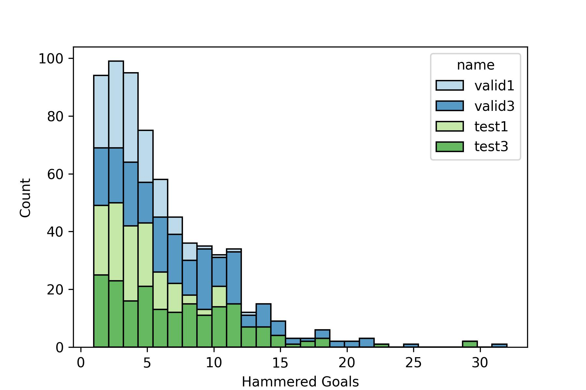
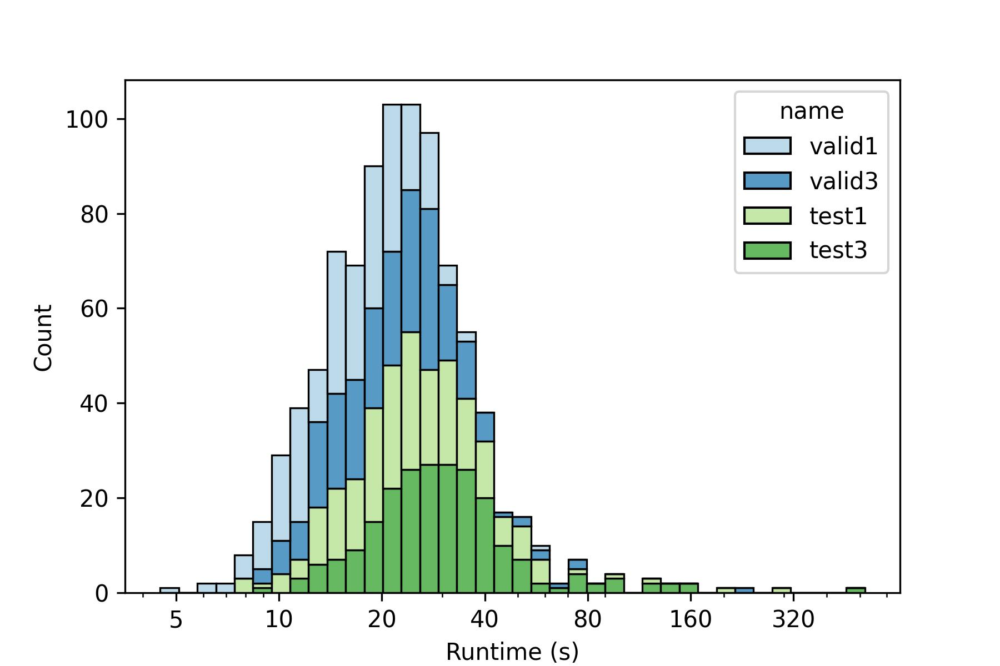
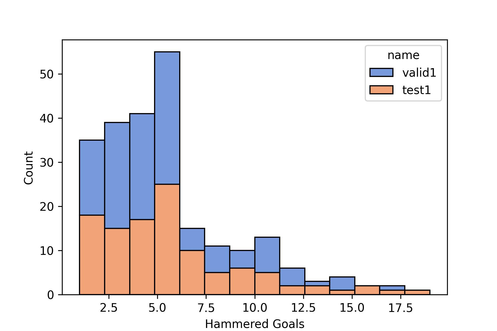
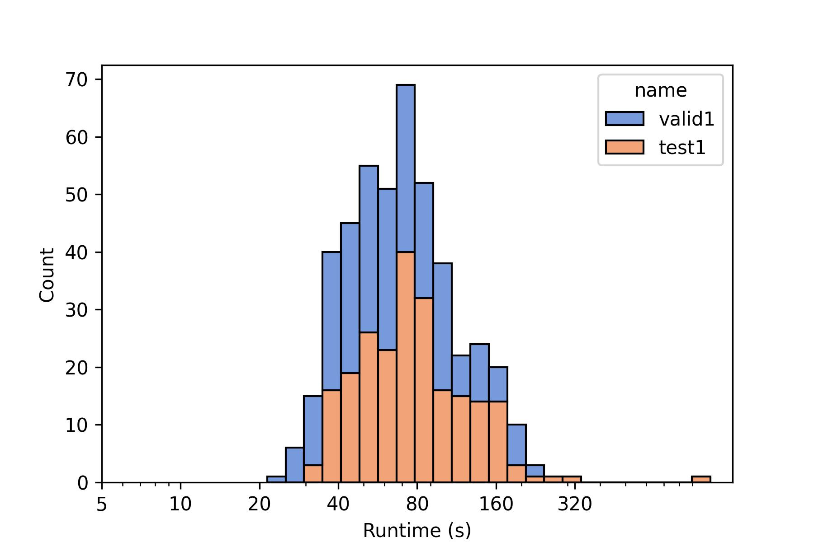

[^note: 1 1 institutetext: Stanford University]

# Pantograph: A Machine-to-Machine Interaction Interface for Advanced Theorem Proving, High Level Reasoning, and Data Extraction in Lean 4

**Leni Aniva Chuyue Sun Brando Miranda Clark Barrett Sanmi Koyejo {aniva,chuyues,brando90,barrettc,sanmi}@stanford.edu**

## Abstract

*Machine-assisted theorem proving* refers to the process of conducting structured reasoning to automatically generate proofs for mathematical theorems. Recently, there has been a surge of interest in using machine learning models in conjunction with proof assistants to perform this task. In this paper, we introduce Pantograph, a tool that provides a versatile interface to the Lean 4 proof assistant and enables efficient proof search via powerful search algorithms such as Monte Carlo Tree Search. In addition, Pantograph enables high-level reasoning by enabling a more robust handling of Lean 4’s inference steps. We provide an overview of Pantograph’s architecture and features. We also report on an illustrative use case: using machine learning models and proof sketches to prove Lean 4 theorems. Pantograph’s innovative features pave the way for more advanced machine learning models to perform complex proof searches and high-level reasoning, equipping future researchers to design more versatile and powerful theorem provers.

## 1 Introduction

Proof assistants are used for a variety of tasks requiring strong guarantees and rigorous reasoning. High-profile applications include formal verification of computer systems (e.g., sel4 [10]) and formalization of mathematics (e.g., [7]). Among proof assistants, Lean 4 has recently accumulated significant momentum both among mathematicians and non-mathematicians. Its Mathlib library [14], for example, is an extensive effort to formalize many branches of mathematics and contains many non-trivial mathematical definitions and theorems.

A common challenge shared by all proof assistants is that completing proofs is tedious and requires manual effort and expertise. Machine learning offers one potential avenue for addressing this challenge. Indeed, recent years have seen several major efforts dedicated to using machine learning to automatically search for proofs in proof assistants (e.g., [21], [22], [5], [6], [12], [11], [8], [9], [20]). While these efforts have produced promising results, many proofs are still beyond the reach of machine learning-based automation.

In order to continue to make progress in this area, several challenges need to be addressed. One of these challenges is the need for better interfaces between proof assistants and machine learning systems. In this paper, we introduce **Pantograph**,^1^11`https://github.com/stanford-centaur/PyPantograph` an API and Read-Eval-Print Loop (REPL) for Lean 4, whose primary goal is to provide a convenient interface for training and evaluating theorem proving agents. The name “Pantograph” alludes to the process of recording a proof during proof search.^2^22A Pantograph is a mechanism for recording the movement of a pen while drawing in order to create a copy.

The main motivation for creating Pantograph is to overcome the limitations of the interface provided by the Lean 4 Language Server Protocol (LSP), which is the standard interface provided for interactive use by a human user. Although the LSP provides interactive feedback for a human operator of Lean 4, it suffers from a number of problems as a machine interface. The LSP interface requires its user to keep track of positions of a cursor in text, and a machine user would be burdened with tracking these redundant data. Moreover, there is no straightforward way to extract tactic training data from the LSP interface or sketch out a proof to be finished by automation tactics. In contrast, Pantograph is designed from the ground up as an efficient and convenient interface for machine (and especially machine learning) agents.

The main contributions of Pantograph are:

1. Unlike prior work, the user can decide to solve goals independently. This enables more powerful search algorithms such as Monte Carlo Tree Search (MCTS), which have been successful in other domains (e.g., AlphaGo and AlphaZero [17, 18]), achieving superhuman performance on complex games like Go, Chess, and Shogi.^3^33Although these board games are not equally difficult, the state-of-the-art algorithms for these board games all involve MCTS. To do this, Pantograph handles metavariable coupling, which is a phenomenon that complicates tree search [13].
2. In contrast to prior work in Lean 4 [23], Pantograph supports the use of the advanced reasoning steps (called tactics) `have`, `let`, `conv`, and `calc`. These tactics are crucial for supporting high-level reasoning strategies like proof sketching [8].
3. Pantograph fully supports essential data extraction tasks (e.g., it can extract the before- and after-goal states of tactic executions, which are usually not available in raw Lean 4 scripts). In addition, Pantograph introduces several novel data extraction capabilities, including the ability to extract entire proof scripts with associated comments, which can be used for tasks like autoformalization, and the important ability to extract proof representations as programs, which allows for one-shot prediction of proofs.
4. Pantograph provides feedback from partially executed `conv` and `calc` tactics, which was not possible in preceding works.
5. Pantograph allows the user to resume an incomplete proof containing the `sorry` keyword in Lean 4. This is useful for machine learning models which produce a proof draft before resolving the details in the proofs.
6. By making use of the novel features listed above, Pantograph can be used to support the draft-sketch-proof (DSP) approach [8]. An evaluation of this approach on the important MiniF2F benchmark [24] in Lean 4 is provided in Section 5. To our knowledge, this is the first implementation of DSP in Lean 4.

As additional evidence of its usefulness, before this paper was even published, research groups in both academia and industry were already using Pantograph for machine-assisted theorem proving.

The rest of the paper is organized as follows. In Section 2, we cover background material on proof assistants and tree search. We then discuss related work in Section 3. Section 4 gives an overview of the architecture and main features of Pantograph. Section 5 illustrates and evaluates Pantograph’s capabilities through an implementation of DSP in Lean 4. Finally, Section 6 concludes.

## 2 Background

### 2.1 The Lean 4 Proof Assistant

A *proof assistant* is a computer program that can formulate and check formal mathematical proofs. This includes Lean 4 [15], Coq [19], Isabelle [16], Aya [3], and many others. These programs operate by formulating mathematics as expressions and checking the validity of the expressions via type-theoretic rules. Proof assistants may differ in a number of ways, including their syntax and the underlying variant of type theory they use. In the language of a proof assistant, every definition, theorem, or proof is a value with a type. A value is represented by an **expression**. A proof of a theorem is a term whose type is the theorem. A proof assistant checks the validity of a proof of a theorem by evaluating its type and checking that it matches the statement of the theorem. It does this using a set of type deduction rules.

For example, the commutativity of the logical OR ($\lor$) operation can be written as the expression:

$$\forall(p:\mathsf{Prop}),\forall(q:\mathsf{Prop}),\forall(h:p\lor q),q\lor p.$$

This statement says that if $p$ and $q$ are Boolean propositions (of type $\mathsf{Prop}$ in Lean 4), then, given the hypothesis $h$ of type $p\lor q$, we can conclude $q\lor p$.

The notation in (1) is more verbose than what mathematicians typically use. This is because proof assistants require the utmost unambiguity. However, informally, the above expression could also be written using the more concise notation:

$$\forall\,p,q.\>p\lor q\to q\lor p$$

A proof of (1) is an expression whose type is given by (1). For example,

$$\displaystyle\lambda(p,q:\mathsf{Prop})(h:p\lor q)$$

is a proof of the commutativity of OR. The type of a $\lambda$-expression is a $\forall$-expression. The $\lambda$’s in the expression correspond to the three $\forall$’s in the statement of the commutativity theorem. Intuitively, this expression says that when $p\lor q$ is assumed to be true, proving $q\lor p$ requires proving $q\lor p$ when $p$ is true and also when $q$ is true. This is signified by the special function $\lor.\operatorname{cases}$, which is provided by Lean 4 as part of the support for the $\lor$ operator. It represents the fact that deriving any value from $p\lor q$ requires two functions, one to handle the case when $p$ is true, and one to handle the case when $q$ is true.

Assuming $p$ is true, $\lor.\operatorname{inr}$ generates a proof of $q\lor p$ from a proof of the right operand $p$ ($\lor.\operatorname{inl}$ is similar but requires a proof of the left operand $q$).

Expressions can also be constructed incrementally. For example, we could postulate that the following expression has the type shown in Expression (1):

$${\color[rgb]{0.55,0.14,1}\definecolor[named]{pgfstrokecolor}{rgb}{0.55,0.14,1}%
\pgfsys@color@cmyk@stroke{0.45}{0.86}{0}{0}\pgfsys@color@cmyk@fill{0.45}{0.86}%
{0}{0}?1}:=\lambda(p:\mathsf{Prop})\mapsto{\color[rgb]{0.55,0.14,1}%
\definecolor[named]{pgfstrokecolor}{rgb}{0.55,0.14,1}\pgfsys@color@cmyk@stroke%
{0.45}{0.86}{0}{0}\pgfsys@color@cmyk@fill{0.45}{0.86}{0}{0}?2}[p]$$

Then ${\color[rgb]{0.55,0.14,1}\definecolor[named]{pgfstrokecolor}{rgb}{0.55,0.14,1}% \pgfsys@color@cmyk@stroke{0.45}{0.86}{0}{0}\pgfsys@color@cmyk@fill{0.45}{0.86}% {0}{0}?2}$ must have the type

$${\color[rgb]{0.55,0.14,1}\definecolor[named]{pgfstrokecolor}{rgb}{0.55,0.14,1}%
\pgfsys@color@cmyk@stroke{0.45}{0.86}{0}{0}\pgfsys@color@cmyk@fill{0.45}{0.86}%
{0}{0}?2}:\forall(q:\mathsf{Prop}),\forall(h:p\lor q),q\lor p\qquad\begin{%
cases}p:\mathsf{Prop}\end{cases}$$

Here, ${\color[rgb]{0.55,0.14,1}\definecolor[named]{pgfstrokecolor}{rgb}{0.55,0.14,1}% \pgfsys@color@cmyk@stroke{0.45}{0.86}{0}{0}\pgfsys@color@cmyk@fill{0.45}{0.86}% {0}{0}?1}$ and ${\color[rgb]{0.55,0.14,1}\definecolor[named]{pgfstrokecolor}{rgb}{0.55,0.14,1}% \pgfsys@color@cmyk@stroke{0.45}{0.86}{0}{0}\pgfsys@color@cmyk@fill{0.45}{0.86}% {0}{0}?2}$ are *metavariables*. A **metavariable** is a variable, possibly unassigned, with a **context**. A **goal** (also called a **hole**) is an unassigned metavariable. When writing proofs in Lean 4, the `sorry` keyword can be used as a placeholder for a hole. A **free variable** in the *context* of a metavariable (e.g., the variable $p$ above) references a value assumed to be true for this metavariable. ${\color[rgb]{0.55,0.14,1}\definecolor[named]{pgfstrokecolor}{rgb}{0.55,0.14,1}% \pgfsys@color@cmyk@stroke{0.45}{0.86}{0}{0}\pgfsys@color@cmyk@fill{0.45}{0.86}% {0}{0}?2}$ is a goal. The **proof state** consists of all metavariables, both those that are unassigned (i.e., the goals) and those that are assigned.

Proof expressions, while easy for the proof assistant to check, are difficult for a human operator to write. Thus, some proof assistants such as Lean 4 also provide an alternative interface for theorem proving, in which a proof can be executed via a series of *tactics*. A **tactic** changes the proof state by assigning an expression, possibly containing new goals, to a goal in the current state. In Lean 4, a tactic can transform one goal into a finite number of subgoals. A tactic that generates no subgoals *solves* the parent goal. If all subgoals produced by a tactic are solved, the goal is solved as well. For example, suppose a variable ${\color[rgb]{0.55,0.14,1}\definecolor[named]{pgfstrokecolor}{rgb}{0.55,0.14,1}% \pgfsys@color@cmyk@stroke{0.45}{0.86}{0}{0}\pgfsys@color@cmyk@fill{0.45}{0.86}% {0}{0}?1}$ has the type shown in Expression (1). Executing the $\mathsf{intro}$ tactic on ${\color[rgb]{0.55,0.14,1}\definecolor[named]{pgfstrokecolor}{rgb}{0.55,0.14,1}% \pgfsys@color@cmyk@stroke{0.45}{0.86}{0}{0}\pgfsys@color@cmyk@fill{0.45}{0.86}% {0}{0}?1}$ results in the *assignment* ${\color[rgb]{0.55,0.14,1}\definecolor[named]{pgfstrokecolor}{rgb}{0.55,0.14,1}% \pgfsys@color@cmyk@stroke{0.45}{0.86}{0}{0}\pgfsys@color@cmyk@fill{0.45}{0.86}% {0}{0}?1}:=\lambda(p:\mathsf{Prop})\mapsto{\color[rgb]{0.55,0.14,1}% \definecolor[named]{pgfstrokecolor}{rgb}{0.55,0.14,1}\pgfsys@color@cmyk@stroke% {0.45}{0.86}{0}{0}\pgfsys@color@cmyk@fill{0.45}{0.86}{0}{0}?2}[p]$, where ${\color[rgb]{0.55,0.14,1}\definecolor[named]{pgfstrokecolor}{rgb}{0.55,0.14,1}% \pgfsys@color@cmyk@stroke{0.45}{0.86}{0}{0}\pgfsys@color@cmyk@fill{0.45}{0.86}% {0}{0}?2}$ has the type in Expression (2). ${\color[rgb]{0.55,0.14,1}\definecolor[named]{pgfstrokecolor}{rgb}{0.55,0.14,1}% \pgfsys@color@cmyk@stroke{0.45}{0.86}{0}{0}\pgfsys@color@cmyk@fill{0.45}{0.86}% {0}{0}?2}$ becomes the new goal that must be solved.

Some tactics can create interdependent metavariables. This is known as **metavariable coupling** [13]. For example, in order to prove

$$\exists(x:\mathbb{N}),2x+5\leq 10$$

one would need to invoke the `Exists``.intro` lemma, which creates the following goals in Lean 4:

$$\displaystyle{\color[rgb]{0.55,0.14,1}\definecolor[named]{pgfstrokecolor}{rgb}%
{0.55,0.14,1}\pgfsys@color@cmyk@stroke{0.45}{0.86}{0}{0}%
\pgfsys@color@cmyk@fill{0.45}{0.86}{0}{0}?x}:$$

where the second goal is now coupled to the first, since any solution of the first goal will necessarily affect the second.

### 2.2 Tree Search

**Tree Search** refers to the process of searching through a tree, each of whose nodes represents a potential solution to a problem, attempting to find the best possible solution [4]. **Monte Carlo Tree Search** (**MCTS**) is a class of tree search algorithms where in each iteration a leaf node from the current search tree is selected and expanded. The selection of this leaf node is driven by the **policy** of the tree search algorithm.

MCTS is used by AlphaGo [18] and AlphaZero [17] for playing board games and by HyperTree [11] for proof search in Lean 3.

The tree structure that results from using tactics to prove theorems in Lean 4 is called an *and-or tree* and contains two types of nodes: *goals* (Or), where solving at least one descendant suffices to solve the goal, and *goal states* (And) produced by tactics, where solving all descendants is required. A Lean 4 proof begins with a single goal. A full proof tree for the commutativity of OR is shown in Figure 1. When applying Monte Carlo Tree Search two theorem proving, two functions are required: the **policy function** decides which node (i.e., goal) to explore next, and the **tactic function** decides which tactic to use on that goal.

*Figure 1 : A proof tree for Expression ( 1 )*

The main motivation for creating Pantograph is to create an interface that can easily be used by machine learning systems aiming to exploit this incremental tree structure to conduct mathematical reasoning. Potential applications of Pantograph include automatic verified program generation, rigorous reasoning for language models, and autoformalization of mathematics results.

## 3 Related Work

The closest related work is **LeanDojo** [23], which provides a Python interface for machine interaction with Lean 4. A user can use this interface to execute tactics on a current proof state in a Lean 4 process. LeanDojo can be used to save and resume proof states. LeanDojo can also run commands such as `#eval` and `#check` and extract goal-tactic pairs over an existing proof.

Pantograph has several key architectural improvements over LeanDojo. First of all, it is written entirely in Lean 4. This removes the need for external dependencies (such as Docker) and also improves the speed of interaction. Also, some tactics not supported by LeanDojo, such as `have`, are available in Pantograph. Other tactics, such as `conv` and `calc`, can only be used monolithically to solve goals in LeanDojo, whereas Pantograph supports incremental exploration using these tactics, allowing a user to obtain feedback at each step, even if a goal is not solved. Moreover, Pantograph efficiently handles the problem of metavariable coupling (see Section 4.3), empowering ML models to work on interdependent proof branches without risking inconsistency.

Like LeanDojo, Pantograph can extract information from existing proofs, including training data based on triples of goal states, tactics, and post-tactic goal states. It can also extract comment data and arbitirary expressions, both of which may be useful as additional training data. However, LeanDojo’s data extraction and proof execution units are essentially separate, which makes it impossible to extract an incomplete proof and resume from it, whereas Pantograph supports this use case.

In [11], Lample et al. implement the aforementioned and-or tree search structure to solve goals in Lean 3. In this work, the relation between goals and tactics is a *hypertree*. This enables efficient proof search via a variant of Monte Carlo Tree Search. The policy and tactic functions are both provided by Large Language Models (LLMs). Pantograph is compatible with this approach, as it gives the user control over both policy and tactic functions.

Draft-Sketch-Prove (DSP) [8] is a *neural theorem prover* which uses an approach based on *drafting*. Instead of directly generating Lean 4 tactics, the neural theorem prover generates intermediate goals in an informal language (draft). Then it translates these goals into Isabelle (sketch), and finally a *hammer* tactic from Isabelle solves the goals (prove). Pantograph’s drafting feature supports this technique as well, allowing the Draft-Sketch-Prove algorithm to be implemented in Lean 4 (see Section 4.6).

Aesop [13] is a proof automation (*hammer*) tactic based on tree-search. Aesop is not based on machine learning and takes metavariable coupling into account when solving goals. When a goal gets solved in Aesop, all of the goals coupled to this goal are brought back into scope. This is known as *copying*. Pantograph’s approach to metavariable coupling is based on Aesop’s technique, but extends it by allowing the user to determine which metavariable to solve next.

CoqGym [22] is similar to LeanDojo but for the Coq theorem prover instead of Lean 4. CoqGym stores proofs in a tree structure and allows the user agent to execute tactics. Optionally, CoqGym can serialize proof terms into S-expressions. These same features are supported by Pantograph, but for Lean 4. Pantograph also has some features unsupported by CoqGym, such as the ability to implement draft-sketch-prove and to handle metavariable coupling.

## 4 Architecture and Features

*Figure 2 : System architecture of Pantograph. A solid arrow indicates that the component at the arrow source calls functions in the component that is the arrow’s target. A human operator interacts with Lean 4’s kernel via the IDE, but a machine learning agent can interact via one of Pantograph’s interfaces.*

Pantograph is implemented entirely in Lean 4 with no external dependencies. Figure 2 shows an overview of the operation of Pantograph. The user, which is often a machine learning model, calls Pantograph’s functions via one of its interfaces. Pantograph provides three interfaces: ($i$) a Python interface called PyPantograph; ($ii$) a REPL via the pantograph-repl executable; and ($iii$) a library via the C Foreign Function Interface (FFI). When the user executes a tactic, Pantograph calls the Lean 4 kernel’s `Elab``.Tactic.evalTactic` function. Internally, many of Lean 4’s functions are *monads*, which are abstract structures enabling state manipulation in an otherwise functional language. Lean 4’s monad hierarchy (from the order of most to least general) has the order `IO`, `CoreM`, `MetaM`, `Elab``.TermElabM`, and `Elab``.Tactic.TacticM`. Figure 3 outlines the most important functions called during the execution of a tactic via Pantograph.

*Figure 3 : Call hierarchy in Pantograph during the execution of a normal tactic. The text on the right indicates the Lean 4 monad each function runs in.*

Other features of Pantograph call into the Lean 4 Language Server Protocol (LSP), the Lean 4 parser, and the Lean 4 compiler. In particular, Pantograph intercepts the Lean 4 compiler state when it processes Lean 4 source code, enabling it to extract information that is otherwise only available via the IDE.

In the rest of this section, we provide details about the features available in Pantograph. We discuss Pantograph’s support for the following features: (*i*) both expression-based and tactic-based proof; (*ii*) tree search; (*iii*) custom handling of metavariable coupling; (*iv*) the extraction of tactic training data; and (*v*) drafting.

### 4.1 Expressions and Tactics

Pantograph enables AI agents to use the same tactics as a human operator can while interacting with Lean. Human-written proofs in Lean 4 (e.g., in Mathlib) are often a mixture between expressions and tactics. As mentioned above, tactics are used to reduce a goal to one or more new subgoals. To see how expressions can be used, consider the following example.

⬇
example
:
exists
x
,
x
+
2
=
8
:=
by
let
a
:
Nat
:=
3
*
2
exists
a

In this example, the required witness for $x$ is directly constructed as the expression $3\cdot 2$. Pantograph supports seamlessly switching between expression-based and tactic-based proof by providing a custom `expr` tactic. This tactic takes an expression $e[{\color[rgb]{0.55,0.14,1}\definecolor[named]{pgfstrokecolor}{rgb}{% 0.55,0.14,1}\pgfsys@color@cmyk@stroke{0.45}{0.86}{0}{0}\pgfsys@color@cmyk@fill% {0.45}{0.86}{0}{0}?1},{\color[rgb]{0.55,0.14,1}\definecolor[named]{% pgfstrokecolor}{rgb}{0.55,0.14,1}\pgfsys@color@cmyk@stroke{0.45}{0.86}{0}{0}% \pgfsys@color@cmyk@fill{0.45}{0.86}{0}{0}?2},\dots]$ and assigns it to the current goal. The holes ${\color[rgb]{0.55,0.14,1}\definecolor[named]{pgfstrokecolor}{rgb}{0.55,0.14,1}% \pgfsys@color@cmyk@stroke{0.45}{0.86}{0}{0}\pgfsys@color@cmyk@fill{0.45}{0.86}% {0}{0}?1},{\color[rgb]{0.55,0.14,1}\definecolor[named]{pgfstrokecolor}{rgb}{% 0.55,0.14,1}\pgfsys@color@cmyk@stroke{0.45}{0.86}{0}{0}\pgfsys@color@cmyk@fill% {0.45}{0.86}{0}{0}?2},\dots$ then become the new goals.

There are 3 views of a proof:

1. **Presentation View**: A proof written for presentation and verification. Coupling does not exist. It may contain values with puzzling origins such as complex bounds that are not apparent before reading the entire proof.
2. **Search View**: A proof viewed as the trajectory of a proof search agent traverses through while finding the proof. It may contain backtracking, coupling, and goal selection.
3. **Kernel View**: A proof viewed as a set of metavariables.

Pantograph enables agents to operate in the search view and handles proofs internally in the kernel view.

Lean 4 includes sophisticated tactics, like `conv` and `calc`, which are *composite* in the sense that they are used to compose sequences of other tactics. While these tactics can be executed monolithically by supplying the full sequence of tactics to be composed, human operators of Lean 4 often rely on Lean 4’s interactive interface to *incrementally* explore possible sequences, obtaining feedback at each step. Pantograph provides a custom tactic called `goal``.tactic`, which can partially execute a `conv` or `calc` tactic and provide feedback from this partial execution. As an example, consider the following use of the `calc` tactic, which is used in Lean 4 to compose a series of transitivity steps.

⬇
example
(
a
b
c
:
Nat
)
:
a
+
b
=
b
+
c
:=
by
calc
a
+
b
=
a
+
a
:=
sorry
_
=
b
+
b
:=
sorry
sorry

Here, the goal `a`` ``+ b = b + c` is not provable by `calc`, but a user can still partially execute the tactic by applying just the first line and seeing what the result is. In this case, the result of executing just the first line results in the following new goal.

⬇
a
b
c
:
Nat
|-
a
+
a
=
b
+
c

Pantograph supports this partial execution model and can return the new goal shown above.

Pantograph also supports the `have` and `let` tactics. These tactics define temporary expressions in a local scope and are indispensable when developing proofs by hand. For example, consider the following snippet.

⬇
example
(
n
:
Nat
),
n
+
0
=
0
+
n
:=
by
have
h1
:
n
+
0
=
n
:=
sorry
sorry

The use of `have` introduces a new expression and a new goal. The two `sorry` expressions create two holes corresponding to the two goals shown below.

⬇
n
:
Nat
|-
n
+
0
=
n
n
:
Nat
h1
:
n
+
0
=
n
|-
n
+
0
=
0
+
n

The Pantograph repository contains documentation and examples for these tactics.

In order to be friendly towards searching methods such as Monte Carlo Tree Search [4], Pantograph provides an interface for incrementally executing tactics. If a tactic creates more than one goal, it is called a *branching* tactic. When more than one goal exists in a proof state, Pantograph provides the option to choose which goal to apply a tactic to.

If a tactic cannot execute for some reason, Pantograph outputs an error message corresponding to what a human operator would see during interaction with Lean’s LSP.

### 4.2 Tree Search

As mentioned above, tree search is a common search technique and is utilized in various proof search approaches such as HyperTree [11] and Aesop [13]. Since each tactic produces zero or more goals, the search structure of applying tactics to goals can be viewed as an And-Or tree (in the absence of metavariable coupling, see Section 4.3). When the current proof state has multiple goals, Pantograph allows the user to choose which goal to attempt next, i.e., it allows user-defined policy functions.

This naturally leads to the question of the fate of sibling goals. Suppose there are two goals $[{\color[rgb]{0.55,0.14,1}\definecolor[named]{pgfstrokecolor}{rgb}{0.55,0.14,1% }\pgfsys@color@cmyk@stroke{0.45}{0.86}{0}{0}\pgfsys@color@cmyk@fill{0.45}{0.86% }{0}{0}?1},{\color[rgb]{0.55,0.14,1}\definecolor[named]{pgfstrokecolor}{rgb}{% 0.55,0.14,1}\pgfsys@color@cmyk@stroke{0.45}{0.86}{0}{0}\pgfsys@color@cmyk@fill% {0.45}{0.86}{0}{0}?2}]$ in the current proof state, and the user applies a tactic to ${\color[rgb]{0.55,0.14,1}\definecolor[named]{pgfstrokecolor}{rgb}{0.55,0.14,1}% \pgfsys@color@cmyk@stroke{0.45}{0.86}{0}{0}\pgfsys@color@cmyk@fill{0.45}{0.86}% {0}{0}?1}$, generating ${\color[rgb]{0.55,0.14,1}\definecolor[named]{pgfstrokecolor}{rgb}{0.55,0.14,1}% \pgfsys@color@cmyk@stroke{0.45}{0.86}{0}{0}\pgfsys@color@cmyk@fill{0.45}{0.86}% {0}{0}?3}$. The status of ${\color[rgb]{0.55,0.14,1}\definecolor[named]{pgfstrokecolor}{rgb}{0.55,0.14,1}% \pgfsys@color@cmyk@stroke{0.45}{0.86}{0}{0}\pgfsys@color@cmyk@fill{0.45}{0.86}% {0}{0}?2}$ depends on the *automatic mode* option. Automatic mode is turned on by default, which means sibling goals are carried forward to the next proof state. Hence, with automatic mode on, the next proof state would contain $[{\color[rgb]{0.55,0.14,1}\definecolor[named]{pgfstrokecolor}{rgb}{0.55,0.14,1% }\pgfsys@color@cmyk@stroke{0.45}{0.86}{0}{0}\pgfsys@color@cmyk@fill{0.45}{0.86% }{0}{0}?3},{\color[rgb]{0.55,0.14,1}\definecolor[named]{pgfstrokecolor}{rgb}{% 0.55,0.14,1}\pgfsys@color@cmyk@stroke{0.45}{0.86}{0}{0}\pgfsys@color@cmyk@fill% {0.45}{0.86}{0}{0}?2}]$, with all goals present and active. If the user disables automatic mode, the proof state instead becomes $[{\color[rgb]{0.55,0.14,1}\definecolor[named]{pgfstrokecolor}{rgb}{0.55,0.14,1% }\pgfsys@color@cmyk@stroke{0.45}{0.86}{0}{0}\pgfsys@color@cmyk@fill{0.45}{0.86% }{0}{0}?3}]$. The goal ${\color[rgb]{0.55,0.14,1}\definecolor[named]{pgfstrokecolor}{rgb}{0.55,0.14,1}% \pgfsys@color@cmyk@stroke{0.45}{0.86}{0}{0}\pgfsys@color@cmyk@fill{0.45}{0.86}% {0}{0}?2}$ becomes *dormant*. Dormant goals are unassigned metavariables that do not appear in the current proof state. Note that dormant goals are an artifact of Pantograph’s manual tree search capability: they do not occur when using Lean 4 through the interactive interface.

*Figure 4 : ? ⁢ 2 becomes dormant after a tactic is applied to ? ⁢ 1 . It must be brought back into scope with goal . continue before the proof can finish. The ellipses ( … ) are plalceholders for some combination of tactics which eventually solves the descendant of ? ⁢ 1 .*

Dormant goals must either be tracked by the user or brought back into the proof state using the `goal``.continue` command, as shown in Figure 4.

To summarize, in *automatic mode*, goals are immediately continued after a tactic execution. Goals will never become dormant in automatic mode. This provides a gym-like environment to its user. Users who wish to handle tree search manually should disable this mode.

### 4.3 Metavariable Coupling

Recall that a proof state may contain 0 or more goals, and metavariable coupling [13] refers to inter-dependencies between goals in a proof state. Metavariable coupling arises naturally in many contexts. For example, applying the transitivity axiom of $\leq_{\mathbb{N}}$ to the goal $2\leq 5$ results in the following goals.

$$\displaystyle{\color[rgb]{0.55,0.14,1}\definecolor[named]{pgfstrokecolor}{rgb}%
{0.55,0.14,1}\pgfsys@color@cmyk@stroke{0.45}{0.86}{0}{0}%
\pgfsys@color@cmyk@fill{0.45}{0.86}{0}{0}?1}$$

Because ${\color[rgb]{0.55,0.14,1}\definecolor[named]{pgfstrokecolor}{rgb}{0.55,0.14,1}% \pgfsys@color@cmyk@stroke{0.45}{0.86}{0}{0}\pgfsys@color@cmyk@fill{0.45}{0.86}% {0}{0}?z}$ appears in all three goals, these goals are all coupled. This complicates proof search because if an assignment is made to $z$ in one goal, it will propagate to all of the other coupled goals. In this case, the other two goals will no longer be coupled, but they will contain the assignment made to $z$.

Pantograph provides explicit information about which goals are coupled. Since there are multiple possible ways of handling coupling, the choice of what to do with the coupling is left to the user. One method employed by [13] is *copying*, where coupled goals are solved sequentially to avoid conflicts.

*Figure 5 : In this diagram, rectangular boxes are proof states, and circles are goals. Each proof state has 0 or more goals. A state with no goals is considered solved. If all descendant goals of a state become solved, the state itself becomes solved.*

Figure 5 gives a full example of the above proof, conducted with automatic mode *off*. The application of the transitivity tactic creates a proof state with three goals. Using the `exact`` ``3` tactic on the ${\color[rgb]{0.55,0.14,1}\definecolor[named]{pgfstrokecolor}{rgb}{0.55,0.14,1}% \pgfsys@color@cmyk@stroke{0.45}{0.86}{0}{0}\pgfsys@color@cmyk@fill{0.45}{0.86}% {0}{0}?z}$ goal results in a solved proof state. Applying `goal``.continue` then brings goals ${\color[rgb]{0.55,0.14,1}\definecolor[named]{pgfstrokecolor}{rgb}{0.55,0.14,1}% \pgfsys@color@cmyk@stroke{0.45}{0.86}{0}{0}\pgfsys@color@cmyk@fill{0.45}{0.86}% {0}{0}?1}$ and ${\color[rgb]{0.55,0.14,1}\definecolor[named]{pgfstrokecolor}{rgb}{0.55,0.14,1}% \pgfsys@color@cmyk@stroke{0.45}{0.86}{0}{0}\pgfsys@color@cmyk@fill{0.45}{0.86}% {0}{0}?2}$ back into the proof state, where they are no longer coupled. Each can be discharged with an additional tactic such as `decide`.

### 4.4 The Environment

All running instances of Lean 4, including instances running behind the LSP or the Pantograph front end, maintain a library of active symbols known as the *environment*. Internally, Lean 4 stores all theorem statements and proofs in the environment as expressions, regardless of how they were constructed. The user can extract the proof of any theorem in the current environment via `env``.inspect`, which will produce an expression similar to Expression (1).

After a proof concludes, the user can extract the proof expression of the root proposition using the `goal``.print` command. These expressions can then be inserted back into the current environment using the `env``.add` command. Adding a lemma to the environment makes it accessible as a step in future proofs. Note that adding lemmas to the environment cannot be done while in the middle of an incomplete proof.

Like CoqGym [22], Pantograph can optionally output proof expressions in S-expression format by turning on the `printExprAST` option via `options``.set`. The user can also change Lean 4’s expression pretty-printing options by providing command line parameters to the Pantograph REPL. For example, to turn off all pretty-printing, use `--pp.all=true`.

### 4.5 Tactic Training Data

The Lean 4 community has produced several large collections of theorems with human-written formal proofs, e.g., Mathlib [14]. These collections can be used to train theorem proving agents. The `frontend``.process` command runs the Lean 4 compiler on a Lean 4 file, collects all tactics in the file, and returns them as a list of (before, after, tactic) triplets. These triplets are conveniently presented in a format conducive to offline reinforcement learning training. Pantograph also outputs information about the starting and ending positions (in the file) of each Lean 4 command in case the user is interested in processing comments or other metadata. Below is an example of one extracted tactic triple.

⬇
{
"
goalBefore
":"
⊢
∀
(
p
,
q
:
𝖯𝗋𝗈𝗉
)
,
p
∨
q
→
q
∨
p
",
"
goalAfter
":"
p
:
𝖯𝗋𝗈𝗉
\
n
⊢
∀
(
q
:
𝖯𝗋𝗈𝗉
)
,
p
∨
q
→
q
∨
p
",
"
tactic
":"
intro
p
"
}

### 4.6 Drafting

**Drafting** refers to a theorem proving technique which starts by generating a proof outline, instead of building a full proof step by step. A *draft* proof first consists of an overview with holes. Draft proofs are resolved by proving the individual goals corresponding to the holes in the proof. For example, consider the task of proving the commutativity of addition in Peano arithmetic. One approach would be to write a proof based on induction, using the inductive hypothesis $n+m=m+n$ to prove the inductive step $m+(n+1)=(m+n)+1$. As stated, this proof is not rigorous or detailed enough for Lean 4, but it *can* be written as a draft proof:

⬇
theorem
add_comm
:
forall
n
m
:
Nat
,
n
+
m
=
m
+
n
:=
by
intros
n
m
induction
n
with
|
zero
=>
have
h_base
:
0
+
m
=
m
:=
sorry
have
h_symm
:
m
+
0
=
m
:=
sorry
sorry
|
succ
n
ih
=>
have
h_inductive
:
n
+
m
=
m
+
n
:=
sorry
have
h_pull_succ_out_from_right
:
m
+
Nat
.
succ
n
=
Nat
.
succ
(
m
+
n
)
:=
sorry
sorry

The placeholders for intermediate goals have marked with the `sorry` keyword.

Pantograph supports drafting in two ways. The first is via the `have` tactic. This tactic introduces a lemma or intermediate claim and creates a new goal corresponding to the lemma.

The other way Pantograph supports drafting is via `sorry`-extraction. Pantograph can find all occurrences of `sorry` in a proof or definition and convert them to goals. For example, when `add_comm` from the above proof is fed into Pantograph’s `frontend``.process` command, it generates the following list of goals:

⬇
m
:
Nat
|-
0
+
m
=
m
m
:
Nat
h_base
:
0
+
m
=
m
|-
m
+
0
=
m
m
:
Nat
h_base
:
0
+
m
=
m
h_symm
:
m
+
0
=
m
|-
0
+
m
=
m
+
0
m
:
Nat
n
:
Nat
ih
:
n
+
m
=
m
+
n
|-
n
+
m
=
m
+
n
m
:
Nat
n
:
Nat
ih
:
n
+
m
=
m
+
n
h_inductive
:
n
+
m
=
m
+
n
|-
m
+
n
.
succ
=
(
m
+
n
).
succ
m
:
Nat
n
:
Nat
ih
:
n
+
m
=
m
+
n
h_inductive
:
n
+
m
=
m
+
n
h_pull_succ_out_from_right
:
m
+
n
.
succ
=
(
m
+
n
).
succ
|-
n
+
1
+
m
=
m
+
(
n
+
1)

The user can then execute tactics on these goals as they see fit. This feature is appealing for machine learning agents, since it allows an agent (e.g., a Generative AI agent like an LLM) to effectively draft the next step of the proof without having to dive into details about its execution. If a sketch contains type errors that cannot be rectified, Pantograph forwards the error generated by the Lean 4 Kernel to the user.

### 4.7 Limitations

Pantograph is limited by the functionalities available in Lean. For example, if a tactic has a bug and discards a metavariable, Pantograph cannot catch the issue until the end of the proof. Anything that cannot be expressed in Lean’s type system (e.g., Homotopy Type Theory (HoTT)) also cannot be expressed in Pantograph. Due to the tight coupling of Pantograph with Lean’s internals, non-trivial engineering effort is required to update Pantograph when Lean undergoes a major version change.

Moreover, due to the user-defined nature of tactics, distributing computation via pickling of objects in Pantograph is not trivial. For example, if two branches of a proof executing on two different machines are concluded, Pantograph does not handle the algorithmically difficult problem of uniting the two branches.

## 5 Evaluation

In this section, we demonstrate that Pantograph has the necessary power to implement a Draft-Sketch-Prove (DSP) solver based on GPT-4o (which, notably, is not tuned for the task) and Aesop [8] (mentioned in Section 3). DSP works as follows: A formal mathematical problem is fed into a language model instance. The language model outputs a proof skeleton outlining the major steps of the formal proof. Then a proof automation tool, which does not use machine learning, fills in the holes.

We used both the GPT-4o [1] and the GPT-o1-preview [2] language models, with parameters given in Table 1, and ran on the theorem proving evaluation benchmark MiniF2F [24]. Each individual experiment works as follows. The language model is given the formal theorem statement from MiniF2F and is asked to generate a natural language proof. Next, the same model is provided with this natural language proof and asked to generate one or three formal proof sketches in Lean 4 (GPT-o1-preview is only asked to generate a single proof sketch, as it does not yet support multiple sketches). These sketches may contain the `sorry` keyword. The sketches are then fed into Pantograph’s sorry-extraction command and turned into goals, which we try to solve one by one. To attempt to solve the goals, we use the following Lean 4 tactics as hammers: `aesop` [13], `simp`, and `linarith` (from Mathlib [14]).

| **Parameter** | **Value** |
| --- | --- |
| Max tokens | $2048$ |
| Top P | $0.95$ |
| Temperature | $0.8$ |

Table 1 : LLM parameters for DSP Experiment

Having built the DSP solver, the results are shown Table 2. They are not state of the art but are better than expected since we conducted no training. The drafting feature of Pantograph made this easy to implement. We show results on both the Validation and Test subsets of the MiniF2F benchmark set, both with one and three proof sketch(es). We report the overall success rate, and the average number of hammer invocations and the average runtime per benchmark. Our best configuration uses GPT-4o and three requested sketches. For this configuration, the DSP system out of the box successfully proved $28\%$ of the theorems from MiniF2F [24]. Since Lean and Isabelle have different type systems, we do not do a comparison with the Isabelle implementation of DSP.

| Benchmark Set | Validation | Test |  |  |  |  |
| --- | --- | --- | --- | --- | --- | --- |
| Requested Sketches (Model) | 1 (4o) | 1 (o1) | 3 (4o) | 1 (4o) | 1 (o1) | 3 (4o) |
| Success Rate ($\%$) | $12.7$ | $10.9$ | $23.6$ | $14.7$ | $16.0$ | **28.4** |
| Hammer Invocations | $4.17$ | $5.38$ | $7.93$ | $4.46$ | $5.72$ | $7.34$ |
| Runtime (s) | $17.25$ | $73.23$ | $23.98$ | $28.39$ | $88.38$ | $36.41$ |

Table 2 : DSP’s proof success rate (in %) using the Pantograph interface on the MiniF2F formal theorem proving benchmark. We used GPT-4o (labeled 4o) and o1-preview (labeled o1) for the DSP experiments.

*(a) Number of goals generated for the hammer tactic*

Figure [6](images/000_dsp-hammer.jpg) shows the result of the DSP experiment on the validation and test sets of the MiniF2F dataset. We plot the distribution of the number of hammer tactic invocations and the distribution of runtimes. The LLM nearly always outputs fewer than 10 goals per sketch. We also observe that running 3 sketches rather than 1 does not dramatically increase the runtime, indicating that the main performance bottleneck is the inference of the GPT-4o model.

*(a) Number of goals generated for the hammer tactic*

In Figure [7](images/002_dsp-hammer-o1.jpg), we show a similar plot for the o1-preview model. This model cannot generate multiple sketches. We observe that the runtime is much longer, likely due to the complex inference mechanism of the o1-preview model. However the success rate is either worse than or only marginally better than the GPT-4o model.

To our knowledge, these results represent the first successful implementation of DSP in Lean 4. We expect that the performance can be improved significantly by tuning parameters or using more refined models, but this work provides a baseline that can be built on and compared to in future work.

## 6 Conclusion

In this work, we introduce Pantograph, a Machine-to-Machine interaction library for Lean 4. We compare its features against existing tools used for training machine learning models for theorem proving, and we provide a list of its novel features. We also illustrate an application by implementing the first Lean 4 implementation of the Draft-Sketch-Prove approach.

In future work, we plan to use Pantograph to build and train various machine learning approaches for theorem proving. We also expect and hope that others will use it in interesting and novel ways and that these use cases will provide feedback for additional improvements and extensions of Pantograph.

Our evaluation also demonstrates one way that formal tools like Lean can be used to address potential harm from Language Models such as the one used in the evaluation section. Language models, though powerful, still face the problem of hallucination and generation of illogical results. These can be mitigated by applying formal techniques to the results produced of language models. The draft-sketch-prove experiment is an instance of this general idea, where proof automation formally checks the potentially incorrect result generated by an LLM. In the future, Pantograph could be used for other hybrid reasoning approaches combining generative AI and formal reasoning.

### Acknowledgements

We thank Abdalrhman Mohamed for his input on Lean 4’s expression system. We also thank Lean 4 Zulip chat users who answered our development questions. We thank Dr. Kim Morrison for the lean-training-data repository and examples of interacting with Lean 4’s front end. We thank Dr. David Dill for his feedback in proofreading the paper. This work was funded in part by a gift from Amazon Web Services and by Centaur: the Stanford Center for Automated Reasoning.

## Appendix

The prompt for the Draft part of the DSP experiment is

⬇

Draft

an

informal

solution

similar

to

the

one

below
.

The

informal

solution

will

be

used

to

sketch

a

formal

proof

in

the

Lean
4

Proof

Assistant
.

Here

are

some

examples
:

Informal
:
### Problem
\n
\n
[...nl/i problem text...]
\n
\n
### Solution
\n
\n
[...nl/i solution/draft text...]
\n
\n
\

n
\

n

Informal
:
###

Problem
\

n
\

n
{

nl_problem
}
###

Solution
\

n
\

n
[...

Model

Completion
...]

The prompt for the Sketch part is

⬇
[...

Translate

informal

draft

to

a

formal

sketch

in

Lean
4.

Here

are

some

examples
:
...]

Informal
:\

n
### Problem
\n
\n
[...nl/i problem text...]
\n
\n
### Solution
\n
\n
[...nl/i solution/draft text...]
\n
\n
\

n
\

n

Formal
:\

n
[...

fl
/

i

problem

text
...]
[...

fl
/

i

partial

sketch

text
...]
\

n
\

n

Informal
:\

n
### Problem
\n
\n
nl_problem ### Solution
\n
\n
nl_solution
\

n
\

n

Formal
:\

n
{

fl_problem
}
[...

Model

Completion
...]
